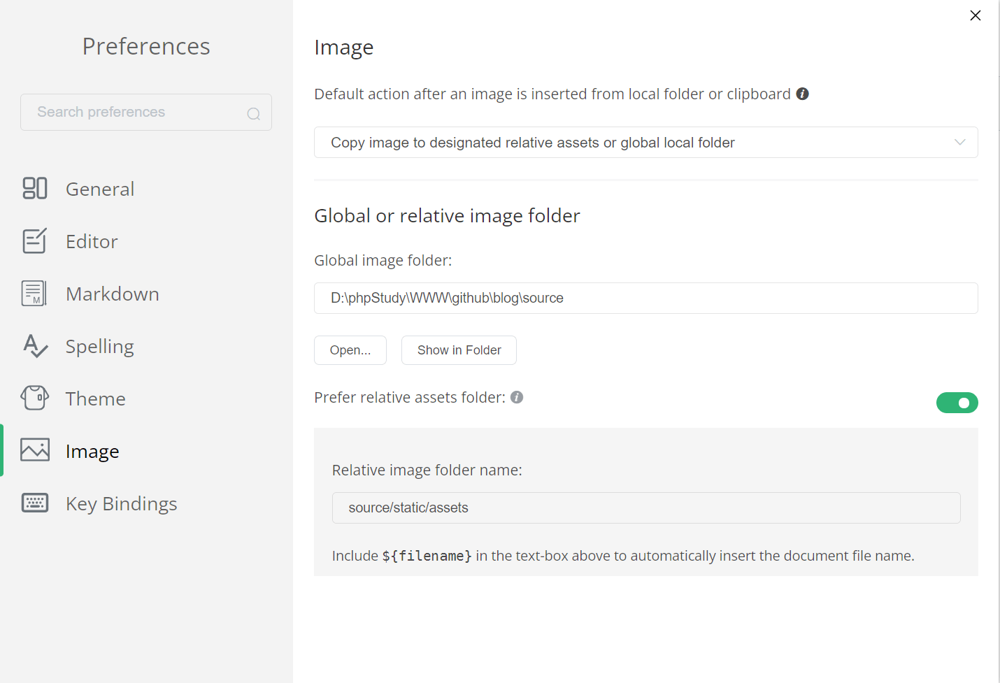

# 个人博客

从 Wordpress 迁移至 hexo，最终还是走向了静态博客的道路。

## 历程

Wordpress 已经是五年前在个人服务器上搭建的了，当时用的服务器还是 centos 6，借着迁移服务器的风，把可以静态化的服务统一放到腾讯云 COS 上，配合其 CDN 分发。

博客以 hexo + neoxeo + githubAction + githubPage + netlify + 腾讯云 CDN 搭建

历程整理（GitHub norefer 的 link 会触发防盗链导致无法打开博客，请复制链接后粘贴倒浏览器访问）：
[测试环境升级整理实录](https://blog.wj2015.com/2022/05/11/%E6%B5%8B%E8%AF%95%E7%8E%AF%E5%A2%83%E5%8D%87%E7%BA%A7%E6%95%B4%E7%90%86%E5%AE%9E%E5%BD%95/)
[hexo博客迁移](https://blog.wj2015.com/2022/05/08/hexo%E5%8D%9A%E5%AE%A2%E8%BF%81%E7%A7%BB/)

## 博客管理

新建博客：

```shell
npx hexo new "博客的标题"
```

marktxt 配置：

- 要选择复制文件到相对路径

- 打开 blog 项目的根目录

- 配置相对路径为 sources/static/assets



然后提交图片前记得压缩一下，不然很大
