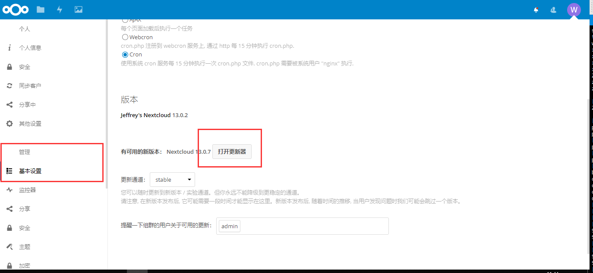
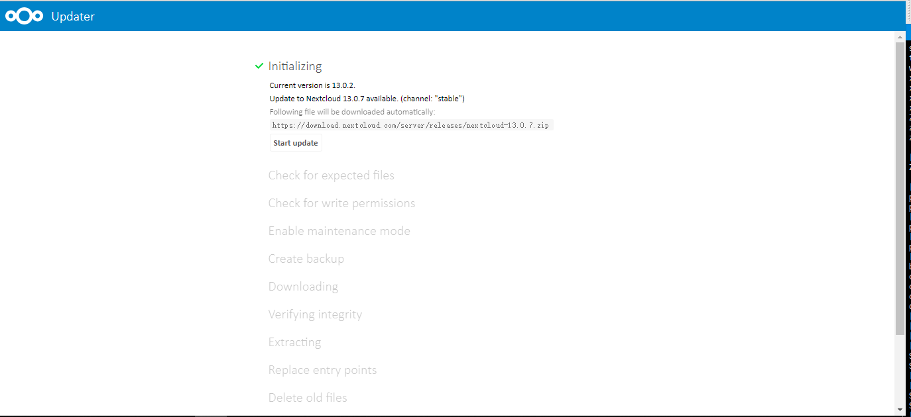

## nextcloud 是神魔

nextcloud 是一个开源的网盘项目，支持 web、Android、IOS、Windows、Linux 等平台，类似于较为常见的 『百度网盘』等，但是服务端部署于自己的服务器，数据存储于自己的服务器中，比较安全可靠。

## 服务器选择

服务器可以选用 云服务商提供的 VPS，也可以结合『树莓派』或者『家里不用的笔记本』搭建，不过一般家庭都是内网，没有公网IP，这时候可以选择使用 `ngrok` 或者 `frp` 实现内网穿透，就可以通过服务商提供的域名访问网盘项目了，如果希望自定义域名，还可做 `CNAME` 解析，或者 `nginx` 做反向代理，从而使用自己的域名，比如 `https://nextcloud.wj2015.com`

##### 网上的免费 ngrok 服务

使用方法都大同小异，看官方的文档即可 [http://ngrok.ciqiuwl.cn/](http://ngrok.ciqiuwl.cn/) [https://www.ngrok.cc/](https://www.ngrok.cc/)

> 如果你有自己的VPS，然后觉得网上免费的 ngrok 太慢不好用的话，可以选择自己搭一个，右边是搭建教程，→\_→，

## 安装及部署

创作中...

## 优化加速

### 使用Opcache加快PHP的执行速度

## occ 脚本的使用

使用 occ 工具可以实现 nextcloud 维护模式的开启和启动，比如：

```shell
[root@JeffreyWang nextcloud]# sudo -u nginx php occ maintenance:mode --off
Maintenance mode disabled
```

\--off 表示关闭维护模式 --on 表示开启维护模式

## 版本更新

管理员登录，找到 『基本设置』>『打开更新器』>『开始更新』即可  

#### 特殊情况

##### 更新失败，导致进入维护模式

进入 nextcloud 源码目录，执行 occ 工具，关闭维护模式即可，注意 `sudo -u xxx`，xxx 表示 `php-fpm` 的执行用户

```shell
[root@JeffreyWang nextcloud]# sudo -u nginx php occ maintenance:mode --off
```

如果非 `php-fpm` 执行，会报如下错误：

```shell
[root@JeffreyWang nextcloud]# php occ maintenance:mode --off
Console has to be executed with the user that owns the file config/config.php
Current user: root
Owner of config.php: nginx
Try adding 'sudo -u nginx ' to the beginning of the command (without the single quotes)
```

##### 下载或某步骤失败，导致无法再次进入更新

点击`打开更新器`，直接报如下错误：

> Step N is currently in process. Please reload this page later.

将 `nextcloud-data` 目录下升级目录删掉即可，**注意，不是源码目录，是数据目录，在 config/config.php 里边的 datadirectory 属性可以看到**，如下：

```shell
[root@JeffreyWang nextcloud]# rm -rf nextcloud-data/updater-somerandomstring/.step
```

再次进入即可