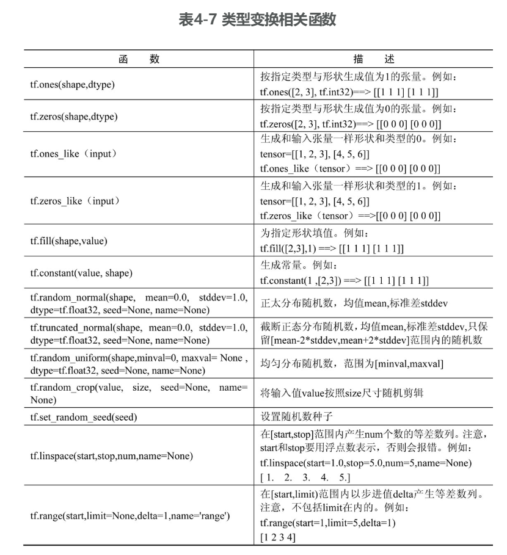

## 前言

## 正文

### 开发环境搭建

#### Gpu版本

#### 验证

### Tensor基础

#### 模型相关概念

##### 张量(tensor)和操作(op)

TensorFlow使用张量(tensor)作为基础数据结构，可以简单的把张量视为多维数组，每个张量都有 类型（Type）、阶(Rank)、形状(Shape)

##### 张量的类型

表示张量中每个元素的数据类型，后续的函数中就会用到 `tf.xxxxx` 的形式来指定类型 

##### 张量的阶

张量的阶可以理解为深度，比如 `t = [1, 2, 3]`，深度是1，阶就是1，`t = [[1, 2, 3], [1, 2, 3]]`，深度是2，阶就是2 具体如下表所示： 

##### 张量的形状

形状可以描述内部的组织关系，比如一个 3 \* 2 的张量 `t = [[1, 2], [1, 3], [1, 4]]`，其形状就是 `(3, 2)`

##### 张量操作

张量的操作可分为 类型变换、数值操作、形状变换、数据操作  

#### 注入和取出

#### 模型保存和载入

### TensorBoard可视化

## 总结