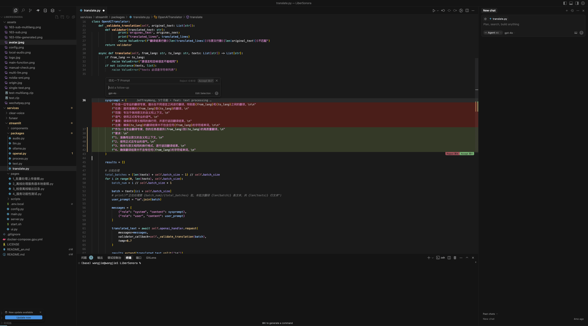
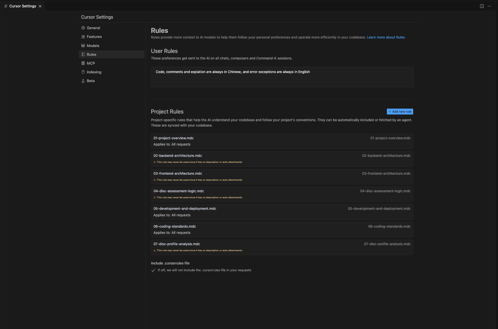
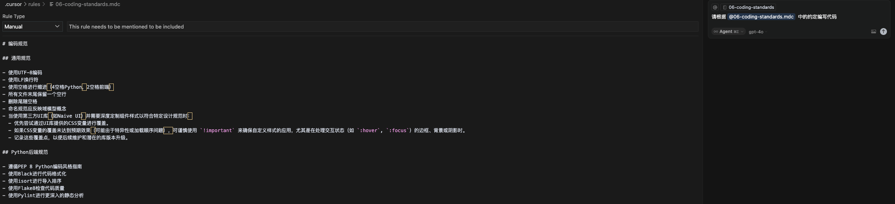

> AI First 编程是指有事儿 AI 先上，搞不定再找我；智驾式编程是类比目前新能源汽车的智能驾驶，它让我们出行更加方便但也需要一位驾驶员来确保前进方向正确和驾驶安全。

## 引言

作为一名步入互联网行业数年的后端码农，我深知日常编码工作中的那些让人腰酸背疼的“痛点”：比如写各种测试 DEMO、纠缠逻辑细节、单元测试样板代码等重复但必要的工作；以及面对一个庞大的新项目，光是理清代码结构、找到关键信息就得耗费大量时间；学习一门新技术或框架，官方文档浩如烟海，API 细节繁杂，学习曲线陡峭。

**这些难题正在日复一日地消耗着码农们的精力和创造力，让我们无法把精力专注在把握实现方向上，更多的被各种实现细节、运行报错拖到晚上十二点，然后转头再去医院花大价钱做推拿按摩缓解颈椎病。**

而 AI 编程工具的出现，正试图从根本上改变这一切。它们不再仅仅是传统代码补全或者问答形式的简单升级，而是力求将 AI 深度整合到编码的每一个环节 ---- 从需求理解到代码生成、重构、测试乃至文档编写。这就是我所理解追求的“AI First” 智驾式编码体验，AI 在其中扮演的不再仅仅是辅助角色，而是成为驱动开发效率的核心引擎之一。

在这波 AI 编程工具的浪潮中，我从 2023 年就开始尝试使用 [Cursor](https://www.cursor.com/)。当时它主要使用 GPT-3.5 模型，功能也只有内联编辑和 Ask，从现在往回看它的模型能力和功能都很弱小，但对于当时的开发场景和产品环境来说已经足够给编码效率带来成倍的提升了。

​

在今年年中，国产 AI 编程新秀 **Trae** 也进入了我的视野。Trae 的特点是更丝滑流畅的 UI、国产以及 **免费** 这一点吸引住了我，功能跟 Cursor 很像，主打 Agent、内联编辑、智能聊天功能，所以这次会以 Cursor 为主，顺便对比一下 Cursor（`v0.50.5`​）  和 Trae（`v0.5.8`​） 这两个 AI IDE 之间有何区别，以及差异在哪里，看看它们是如何实实在在地变革我的日常开发工作流的。

​

> 声明：Cursor 这款产品上线打磨的时间很长，Trae 在很多细节上肯定有所不如，但并不代表博主不喜欢 Trae，Trae 有自己独特的优势，比如 UI 流畅度、国产化、免费策略等等，Trae 与 Cursor 在核心功能上的差距也在不断在缩减，希望在不久的将来能看到 Trae 的弯道超车时刻！

## AI 如何重塑我的编码工作流

经过了**不长时间**的磨合，我觉得 Cursor 确实在很大程度上改变了我与代码交互的方式，让 “AI First” 和 ”智驾式编程“ 不再是一个遥不可及的概念，而是融入日常工作，把我们从重复劳动中解救出来的良方。

**AI 编辑器的底层技术主要是 LLM 、向量数据库、MCP 或 FunctionCall，其中 LLM 主要用于意图识别、实现路径规划、函数调用等，向量数据库主要用于代码索引和召回、文档知识库的实现等，而 MCP 或 FunctionCall 是大模型与计算机交互的重要方式，这些所有关联技术的核心目的是利用好有限上下文以及扩展大模型的影响范围。**

> 关于目前大模型技术的原理、能力和限制，可参考之前编写的一篇博客和分享稿 [建立大模型的感性认知](https://juejin.cn/post/7398046513812127784?searchId=2025060918364655E361DA3747DC890202)。

比如 AI Agent 在修改代码之前 LLM 需要了解待修改代码是什么样子的，可能就会用到 ListFiles 、ReadFile 等读取代码，然后向量数据库中召回相关的代码、文档，代码生成完成后，再用 WriteFile 去应用修改。

​

图片来源：[https://www.bilibili.com/opus/1054156893413441539](https://www.bilibili.com/opus/1054156893413441539)

> 注：目前阶段的 AI IDE 对专业开发者而言，更像一个任劳任怨的”实习生“，他可能做错，也可能做的不好，这就首先要求开发者自己对项目、对业务、对代码、对架构有比较深入的了解，才能够对这位”实习生“的工作结果给出合适的指导意见，这样才能写出高质量、高可维护的代码。

### 智能聊天与代码库的深度融合

Cursor 的聊天功能（官方称之为 "Chat with your code"）不止一个简单的问答机器人。它的强大之处在于能够深度理解并索引你的整个项目代码库（Codebase），从而提供高度相关的、上下文感知的回答和建议，下面是一些具体的场景。

​

#### 场景1：项目结构理解

这可能是我在接触一个全新或庞大项目时最先使用的功能。过去要理解一个陌生的代码库，我可能需要花费大量时间阅读文档（如果文档足够齐全的话）、梳理代码结构、跟踪函数调用。现在有了 Cursor、Trae 等 AI IDE 的 Chat 功能，这个过程被大大加速了。

比如当我接手公司一个包含数十个模块、数万行代码的遗留项目时，我可以直接向 Cursor 提问：

> 我不懂 ruby，请为我梳理整个项目的代码结构和 API 入口

​

AI 就会帮我把整个项目的代码结构直接梳理出来，对于大部分规范项目而言，准确度还是比较高的。

下一步可以把这个项目结构输出为 markdown 文档，在下次找逻辑、找 API 端点时把项目代码结构文档作为上下文提供给 AI，得出的结果会更迅速且更准确。

#### 场景2：代码解释

定位到需要调整或者不理解的代码时，可以选中一段代码按 Ctrl + L 向 Cursor 提问：

> 我不懂 ruby，请详细解释这段代码是什么意思？

Cursor 会扫描与这个问题相关的代码文件，自动将这些文件或关键代码片段作为上下文（@符号引用），然后给出它的理解。我发现 Cursor 在自动填充上下文这方面做得相当智能，它会优先查找与问题关键词最匹配的文件和代码段。

​

这对于快速建立对项目关键部分的认知非常有帮助，省去了挨个文件点进去翻看和理解的时间。

### 无缝丝滑的内联编辑

如果说 Chat 功能侧重于宏观的理解、生成和问答，那么内联编辑（Inline AI）则专注于微观的代码修改、优化和生成，在 Cursor 中通常通过选中代码后按 `Cmd+K`​ 触发。

这是我在做老系统维护时使用频率非常高的一个功能，**就像一把小手术刀，让 AI 专注在一个细分场景的逻辑做代码微调**，Cursor 在这方面的体验细节相比其他家打磨得相当出色。

#### 亮点：上下文保持与编辑自由度

> 注：我自己在编写代码的时候只要不涉及多文件修改（这种场景更适合用 Agent）大多数都是以内联编辑的方式进行代码编写，目的是确保 Prompt 意图、修改代码的位置更精准以增加质量

**暂存区缓存机制的优越性：**   
这是 Cursor 内联编辑体验远超许多其他 AI 辅助工具（包括我体验过的早期 Trae 版本）的一个关键点。

这时候经常遇到的一个场景是：

1. 在**模块 A** 的某个函数中，我选中一段代码，使用内联编辑（`Cmd+K`​）让 AI 进行修改或重构。AI 给出了一些建议，我可能还在思考如何调整 Prompt 以获得更好的结果。
2. 这时我突然意识到，为了完成模块 A 的这个修改，我需要在**模块 B** 中新增一个辅助函数。
3. 我切换到**模块 B** 的文件，可能会用 Chat 或者再次使用内联编辑（比如选中一段注释，让 AI 生成函数体）来快速创建这个新函数。
4. 完成模块 B 的工作后，我再切回**模块 A** 的文件。

在 Cursor 中，当我切回模块 A 时，之前在模块 A 进行的内联编辑对话历史、AI 的建议、甚至我输入了一半的待调整 Prompt **依然存在**，我可以无缝接续之前的操作。这种上下文的持久性非常重要，它保证了工作流的连贯性。

​

而在 Trae 目前版本中，从其他文件切换回来之后，不止输入到一半的 Prompt 丢失，甚至没有被确认的代码都被自动应用了，这对高频使用内联编辑的用户来说是不太能忍受的。

​

#### 段内编辑的上下文感知

另一个值得称赞的细节是 Cursor 在进行**段内编辑**（不替换整个函数或类，而是修改选中代码片段中一小部分）时，对语法上下文的理解。

当我选中一段复杂的条件语句中的某个表达式，或者一个循环体内部的几行代码，要求 AI 进行修改时，Cursor 通常能很好地理解这几行代码在整个语法结构中所处的位置和角色，从而给出精准且语法正确的修改。

​

而 Trae 在这方面的表现，根据我的体验有时就不那么理想。它对于段内代码的修改，偶尔会显得比较“粗暴”和割裂，像是把选中的部分孤立出来进行处理，不太考虑其在原始语法结构中的嵌入关系，导致生成的代码片段虽然本身可能逻辑正确，但直接放回原文时会出现语法错误或逻辑断裂，需要开发者进行二次加工。

​

### AI Agent — 自动化与智能辅助

除去精细化的内联编辑和带有上下文感知能力的聊天，AI IDE 通常还提供一种更宏观、更具自主性的交互模式，通常称之为“Agent”模式。

在这种模式下，AI 不仅仅是响应你对特定代码片段的修改请求，而是尝试理解并执行更复杂的、可能跨越多个文件或涉及多个步骤的任务。

我体验过 Cursor、Cline、Trae 这三家的 Agent 功能，最让我眼前一亮的是 `Cursor Agent`​和 `claude-4-sonnet`​的组合，虽说在上下文过长时代码质量会显著下降，也可能出现越改越乱的情况；但相比其他组合而言，它在开发人员的意图理解及生成代码质量的提升是巨大的。

抛开模型来看，**Agent 功能上各家并没有拉开本质上的差距，以及受制于 LLM 目前的基础上下文能力，目前无论多好的 AI IDE 都会出现“鬼打墙”的情况，但相信在大模型基础能力增强以及召回策略的更新迭代下，Agent 的问题会越来越少。**

用开源项目 [LiberSonora/LiberSonora](https://github.com/LiberSonora/LiberSonora) 举个例子：

> 请帮我实现如下功能：
>
> * 增加 Gemini 、 Claude、Grok 系列模型的配置
> * 翻译功能增加意大利语、阿拉伯语、韩语、俄语的选择
> * 优化翻译 Prompt

​

与内联编辑专注于局部修改不同，Agent 的特点在于：

* **任务导向：**  你描述的是一个“任务”或“目标”，而不是具体的代码改动。例如：“为 `Product`​ 模型添加一个新的 `inventory_status`​ 字段，并在相关的服务和API中更新逻辑以支持按库存状态筛选产品。”
* **潜在的跨文件操作：**  AI Agent 可能会识别出完成该任务需要在多个文件中进行修改（例如，模型定义、数据库迁移脚本、服务层逻辑、API 控制器、单元测试等）。
* **更高程度的自主性：**  AI 会尝试自行决定修改的具体位置和方式，以及通过 Lint、命令行工具验证更改的有效性

> PS：在 Typescript 场景下，动态更新的 node_modules 依赖文件有时无法很好的自动重载导致 Lint 无法识别新字段，这时候 Agent 会认为代码写错了而不会怀疑 IDE 的 Lint 出现了问题，然后给代码加一堆 as any
>
> 目前这个问题比较频繁触发的是 [Prisma](https://www.prisma.io/) 在 Agent 更改 Schama 后自动执行 prisma generate 生成动态依赖，出现这种情况只能手动重启 Typescript Server 解决；

**挑战与应对：**

* **“黑盒”与不可预测性：**  AI Agent 的决策过程有时不够透明，它所做的修改可能遍布代码库，如果不对其行为进行约束或仔细审查，很容易引入难以察觉的 Bug。

  * **应对：**  Cursor 相比 Cline 和 Trae 做的好一点，可以自动识别 AI 做出的更改进行”Restore Checkpoint“，**但我自己的习惯还是每次做大更改前我把已自测验证的功能** **​`git add .`​** ​ **或** **​`git commit`​**​ **一下，避免 Agent 把代码改乱不好恢复。**
* **代码质量参差不齐：**  AI Agent 往往遵循“最方便更改”或“最快实现”的原则，可能会生成冗余代码，或者忽视代码的可扩展性和维护性。

  * **应对：** 尽可能保证代码库中现有代码质量，以及给 AI 找一个正确的规范的代码参考，AI 需要参考好代码才能写出好代码
* **理解偏差：**  对于模糊或复杂的指令，AI Agent 的理解可能与你的预期有偏差，导致生成错误或不相关的代码。

  * **应对：**  尽量将复杂任务拆解成更小、更明确的子任务，分步引导 Agent，并且给到足够多的业务信息上下文以及代码上下文，这样稳定性会更好。
* **知识陈旧：** 大模型的知识库总是有滞后性的，这是目前所有 AI 工具都面临的一个坎。新技术、新框架层出不穷，迭代速度飞快，指望大模型能及时跟上所有这些更新，有点不太现实。

  * **应对：** 善用文档和规则引擎功能，在每次推理前给到足够精确有效的上下文

### 强大的自定义规则引擎 (Project Rules)

用 AI 写代码，最怕的就是它“自作聪明”或者“风格迥异”。Cursor 的 Project Rules 功能，在很大程度上缓解了这个问题，这也是我觉得它比 Trae 在项目级理解上做得更深的一个点。

简单说，Project Rules 允许你为整个项目或者项目中的特定目录、特定文件类型定义一套指导意见。这些意见会作为高优先级的上下文，影响 AI 生成代码的风格规范、代码结构、实现方案选型等。

> 下图是我一个做市场的朋友，一位几乎零基础的非互联网人让 AI 编写的自定义规则；
>
> 他最近用 Cursor 开发了一个心理评测网站，打通了从原始需求沟通到项目上线的全流程，一个人承担了市场、产品、前后端研发的职能，他在这里约定了项目背景、前后端架构、开发部署规范、代码规范等。

​

我个人体验下来，Cursor 在规则灵活性和上下文填充优先级上，确实比我用过的其他工具（包括 Trae）要强一些。

在 Cursor 中，可以非常细致地为不同的文件目录配置不同的规则，并作为一个配置文件跟着 Git 提交到仓库中，保证所有人的规则版本一致

​

以及支持在 Agent、Ask 模式下引用自定义规则，用于控制生成的代码质量或方便的填充统一的项目约定

​

### 文档：让 AI 实时学习新知识

大模型的知识库总是有滞后性的，这是目前所有 AI 工具都面临的一个坎。互联网的新技术、新框架、新语言以及新版本层出不穷，迭代速度飞快，指望大模型能及时跟上所有这些更新有点不太现实。**一旦遇到模型训练数据里覆盖不足的技术，AI 就很容易开始胡言乱语，给出的代码可能完全不着边际。**

我之前工作中就遇到过这样的典型场景。当时在调研用字节新开源的一个大模型应用开发框架，叫做 [Eino](https://github.com/cloudwego/eino)。这个框架非常新，版本迭代也特别快，几乎每天都有新变化。

这种情况下，无论是 GPT 、 Claude、以及字节自己的豆包大模型，在它们的知识库里关于 Eino 的有效信息几乎是零。直接让它们写 Eino 的代码，基本就是鸡同鸭讲。

Cursor 提供了一个非常实用的“文档” (Docs) 功能，允许你把外部的文档、网页链接，甚至是本地的 Markdown 文件、代码片段等加入到项目的知识库中，让 AI 可以实时学习和参考这些最新的信息。

​

具体到 [Eino](https://github.com/cloudwego/eino) 这个例子，我的做法是：

1. **收集关键信息源：**  我把 Eino 的官方文档链接、核心源码的 GitHub 仓库链接，以及一些社区贡献的扩展库源码链接都整理出来。
2. **添加到 Cursor 文档：**  在 Cursor 的项目设置里，找到 “Add Docs” 入口，把这些链接依次加进去。Cursor 会在后台抓取这些网页内容并建立索引。
3. **在交互中引用文档：**  当我需要 AI 帮我写 Eino 相关的代码，或者解答关于 Eino 的问题时，我会在 Prompt 中明确引用这些添加的文档。比如，在 Cursor 的聊天框里，我可以输入类似：“`@Eino官方文档 @Eino核心源码 请帮我实现一个使用 Eino 的 XXX 功能，需要注意 YYY`​”。通过 `@`​ 符号可以精确地告诉 AI 去参考哪些特定的知识源。

​

效果立竿见影，AI 能理解 Eino 的 API 设计、特定的函数用法，甚至是一些设计理念了。虽然不能说完美无缺，但至少代码能跑起来，实现方向也是对的，大大减少了我查官方文档和翻源码考究内部实现的时间。

**从外部文档到内部实践的演进：**

随着项目开发进行，项目本身会积累大量使用 Eino 的优秀实践。这时对外部文档的依赖就可以逐渐减少，因为 AI 在索引我们项目代码时，已经能从现有的、经过验证的代码中学习到 Eino 的正确用法和最佳实践了。

这时候我可能会调整 Project Rules，让 AI 自动总结一些基于项目实践总结出来的规范和要求，以及在提问时，引导 AI 参考项目中某个写得特别好的模块作为优秀范例。

**一些思考**

文档功能配合 Codebase Indexing 和 Project Rules，它让 Cursor 不仅仅能理解你已有的代码，还能快速学习和适应项目依赖的新技术、新知识，这对于追赶技术迭代、尝试新框架的开发者来说价值非常大。它解决了 AI 水土不服的一个关键问题，让 AI 辅助编码在新技术探索阶段也能真正派上用场。

目前的文档和 indexing 并非没有局限，他们的底层实现都十分依赖向量数据召回，所以引用文档时的关键字准确性比较重要，不然在目前的索引技术上很容易找偏，带来的结果就是代码质量差。

## 实操案例

使用 Cursor 做了几个开源小项目满足日常需求，一个是 [LiberSonora](https://libersonora.github.io/)，这是我在25年元旦假期期间做的，为了满足我有声书看字幕、以及字幕反向跳转的需求，核心功能使用 Python 开发开发了两天左右，主要使用 Cursor 的内联编辑结合当时成本极低的 Deepseek 模型开发，大概有 80% 以上的代码都是 AI 写的

​

一个是 [Clash 订阅转换工具](https://github.com/wangerzi/clash-converter/tree/main)，其实网上有很多转换工具，但还是想做一个轻量的，切实满足自己需求的转换工具，使用 Python 开发，完全使用 Agent（claude-4-sonnet），开发时间在两小时左右

​

一个是[红色年代海报生成器](https://github.com/wangerzi/CrimsonRise/tree/main)，完全使用 Agent（claude-4.1-thinking），开发时间在三十分钟左右

## AI 近期的发展

个人觉得最近比较值得关注趋势之一是”自我进化“、”复杂环境自适应“和”具身智能结合“。

### 大模型的自我进化

在大模型训练上，强化学习本身就是一种自我进化，目前已经有 SFT、DPO、PPO、GPRO 等各种强化方法用在大模型对齐等场景（[参考资料](https://zhuanlan.zhihu.com/p/1910019667268986241)）。

最近 [MM-UPT](https://github.com/waltonfuture/MM-UPT)、（[公众号解读文章](https://mp.weixin.qq.com/s/0PPw4t2YCwu-7zrxpjglcA)）也给出了强化学习和自我进化的的新思路，不需要像 DPO、DPO 等算法依旧需要少量标记数据计算奖励，而是让模型自己去投票出最佳的奖励（**这个策略跟模型蒸馏非常像，多次迭代可能导致模型偏见增加**），整个流程如下：

* 给定一张图片和一个问题，模型生成多个候选回答；
* 使用多数投票选出出现频率最高的回答，作为当前输入的「伪标签」；
* 使用这个「伪标签」来计算 reward，引导模型根据 GRPO 策略更新；

这整个过程无需任何外部监督信号或真实答案，使得模型可以基于自身的「共识」行为进行强化学习，从而实现持续的性能提升。

### 复杂环境自适应和知识的热更新

比如 [github.com/CharlesQ9/Alita](https://github.com/CharlesQ9/Alita) 这个项目（[公众号解读文章](https://mp.weixin.qq.com/s/vmp8H-3S_HH6Gvb4dH5FxA)），任务的难度可能超出了预定义工具或工作流的能力范围。复杂任务通常需要智能体创新性地使用新工具，或以新的方式组合和利用现有工具，而预定义的工具库和工作流会制约这种创造性和灵活性。

​

还有一个方向是尝试解决大模型知识库始终落后这一问题的，最近一个早期发现是 [ Parametric RAG](https://github.com/oneal2000/PRAG) 可以“**喂大模型吃记忆面包**”，相当于把新的最相关的知识转成“学习这段知识的前后权重差异”，在用的时候临时“吃”进模型里，并且不占用宝贵的上下文

​

### 具身智能结合大模型

参考资料：[2025年具身智能+大模型](https://xueqiu.com/9615908983/327812508)

具身智能是人工智能的一个重要分支，强调 Agent 在物理环境中的身体与智能相互依赖。具身智能不仅依赖于信息处理能力，还依赖于智能体的感知和行动能力，通过感知环境并采取适当的行动来解决问题。

这对 Agent 的信息采集处理、意图识别、实时任务规划和执行的要求会比较高，谷歌就开放了[OpenVLA](https://openvla.github.io/) 这一模型，开放的版本是基于 llama2-7b 调的，小巧适合端到端部署但性能不弱（虽然现在都还是找、拿、放东西的级别），但相信国内外各大机器人厂商对这个的投入和热情不会太少。

​

## 总结

总的来说，目前阶段 AI 擅长的是做大量重复性的代码生成工作但注意力上下文较为有限，人擅长的是对需求上下文的深入理解及项目代码的整体把控；

所以现阶段 AI First 的重点在于人和 AI 的协作，各司其职发挥所长，相信在未来随着 AI 能力的提升，AI First 的理念不止在编程领域生根发芽，还会越来越多的融合到互联网领域外，像移动互联网和自来水一样成为人类生活必备的工具之一。