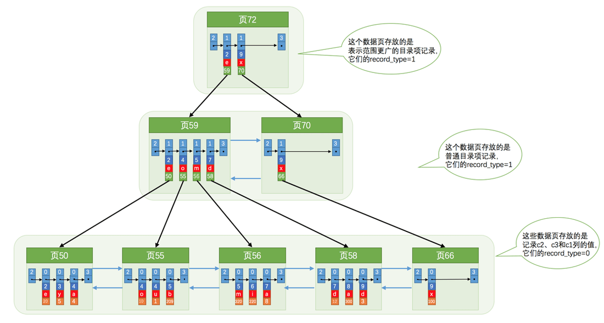
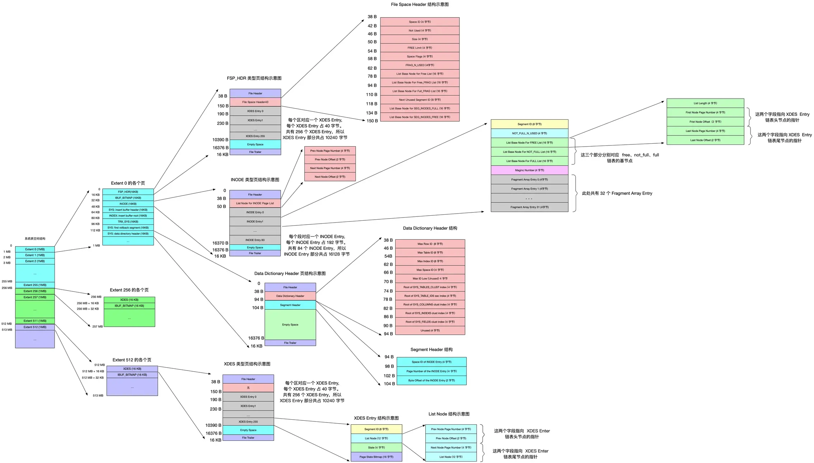

# MYSQL 的底层数据结构

## 前言

本篇从《MYSQL 是怎样运行的：从根上理解 MYSQL》摘录而来，系列博客会有三个篇章，分别是：

* 底层数据结构，整理 MYSQL 是怎么记录数据的，包括InnoDB数据结构，b+树的数据结构
* 高效查询，包括单表查询，连接和索引等
* 事务和锁，包括事务、相关日志文件、锁结构和功能等

这篇博客是三个篇章中的第一篇，因为这本书我买了小册、买了实体书，已经是第三遍阅读了，我会整理出我个人认为最核心的东西，目的是理解其设计思路，让 MySQL 理解和应用变得更为醇熟；这个系列并不会细化到每个 bit 的具体细节，如果需要更深入的了解细节建议阅读小册或者看其他深入解析的书籍。

​​

## INNODB 和 MyISAM

innodb 和 myism 是 MySQL 的存储引擎，除此之外还会有 Memory、blackhole、CSV、NDB、Merge、Federated、Example 等，但并不常用，都可以有其他更合适的方案替代。

innodb和myisam都是落地在文件上的，在mysql5.7以后，全局变量中的 datadir 就表示这个数据库实例的数据目录，数据库中的每个表会对应数据目录下的一个子目录。

innnodb 默认使用独立表空间，会在数据库子目录下为每个表创建一个fmr结构定义文件和.idb 页文件

由于上面的特性，文件名约束会对数据库名和表名产生制约，系统最大文件大小会对单表最大数据产生制约

​​

### MyISAM

MyISAM 直接在数据库目录下为每个表创建 fmr 结构定义文件，myd 数据文件和myi 数据索引文件

MyISAM 由于不支持事物，读取速度会比 innodb 更好，所以经常被用于读多写少的场景

#### 行格式

FIXD 静态格式，静态格式是MyISAM表的默认存储格式。当表不包含变量长度列（VARCHAR, BLOB, 或TEXT）时，使用这个格式。每一行用固定字节数存储。

DYNAMIC 动态格式，如果一个MyISAM表包含任何可变长度列（VARCHAR, BLOB或TEXTDynamic），或者如果一个表被用ROW_FORMAT=DYNAMIC选项来创建，动态存储格式被使用。

COMPRESSED 压缩格式，一种带空间压缩的只读格式。

### INNODB 如何进行存储

#### 行格式

MySQL 日常操作以行为单位进行存储和处理，存放行的格式被称为行格式

innodb 有四种行格式，compact 是目前最新的默认行格式，reduntant 是 MySQL 5.6之前的格式，dynamic 在数据溢出时表现与compact有细微差别，compressed 是在 compact 格式的基础上加上了数据压缩，更为节省空间

​​

所谓变长字段长度列表，简言之 VARCHAR、TEXT 等长度不固定的列需要记录一下他们的真实长度，否则无法正常的分割真实数据中的二进制数据

NULL 值列表也同理，对于部分可以位 NULL 的列，都在 NULL 值表中以二进制的形式来记录，方便记录同时也增加访问效率

​​

‍

MYSQL 是支持数据持久化的数据库，而由内存到硬盘之间的 IO 读写速度差距特别大，因此 MYSQL 会设计一系列缓存及读写策略以保证效率最优化。

#### 内存与磁盘的交互

页是磁盘和内存交互的基本单位，默认页大小是16kb，单次磁盘读取的最小规模是一个页，单次从内存刷入到硬盘的最小规模也是一个页。

​

INNODB 设计了不同用途的页，其中存储数据的页叫做数据页，除了实际数据之外，还会存储更多的双向链表、文件信息等管理需要的字段，多个页通过 page header 行成双向链表。

​​

在管理页内数据的时候，会自动按照排序进行分组，，在插入或查询时会按照二分法的思想，快速找到对应的“槽”，再找到槽内插入、查询的数据位置

比较重要的是最小纪录，最大纪录以及用户记录这几个部分，相邻用户记录使用 next record 做单向链表，再把一个页中的数据按照大小排序后用槽分组，便于二分查找插入数据且通过算法保证每个分组中的数据不会太多进而提高效率

​​

#### 索引

MySQL 的索引结构也是一种数据，也会以页进行存储，MYSQL 最常见的索引结构是 B+ 树。

B+树和 B 树的核心思想依旧是二分法，这两种树会在索引节点顺序存储数据页范围，这样就可以在顺序范围下通过二分法找到最符合要求的下一级节点的地址，循环往复即可找到最终需要的数据。

B+ 树比 B 树更适合 MySQL 索引结构的原因是，B 树会把完整数据存储在所有节点上，而 B+ 树只会把完整数据存储在叶子节点上，非叶子节点会存储索引需要的信息，而 InnoDB是按照页去存储索引数据的，在插入和查询的时候都会通过非叶子节点找到下一级节点，一个页的大小是固定的，这时候会更希望一次读取能获取到更多的索引信息而非被不需要的完整数据占用了大量空间。

‍

B+树的索引结构和用法决定了使用过程中的一些限制

特性：

* 由于索引按照列顺序存储，如果在聚簇索引的场景下插入顺序非自增的话容易导致页分裂，降低写入效率

* 在非聚簇索引查询的场景下，就出现了查询的最左原则，只能顺序的单向的使用索引。

* 索引除查询外还可用于数据的排序、分组

* 为提高索引空间时间效率，列数据应该尽可能多样且列结构应该尽量小

代价：

* 创建索引会有空间损失 回表和维护额外数据结构有时间损失

​​

innodb中，每个页通过双向链表连接，再把页编号和做比较的键提取出来放到上一层的索引页中，进而可以通过二分法快速的获取数据。

‍

MySQL 在存储表数据时，本质上是创建了一个索引，存储完整数据的索引被称为聚簇索引，而我们自建列的索引被称为非聚簇索引，非聚簇索引只会存储 索引列、主键等必要信息，体积比完整索引小很多，但带来的问题是如果需要获取非索引列的数据就需要根据主键去聚簇索引中找，这个过程就叫做回表，回表会带来额外的性能损失。反之，如果需要查询的列都在非聚簇索引中，那么就会省略这个回表操作，进而提升性能。

​​

#### 表空间、段和区

表空间，表空间是为单个数据表服务的，对应一个或多个表文件，比如前面提到的 表名.idb

每个索引（聚簇或非聚簇都一样）包含两个段，叶子节点段和非叶子节点段，每个段都包含一些区，区下面就是页，每个区有256个页面。

段内第一个区所存储的数据与其他区不一样，因为会有额外的段锁需要的信息，意思也就是段信息最终写文件也是落地到页上的。

​​

引入段目的是加快索引速度，方便管理页面，以及减少随机io。

为优化数据利用，段在为写入数据找区的时候会先申请在碎片区中写入，写满32个碎片区会申请独立区。

> 独立的区会按照利用情况放到三个链表中，free，not_full和full。
> 
> 区有四种状态，free 空闲区，free_frag 有空闲碎片区，full_frag 无空闲碎片区，faeg 属于某个段的区。
> 
> 如果把表空间比作是一个集团军，段就相当于师，区就相当于团。一般的团都是隶属于某个师的，就像是处于FSEG的区全都隶属于某个段，而处于FREE、FREE_FRAG以及FULL_FRAG这三种状态的区却直接隶属于表空间，就像独立团直接听命于军部一样。

## 总结

理解底层数据结构的设计有利于掌握 MySQL 的设计初衷和存在一些规则约束的根本原因，比如命名规则、索引最左匹配原则、避免回表的优化等等。

语言整理可能稍显混乱，最后贴上文章中整理的底层结构图

​​
