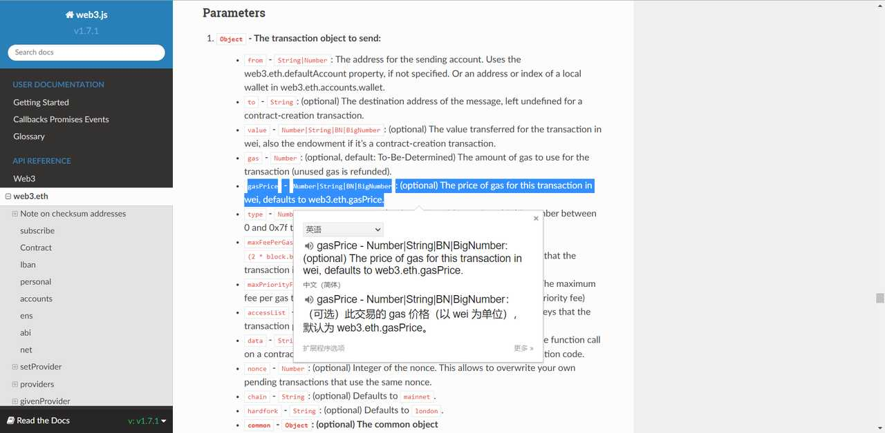

## 前言

最近公司发展 NFT 相关的业务，而 mint/transfer 都需要改变合约状态，所以需要打包并发起交易，调研 Alchemy 的时候发现他给的 gasPrice 与 MetaMask 这种钱包给的三档价格有略微区别，于是进行了一番追查。

## 追查记录

小狐狸的出价类似 [Eth Gas Station](https://ethgasstation.info/)，有三档  但 Alchemy 提供的获取 gasPrice 的接口只返回一个数据 [https://docs.alchemy.com/alchemy/tutorials/sending-txs#7.-create-sendtx.js-file](https://docs.alchemy.com/alchemy/tutorials/sending-txs#7.-create-sendtx.js-file) [https://docs.alchemy.com/alchemy/apis/polygon-api/eth\_gasprice](https://docs.alchemy.com/alchemy/apis/polygon-api/eth_gasprice) 

### 从 alchemy 到 web3

文档和 google 里边并没有找到，只在 EIP1155 里边提了一嘴  好在他们的 web3 wrapper 是开源的，找了下并没有对 gasPrice 做任何的包装和处理，[https://github.com/alchemyplatform/alchemy-web3](https://github.com/alchemyplatform/alchemy-web3) 而 web3 的 gasPrice 默认值是 web3.eth.gasPrice  告诉我们是从 gas price 预言机找到的  好在 web3.js 也是开源的，找到相关的代码，[https://github.com/ChainSafe/web3.js](https://github.com/ChainSafe/web3.js)  需要去调用对应 json-rpc 主机的 eth\_gasPrice 方法

### 从 web3 到 geth

Alchemy 的文档提了一下其间差别  对应的问题：[https://github.com/ethereum/go-ethereum/issues/15825](https://github.com/ethereum/go-ethereum/issues/15825) ，意思是这个 price 是 geth 实现的 追查了相关的代码变更：[https://github.com/ethereum/go-ethereum/pull/15828/files](https://github.com/ethereum/go-ethereum/pull/15828/files) 翻查了 geth 的源码，[https://github.com/ethereum/go-ethereum/](https://github.com/ethereum/go-ethereum/) 提问时配置是：  现在配置是：  代码实现： [https://github.com/ethereum/go-ethereum/blob/f01e2fab07a20a4be5bedde45a366cfe89f07cd4/internal/ethapi/api.go#L64](https://github.com/ethereum/go-ethereum/blob/f01e2fab07a20a4be5bedde45a366cfe89f07cd4/internal/ethapi/api.go#L64 "https://github.com/ethereum/go-ethereum/blob/f01e2fab07a20a4be5bedde45a366cfe89f07cd4/internal/ethapi/api.go#L64") [https://github.com/ethereum/go-ethereum/blob/f01e2fab07a20a4be5bedde45a366cfe89f07cd4/eth/gasprice/gasprice.go#L149](https://github.com/ethereum/go-ethereum/blob/f01e2fab07a20a4be5bedde45a366cfe89f07cd4/eth/gasprice/gasprice.go#L149 "https://github.com/ethereum/go-ethereum/blob/f01e2fab07a20a4be5bedde45a366cfe89f07cd4/eth/gasprice/gasprice.go#L149")   **大概意思是，取20个块中价格位于 60% 的交易价格** 网上的一些解析：[https://stackoverflow.com/questions/55431745/how-do-geth-estimategas-and-suggest-gas-price-work](https://stackoverflow.com/questions/55431745/how-do-geth-estimategas-and-suggest-gas-price-work "https://stackoverflow.com/questions/55431745/how-do-geth-estimategas-and-suggest-gas-price-work")

## 参考文档

[Mint NFT and Run Node Contract](https://docs.alchemy.com/alchemy/tutorials/how-to-create-an-nft/how-to-mint-a-nft#step-9-call-mint-nft-and-run-node-contract-interact-js)
[Alchemy Transaction Parameters](https://docs.alchemy.com/alchemy/apis/polygon-api#parameters-28)
[maxPriorityFeePerGas vs maxFeePerGas](https://docs.alchemy.com/alchemy/guides/eip-1559/maxpriorityfeepergas-vs-maxfeepergas#what-is-the-base-fee-per-gas)
[How to Send Transactions with EIP 1559](https://docs.alchemy.com/alchemy/guides/eip-1559/send-tx-eip-1559#add-max-priority-fee-per-gas-field-only-recommended)
[The Developer EIP-1559 Prep Kit](https://blog.alchemy.com/blog/eip-1559)