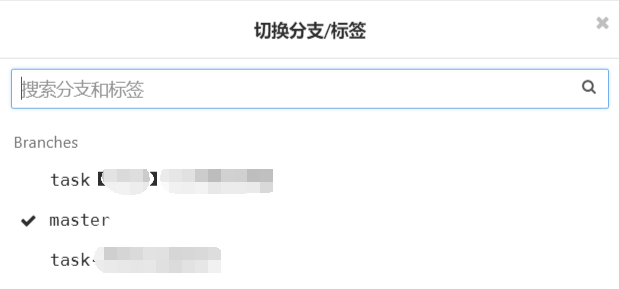

## 背景

博主接触 GIT 也有一段时日了，但是来公司之前用的最多的也就 `git push origin master`, `git pull origin master` `git commit -m 'xxx'` 跟小伙伴在 master 上拉过来推过去，根本不适用于公司的多人协作开发的情况。遂写下此文，以便查阅。

## 需要用到的基础命令

### 本地仓库操作

命令

描述

示例

git init

初始化仓库

git init

git add 文件

将文件/目录从工作区加入到暂存区

git add test.txt

git commit -m '提交信息'

本地提交暂存区的文件，并生成一个 commitId

git commit -m '测试提交'

### 远程仓库操作

命令

描述

示例

git remote add 远程仓库名称 远程仓库地址

添加一个远程仓库

git remote add origin https://github.com/wangerzi/layui-excel.git

git remote remove 远程仓库名称

移除关联远程仓库

git remote remove origin

git pull 远程仓库名称 分支名

拉取分支代码

git pull origin master

git push 远程仓库名称 分支名

推送本地分支至远程

git push origin task-任务1

git checkout -b 分支名 远程仓库/远程分支

新建一个本地分支，依赖某个远程分支

git checkout -b task-任务1 origin/master

git branch -u 远程仓库/远程分支

更换当前本地分支跟踪的远程仓库

git branch -u origin/task-任务1

## 多人合作中分支的构成

### 简单 master 和多个任务分支

博主所在公司前端项目就是这种形式，一个项目也许就一个人负责，master分支上维护线上最稳定的代码，并为每个任务建立各自的任务分支，同时只有一个分支的代码能够被测试，测试完毕即往master合并，下一次任务从最新的master上拉去代码。 比如这样：  建立任务分支或bugfix分支命令描述如下： 需要注意：`checkout -b task-任务1 origin/master` 切出来的分支，默认对应远程分支为 master，需要手动更改为新建的任务分支

```shell
# 从 master 拉去最新代码并将本地分支推向远程
git checkout -b task-任务分支 origin/master
git push origin task-任务分支
git branch -u origin/task-任务分支
# 修改/新增部分代码并推送到远程
git add .
git commit -m '备注'
git push
```

上线操作命令描述如下：

```shell
git checkout master
git pull
git merge origin/task-任务1
git push
```

一旦有两个人同时做一个需求，并且需要同时提测时，需要建立一个临时分支，然后把两个任务的分支同时往这个分支合并。 命令描述如下：

```shell
# 从远程master拉取代码，合并两个任务分支
git checkout -b task-统一提测分支 origin/master
git merge origin/task-任务1
git merge origin/task-任务2
# 将合并完毕的分支推送到远程，并设置分支跟踪
git push origin task-统一提测分支
git branch -u origin/task-统一提测分支
```

### 主干分支+测试分支+任务分支

公司后端用的就是这个模式，后端人数比较多，一次迭代需求可能会有多个人参与，并且后端RPC（远程过程调用）需要协助的地方比较多，会存在并行开发的情况。所以RPC协助、迭代需求等需要在一个环境同时存在并运行，所以有一个 dev(测试)环境。 在这种模式中，测服代码往往是几个任务分支合并在一起的结果，测试人员在与dev分支环境下测试代码准确性，上线时各个分支往master上合并，dev分支相对master独立，不合并到master。 工作流程命令描述如下：

```shell
# dev 源自master
git checkout -b dev origin/master
# 从 master 拉去最新代码并将本地分支推向远程
git checkout -b task-任务分支 origin/master
git push origin task-任务分支
git branch -u origin/task-任务分支
# 修改/新增部分代码
git add .
git commit -m '备注'
git push
# 提测，合并到 dev 分支
git checkout develop
# 先拉下来dev最新代码，再推送
git pull
git merge task-任务分支
git push
# 上线 - 拥有master分支的推送权限
git checkout master
git pull master
git merge task-任务分支
git push
# 上线2 - gitlab等在线工作台提mergeRequest前需要合并master到任务分支，避免冲突
# 备注：当前分支在 task-任务分支
git checkout task-任务分支
git merge master
git push
# 接下来提交合并申请
```

其实从项目管理的角度来看，这样的工作流容易造成一些问题，比如有两个分支并行开发，比如：task-任务1，task-任务2，任务1先开发，先上线，任务2后开发，后上线，在任务1提测一段时间后，任务2提测。 测试人员验证的是 task-任务1+task-任务2 的代码（dev分支同时合并俩任务分支），但是上线却是任务1先上，所以并不能保证task-任务1的分支一定是无误的。不过这个问题也可以从任务划分上避免掉，比如任务一的模块和文件变动范围与任务二的模块和文件变动范围没有交集

### 主干分支+测试分支+开发联调分支+任务分支

这种模式属于上一种模式的改进，合并到测试分支的代码一定是同一批次上线的，开发联调分支是需要做前后端联调等情况时用的。 开发流程代码描述如下：

```shell
# 测试分支和开发源自 master
git checkout -b test origin/master
git checkout -b dev origin/master
# 新建开发分支与之前相同，不再赘述
# ... 建立开发分支 task-任务1，task-任务2，task-任务3
# task-任务1，task-任务2 同时上线，task-任务3 后上线
# 三个分支均往联调环境合并，方便联调
git checkout develop
git pull
git merge task-任务1
git merge task-任务2
git merge task-任务3
git push

# 第一种操作 - 新建提测分支
git checkout -b test-20190723-任务X提测 origin/master
git push origin test-20190723-任务X提测
git branch -u origin/test-20190723-任务X提测
# 合并任务分支
git merge task-任务1
git merge task-任务2
git push
# 合并到测试分支
git checkout test
git pull
git merge origin/test-20190723-任务X提测
git push
# 测完上线
git checkout master
git pull
git merge origin/test-20190723-任务X提测

# 第二种操作 - 直接测试分支合并俩任务分支，上线时也合并俩任务分支，不再赘述
git checkout test
git pull
git merge task-任务1
git merge task-任务2
git push
```

### git flow 工作流

这种模式网上资料很多，比如这篇文章 [https://www.cnblogs.com/wish123/p/9785101.html](https://www.cnblogs.com/wish123/p/9785101.html) ，写的十分详细 在这种模式中，每一次上线都有一个 `release` 分支，每个 `release` 分支就相当于一次发版，每次 `master` 分支上的提交都需要打 tag 用于标记版本号，分支作用如下表：

> 这里有个名词叫 release 分支，就是即将上线的分支，测试的目的是保证这个分支的代码功能正确，如果测试过程中遇到bug直接在 release 分支上修改即可，测试没有问题将次分支合并到 master

分支名称

作用

master

主干分支，每个Commit都应该打Tag

feature

任务分支，用于任务开发，开发完毕应该合并到 develop（没写完就不要合进去了，不然影响release，合并完建议删除）

develop

开发分支，各个任务分支都往这上边合并

release-vxxx

可以理解为发版分支，基于 develop ，一定周期内的开发任务统一在一个release中测试，测试中出现的BUG直接commit在release分支中，测试完毕后提交到master

hotfix

热修复分支，一般用于处理紧急BUG，开发完毕后合并到 develop 以及 master，master上打TAG

## 总结

上述模式可能也仅仅适合体量中小的公司，开发、测试等资源均比较有限，如此结构沟通成本和操作成本会更低一点。更大规模的软件开发协作，git工作流会更加的规范化与流程化，博主还未接触研究，诸君共勉。