## 目的

五六年前买的腾讯云学生机，系统太过老旧，目前正在逐步执行迁移计划，首当其冲的就是托管于服务器上的静态页面，以及偶有访问的博客系统，最好做到**不停机不变 URL 的迁移**，也是对自己技术的一个检验。

## 现状

之前记录博客使用的是 Wordpress，当时非常喜欢里边**完善的功能以及丰富的主题**，插件和界面调整也比较方便。

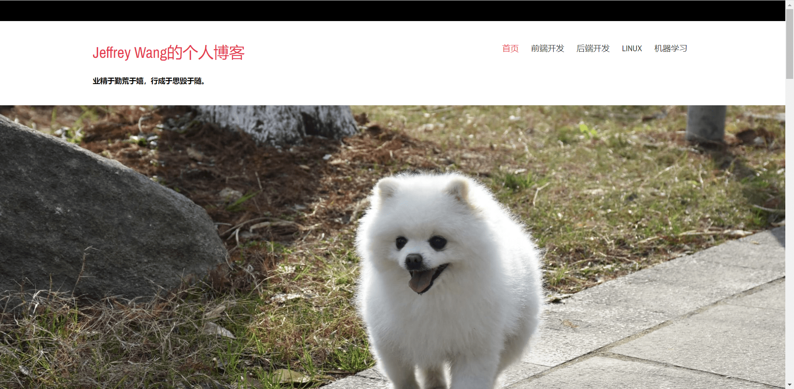

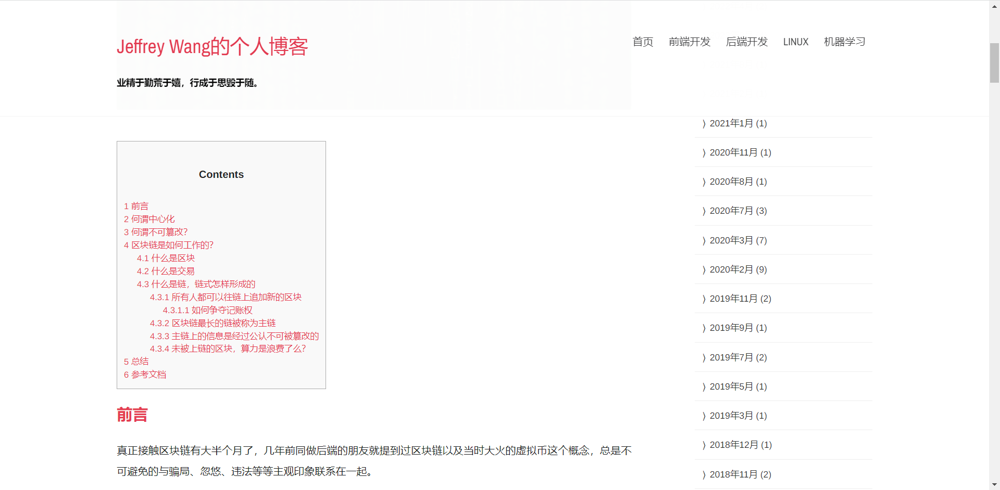

但用的时间越久，就越发觉**庞大且运行缓慢**，里边的 markdown 插件体验不佳，每次在慢吞吞进入系统后，还需要忍受比较糟糕的编写体验（没有实时预览，纯手写 markdown），比较打击写文积极性（咕咕咕借口+1）

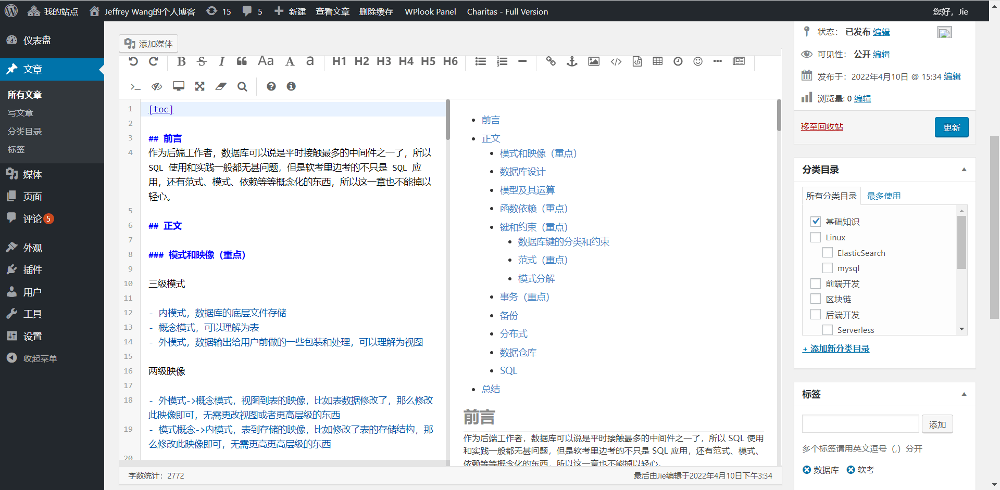

一段时间不进入系统还会有很多**机器人发的乱七八糟的垃圾评论**出现在后台等待审核，一是有安全性上的担忧，万一有人搞一个 XSS，我在审核评论时中招了不就危险了；二来评论审核和过滤也非常的慢，处理完这些事情，写文积极性又降低了一成。

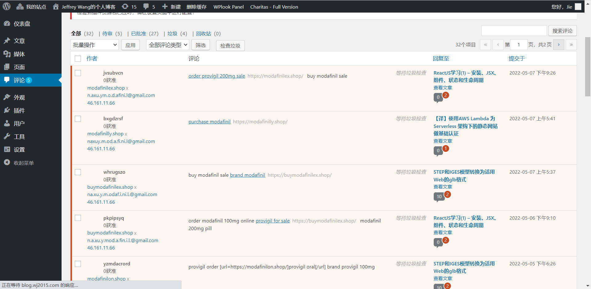

并且我女朋友的博客也在上面，[https://lhx.blog.wj2015.com/](https://lhx.blog.wj2015.com/)，用 Wordpress 的多站点做的，与我一样，每次登陆至少几分钟的精力耗在与无关的事情上，甚至太久没登还需要找回密码。

于是，借个人服务器升级的东风，翻查了现有的博客方案，发现将博客全部静态化可能更符合我现在的调性，评论等需求用 gitlk 等三方服务即可，无需另行操心。

## 效果

这里用了 [GitHub - theme-nexmoe/hexo-theme-nexmoe: 🔥 一个比较特别的 Hexo 主题](https://github.com/theme-nexmoe/hexo-theme-nexmoe) 主题，稍作修改就成了现在的模样。

> PS：以后可能会变化，所以先留个档记录下初始状况

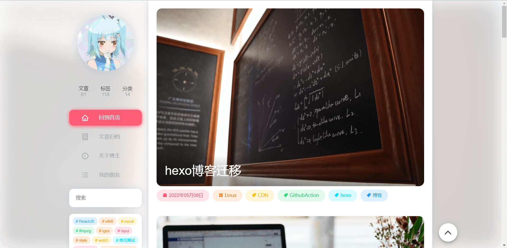

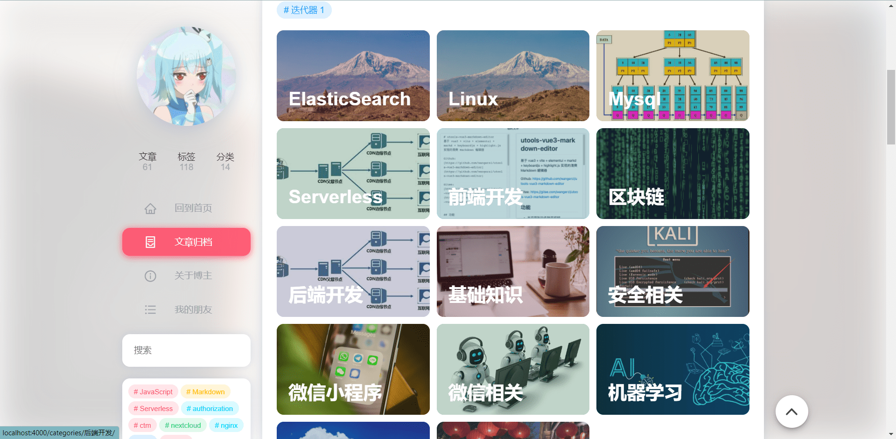


## 调研

借助百度娘谷歌娘，以及万能的 github，我大概看了三款静态博客生成器

还有一个项目对这类静态网站生成器做了整理，可太多了，[GitHub - pinceladasdaweb/Static-Site-Generators: A definitive list of tools for generating static websites.](https://github.com/pinceladasdaweb/Static-Site-Generators)

- Hexo：https://hexo.io/zh-cn/index.html

- Jekyll：https://jekyllrb.com/

- Hugo：https://www.gohugo.org/

最后还是 hexo 吸引住了我，理由有三

- 程序是 nodejs 写的，**插件生态比较多**，我也比较熟悉 Nodejs，有些问题文档描述不清可以看源码了解，一般 nodejs 社区高级前端比较多，主题产出质量应该也高一点吧；

- **已有不少主题比较好看且切换便利**，利用插件完全可以用 markdown 编辑器预览和编写文章，再通过脚本或 CI/CD 一键发布

- 有一个从 wordpress 迁移到 hexo 的方案，这个比较重要

## 实践

### 数据迁移和问题处理

从 Wordpres 迁移到 hexo，有这么一个插件 [GitHub - hexojs/hexo-migrator-wordpress: WordPress migrator for Hexo.](https://github.com/hexojs/hexo-migrator-wordpress)

安装完毕后在源站的『工具』->『导出』中导出所有内容

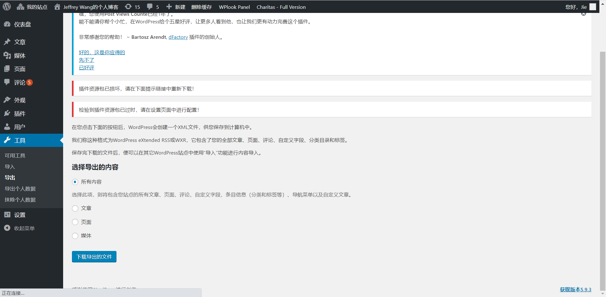

再执行进入 hexo 项目中，安装此插件

```bash
npm i hexo-migrator-wordpress -D
```

将导出的 `wordpress.xml` 放入进去

```bash
hexo migrate wordpress ./wordpress.xml --skipduplicate --import_image
```

#### 碰到的问题

##### 图片没有默认导入

估计也是迁移插件功能不完善导致的，但好在 Wordpress 所有的上传文件都在 `uploads` 目录中，多站点模式下还会有 `uploads/sites/{id}/` 的子目录，我把所有的图片打包下载下来后，做了下批量替换 **（这里记得检查 zip 包的 md5，否则可能解压失败或图片丢失）**，**将路径换为本地相对路径即可**

用相对路径的好处在于：

- Markdown 编辑器一般都支持将图片传到固定路径，并优先使用相对路径，编辑时体验相对友好

- 博客项目和资源存在于一个项目中，方便查看和维护

- 本地编辑时更顺畅，不必依赖网络

但也带来了坏处，是个大坑：

- 由于博客路径需要与 wordpress 保持一致，也就是 `:year/:month/:day/:title/` 格式的链接地址，相对路径不能直接渲染，**必须在程序上转换为 CDN 地址或绝对地址**

**如果有自己稳定使用的图床，那么用 picgo 等软件上传完毕后直接粘贴图片地址，会更简单轻松**，但图床自身的维护成本及日后迁移的成本、以及本地预览时一定需要从网络上下载图片，体验上以及增加的资源都是代价。

所以任何方案都有代价的，选择了其中一条道路，享受了好处，就需要解决他带来的问题。

##### 博客没有封面

因为 hexo 默认的 post 属性是不带封面的，wordpress 中封面也并非必填

- 解决方法：把必要的博客 cover 手动填补上即可

##### 分类紊乱

这个看主题是如何处理分类的，Wordpress 中分类是可以有父级结构的，hexo 也支持父子分类，但插件如果不做区分和配置全部输出出来，效果就不会太好看

- 解决方法：通过查找和替换，整理好不规范和过多的子分类

##### 表格导入不正确

导入的表格会丢失格式，像下面这样

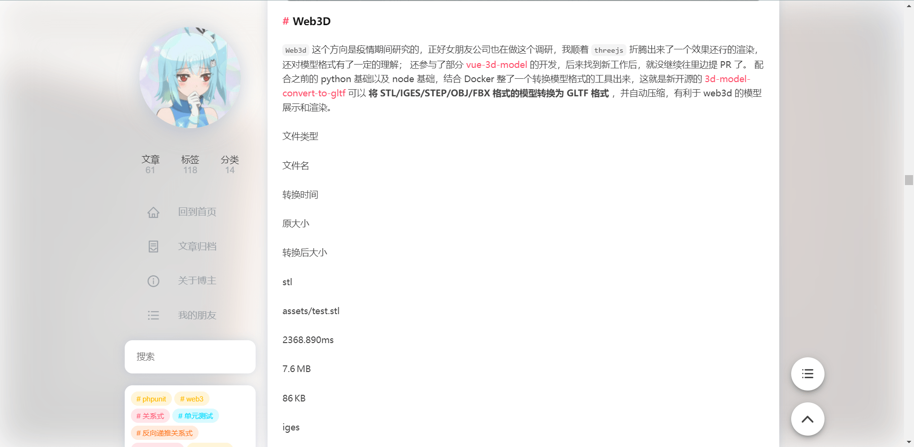

目前没发现好的解决办法，我平时 Markdown 表格用的不多，只能自己手动编辑改过来了

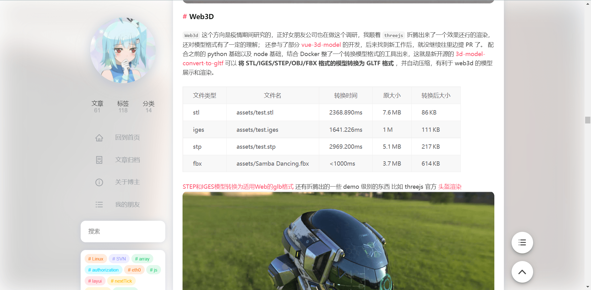

##### CDN 问题

部分主题喜欢使用 jsdrivr，这个 CDN 免费且在国外速度飞快，缺点就是国内很慢。由于我选择了图片相对路径这条路，以及 Wordpress 迁移过来的特殊性，使用了市面上各式各样的图片处理插件都无法满足我的需求。

于是乎，我参考了国人同胞写的，[GitHub - JoeyBling/hexo-filter-image: 自动为hexo中的图片映射绝对路径 | Automatically maps absolute paths to images in hexo](https://github.com/JoeyBling/hexo-filter-image) 插件，自己写了一个 `scripts/images.js`

通过 `_config.yml` 中的 `imageRoot` 参数来控制文章中所有图片的访问路径

```yml
# 流量负担不起的时候，再用这个吧
# imageRoot: https://cdn.jsdelivr.net/gh/wangerzi/blog@latest/source/
imageRoot: /
```

如果后面我发现直接用腾讯云 CDN 图片加载着实慢，改一个配置即可，脚本的原理是**每次渲染后将 img src 中满足相对路径条件的 img 提取出来，根据 markdown 的路径，计算出图片相对 sourcePath 的绝对路径，最后拼接上 imageRoot 即可**，根据 hexo 的规则，就可以顺利的访问到相关资源了。

```js
const path = require('path')
const cheerio = require('cheerio');
const imageRoot = hexo.config.imageRoot || '/';
const sourcePath = hexo.config.source_dir;

function convertRoot(docAbsPath, relSrc, sourcePath='') {
    const dirname = path.dirname(docAbsPath)
    const srcPath = path.normalize(path.resolve(dirname, relSrc));

    return path.relative(sourcePath, srcPath).replace(/\\/g, '/')
}

function urlForHelper(path = '/', docPath = '') {
    path = path.replace('\\', '/');
    if (/http[s]*.*|\/\/.*/.test(path) ||
        /^\s+\//.test(path)) {
        return path
    }
    if (path[0] === '#' || path.startsWith('//')) {
        return path;
    }

    if (path.startsWith('/')) {
        path = path.slice(1)
    }

    path = convertRoot(docPath, path, sourcePath)
    // Prepend path
    path = imageRoot + path;

    // path.replace(/\/{2,}/g, '/');
    // return path.replace(/(\\|\/){2,}/g, '/');
    return path;
}
hexo.extend.filter.register('after_post_render', function (data) {
    const docPath = data.full_source
    if (!docPath.endsWith('.md')) {
        console.log('path break', data.asset_dir, data.full_source)
        return ;
    }
    // console.log('path', data.asset_dir, data.full_source)
    // console.log("excerpt === " + data.excerpt);
    // console.log("more === " + data.more);
    // console.log("content === " + data.content);
    if (data.cover) {
        data.cover = urlForHelper(data.cover, docPath)
    }
    const dispose = ['excerpt', 'more', 'content'];
    for (var i = 0; i < dispose.length; i++) {
        var key = dispose[i];

        if (!data[key]) {
            continue;
        }
        var $ = cheerio.load(data[key], {
            ignoreWhitespace: false,
            xmlMode: false,
            lowerCaseTags: false,
            decodeEntities: false
        });

        $('img').each(function () {
            var src = $(this).attr('src');
            if (src) {
                // For windows style path, we replace '\' to '/'.
                const newUrl = urlForHelper(src, docPath);
                // console.log('change', $(this).parent().attr('href'), src, newUrl, data.full_source);
                if (src !== newUrl) {
                    $(this).attr('src', newUrl);
                }
                // too slow!!!
                if (src.indexOf($(this).parent().attr('href')) !== -1) {
                    $(this).parent().attr('href', newUrl)
                }
            } else {
            }
        });
        data[key] = $.html();
    }
    // if (this.config.imagePrefix) {
    //     data.content = data.content.replace(
    //         new RegExp(themeCfg.imageCDN.origin, "gm"),
    //         themeCfg.imageCDN.to
    //     );
    // }
})

console.log('')
```

##### 主题写死 CDN 的问题

用的主题有硬编码 jsdrivr 的 CDN 地址，国内用户体验很差。


在 ISSUE 下也有其他用户反馈这个问题，于是乎写了一个脚本在渲染完毕后动态的替换这些硬编码地址，具体用法和代码都附在了这个 ISSUE 上。

[优化被硬编码的可达性不佳的cdn地址 · Issue #184 · theme-nexmoe/hexo-theme-nexmoe · GitHub](https://github.com/theme-nexmoe/hexo-theme-nexmoe/issues/184)

##### 网站统计分析

既然纯静态了，那么分析统计方面自然也只能用三方服务了，这里用了 **Google Analytics**，注册一个谷歌账号，创建一个项目后在 hexo 中引入即可使用，还是比较方便的。

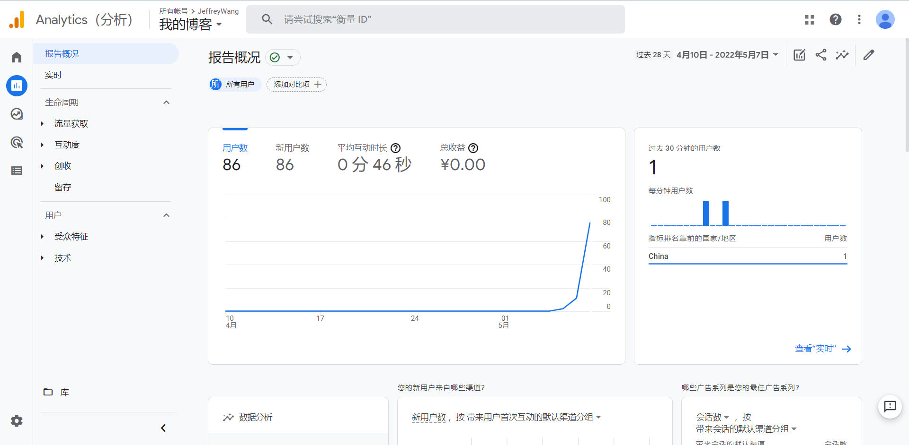

#### 待解决的问题

##### 静态资源压缩问题

这个问题比较复杂，hexo 中 html / js /css 都没有经过压缩，**以及我们平时用的微信/QQ截图保存生成的图贼拉大，粘贴到项目或图床前本身就需要经过一次压缩。**

比如偶尔一个微信生成的 1080p 屏幕的截图，4M多，简单压缩一下 8k 多，虽然也很大，但相对来说不至于特别无法接受。

而且这个问题还可能跟使用的主题有关，在调研 [hexo-theme-keep](https://keep-docs.xpoet.cn/) 时，作者在文档中写道可以使用 [hexo-all-minifier](https://github.com/chenzhutian/hexo-all-minifier) 插件，这个插件在 keep 上体验良好（**但压缩 PNG 会导致 CPU 爆掉**），但其他主题上就可能有兼容性问题。

上述插件也有段时间没更新了，毕竟是开源全靠情怀，可以理解。

##### 评论问题

一开始是打算用 gitlk 这类评论系统的，但其**国内连接 github 过慢的连接速度对体验的影响让我还是关闭掉了这个功能**，后面有更合适的，更有必要的场景时，再考虑打开。

找主题的时候，发现 hexo-theme-yun 主题的作者，对三方评论系统做了这样一番总结，可供参考：https://www.yunyoujun.cn/share/third-party-comment-system/

hexo-theme-yun 主题链接：[GitHub - YunYouJun/hexo-theme-yun: ☁️ A fast & light & lovely theme for Hexo. 一个对可爱自以为是的 Hexo 主题。](https://github.com/YunYouJun/hexo-theme-yun)

##### 国内和境外访问的问题

虽然我这是个中文博客，但我在谷歌上的统计报表上发现，每天还是**有人通过 google 搜索到我的页面并访问的**，而我用的 CDN 是腾讯云，在我不开国外流量包时，他们的访问速度会特别慢，甚至慢过直接访问 githubpages 。

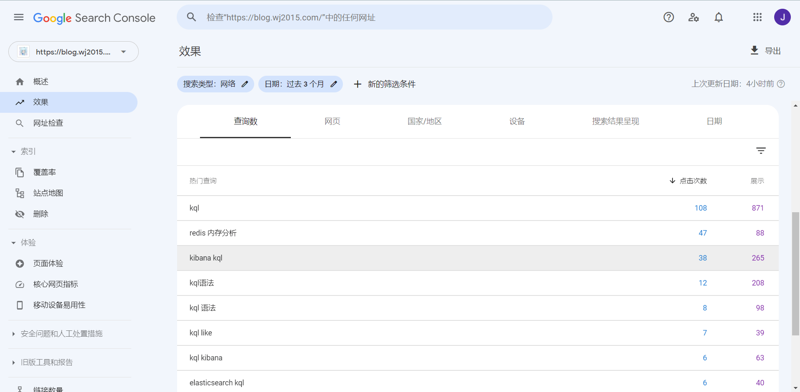

这里倒是有一些解决办法，比如**动态 DNS，分区域解析不同的记录**，但受限于我在数年前在腾讯云上购买和使用的域名，所以里边不像 AWS 可以分区域做不同的 CNAME 解析（或者这在腾讯云上是付费服务），对于我来说暂时不会考虑，随后再解决吧，毕竟有本地缓存之后，体验尚可。

再比如 element 官网那样，检查是否国内用户，给到不同的网址，说来话长，随后再想办法解决。

### 如何部署

之前看过 hexo-deployer-cos-cdn 作者写了一篇帖子，是将所有图片和生成的资源放在 cos 上的，https://www.lixl.cn/2020/020936412.html

插件地址：[GitHub - lxl80/hexo-deployer-cos-cdn: Hexo部署插件，支持将静态博客发布到腾讯云对象存储中，并同步刷新被更新文件的CDN缓存。](https://github.com/lxl80/hexo-deployer-cos-cdn)

因为我刚将我的开源插件插件文档、静态化的项目都放到了腾讯云的 COS 中，所以我一开始也打算使用这种方式，**但后来在尝试 githubaction + netflix 后，发现推到 github 中随后什么也不管更爽一点**，反正都是静态资源，其他的让 CDN 自动加速好了，还能省去未来图片过多 COS 收费的问题。

##### GithubAction

按照官方教程，做一个 workflow 即可，也就是在 `.github/workflows/pages.yml` 中填入如下内容，目录没有自己建好即可

> 原理是执行 npm run build 后，将产物推送到 gh-pages 分支上

```yml
name: Pages

on:
  push:
    branches:
      - master  # default branch

jobs:
  pages:
    runs-on: ubuntu-latest
    steps:
      - uses: actions/checkout@v2
      - name: Use Node.js 16.x
        uses: actions/setup-node@v2
        with:
          node-version: '16'
      - name: Cache NPM dependencies
        uses: actions/cache@v2
        with:
          path: node_modules
          key: ${{ runner.OS }}-npm-cache
          restore-keys: |
            ${{ runner.OS }}-npm-cache
      - name: Install Dependencies
        run: npm install
      - name: Build
        run: npm run build
      - name: Deploy
        uses: peaceiris/actions-gh-pages@v3
        with:
          github_token: ${{ secrets.GITHUB_TOKEN }}
          publish_dir: ./public
```

然后在项目 Setting -> Actions -> General 下，允许 action 读写仓库，不然执行会失败


提交数据并推送后，会在 actions 界面看到执行记录

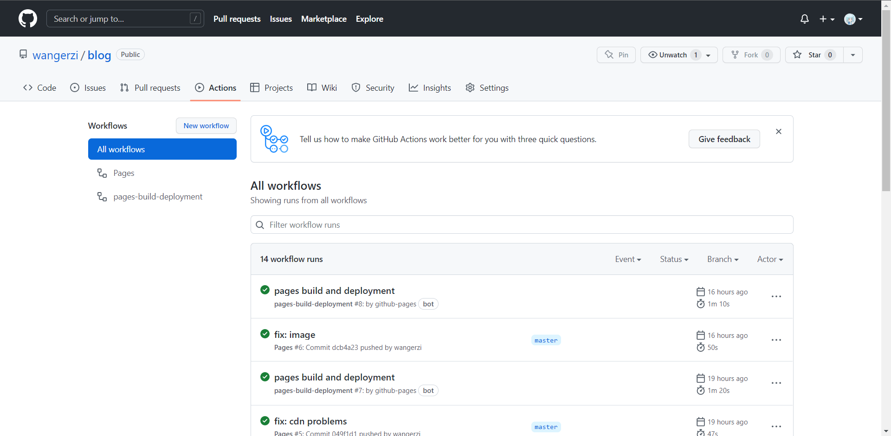

并且能够找到自动创建的分支，点进去之后会发现全都是自动生成的静态文件

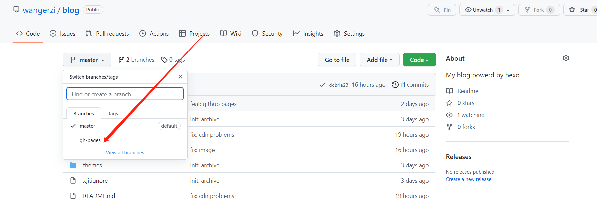

##### GithubPage

选一下分支保存就行，就可以得到一个可访问地址了

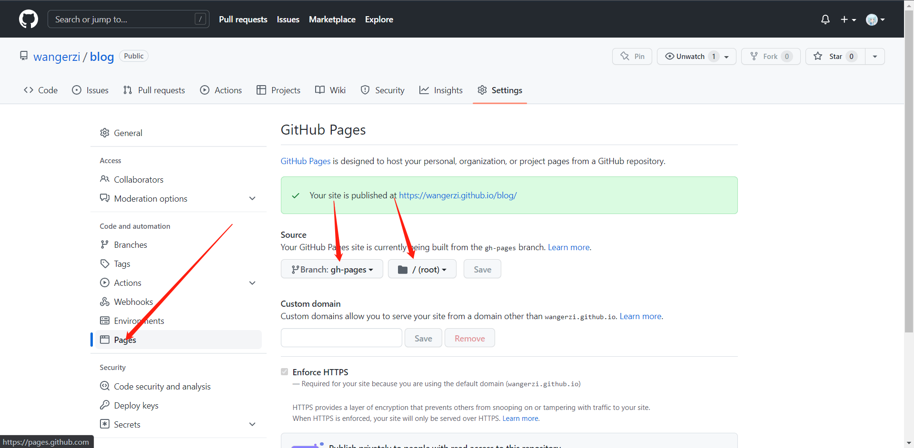

##### Netlify

https://www.netlify.com/

这个服务可以给到你一个带 CDN 的地址，性能比 githubpages 稍微好点，但是国内依旧很慢，如果这已经可以满足需求，直接把自己的域名 CNAME 到他生成好的域名上即可。

这里有篇教程：https://kalasearch.cn/blog/gatsby-blog-setup-tutorial-with-netlify/

##### 腾讯云 CDN

界面操作建好即可，唯一需要注意的可能就是缓存部分，其实是可以做到每次更新就刷新缓存的，但介于博客的场景，新增多、修改少，所以我做了如下规则，根路径下的 `about.html/friends.html/archives.html` 等页面会随着文章编写而变化，而静态的图片和 CSS/JS 等资源基本就不变，所以设置了节点7天缓存的规则，也足够了。

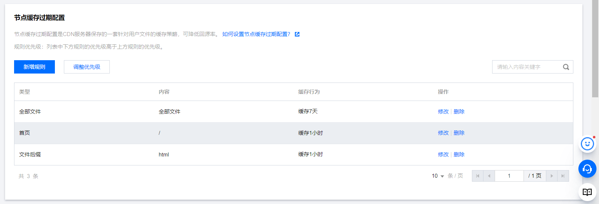

腾讯云的 HTTP2 有点坑，存在偶现的图片无法加载的情况，所以我关掉了

回源我配置的 netlify 地址，因为腾讯云不能指定回源路径，微坑，只能通过回源配置里的 URL 重写来曲线救国，不然也可以多配一个 githubPages 的链接，但我没测过两者回源谁比较快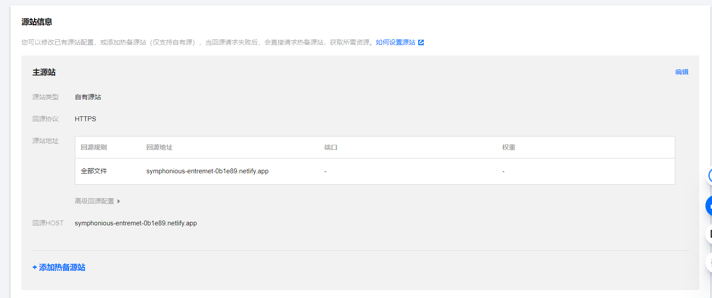

等 CDN 部署完毕，修改 DNS 解析就可以实现平滑的迁移

##### 网络结构

从用户到服务，大概是这么个过程

- DNS 解析到距离用户最近的腾讯云 CDN 节点

- CDN 节点是否有缓存且未过期
  
  - 是：直接返回数据
  
  - 否：向 netlify 回源

- Netlify 这里会监控 github 上 gh-page 分支，可以认为是提交后实时变化的

## 博客编写流程

之前是用 Typora 的，但最近要收费了，于是目标转向了一个开源的编辑器 MarkText

[GitHub - marktext/marktext: 📝A simple and elegant markdown editor, available for Linux, macOS and Windows.](https://github.com/marktext/marktext)

虽然不支持中文，但是我最希望有的**图片相对路径保存**是有的，这就足够了，配置如下：

> ctrl + shift + O 打开项目文件，然后 global image foldr 设为 sourcePath，relative image folder 设为相对于项目的路径，然后粘贴图片就会保存至指定的目录


效果：

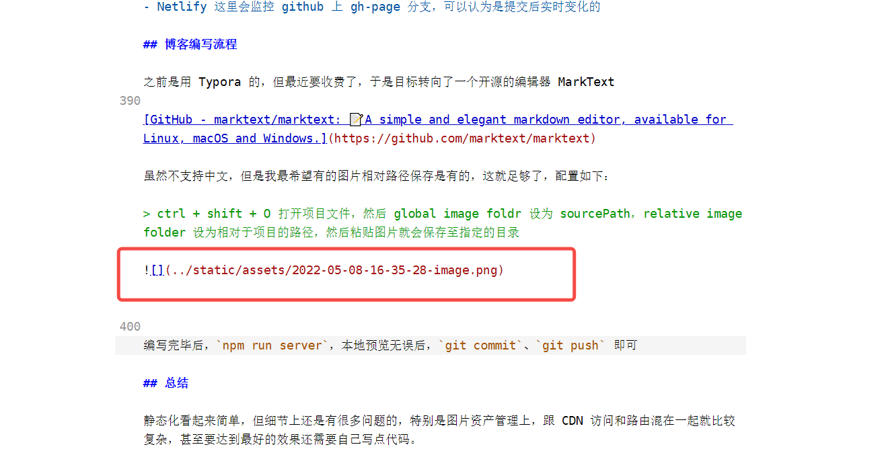

编写完毕后，`npm run server`，本地预览无误后，`git commit`、`git push` 即可

## 总结

静态化看起来简单，但细节上还是有很多问题的，特别是图片资产管理上，跟 CDN 访问和路由混在一起就比较复杂，甚至要达到最好的效果还需要自己写点代码。 

虽然碰到了很多问题，但这个过程也是很有趣且快乐的，也是对自己技术上的一次综合测试。
