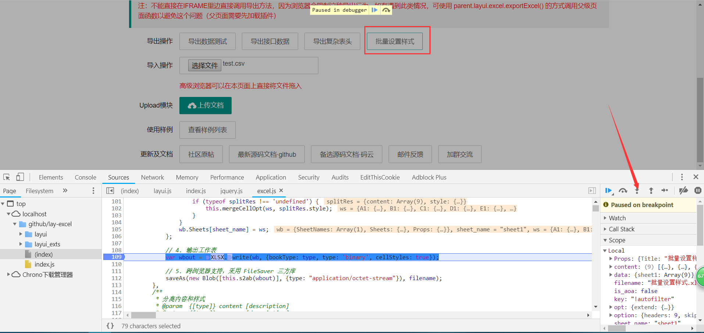
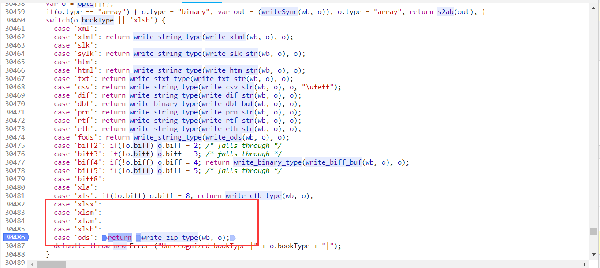
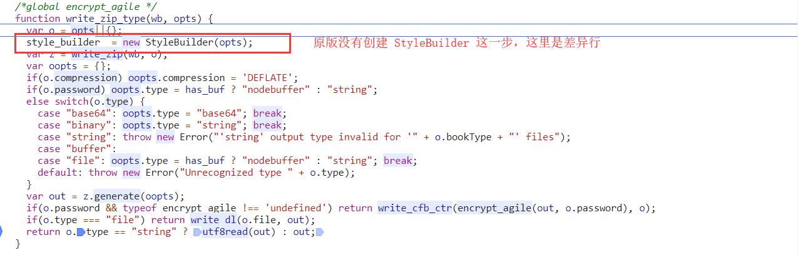
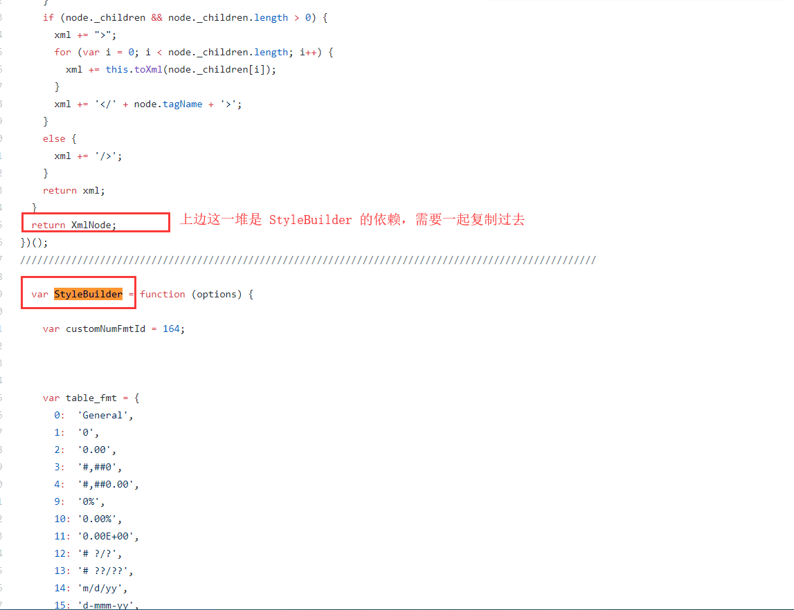
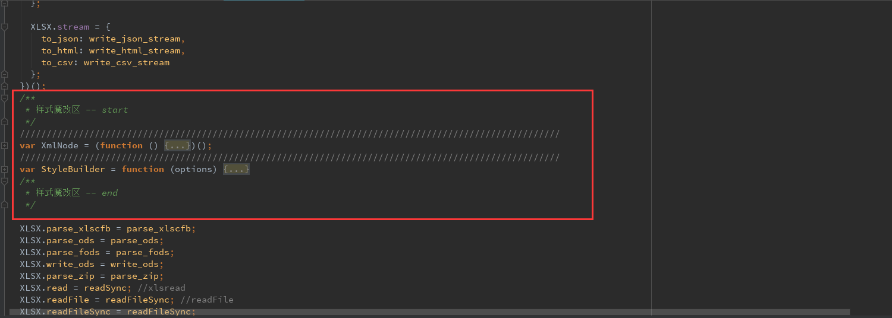
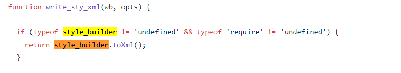
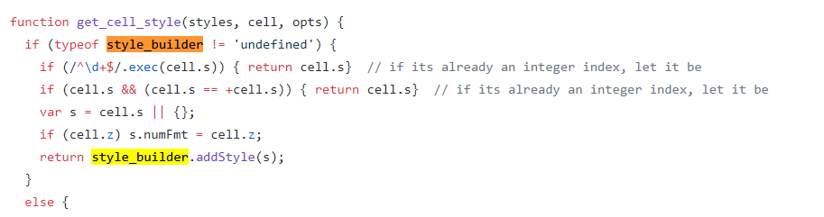
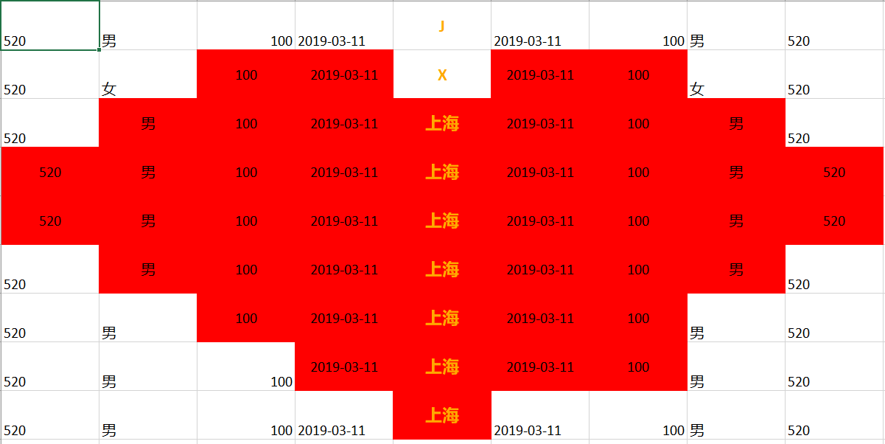

## 背景

最近五一小长假，统一处理下之前开源的 [Layui导出插件 lay-excel](https://github.com/wangerzi/layui-excel) 反馈的部分问题，这个插件核心使用的是经过改造的 protobi/js-xlsx，支持设置样式但是不支持诸如 导出文件压缩、边距设置等功能，还存在很多BUG，效率也不高。 为解决这些问题，博主开始着手改造最新 JS-XLSX 让其支持样式设置，断点调试再加上代码对比，最后改造成功。 改造完毕的 xlsx.js 在此，可自行引入： [https://github.com/wangerzi/layui-excel/blob/master/src/xlsx.js](https://github.com/wangerzi/layui-excel/blob/master/src/xlsx.js) 记得配合 jszip.js 使用，否则报错： [https://github.com/wangerzi/layui-excel/blob/master/src/jszip.js](https://github.com/wangerzi/layui-excel/blob/master/src/jszip.js)

## 开始前的准备

> SheetJs/js-xlsx是目前依旧维护的最新版本，protobi/js-xlsx 是大约两年前的支持设置样式的版本，很多比较实用的功能都没有。

开源项目名称

地址

用于

[SheetJS / js-xlsx](https://github.com/SheetJS/js-xlsx)

[https://github.com/SheetJS/js-xlsx](https://github.com/SheetJS/js-xlsx)

导出的基础逻辑

[protobi / js-xlsx](https://github.com/protobi/js-xlsx)

[https://github.com/protobi/js-xlsx](https://github.com/protobi/js-xlsx)

可以设置样式，用于补全样式功能

## 改造思路

博主做了个插件预览放在了服务器上，如果想了解具体的改造原理，可以跟着思路在 [http://excel.wj2015.com](http://excel.wj2015.com) 上自行调试一下

### 断点调试，找有关样式设置的代码

*   点击批量设置样式按钮，在调用行处打断点

```javascript
var wbout = XLSX.write(wb, {bookType: type, type: 'binary', cellStyles: true});
```



*   发现xlsx导出进入了此函数



*   进一步调试，发现了差异



#### 根据支持样式的版本，补全缺失代码

*   补全样式代码

> 进入最新版[https://github.com/SheetJS/js-xlsx/blob/master/dist/xlsx.js](https://github.com/SheetJS/js-xlsx/blob/master/dist/xlsx.js)，搜索 `StyleBuilder` 发现没有这个类，但是在 [https://github.com/protobi/js-xlsx/blob/master/dist/xlsx.js](https://github.com/protobi/js-xlsx/blob/master/dist/xlsx.js) 发现了这个类，与其依赖一起复制过来



*   复制到目标文件暴露全局变量之前



*   查找 `style_builder` 这个变量在 `protobi/js-xlsx` 中有哪些地方使用到了，依次复制到 `SheetJS/protobi` 中

  PS:几年过去了，这里的逻辑基本没变，所以放心复制好了

*   最后，测试一下导出，发现可以设置样式了

