# 背景

学校开了一门“网络安全”相关的课程，要求自己安装一个kali Linux 玩玩，之前对kali的大名早有耳闻，于是正好乘此机会好好倒腾倒腾。

## 如何安装kali

### 下载kali

首先，于[kali的官网](https://www.kali.org/)选择“Downloads”，下载最新版种子文件，[种子链接](https://images.offensive-security.com/kali-linux-2018.1-amd64.torrent)，使用迅雷等工具进行下载。 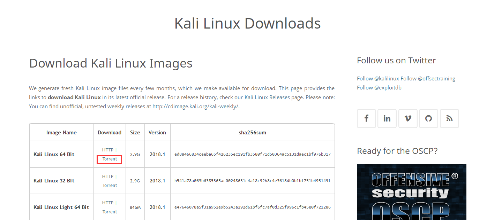

### 使用VMware新建虚拟机进行安装

新增一台虚拟机（内存2G，硬盘20G即可，网络选桥接/NAT）

> 开启虚拟机 》 图形安装

> 选择语言（简体中文）

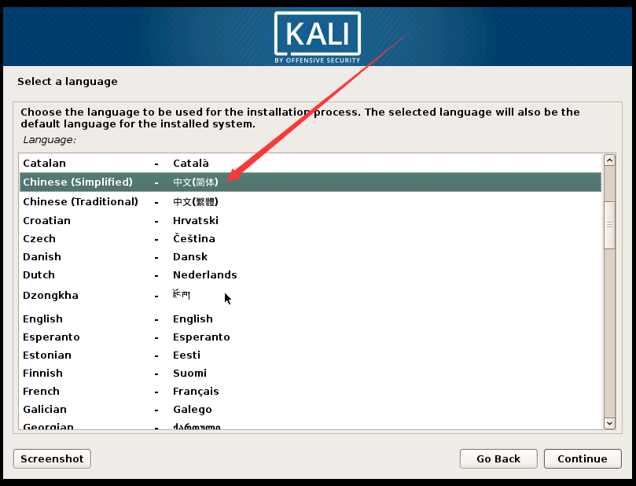

> 选择键盘配置之后将会自动配置

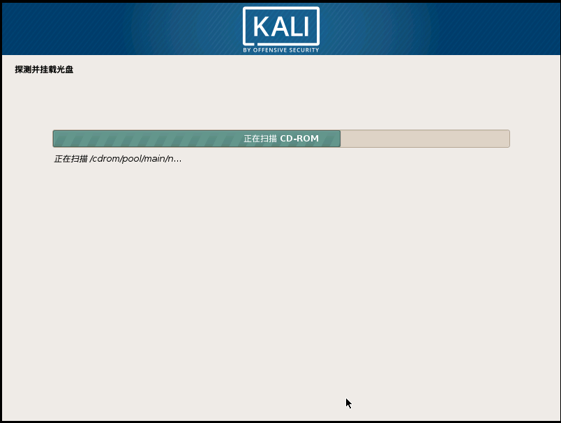

> 可能会存在DHCP获取不到的问题，不进行网络配置即可

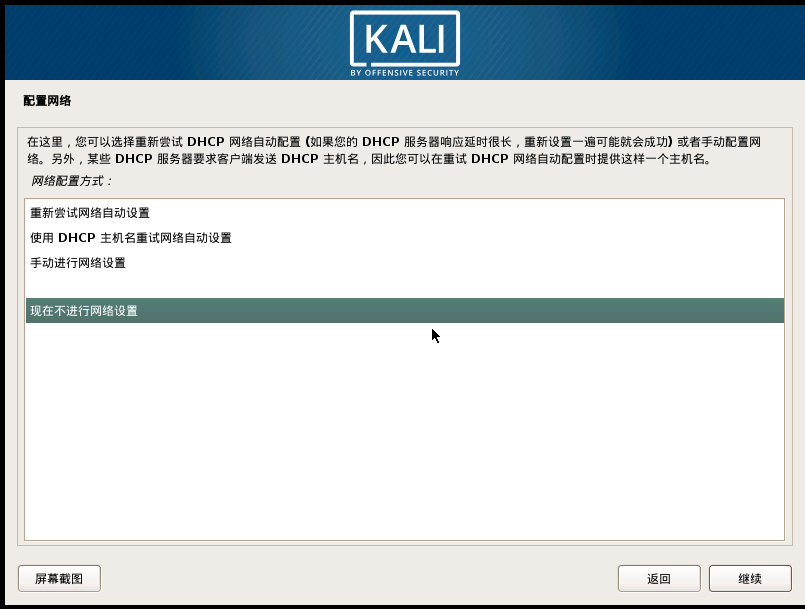

> 设置主机名和密码

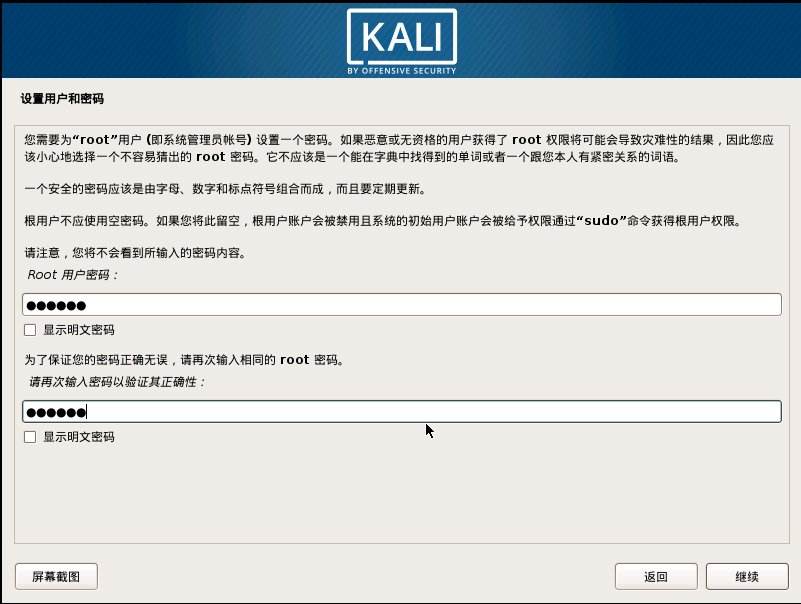

> 磁盘分区，有安装经验的可以选择自行分区，然后继续选择“继续”、“是”即可开始安装系统

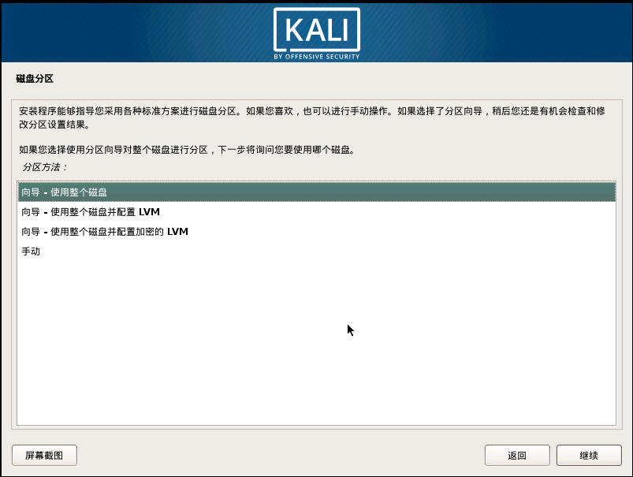 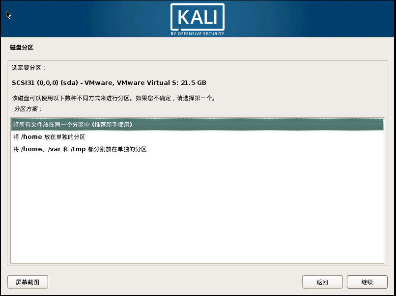 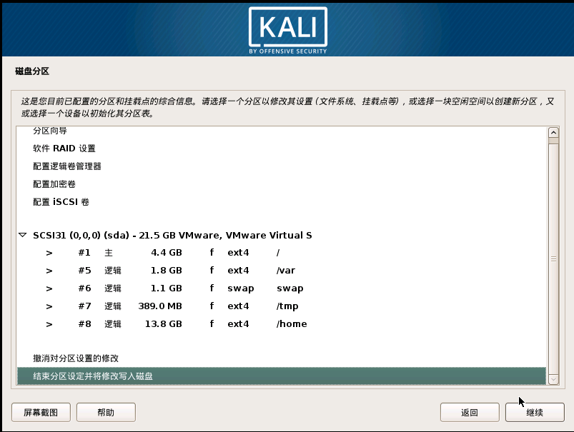 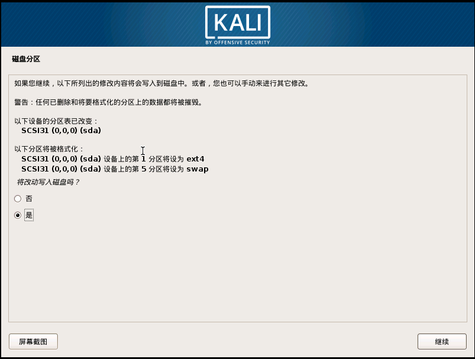

> 等待安装完成

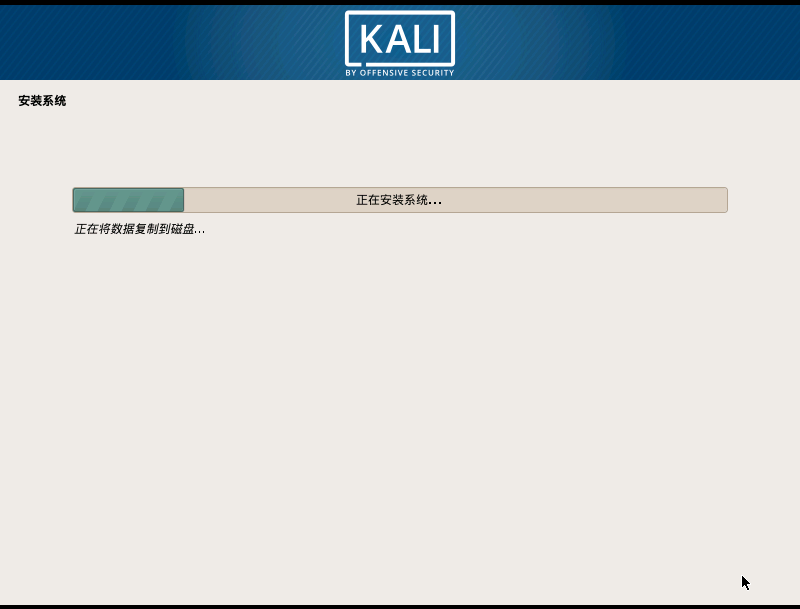

> 这里选择是

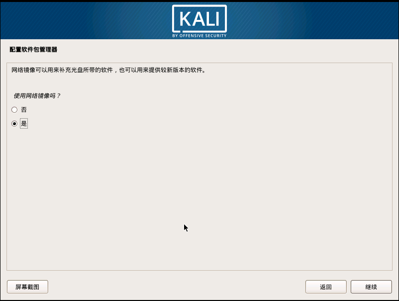

> 选择安装GRUB，如果自定义/boot分区，则选择/boot分区所在磁盘

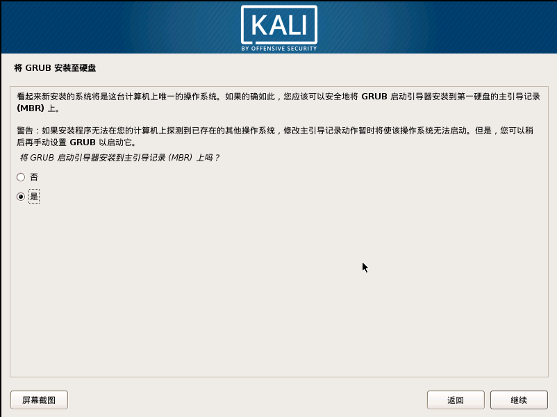 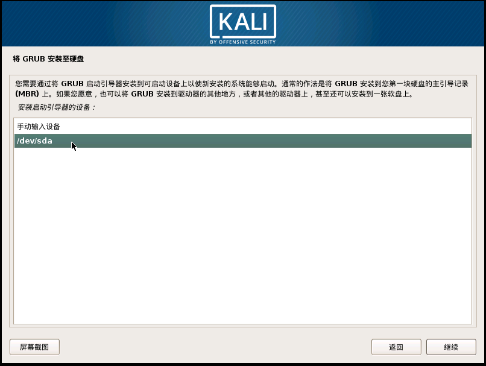

> 点击“继续”，虚拟机将会重启，后完成 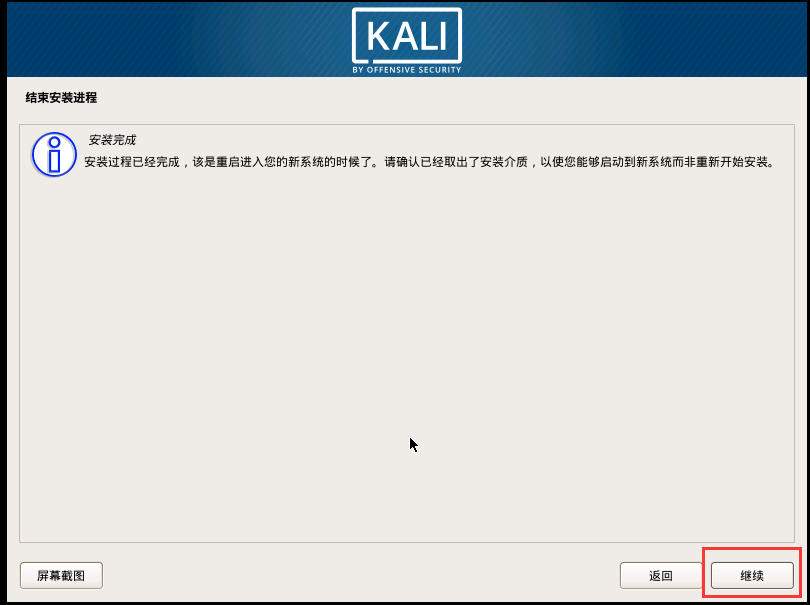 注意：如果在安装时报错“系统安装错误”，请在磁盘分区步骤中选择“将所有文件放在一个分区中”

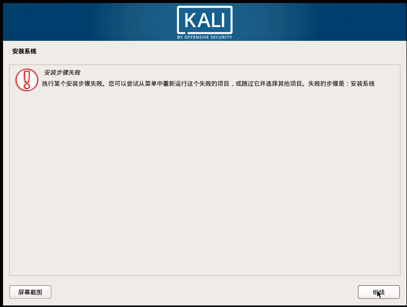 

## ARP欺骗+tcpdump抓取并盗用用户信息

使用arpsproof、tcpdump抓取HTTP信息并使用session盗取用户登录信息

### 环境假设：

主机

IP

MAC

网关

192.168.10.250

50:DA:00:42:82:5E

被攻击者PC1

192.168.10.18

3C:52:82:E0:74:CB

攻击者PC2

192.168.10.3

00:0C:29:7B:33:6E

### ARP双向欺骗网关、PC1

> 本次测试网址：http://shop.wj2015.com

##### arpsroof参数说明

arpsroof -i \[指定网卡\] -t \[被欺骗IP\] \[申明IP\] 原理：一直

#### 打开转发

打开转发功能，令数据流 PC1 > 我 > 网关 或者 网关 > 我 > PC1 正常沟通。

> echo 1 > /proc/sys/net/ipv4/ip\_forward 内容为 1 表示开启  注意：如果不开启自动转发，被攻击者将在开始攻击后断网

#### 欺骗被攻击者

欺骗被攻击PC1(192.168.10.18)，我是网关(192.168.10.250)，让PC1的MAC地址表添加一条我的MAC和网关IP的记录。

> arpsroof -i eth0 -t 192.168.10.18 192.168.10.250 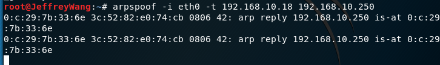

##### 欺骗前

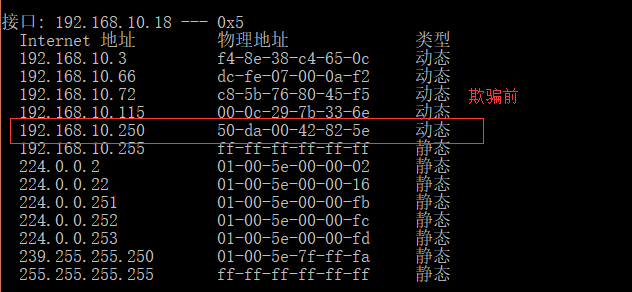

##### 欺骗后

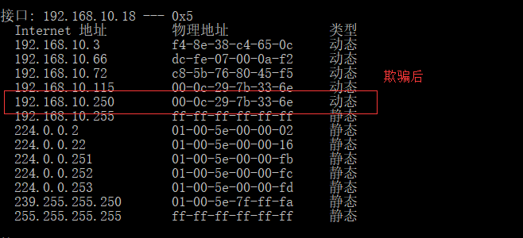

#### 欺骗网关

欺骗网关（192.168.10.250），我是PC1（192.168.10.18），使网关的MAC地址表添加一条我的MAC和PC1IP的记录。

> arpsroof -i eth0 -t 192.168.10.250 192.168.10.18 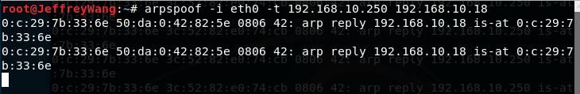

#### 抓取被攻击者的报文

能使用tcpdump工具将PC1出网的所有数据包拦截下来（这里只监听发包-抓密码）注：123.206.67.59为测试地址的IP

> tcpdump -i eth0 -Av -c 1000 src 192.168.10.18 and dst 123.206.67.59 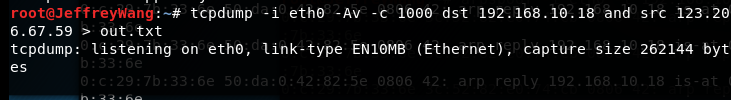

##### tcpdump参数简介

\-i 指定网卡 -A ascii形式打印 -v 显示更多信息 -c 限制条数 src 指定包来源 dst 指定包目标

##### 被攻击者访问网站并登陆

##### 检查监听的文件

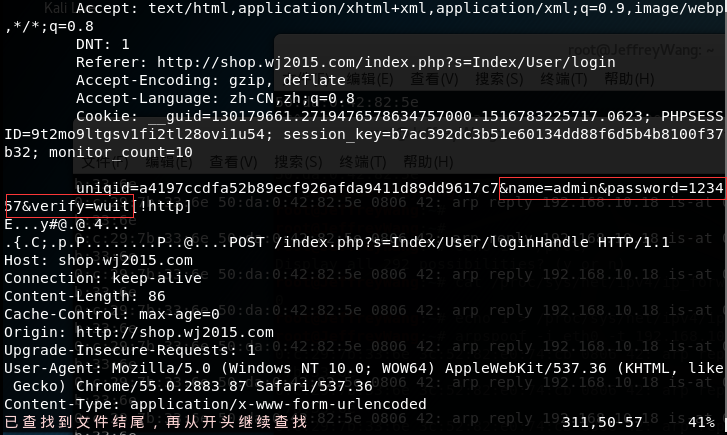 成功找到用户名+密码，找到cookie信息放置于firefox中，即可盗用被攻击者的账号进行操作，因为大部分网站的SESSIONID都是存放在COOKIE中的，得到了COOKIE，对于服务器来说你与被攻击者没有区别。

## 从攻击中发现的问题及防范

ARP协议是数据链路层协议，用于转换内网的IP > MAC，由于网络协议上层依赖下层，所以如果在此层受到攻击，轻则无法上网，重则账号密码被盗，账号被盗用。 那么，如何避免此情况呢？首先，这是一个用于局域网内的协议，所以应该避免连接不确定安全性的WIFI，特别是免费WIFI。其次，ARP攻击的特征还是比较明显的，一台机器不停的发送ARP回应报文，一般的局域网安全检测软件都能检测到，如：手机的腾讯管家、手机自带的wifi检测等均会发起安全提示。

# 结语

Kali Linux中集成了大量的安全测试工具，ARP欺骗+中间人攻击只是其中很小一部分的应用，重要的是理解其中原理，增加防范意识。