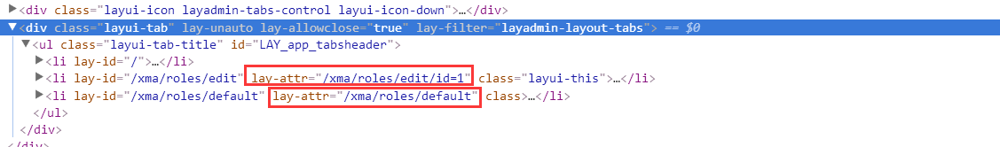

 注：此页面所属问题均出现于layuiAdmin V1.0环境下，部分解决方案需修改源码，并非官方修复，请谨慎使用

* * *

# 背景

现在项目采用layuiAdmin作为后台框架，虽然在此之前已经有了layui的基础，但是在使用的过程中依旧磕磕绊绊踩了很多坑，故写此博客作为记录以方便来人。

## 网页内部刷新导致问题

> 一般来讲，内部刷新导致的问题，主要分为两类： 1. script标签带lay-url，异步获取数据延迟导致渲染失效 2. ID重复/重复绑定jquery事件导致的BUG

### 数据表格自动渲染无法使用

数据表格的自动渲染一直无法使用，使用layui.table.render();使用javascipt渲染即可，样例如下：

```javascript
table.render({
        elem: '#LAY-xma-users-default-table'
        ,url: './json/xma/roles/users.js' //模拟接口
        ,height: 'full-235'
        ,page: true
        ,cellMinWidth: 120
        ,cols: [[
            // {type: 'checkbox'},
            {field:'id', width:80, sort:true, title: '编号'},
            {field:'name', width:160, title: '用户名'},
            {field:'role', width:120, sort:true, title: '所属角色'},
            {field:'grade', title: '管理年级'},
            {field:'classes', title: '管理班级'},
            // {toolbar: '#statusSwitch', title: '状态', width:120},
            {field:'expire', title: '到期时间', width:160},
            {field:'update', title: '更新时间', width:160},
            {field:'create', title: '创建时间', width:160},
            {width:150, title: '操作', align:'center', fixed: 'right', toolbar: '#LAY-xma-users-default-table-operate'},
        ]]
    });
});
```

### 数据表格、动态表单内部刷新后消失

数据表格的渲染，表单的自动渲染一般都是在layui.use(\['table', 'form'\])的时候处理的。 

刷新不出来一般有两种情况：

1. 如果我们使用 `<script type="text/html" template lay-url="xxx.js"></script>` ，layui将会自动使用ajax获取lay-url所在地址，导致加载延迟，在执行layui.use(\[\])时，script中的内容并没有被渲染完成。
  **解决方法：** 故将layui.use(\[\]);放在 `<script templete>` 中即可在异步获取后再渲染 table/form。
2. form在使用内部刷新后经常会出现没有渲染的情况，这是因为form的自动渲染仅在第一次使用layui.use(\['form'\])时，内部刷新并不会重新加载form.js，导致表单没有自动渲染。
  **解决方法：** 在非1 情况时，在layui.use(\['form'\], function(){layui.form.render();});手动渲染兼容下就好。

### 动态渲染相同ID元素导致某个页面元素失效

layuiadmin是单页面应用，并非通常的iframe架构，相同ID的元素在同一页面下会导致获取ID选择器获取元素达不到想要的效果。最后的结果可能是：单独刷新此页面 - 一切正常。 打开其他页面，发现同ID的元素渲染不正常（不渲染或信息错误-table的toolbars）。 **解决方法：** 对于此类问题，layuiadmin文档中给出的解决方案是：所有ID/lay-filter都使用_LAY-_开头，并将路由信息以-分割，最后才是自定义的ID字符串，比如路由信息user/login,ID可为：**LAY-user-login-tempid**。

### 内部渲染事件重复绑定问题

通常，我们使用$(...).click();来绑定点击事件，并且习惯将此代码直接放到views/下的视图文件中，不过由于layuiadmin采用单页面技术，每次使用layuiadmin提供的刷新按钮刷新时，内部代码绑定事件的代码会被重新执行，导致多次绑定click事件。 **解决方法：** 目前我使用的方法是，使用xx.on('click');前执行unbind('click')，解除点击事件的绑定，亲测有效，如：。

```javascript
// 普通绑定
$('.test').unbind('click').on('click', function(){...});
// 动态绑定
$('#main-content').unbind('click').on('click', function(){...});
```

## 框架其他问题

> 此类问题中部分是官方写代码时的疏忽，部分是使用者使用时不注意导致的。

### layui.use()与script templete同时使用，内部解析失效问题

**出现原因：** layui.use()当模块未加载时，会异步加载模块代码，`<script templete>` 使用if判断时为同步解析，导致layui.use的回调执行时模板解析早已结束，所以无法同时使用templete和layui.use(); **解决方法：** 目前的解决方法是把需要使用的模块在使用前静态加载好（手动赋值layui.xxx = obj;等形式），如有更好的办法请告知。

### 多重script嵌套使用单行注释导致报错

**出现原因：** layui的模板解析会压缩代码，从而导致//注释将其后的所有代码注释掉。 **解决方法：** 换为块级注释即可/\*测试注释\*/。

### 菜单无法自动定位

**出现原因：** 出现此类问题的原因很多，目前我遇到的原因是，仅使用菜单返回的jump属性强制跳转，导致_lib/admin.js_中on('hash(_)')监听hash变化时无法正确找到对应菜单从而导致切换tab菜单自动定位失效。 **解决方法：** 于_lib/admin.js\*500行左右，添加如下代码：

```javascript
// 上边是match2的判断
if(matched2 == false && matched1){
            // 避免二级分类无法渲染匹配（主要是使用jump的时候）
            matched1 = false;
          }
```

注：临时解决方法，并不具有解决一切问题的能力。

### tab左右切换导致路由传递参数丢失问题

**出现原因：** 这个问题无论是官方给的样例，还是自己的测试都会存在这个问题，目测是官方系统缺陷，审查TAB的元素可知，lay-attr内的数据是tab切换时应该跳转的真实路径，而非lay-id中去掉参数的路径。  **解决方法** 于_lib/admin.js_约568行的位置（检索setThisRoter即可），将此函数代码改为：

```JavaScript
//同步路由
  var setThisRouter = function(othis){
    var layid = othis.attr('lay-attr')
    ,index = othis.index();
    // 兼容主页
    layid = layid ? layid : othis.attr('lay-id');

    admin.tabsBodyChange(index);
    location.hash = layid === setter.entry ? '/' : layid;
  }
  ,TABS_HEADER = '#LAY_app_tabsheader>li';
```

### admin.req()无法POST传递问题

**出现原因：** 在_lib/view.js_的req()函数中将$.ajax中的type写死为get，所以无法使用POST（注：admin.req其实是回调的view.req()，在admin.js中可以看到）。 **解决方法：** 在_lib/view.js_第89行（搜索：$.ajax 即可），将type: 'get'改为`type: options.type ? options.type : 'GET'`