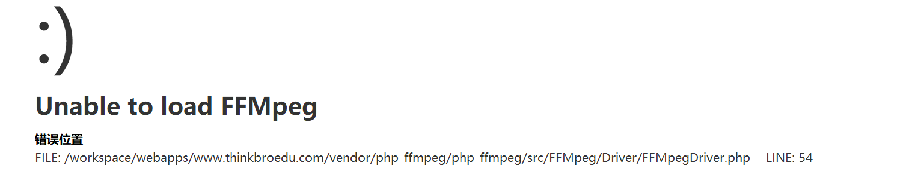
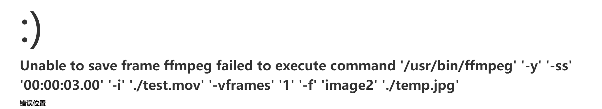
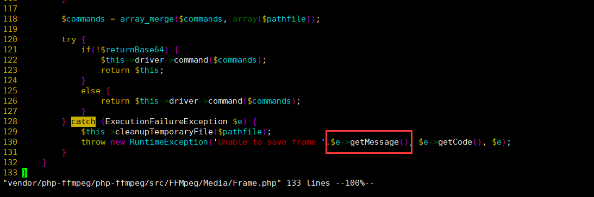
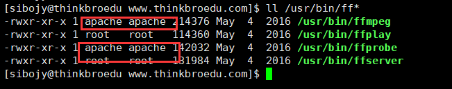

# 背景

项目中需要使用ffmpeg对视频进行视频封面截图操作，但是ffmpeg在Linux下的安装需要装很多依赖包，非常费时间，并且使用php-ffmpeg进行调用时总是爆出莫名奇妙的问题，此博客即为对此类问题的总结。

# 如何在Linux（Centos、fedro）中快速安装FFMPEG

在网上也看过不少安装ffmpeg的博客，都是安装一大堆xlib，libx264之类的一大堆包，搭建需要花费大量的时间，对于想要快速部署ffmpeg环境的时候特别不合适，于是笔者就找到了一个centos的yum源，可以快速安装ffmpeg以及相关依赖。

## yum快速安装ffmpeg环境

首先，安装yum源 Centos6 : `rpm -Uvh http://li.nux.ro/download/nux/dextop/el6/x86_64/nux-dextop-release-0-2.el6.nux.noarch.rpm` Centos7 : `rpm -Uvh http://li.nux.ro/download/nux/dextop/el6/x86_64/nux-dextop-release-0-2.el6.nux.noarch.rpm` 然后，直接yum安装ffmpeg `yum install ffmpeg`

## composer安装php-ffmpeg

`composer require php-ffmpeg/php-ffmpeg` 在php中使用，注：此代码在windows下不报错，但在Linux中可能会出现问题

```php
<?php
require 'vender/autoload.php';
$fpg = \FFMpeg\FFMpeg::create();
// 打开test.mov
$video = $fpg->open('test.mov');
// 保存第3秒的截图
$video->frame(\FFMpeg\Coordinate\TimeCode::fromSeconds(3))->save('temp.jpg');
```

# 踩过的坑

## 如何解决Unable to load FFMpeg

在Linux环境中，直接使用create()会爆出如下错误：  **出现原因：** create()时未指定ffmpeg的完成路径，所以报错 Unable to load FFMpeg(译：不能加载FFMPEG) **解决方案：** 指定ffmpeg和ffprobe的完整路径即可

```php
<?php
$fpg = \FFMpeg\FFMpeg::create([
    'ffmpeg.binaries'  => '/usr/bin/ffmpeg',
    'ffprobe.binaries' => '/usr/bin/ffprobe'
]);

```

注：即时ffmpeg在环境变量中，也需要指定完整路径

## 如何解决Unable to save frame

解决完Unable to load 问题之后，又出现了Unable to save frame的问题。  Unable to save frame ffmpeg failed to execute command '/usr/bin/ffmpeg' '-y' '-ss' '00:00:03.00' '-i' './test.mov' '-vframes' '1' '-f' 'image2' './temp.jpg' PS：failed to execute command ...的详细信息是更改Frame.php中的源代码查看到的。  **发生原因** 笔者看到这种情况，第一想到的就是可能保存文件权限不足，所以更改了下 保存路径的权限为 777，但是并没有这么简单，手动在命令行下执行了这个脚本，发现在命令行下可以执行。 **解决办法** 经过一番资料搜索与摸索，终于确定了问题所在，既然 手动执行脚本没有问题，为何通过web调用php就不能执行呢？于是将目标转移到了/usr/bin/ffmpeg和/usr/bin/ffprobe上，ls -a 查看权限所属，果然全是root:root，将其改为apache:apache后使用web调用php程序正常执行。 `chown apache:apache /usr/bin/ffmpeg /usr/bin/ffprobe` **执行完毕后最终结果：** `ls -a /usr/bin/ff*` 