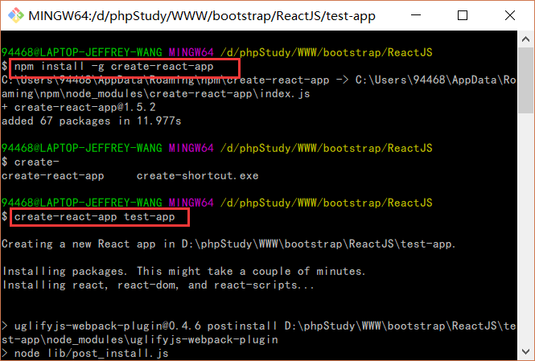
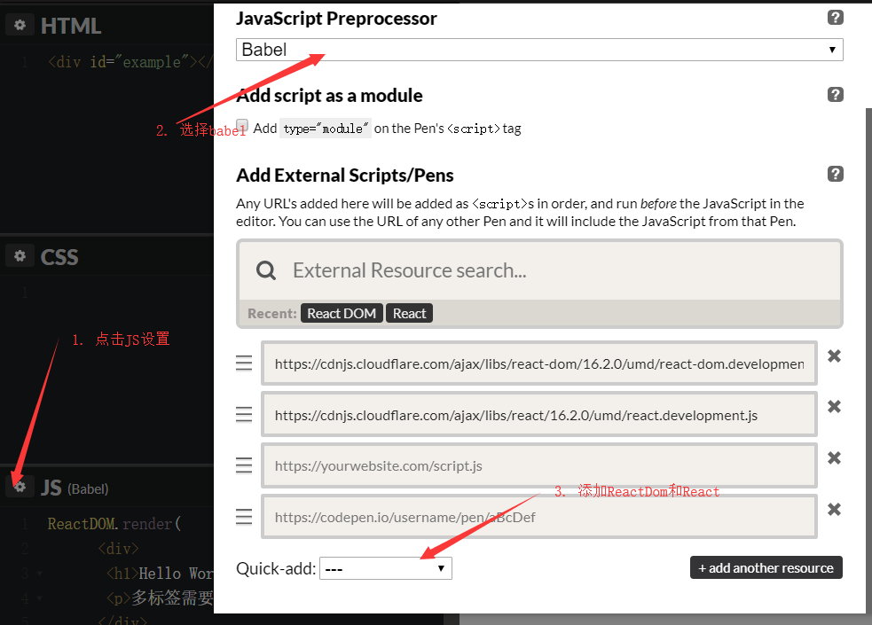

# ReactJS学习笔记


## 安装React

#### 安装条件准备

1.  首先安装node，直接官网上下载安装即可。
2.  安装完毕后，执行`npm install -g create-react-app`，全局安装项目构建工具。

#### 创建项目

1.  `create-react-app 项目名称`，然后进入目录，`cd 项目名称`，最后`npm start`，完成项目的启动。
    
2.  浏览器中访问`localhost:3000`即可访问项目。  **访问效果：** 
    
    #### 学习建议
    
    开始的时候，可以在**在线编辑器**上实时调试，会比较方便，使用`create-react-app`创建的文件全是用类构建，辅以nodeJS得以运行，效率较高。但是对于初学者来说，一层一层的类也容易绕晕，所以比较建议使用ReactDOM采用传统前端架构的形式来学习。 在线编辑器：[https://codepen.io](https://codepen.io) **注意**：React需要在ReactDOM之前引入。  **配置编辑器支持React** 可以参考如下链接对sublime进行优化以适应react.js的JSX语法： [https://segmentfault.com/a/1190000003698071](https://segmentfault.com/a/1190000003698071)
    

## 了解React JSX

##### 优势

```
1. 执行更快，因为编译过程中做过优化
2. 更加安全，能在编译时发现错误
3. 编辑更简单快速
```

##### 学习React有啥用

大佬的博客介绍：[https://www.cnblogs.com/clearyang/p/6898659.html](https://www.cnblogs.com/clearyang/p/6898659.html) 当然，吸引我的还有各种高大上的库，比如：[阿里的后台模板](https://pro.ant.design/index-cn)，[阿里的前端框架](http://ant.design/index-cn)，[阿里移动端框架](https://mobile.ant.design/index-cn)，[高大上的动效库](https://motion.ant.design) 还有React Native，学会之后可以用React语法做出原生App了，还可以转换成Android和IOS，强大的不要不要的！ [React Native中文文档](https://reactnative.cn/docs/0.51/getting-started.html)

##### 简单渲染

ReactDOM能将渲染虚拟DOM至指定元素，仅需要调用render()函数即可。

```
ReactDOM.render(
    <div>
        <h1>Hello World!</h1>
        <p>多标签需要外包div</p>
    </div>
    ,
    document.getElementById('example')
);
```

此段代码可以独立放到js文件中，然后引入即可(type="text/babel")。 **在线演示：**[在CodePen中尝试](https://codepen.io/wangerzi/pen/MGGPoj?editors=1111)

##### JavaScript表达式

{name}可以输出变量，并且支持内部表达式。

```
var name = 'Wang';
var a = 1;
var b = 2;
ReactDOM.render(
    <div>
        <p>Hello, {name}!</p>
        <p>a + b = {a+b}</p>
        <p>结果{(a+b) > 0 ? '大于' : '小于'}零</p>
    </div>,
    document.getElementById('example')
);
```

**注**：JSX不支持if...else...，但是可以使用三目表达式来处理条件判断。 **在线演示：**[在CodePen中尝试](https://codepen.io/wangerzi/pen/NMMOaW)

##### 设置样式和注释

JSX支持使用 **camelCase** 语法来设置内联样式 ，如：

```
var btnStyle = {
    fontSize: '20px',
    color: '#fff',
};
ReactDOM.render(
    <div>
        {/*这里是注释哦！！！*/}
        <button style={btnStyle}>这是按钮</button>
    </div>,
    document.getElementById('example')
);
```

**在线演示：**[https://codepen.io/wangerzi/pen/MGGPEb](https://codepen.io/wangerzi/pen/MGGPEb)

##### 展开数组

JSX自动展开数组元素

```
var viceTitleStyle = {
  textAlign: 'right',
};
var arr = [
    <h1>这里是ReactJS学习实况</h1>,
    <h2 style={viceTitleStyle}>-- Jeffrey Wang</h2>
];
ReactDOM.render(
    <div>
        {arr}
    </div>,
    document.getElementById('example')
);
```

**在线演示：**[https://codepen.io/wangerzi/pen/OZZBxe](https://codepen.io/wangerzi/pen/OZZBxe)

##### 重新渲染

仅需要重新调用render()即可，并且React只更新需要更新的地方。

```
function runtime(){
    ReactDOM.render(
        <div>
            <h2>{new Date().toLocaleTimeString()}</h2>
        </div>,
        document.getElementById('example')
    );
}
setInterval(runtime, 1000);
```

**在线演示：**[https://codepen.io/wangerzi/pen/LmmgOm](https://codepen.io/wangerzi/pen/LmmgOm)

## React组件

##### html标签和React组件渲染的区别

渲染html标签的时候，标签都是以小写字母开头，如：`<div></div>`等。 渲染自定义组件时，标签都是以大写字母开头，如：`<MyComponent></MyComponent>`等。 **注**：由于JSX也是JS，所以class，for等属性不宜直接书写，应写为`className`,`htmlFor`。

##### 创建组件并渲染

创建一个函数MyComponent，接受一个参数props，props参数传递DOM的属性值。

```
function MyComponent(props){
    return <h1>Hello {props.name}!</h1>;
}
ReactDOM.render(
    <MyComponent name="Wang" />,
    document.getElementById('example')
);
```

**在线演示：**[https://codepen.io/wangerzi/pen/errPyv](https://codepen.io/wangerzi/pen/errPyv)

##### 复合组件(Composing Components)

新建组件的时候，可以自由组合其他组件，但是注意，**复合的组件顶层也应该只有一个标签。**

```
function MyName(props){
    return <h2>Hello, My name is {props.data}</h2>;
}
function MyAge(props){
    return <h2>My Age is {props.data}</h2>;
}
function MyInfo(props){
    return <div>
            <MyName data={props.name} />
            <MyAge data={props.age} />
        </div>;
}
ReactDOM.render(
    <MyInfo name="Wang" age="21" />,
    document.getElementById('example')
);
```

**注意**：通过props给子组件传递参数时，不可加引号。 **在线演示：**[https://codepen.io/wangerzi/pen/deegJj](https://codepen.io/wangerzi/pen/deegJj)

##### 拆分组件

一些嵌套比较深的组件，可以拆分为多个组件，独立出来以减少耦合。

```
// 杂糅在一起的示范
function MyComment(props){
    return <div>
        <div className="comment-head">
            <div className="user-info">
                
                <span>{props.author.name}</span>
            </div>
        </div>
        <div className="comment-body">
            <div className="comment-content">{props.comment.content}</div>
            <div className="comment-time">{props.comment.time.toString()}</div>
        </div>
    </div>
}
const data = {
    author: {
        avatar: 'http://placekitten.com/g/64/64',
        name: 'JeffreyWang',
    },
    comment: {
        time: new Date(),
        content: '这里是评论内容！',
    }
};
ReactDOM.render(
    <MyComment author={data.author} comment={data.comment} />,
    document.getElementById('example')
);
```

**在线演示：**[https://codepen.io/wangerzi/pen/OZZBze](https://codepen.io/wangerzi/pen/OZZBze)

```
// 拆分为多个组件，便于多次使用。
function UserInfo(props){
    return <div className="user-info">
                
                <span>{props.data.name}</span>
            </div>
}
function CommentInfo(props){
    return <div className="comment-body">
            <div className="comment-content">{props.data.content}</div>
            <div className="comment-time">{props.data.time.toString()}</div>
        </div>
}
function MyComment(props){
    return <div>
        <div class="comment-head">
            <UserInfo data={props.author} />
        </div>
        <CommentInfo data={props.comment} />
    </div>
}
const data = {
    author: {
        avatar: 'http://placekitten.com/g/64/64',
        name: 'JeffreyWang',
    },
    comment: {
        time: new Date(),
        content: '这里是评论内容！',
    }
};
ReactDOM.render(
    <MyComment author={data.author} comment={data.comment} />,
    document.getElementById('example')
);
```

**在线演示：**[https://codepen.io/wangerzi/pen/LmmgQr](https://codepen.io/wangerzi/pen/LmmgQr) **注意**：无论是通过function直接创建组件，或者通过新增类来创建组件，处理方法都需要是纯函数，即：不得改变传递参数props的值。如果需要使用可变的变量，可以参考下一节的状态和生命周期。

## 状态和生命周期

之前构建自定义组件的时候，都是以函数式构建的，但是现在需要以类来构建，以支持状态。

##### 组件状态

**注意**：新老版本创建类的代码不一样，请注意区别。

```
// 新版本 - 使用ES6的继承
class MyInfo extends React.Component{
    // 初始化状态
    constructor(props){
        super(props);
        this.state = {date: new Date()};
    }
    render(){
        return <h1>Hello {this.props.name} {this.state.date.toString()}</h1>;
    }
}
// 新版本 - 易于理解的写法
class MyInfo extends React.Component{
    render = function(){
        return <h1>Hello {this.props.name} {this.state.date.toString()}</h1>;
    }
}
ReactDOM.render(
    <MyInfo name="JeffreyWang" />,
    document.getElementById('example')
);
// 老版本- 使用React.createClass
var MyInfo2 = React.createClass({
    render: function(){
        return <h1>Hello {this.props.name}</h1>;
    }
});
ReactDOM.render(
    <MyInfo2 name="JeffreyWang" />,
    document.getElementById('example')
);
```

**在线演示：**[https://codepen.io/wangerzi/pen/MGGzwO](https://codepen.io/wangerzi/pen/MGGzwO) 老版本表现方法：[https://www.cnblogs.com/javascript-center/p/5533131.html](https://www.cnblogs.com/javascript-center/p/5533131.html) **注意**：内部`this.state = {data: new Date()};`即为状态，完全由组件自己管理，可以随意组件的意愿改变。 constructor(){}为构造函数，可用于初始化组件状态。

##### 生命周期

在一个具有许多组件的应用程序中，在组件被销毁时释放所占用的资源是非常重要的。 组件渲染时，有一些特殊的回调，我们称为钩子函数，如：有一个`componmentDidMount`钩子函数，会在首次加载到DOM的时候会执行函数内容，再比如`componmentWillUnmount`钩子函数，会在卸载DOM的时候执行函数内容。 **注意**：this.setState(obj);会触发DOM的重新渲染，直接this.state.xxx = xxx;是不触发渲染的。

```
class Clock extends React.Component{
    constructor(props){
        super(props);
        this.state = {date:new Date()};
    }
    componentDidMount(){
        // 这里由于timeIndex并不需要显示，所以并没有存放到this.state中。
        // 这里的() => {}是一个ES6中的箭头函数，考虑到constructor()函数已经是ES6的语法了，所以这里直接用的() => {}。
        this.timeIndex = setInterval(() => {
            this.setState({date: new Date()});
        }, 1000);
    }
    componentWillUnmount(){
        if(this.timeIndex){
            clearInterval(this.timeIndex);
        }
        this.timeIndex = 0;
    }
    render(){
        return <h1>当前时间：{this.state.date.toLocaleTimeString()}</h1>
    }
}
ReactDOM.render(
    <Clock />,
    document.getElementById('example')
);
```

引用官网文档：

> 来快速回顾一下该过程，以及调用方法的顺序：
> 
> 1.  当 `<Clock />` 被传入 `ReactDOM.render()` 时, React 会调用 `Clock`组件的构造函数。 因为 `Clock` 要显示的是当前时间，所以它将使用包含当前时间的对象来初始化 `this.state` 。我们稍后会更新此状态。
> 2.  然后 React 调用了 `Clock` 组件的 `render()` 方法。 React 从该方法返回内容中得到要显示在屏幕上的内容。然后，React 然后更新 DOM 以匹配 `Clock` 的渲染输出。
> 3.  当 `Clock` 输出被插入到 DOM 中时，React 调用 `componentDidMount()` 生命周期钩子。在该方法中，`Clock` 组件请求浏览器设置一个定时器来调用匿名方法更新`this.state.date`。
> 4.  浏览器会每隔一秒调用一次 匿名方法。在该方法中， `Clock` 组件通过 `setState()` 方法并传递一个包含当前时间的对象来安排一个 UI 的更新。通过 `setState()`, React 得知了组件 `state`(状态)的变化, 随即再次调用 `render()` 方法，获取了当前应该显示的内容。 这次，`render()` 方法中的 `this.state.date` 的值已经发生了改变， 从而，其输出的内容也随之改变。React 于是据此对 DOM 进行更新。
> 5.  如果通过其他操作将 `Clock` 组件从 DOM 中移除了, React 会调用 `componentWillUnmount()`生命周期钩子, 所以计时器也会被停止。

##### 使用状态(state)的三个要点

1.  不能直接在钩子函数里边修改`this.state`，因为这并不会令DOM更新，只有在`constructor()`内直接修改this.state才是有效的，应该使用`this.setState({name: value})`
    
    ```
    // 错误的示范
    this.state.date = new Date();
    // 正确的示范
    this.setState({date: new Date()});
    ```
    
2.  state的更新可能是异步的，因为出于性能优化的考虑，可能会将多个setState合并为一个进行更新。所以说，不能直接依赖`this.props`或者`this.state`
    
    ```
    // 错误的示范
    this.setState({count : this.state.count + 1)。
    // 正确的示范
    this.setState(function(prevState, props){
       return {count: prevState.count + 1};
    });
    ```
    
    **在线演示：**[https://codepen.io/wangerzi/pen/ELLMRr](https://codepen.io/wangerzi/pen/ELLMRr)
    
3.  state的更新会被合并，每次更新不同的项目并不会互相影响，比如：
    
    ```
    class CommentBox extends React.Component{
       constructor(props){
           super(props);
           this.state = {
            users: [],
               comments: [],
           }
       }
       componentDidMount(){
           this.setState({users: ['user1', 'user2']});
           this.setState({comments: ['1111', '233333']});
       }
       render(){
           return <div>
            users:
            {this.state.users}
            comments:
            {this.state.comments}
           </div>;
       }
    }
    ReactDOM.render(
    <CommentBox />,
    document.getElementById('example')
    );
    ```
    
    **在线演示：**[https://codepen.io/wangerzi/pen/LmmaaY](https://codepen.io/wangerzi/pen/LmmaaY)
    
4.  state可以通过属性的形式向下传递，比如子组件`<Clock name={this.state.name}>`，子组件并不在意上层组件传递的数据是 state、prop或者手动写入，也不论上层组件是函数式抑或类，都使用`this.props.xxx`来进行参数接受。
    
    ```
    function MyName(props){
       return <h2>Hello, My name is {props.data}</h2>;
    }
    function MyAge(props){
       return <h2>My Age is {props.data}</h2>;
    }
    class MyInfo extends React.Component{
       constructor(props){
           super(props);
           this.state = {
               name: props.name  'Wang',
               age: props.age  21,
           }
       }
       render(){
           return <div>
            <MyName data={this.state.name} />
            <MyAge data={this.state.age} />
        </div>;
       }
    }
    ReactDOM.render(
    <MyInfo name="Wang" />,
    document.getElementById('example')
    );
    ```
    
    **在线演示：**[https://codepen.io/wangerzi/pen/vjjPqK](https://codepen.io/wangerzi/pen/vjjPqK)