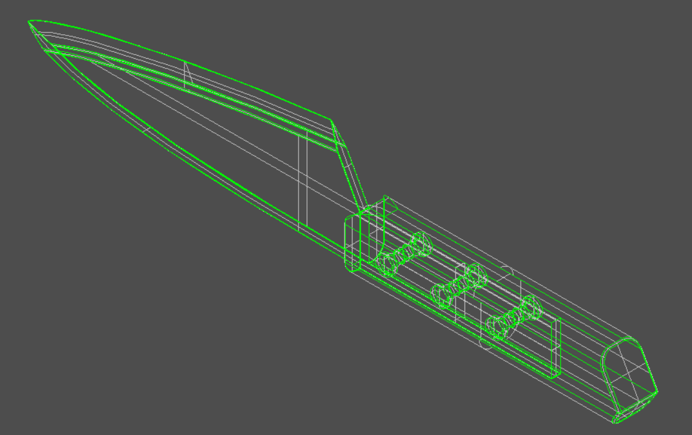
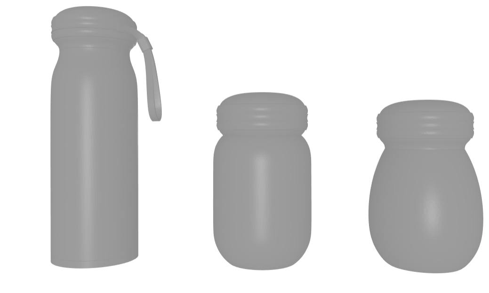
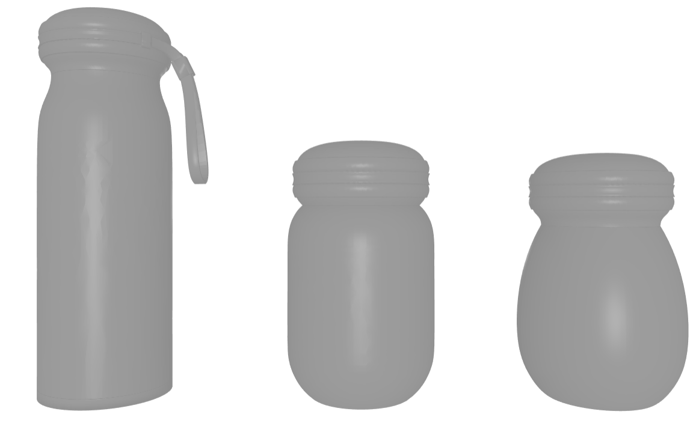
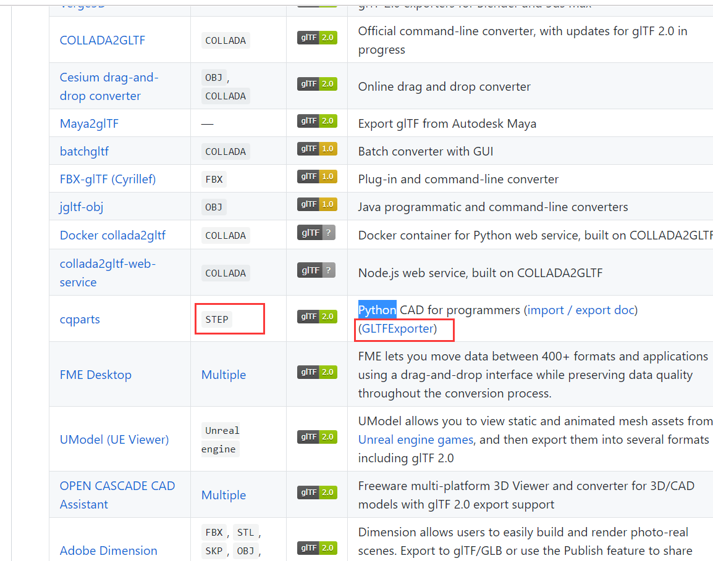
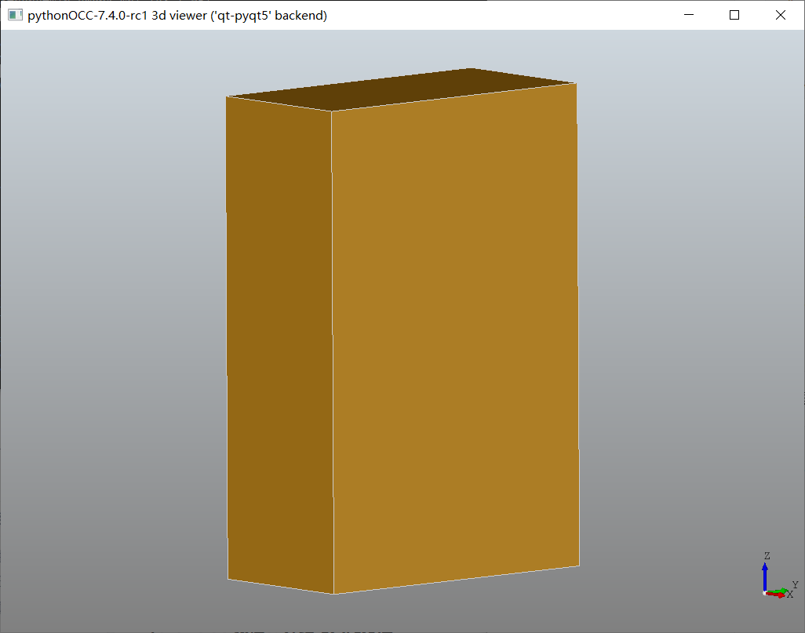
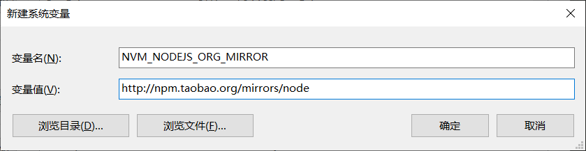

## 前言

博主最近一直在调研web3d格式转换和优化相关的东西，国内资料比较少，很多信息甚至只能从 GitHub 的 issue 里边才能窥知一二，特写下此篇博客，希望能让有此需求的伙伴们少走一些弯路。

## 正文

### 基于本文做的开源项目

可以通过一个简单的入口脚本配合docker，完成对多种类型3d模型的转换，支持 glb(binary) 和 gltf，并自动压缩 项目地址：[https://github.com/wangerzi/3d-model-convert-to-gltf](https://github.com/wangerzi/3d-model-convert-to-gltf) 去项目中下载 `convert.sh` 后，准备好docker环境（镜像有点大 1G+，请配合国内镜像源下载），执行如下格式的脚本即可一键转换

```shell
convert.sh [stlstepigesobjfbx] inputpath.stl outputpath.glb # convert to gltf bin file
convert.sh [stlstepigesobjfbx] inputpath.stl outputpath.gltf # not only bin file
```

### 了解STEP和IGES格式

首先，需要大概了解下 STEP 格式和 IGES 格式到底是什么，哪些领域正在使用 英文基础比较不错的童鞋，可以参考下如下外文资料 STEP文件： [https://fileinfo.com/extension/step]("https://fileinfo.com/extension/step") IGES文件： [https://fileinfo.com/extension/iges]("https://fileinfo.com/extension/iges") 简单来说，这俩都是**CAD的一种文件标准**，STEP比IGES出现得更晚一些，由于IGES格式的最新版本是96年发布的，现在多由更高效的STEP等新格式替代，**不支持材质** IGES 可以安装 `iges viewer` 这一免费工具在电脑上查看 下载链接在此：https://igsviewer.com/download.aspx 比如网上随便下载的一个 IGS 文件，打开后展示效果如下 [](../static/uploads/2020/03/d6ce6f52c39c343cd6fc1f8940429066.png) 但是，现行主流的web3d库，比如 three.js、Babylon **均不支持** STEP 和 IGES 模型，需要解决这个问题有两个思路

*   深入了解格式含义，编写代码给对应库提交对应的解析方案（想法很好，但是实践不易）
*   将格式转换为适合web展示的格式，比如称为3d界JPG的 GLTF 格式（本文就是讲这个的）

> three.js 社区中有关于 STEPLoader 的讨论，链接如下：https://github.com/mrdoob/three.js/issues/7125

### 了解STL格式

STL格式更多出现在3D打印中，只能用来表示封闭的体或者面，且文件内部**都用三角形表示**，所以转换精度比较粗的话，看起来效果比较诡异，包括 Ascii 编码和二进制两种编码模式，一般采用二进制，因为体积**相对较小**，并且与STEP和IGES一样**不支持材质** 比如同一个模型（STEP大小：4.81M），转换精度不同可能就是如下两种效果 粗精度（Ascii编码：3.7M）： [](../static/uploads/2020/03/92acb91ddcfe55122b4e7689659c8612.png) 细精度（Ascii编码：63.3M，二进制编码：12.1M）： [](../static/uploads/2020/03/16b2c25d5a260b207fb9d0703b03ba0c.png) 但是模型大小也会很有区别，甚至同一个图，精度调整很细的话，能达到**一百多兆** 模型的加载和解析都非常慢，精度调整粗一点，几兆就搞定了，但是页面展示的效果根本不能看

#### 为何不统一转换为stl格式？

看到这里，大家应该知道了，STL**非常不适合web**的模型展示，精度稍高体积就十分庞大这一点直接 PASS

### CTM格式

这里简单提一下 CTM 格式，这是一个压缩能力很强的格式，就上面截图的小杯子，精度稍高的 STL 得有 60M 左右，但是CTM得到更好的效果，只需要 795kb CTM格式（795kb） [](../static/uploads/2020/03/0d2345827c242f02c6f0b8ad66cc6d36.png) 不过CTM格式已经**被 THREE.JS 抛弃了**，社区更希望用户使用 GLTF 格式，106版本后已经去掉了 CTMLoader，如果需要复原只能从老版本里边拷贝出来代码并且做一些小修改才能使用，关于CTM格式讨论如下： https://github.com/mrdoob/three.js/pull/14308

### GLTF格式

简单来说，就是最小化的把模型资源整理起来，称为3d模型界的JPG，支持材质贴图等，在各个Web3D库中得到了**广泛支持**，具体怎么加载这里就不赘述了，网上demo很多 下面Github上的格式介绍和相关技术汇总，当初博主就是在这里边翻来覆去找转换方案的，虽然最后并没有采用这里边提到方案 /(ㄒoㄒ)/ https://github.com/KhronosGroup/glTF GLTF的详细介绍也找来了中文资料： [https://zhuanlan.zhihu.com/p/65265611]("https://zhuanlan.zhihu.com/p/65265611")

### 现有的在线转换服务

经过资料调研，国内比较知名的有**魔猴的转换工具**，能支持 **STEP 到 STL 和 CTM** 格式的转换 魔猴链接在此：http://www.mohou.com/tools/stlconverter.html 魔猴的转换是免费且公开的，**非常的良心**，我也尝试过分析请求报文直接调用魔猴的转换API，魔猴并没有限制IP、频次以及转换结果下载，但是一如所料的**慢**，这里的慢主要有以下三个方面

*   服务端接受文件后，上传到魔猴服务器慢
*   魔猴转换需要至少十多秒
*   再根据魔猴的响应报文，下载对应文件也需要时间

还是上边那个瓶子模型，转换一次至少**40s+**，很影响效率，所以还是自己找方案转换格式来的靠谱

### 网上现有轮子能针对这个格式做哪些转换

以下方案都是 Google + Github 不停找资料拼凑出来的

#### cqparts方案（环境难搞，未采用）

前面提到的GLTF技术汇总：[https://github.com/KhronosGroup/glTF]("https://github.com/KhronosGroup/glTF") 其中提到了使用 cqparts 直接就能把 STEP 转换为 GLTF，不过博主尝试过后发现环境太难搞了，不止要装 cqparts 还需要装 FreeCAD，很难调，后来就没采用此方案 [](../static/uploads/2020/03/cfd666fd15904986c15f50a731d86519.png) 项目地址：[https://github.com/cqparts/cqparts]("https://github.com/cqparts/cqparts")

#### pythonocc方案（读取或写入STP/IGS/STL）

Pythonocc是python的CAD，安装和使用都很方便，转换脚本简单明了 项目地址：https://github.com/tpaviot/pythonocc-core

> PS:不推荐看文档，太难找了...，可以直接看格式转换的相关代码，比较好懂

格式转换用到的代码： https://github.com/tpaviot/pythonocc-core/blob/master/src/Extend/DataExchange.py 安装和使用可查看本篇博客后续的**『环境安装』**和**『关键代码』**部分

#### stl2gltf（将STL转换为GLTF）

是一个两年前更新的冷门项目，作用是将**二进制模式的 STL 文件**转换为 GLTF 文件，支持浏览器本地转换、Python脚本以及C++源码，虽然star很少，但是工具确实很好用 博主花了不少在Github上搜STL相关项目一个个的翻才发现这个宝藏/(ㄒoㄒ)/ 项目地址：[https://github.com/MyMiniFactory/stl2gltf]("https://github.com/MyMiniFactory/stl2gltf") 在线体验地址：[https://myminifactory.github.io/stl2gltf/]("https://myminifactory.github.io/stl2gltf/")

### GLB文件压缩

直接转换出来的 glb 文件可能比较大，上方截图的瓶子，转换出来在 4MB 左右，对于WEB来说还是太大了 文件压缩主要是从腾讯工程师分享的**《腾讯硬核干货！如何在页面极速渲染3D模型》**，得到的启发 原文链接：[https://www.bilibili.com/read/cv4130967/]("https://www.bilibili.com/read/cv4130967/") 文中推荐使用 `gltf-pipeline` 进行文件压缩，安装指令一句话，压缩指令一句话，前面那个瓶子模型生成的GLB文件 **4.34M**，压缩后仅 **339kb** 安装以及踩坑依旧放到了后面，前面先讲清思路

### 统一输出GLTF格式的思路

上面提到了使用 `pythonocc` 将 STEP/IGES/Ascii的STL文件 统一转换为**二进制模式的 STL**，再使用 `stl2gltf` 将STL转换转换为 gltf 格式，最后使用 `gltf-pipeline` 将glb文件压缩输出即可，中间的转换文件会比较大，需要及时删掉

### 环境安装

#### 安装AnaConda

下载即可 [https://www.anaconda.com/distribution/#download-section](https://www.anaconda.com/distribution/#download-section) 注意Python版本需要是 python3.7 设置镜像并在安装时显示镜像来源

```shell
conda config --add channels https://mirrors.tuna.tsinghua.edu.cn/anaconda/pkgs/free/
conda config --add channels https://mirrors.tuna.tsinghua.edu.cn/anaconda/pkgs/main/
conda config --set show_channel_urls yes
```

#### 安装pythonocc

在 `Anaconda Prompt` 中执行如下代码，即可创建 `pythonocc` 环境

```shell
conda create -n pythonocct -c dlr-sc -c pythonocc pythonocc-core=7.4.0rc1
```

安装成功大概是这个样子

```shell
Preparing transaction: done
Verifying transaction: done
Executing transaction: done
#
# To activate this environment, use
#
#     $ conda activate pythonocct
#
# To deactivate an active environment, use
#
#     $ conda deactivate

```

`activate pythonocct` 即可进入环境

```shell
Preparing transaction: done
Verifying transaction: done
Executing transaction: done
#
# To activate this environment, use
#
#     $ conda activate pythonocct
#
# To deactivate an active environment, use
#
#     $ conda deactivate
```

还需要安装一下 pyqt5，不然跑不通demo

```shell
(pythonocct) D:\temp\pythonocc-demos-master\examples>pip install pyqt5
Looking in indexes: http://pypi.douban.com/simple
```

跑一下 [https://github.com/tpaviot/pythonocc-demos](https://github.com/tpaviot/pythonocc-demos) 中的 hello-world 显示如下界面就是成功了（GUI模式） [](../static/uploads/2020/03/6eba449ab04b6b4b2ed8cf4a6885ea19.png)

#### gltf-pipeline 的安装

安装完 npm 之后，执行如下指令即可

```shell
npm install -g gltf-pipeline
```

强烈建议，安装完后执行下 `gltf-pipeline -h`，可能会遇到下面描述的坑 高版本的 node 调用指令会出错，在这个 Issue 里边详细描述了这一问题 [https://github.com/CesiumGS/gltf-pipeline/issues/507]("https://github.com/CesiumGS/gltf-pipeline/issues/507") 现在是`20年3月8日`，官方并没有在代码层面上解决这个问题，根据讨论需要node降级到 12.0.0 即可

```shell
$ node -v
v12.16.1
$ gltf-pipeline.cmd -h
internal/modules/cjs/loader.js:1174
      throw new ERR_REQUIRE_ESM(filename, parentPath, packageJsonPath)
```

推荐使用 `nvm` 进行管理，方面node版本切换 nvm-windows 链接在此：[https://github.com/coreybutler/nvm-windows/releases]("https://github.com/coreybutler/nvm-windows/releases") 安装完之后，改下环境变量使用淘宝镜像提速

> NVM\_NODEJS\_ORG\_MIRROR=http://npm.taobao.org/mirrors/node NVM\_NPM\_ORG\_MIRROR=https://npm.taobao.org/mirrors/npm/

[](../static/uploads/2020/03/17dd7ebd3e8758b955dcdbda9171e054.png) 临时使用如下指令也可以：

```shell
nvm node_mirror https://npm.taobao.org/mirrors/node/
nvm npm_mirror https://npm.taobao.org/mirrors/npm/
```

凌晨下载5M多每秒，速度飞起 安装和使用 v12.0.0 如下所示

```shell
$ node -v
v12.16.1

$ nvm.exe install 12.0.0
Version 12.0.0 is already installed.

$ nvm.exe use 12.0.0
Now using node v12.0.0 (64-bit)

$ node -v
v12.0.0

$ npm -v
6.9.0

$ npm install -g gltf-pipeline
C:\Program Files\nodejs\gltf-pipeline -> C:\Program Files\nodejs\node_modules\gltf-pipeline\bin\gltf-pipeline.js
+ gltf-pipeline@2.1.8
added 38 packages from 20 contributors in 8.239s
```

执行 `gltf-pipeline.cmd -h`，如下所示即为成功

```shell
$ gltf-pipeline.cmd -h
Usage: node gltf-pipeline.js -i inputPath -o outputPath
...
...
...
示例：
  node gltf-pipeline.js -i model.gltf
  node gltf-pipeline.js -i model.gltf -b
  node gltf-pipeline.js -i model.glb -o model.gltf
```

### 关键代码展示

> PS:这里需要注意下 `write_stl_file` 的第四个参数，代表精度，精度越大，生成的文件越大，显示效果越精细，我试下来觉着 0.03 比较合适，反正后边都要转为GLTF，大小会随之下来的

STP转换为 STL 文件（`StpConverter.py`）

```python
import os
from OCC.Extend.DataExchange import read_iges_file,read_step_file,write_stl_file

input_file = 'temp2.stp'
output_file = 'out.stl'
if not os.path.exists(input_file):
    print('Input file need exists')
    exit()

shapes=read_step_file(input_file)
write_stl_file(shapes, output_file, 'binary', 0.03, 0.5)
```

IGES转换为 STL 文件（`IgsConverter.py`）

```python
import os
from OCC.Extend.DataExchange import read_iges_file,read_step_file,write_stl_file

input_file = 'temp2.igs'
output_file = 'out2.stl'
if not os.path.exists(input_file):
    print('Input file need exists')
    exit()

shapes=read_iges_file(input_file)
write_stl_file(shapes, output_file, 'binary', 0.03, 0.5)
```

调用 stl2gltf 转为gltf格式，使用 -b 只生成一个文件

```shell
python stl2gltf.py out.stl out.glb -b
```

调用 `gltf-pipeline` 进行 GLB 的压缩

```shell
$ gltf-pipeline.cmd -i out.glb -o out.zip.glb -b -d
```

## 总结

本篇博客是博主数日查找资料得来，鉴于国内资料相关缺失，解决方案都是在外网讨论和文档中，做了一些总结希望能让后来人能少走一些弯路！路漫漫其修远兮，各位加油！