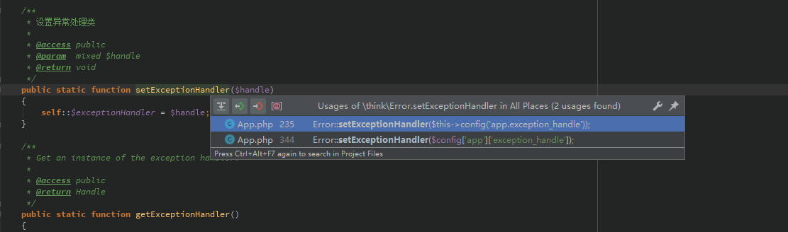

## 前言

在很多php的项目中，错误信息的输出返回都通过异常抛出的方式进行，特别是在后端校验过程中，或者后端处理过程中突然遇到需要中断程序执行的情况，相比返回`['code' => 999, 'message' => 'error']`，抛出异常无疑更简单明了 众所周知，php里边自定义异常处理函数需要用到内置方法 `set_exception_handler`，而在 Thinkphp5 中可以由开发者自定义异常处理类进行接管

## 正文

### 涉及到的配置参数及类

如果需要自定义异常处理，则需要在 `app.php` 中配置 `exception_handle` 参数 参数支持回调模式和自定义类，正如官方文档所说

```php
'exception_handle'       => function($e) {
  // 参数验证错误
  if ($e instanceof \think\exception\ValidateException) {
    return json($e->getError(), 422);
  }

  // 请求异常
  if ($e instanceof \think\exception\HttpException && request()->isAjax()) {
    return response($e->getMessage(), $e->getStatusCode());
  }
},
// 异常处理handle类 留空使用 \think\exception\Handle
'exception_handle'       => '\\app\\common\\exception\\Http',
```

自定义类需要继承 `think\exception\Handle` 并实现 render()，支持 `return new Response()` 直接向前端响应数据 比如在我的项目中，在 `app/common/exception` 下定义了 `BaseException extends \think\Exception`，以后不同模块的自定义异常类都会继承 `BaseException`，在自定义异常处理类中判断 `$e instanceof BaseException` 即可进行个性化处理 `app/common/exception/BaseException.php`

```php
<?php
/**
 * Created by PhpStorm.
 * User: 94468
 * Date: 2020/2/10
 * Time: 2:12
 */

namespace app\common\exception;


use think\Exception;

class BaseException extends Exception
{
}
```

在 `app/common/exception/Http.php` 中实现了控制器抛出的验证器异常和基于 `BaseException` 的异常，并统一格式输出和错误日志记录，在实际使用过程中就特别方便 `app/common/exception/Http.php`

```php
<?php
/**
 * Created by PhpStorm.
 * User: 94468
 * Date: 2020/2/10
 * Time: 0:33
 */

namespace app\common\exception;


use Exception;
use think\exception\ErrorException;
use think\exception\Handle;
use think\exception\ValidateException;
use think\facade\Log;

class Http extends Handle
{
    public function render(Exception $e)
    {
        if ($e instanceof ValidateException) {
            Log::info('Exception-Validate:' . $e->getMessage());
            return json([
                'code' => 888,
                'message' => $e->getMessage(),
                'data' => [],
            ]);
        }

        if ($e instanceof BaseException) {
            Log::error('Exception-Logic:' . $e->getMessage());
            return json([
                'code' => $e->getCode() ?: 777,
                'message' => $e->getMessage(),
                'data' => [],
            ]);
        }

        if ($e instanceof ErrorException) {
            Log::error('Exception-Error:' . $e->getMessage());
            return json([
                'code' => $e->getCode() ?: 666,
                'message' => $e->getMessage(),
                'data' => [],
            ]);
        }
        Log::error('Unknown-Error:' . $e->getMessage());
        return json([
            'code' => $e->getCode() ?: 555,
            'message' => env('APP_DEBUG') ? $e->getMessage() : '系统错误',
            'data' => []
        ]);
//        return parent::render($e);
    }
}
```

### 底层是如何实现的

首先，定位到 `thinkphp/library/think/Error.php` 错误处理类，在其 `register()` 中可看到对 php 的异常处理函数注册方法`set_exception_handler` 的调用

```php
    /**
     * 注册异常处理
     * @access public
     * @return void
     */
    public static function register()
    {
        error_reporting(E_ALL);
        set_error_handler([__CLASS__, 'appError']);
        set_exception_handler([__CLASS__, 'appException']);
        register_shutdown_function([__CLASS__, 'appShutdown']);
    }
```

再顺着看 `appException` 方法，发现使用了 `self::getExceptionHandler()` 获取异常处理对象，对象是由变量 `self::$exceptionHandler` 决定的，默认 `\\think\\exception\\Handle`

```php
    /**
     * 注册异常处理
     * @access public
     * @return void
     */
    public static function register()
    {
        error_reporting(E_ALL);
        set_error_handler([__CLASS__, 'appError']);
        set_exception_handler([__CLASS__, 'appException']);
        register_shutdown_function([__CLASS__, 'appShutdown']);
    }
    /**
     * Exception Handler
     * @access public
     * @param  \Exception\Throwable $e
     */
    public static function appException($e)
    {
        if (!$e instanceof \Exception) {
            $e = new ThrowableError($e);
        }

        self::getExceptionHandler()->report($e);

        if (PHP_SAPI == 'cli') {
            self::getExceptionHandler()->renderForConsole(new ConsoleOutput, $e);
        } else {
            self::getExceptionHandler()->render($e)->send();
        }
    }
```

看到这里并没有看到 `app.php` 中的 `exception.handler` 如何发挥作用的，那么继续往下看，由于 `self::$exceptionHandler` 由 `setExceptionHandler` 决定，透过编辑器可以找到其调用方如下图所示： [](../static/uploads/2020/02/69a4786f0b48d4cc4439fd6bbf677380.png) 在 `thinkphp/library/think/App.php` 的 `initialize()` 中，可看到如下所示代码

```php
// 注册异常处理类
if ($this->config('app.exception_handle')) {
    Error::setExceptionHandler($this->config('app.exception_handle'));
}
```

`initialize()` 是在应用启动时(执行 `run()`)执行的初始化函数， `public/index.php`

```php
<?php
// [ 应用入口文件 ]
namespace think;

// 加载基础文件
require __DIR__ . '/../thinkphp/base.php';

// 支持事先使用静态方法设置Request对象和Config对象

// 执行应用并响应
Container::get('app')->run()->send();
```

`App.php`

```php
   /**
     * 执行应用程序
     * @access public
     * @return Response
     * @throws Exception
     */
    public function run()
    {
        try {
            // 初始化应用
            $this->initialize();

            // 监听app_init
            $this->hook->listen('app_init');
        }
    }
```

以及在同文件的 `containerConfigUpdate()` 中也能看到类似代码

```php
$config = $this->config->get();

// 注册异常处理类
if ($config['app']['exception_handle']) {
    Error::setExceptionHandler($config['app']['exception_handle']);
}
```

这个函数可以顺着 `initialize()` -> `init()` -> `containerConfigUpdate` 找到，作用是对不同模块中的配置进行一次更新

```php
public function init($model)
{
    // 定位模块目录
    $module = $module ? $module . DIRECTORY_SEPARATOR : '';
    $path   = $this->appPath . $module;

    // 加载初始化文件
    if (is_file($path . 'init.php')) {
        include $path . 'init.php';
    } elseif (is_file($this->runtimePath . $module . 'init.php')) {
        include $this->runtimePath . $module . 'init.php';
    } else {
        // ... 中间代码
    }
    // ... 中间代码
    $this->setModulePath($path);

    if ($module) {
        // 对容器中的对象实例进行配置更新
        $this->containerConfigUpdate($module);
    }
}
```

## 总结

php中使用 `set_exception_handler` 处理异常，而Thinkphp5中可在 `app.php` 中自定义 `excpetion_handler` 处理类的方式统一方便的处理异常