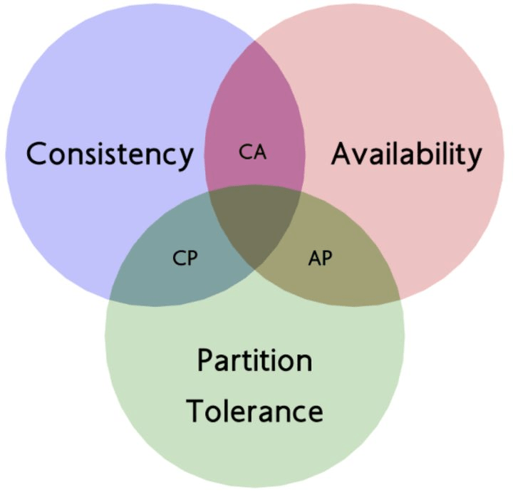

## 前言

分布式系统是一个很大的话题，在前文[给偶遇的小萝莉讲明白什么是分布式 - 九层台](https://blog.wj2015.com/2022/07/08/%E7%BB%99%E5%B0%8F%E8%90%9D%E8%8E%89%E8%AE%B2%E6%98%8E%E7%99%BD%E4%BB%80%E4%B9%88%E6%98%AF%E5%88%86%E5%B8%83%E5%BC%8F/)中，以拜占庭将军问题为引，带出了 CAP 定理；而 Paxos 算法就是满足一致性和分区一致性的分布式算法（CP）。



本篇将梳理 Basic Paxos 算法的核心原理以及在 golang 下的代码实现和单元测试。

## 原理

本篇仅实现 Basic Paxos，所有节点只会决议出一个共识的值，虽然看起来实现的效果很简陋，但其中思想却是各大工程化分布式算法的基石。

常规的分布式系统里边，网络比较可靠，不需要考虑拜占庭容错（网络节点里边有叛徒乱发消息），Basic Paxos 就是这样的算法。

> PS：如果想要了解防止拜占庭容错的分布式算法，可以看下 PBFT、用于区块链的 POW/POS 等等。

### 基本概念

先从数据结构和角色说起，Paxos 使用提案来推动算法，由系统决议出同一个提案（达成一致）。

#### 节点角色

Paxos 算法中存在四个角色：

- 客户端，向系统**发起请求**（写请求、读请求）

- 提议者，接受客户端请求，并以此**发起一个提案**，试图让接收者接受提案，达成一致

- 接收者，可以接受提案或拒绝提案，系统中**超过半数接受提案，那么该提案就被批准了**（达成一致了）

- 学习者，只能**学习被接收者们批准的提案**，不参与决议，相当于只读节点

#### 节点通信

**节点间的通信属于远程调用**，也就是 RPC，golang 本身自带 rpc 包，可以实现 TCP 协议的信息传输调用，同样可以使用 gprc 等更兼容更常见的 rpc 方案。

#### 提案

提案由两个部分组成：

- 提案编号，**全局唯一，有先后顺序**

- 提案值，就是提案对应的数据

其中，在 Paxos 算法中，提案编号由轮次和服务器id一起组成，轮次的意思是这是第几次提案，在系统中每次提案都全局递增，服务器id每个节点都不一样，以此满足全局唯一且有先后顺序的要求。

> PS：如果这里用时间戳+serviceid 或者雪花数等分布式全局递增的方案也可以达到效果，但介于 Demo 的简单性和易理解性，不做对应的实现

所以每次客户端发起**写请求**，想更新分布式系统整体的提案值，就会**生成一个最新的最大的提案编号，去让接收者接受**，而如何避免提案的冲突以及令大多数节点认可，就是 Paxos 算法的重点了。

#### Quorum机制

与之相对的是 WARO协议，大概意思是我们的每次写入都需要**让每个节点都写入并更新成功**，这在实际工程应用中就会有效率上的问题（得等所有人完成）。

而 Quorum 机制就是，每次写的时候需要让**超过半数的节点更新成功**，每次读的时候也需要有超过半数的节点返回同一版本的数据。

因为写入的超半数节点和读取的超半数节点，中间一定会有交际，所以就可以保证读到最新的数据。

> PS：假如有三个节点 ABC，写入的时候写了 AB 两个节点，读取的时候需要超过半数，也就是得读两个节点，那么不管读 AB 还是 AC 还是 BC，都会读到写过的最新版本的数据。
> 
> 但分布式系统中时刻都有意外发生，在刚才的案例中，如果更新了 AB 但节点 B 由于网络或机器故障挂掉了，那么这时候客户端只能读到 A和C，通过版本号可以确定A 节点的数据是最新的值。
> 
> 要是超过半数的节点挂掉，这个机制就无法响应用户请求了。

### 过程

#### Prepare阶段

提议者收到客户端请求，使用最新的提案编号 n + 1 作为新的提案编号进行提案，向超过半数的接收者广播 Prepare 消息。

> PS：在 Prepare 请求的响应中，会响应这个节点的最新提案编号和提案值，如果提议者的提案编号不够新，会更新到最新的，并放弃这次新提案；所以最新提案的提案编号一定是全局最大的。

接收者收到 Prepare 请求后，**如果拿到的提案编号比他之前收到的都大，那么就把这个提案号保存起来并响应成功**；以后碰到比这个提案小的 Prepare 请求，就拒绝掉。

> 这一步相当于提议者探一探各个接收者的反应，如果超过半数的接收者都给到提议者成功的响应，就说明这些接收者都暂时认可他的提案，可以进行下一步操作了。

如果在大于半数的 Prepare 响应中**收到了比当前提案号更大的，已提交的提案**，也就代表着我们这次提案比已有提案小，这提案的值会被更新为**响应中给到的最新提案值和提案编号**，并继续接下来的 Accept 阶段。**相当于放弃新提案，转为把目前最新的已提交的提案推到更多的接收者上**

> 因为每次发起提案和接收者确认提案只需要一半以上的节点批准即可，剩下的一半可以通过这个机制同步信息。

接收者的伪代码

```python
# 注意这里是大于，提案号一样是不能响应成功
if n > max_n:
    max_n = n
    # 节点接受过提案
    if accepted:
        # 如果提议者收到一个已接受的，比他提案号大的，要放弃他当前提案，推这个
        return promise(n, accepted_N, accepted_V)
    else:
        return promise(n)
else:
    # 拒绝
    return reject()
```

#### Accpet阶段

在提议者的 Prepare 阶段结束后，会由提议者发起 Accept 请求，其中包含提案号、提案值。

接收者在收到请求后，检查提案号是否**大于等于**自己见过的最大的提案号，如果是，才可以接受提案，接受提案也就是保存这次 Accept 请求中携带的提案号、提案值即可。如果不满足条件，响应拒绝。

然后会把接收者批准这一提案的信息告知学习者，把自己最新的提案号和提案值告诉学习者，学习者在收到读请求时自行统计和判断哪个是当前系统认可的值。

接收者的伪代码

```python
# 注意这是大于等于，因为 prepare 阶段更新过 max_n 了，不然正常流程过来进不去逻辑
if n >= max_n
    # 标记为已接受过提案
    accetped = true
    max_n = n
    accetpted_N = n
    accepted_V = v

    for all learners:
        update(server_id, n, v)
    return accepted(n, v)
else:
    return reject()
```

## 代码细节

具体代码可见：[blog/source/static/assets/code/basic-paxos at master · wangerzi/blog · GitHub](https://github.com/wangerzi/blog/tree/master/source/static/assets/code/basic-paxos)

代码结构为：

> message.go -- 基本的 RPC 通信和服务的封装，请求和响应的结构体
> 
> proposer.go -- 提议者逻辑
> 
> acceptor.go -- 接收者逻辑
> 
> learner.go -- 学习者逻辑
> 
> paxos_test.go -- 单元测试

#### 消息通信

使用了 golang 自带的 `net/rpc` 包，把调用和监听端口并服务封装了两个函数 `call` 和 `server`

```go
package main

import (
    "fmt"
    "log"
    "net"
    "net/rpc"
)

// MsgArgs 请求结构
type MsgArgs struct {
    Number int
    Value  interface{}
    From   int
    To     int
}

// MsgReply 响应结构
type MsgReply struct {
    Ok     bool
    Number int
    Value  interface{}
}

// 约定：接受者1开头，学习者端口2开头
const (
    AddrAccept = iota + 1
    AddrLearner = iota + 1
)
func generateAddr(id int, t int) string {
    return fmt.Sprintf("127.0.0.1:%d", id)
}

func call(addr string, name string, args interface{}, reply interface{}) error {
    c, err := rpc.Dial("tcp",addr)

    if err != nil {
        return err
    }

    defer func(c *rpc.Client) {
        _ = c.Close()
    }(c)

    err = c.Call(name, args, reply)
    if err != nil {
        return err
    }

    return nil
}

func server(addr string, obj interface{}) (net.Listener, error) {
    s := rpc.NewServer()
    if err := s.Register(obj); err != nil {
        return nil, err
    }

    l, err := net.Listen("tcp", addr)
    if err != nil {
        return nil, err
    }

    go func() {
        for {
            conn, err := l.Accept()
            if err != nil {
                // ignore error and continue
                log.Println("[error] tcp", err)
                break
            }

            go s.ServeConn(conn)
        }
    }()

    return l, nil
}
```

#### 提议者

包含生成提案编号、向半数 Acceptor 发起 Prepare 请求并更新提案号、发起 Accept 请求等逻辑。

```go
package main

import (
    "errors"
    "log"
    "strconv"
)

type Proposer struct {
    id        int   // 提议者服务器id
    round     int   // 已知最大轮次
    number    int   // 提案编号（轮次，服务器id）
    acceptors []int // 接收者
}

// 生成提案号，轮次在前，服务器在后，方便比较
func (p *Proposer) generateNumber() int {
    return p.round << 16 | p.id
}

// 发起新提案
func (p *Proposer) propose(v interface{}) (interface{}, error) {
    p.round++
    p.number = p.generateNumber()
    log.Println("[info] propose ", p.number, v)

    prepareCount := 0
    maxNumber := 0
    majorAcceptorNum := len(p.acceptors) / 2 + 1

    // todo:: acceptor 打乱顺序
    // 第一阶段
    for _, aid := range p.acceptors {
        args := MsgArgs{
            Number: p.number,
            From: p.id,
            To: aid,
        }
        if p.number > maxNumber {
            maxNumber = p.number
        }

        reply := new(MsgReply)

        err := call(generateAddr(aid, AddrAccept), "Acceptor.Prepare", args, reply)
        if err != nil {
            // 允许错误
            log.Println("[error] prepare response error", aid, err)
            continue
        }

        if reply.Ok {
            prepareCount++
            // 如果 prepare 发现有提案号更高的，更新提案值
            if reply.Number > maxNumber {
                maxNumber = reply.Number
                v = reply.Value
            }
        } else {
            log.Println("reply is not valid", aid, reply)
        }

        if prepareCount >= majorAcceptorNum {
            break
        }
    }
    if prepareCount < majorAcceptorNum {
        return nil, errors.New("acceptor prepare is not enough" + strconv.Itoa(prepareCount) + "-" + strconv.Itoa(majorAcceptorNum))
    }

    // 第二阶段
    acceptCount := 0
    for _, aid := range p.acceptors {
        args := MsgArgs{
            Number: maxNumber,
            Value: v,
            From: p.id,
            To: aid,
        }

        reply := new(MsgReply)

        err := call(generateAddr(aid, AddrAccept), "Acceptor.Accept", args, reply)
        if err != nil {
            // 允许错误
            log.Println("[error] accept response error", aid, err)
            continue
        }

        if reply.Ok {
            acceptCount++
        } else {
            log.Println("[error] accept reply is not valid", aid, reply)
        }

        // 超过半数
        if acceptCount >= majorAcceptorNum {
            return v, nil
        }
    }

    return nil, errors.New("acceptor accept is not enough")
}
```

#### 接收者

是刚才提到的 Prepare 阶段和 Accept 阶段的 golang 实现

```go
package main

import (
    "log"
    "net"
)

type Acceptor struct {
    listener    net.Listener
    id          int         // 服务器id
    minProposal int         // 最小提案号
    acceptedN   int         // 已接受的值
    acceptedV   interface{} // 已接受的提案值
    learner     []int       // 学习者id
}

func (a *Acceptor) Prepare(args *MsgArgs, reply *MsgReply) error {
    if args.Number > a.minProposal {
        a.minProposal = args.Number
        reply.Number = a.acceptedN
        reply.Value = a.acceptedV
        reply.Ok = true
    } else {
        reply.Ok = false
    }

    return nil
}

func (a *Acceptor) Accept(args *MsgArgs, reply *MsgReply) error {
    if args.Number >= a.minProposal {
        a.minProposal = args.Number
        a.acceptedN = args.Number
        a.acceptedV = args.Value
        reply.Ok = true

        // 转发给学习者
        for _, lid := range a.learner {
            go func(learner int) {
                addr := generateAddr(learner, AddrLearner)
                args.From = a.id
                args.To = learner

                resp := new(MsgReply)

                err := call(addr, "Learner.Learn", args, resp)
                if err != nil {
                    log.Println("[error] learn failed", err)
                }
                if !resp.Ok {
                    log.Println("[error] learn response is not valid")
                }
            }(lid)
        }
    } else {
        log.Println("[warn] can't accept", args, a)
        reply.Ok = false
    }
    return nil
}

func newAcceptor(id int, learner []int) (*Acceptor, error) {
    acceptor := &Acceptor{
        listener:    nil,
        id:          id,
        minProposal: 0,
        acceptedN:   0,
        acceptedV:   nil,
        learner:      learner,
    }
    listener, err := server(generateAddr(id, AddrAccept), acceptor)
    if err != nil {
        return nil, err
    }

    acceptor.listener = listener

    return acceptor, nil
}
```

#### 学习者

学习者比较简单，保存所有 Acceptor 何其接受值的映射关系，读的时候找到被一半以上节点认可的数据返回即可。

```go
package main

import (
    "log"
    "net"
)

type Learner struct {
    listener    net.Listener
    id          int
    acceptedMsg map[int]MsgArgs
}

// Learn 接受 acceptor 发来的学习请求并更新
func (l *Learner) Learn(args *MsgArgs, reply *MsgReply) error {
    a := l.acceptedMsg[args.From]
    log.Println("[info] learn", args)
    if a.Number < args.Number {
        l.acceptedMsg[args.From] = *args
        reply.Ok = true
    } else {
        reply.Ok = false
    }
    return nil
}

// 选出来最多 acceptor 认可的值即可
func (l *Learner) choose() interface{} {
    acceptCounts := make(map[int]int)
    // number -> msg的映射
    acceptMsg := make(map[int]MsgArgs)
    majorCount := len(l.acceptedMsg) / 2

    //log.Println("[info] learner ", l.id, l.acceptedMsg)
    for _, accepted := range l.acceptedMsg {
        if accepted.Number != 0 {
            acceptCounts[accepted.Number]++
            acceptMsg[accepted.Number] = accepted
        }

        if acceptCounts[accepted.Number] > majorCount {
            return accepted.Value
        }
    }

    return nil
}

func NewLearner(id int, acceptorIds []int) (*Learner, error) {
    learner := &Learner{
        listener:    nil,
        id:          id,
        acceptedMsg: make(map[int]MsgArgs),
    }

    listener, err := server(generateAddr(id, AddrLearner), learner)

    if err != nil {
        return learner, err
    }
    learner.listener = listener
    // 初始化
    for _, aid := range acceptorIds {
        learner.acceptedMsg[aid] = MsgArgs{
            Number: 0,
            Value: nil,
        }
    }

    return learner, nil
}
```

#### 单元测试

这里的测试用例比较有限，很多边界条件还不太好实现，比如提议者发到一半挂掉了，Acceptor 响应成功前挂掉了，重启之后带来的问题等等。

```go
package main

import (
    "testing"
    "time"
)

func start(acceptorId []int, learnerId []int)([]*Acceptor, []*Learner, error) {
    acceptorList := make([]*Acceptor, len(acceptorId))
    for i := 0; i < len(acceptorId); i++ {
        acceptor, err := newAcceptor(acceptorId[i], learnerId)
        if err != nil {
            return nil, nil, err
        }
        acceptorList[i] = acceptor
    }
    learnerList := make([]*Learner, len(learnerId))
    for i := 0; i < len(learnerId); i++ {
        learner, err := NewLearner(learnerId[i], acceptorId)
        if err != nil {
            return nil, nil, err
        }
        learnerList[i] = learner
    }

    return acceptorList, learnerList, nil
}

func cleanup(acceptorList []*Acceptor, learnerList []*Learner) {
    for _, a := range acceptorList {
        _ = a.listener.Close()
    }
    for _, l := range learnerList {
        _ = l.listener.Close()
    }
}

func TestSingleProposer(t *testing.T) {
    acceptorId := []int {20001, 20002, 20003}
    learnerId := []int {30001}

    acceptorList, learnerList, err := start(acceptorId, learnerId)

    if err != nil {
        t.Error("start failed", err)
    }

    defer cleanup(acceptorList, learnerList)

    proposer := &Proposer{
        id:        1,
        acceptors: acceptorId,
    }

    // 发起提案
    val, err := proposer.propose("hello world")
    if err != nil {
        t.Error("propose failed", err)
    }

    // 检查返回值
    if val != "hello world" {
        t.Error("propose return value is not valid", val)
    }

    // 等一秒同步完毕再检查
    time.Sleep(1 * time.Second)
    choose := learnerList[0].choose()
    if choose != "hello world" {
        t.Error("learn value is not valid", choose)
    }
}

func TestTwoProposer(t *testing.T) {
    acceptorId := []int {20001, 20002, 20003}
    learnerId := []int {30001}

    acceptorList, learnerList, err := start(acceptorId, learnerId)

    if err != nil {
        t.Error("start failed", err)
    }

    defer cleanup(acceptorList, learnerList)

    proposer := &Proposer{
        id:        1,
        acceptors: acceptorId,
    }

    // 发起提案1
    val, err := proposer.propose("hello world")
    if err != nil {
        t.Error("propose failed", err)
    }

    // 检查返回值
    if val != "hello world" {
        t.Error("propose return value is not valid", val)
    }

    // 等一秒同步完毕再检查
    time.Sleep(1 * time.Second)
    choose := learnerList[0].choose()
    if choose != "hello world" {
        t.Error("learn value is not valid", choose)
    }

    // 发起提案2
    proposer2 := &Proposer{
        id:        2,
        acceptors:  []int{20003, 20002, 20001},
    }
    val, err = proposer2.propose("hello world2")
    if err != nil {
        t.Error("propose2 failed", err)
    }
    // 检查返回值
    if val != "hello world2" {
        t.Error("propose2 return value is not valid", val)
    }
    // 再提一次
    val, err = proposer.propose("hello world3")
    if err != nil {
        t.Error("propose3 failed", err)
    }
    // 检查返回值
    if val != "hello world3" {
        t.Error("propose3 return value is not valid", val)
    }
    // 等一秒同步完毕再检查，是提案3的值
    time.Sleep(1 * time.Second)
    choose = learnerList[0].choose()
    if choose != "hello world3" {
        t.Error("learn value is not valid", choose)
    }
}
```

## 总结

核心还是理解 Paxos 算法为何可以让多数节点达成一致，为以后的学习和理解打下基础。虽然实现的并不是一个非常完美，可以生产使用的 Paxos 算法，但里边每一步操作、分支判断所蕴含的思想还是很值得学习的。
