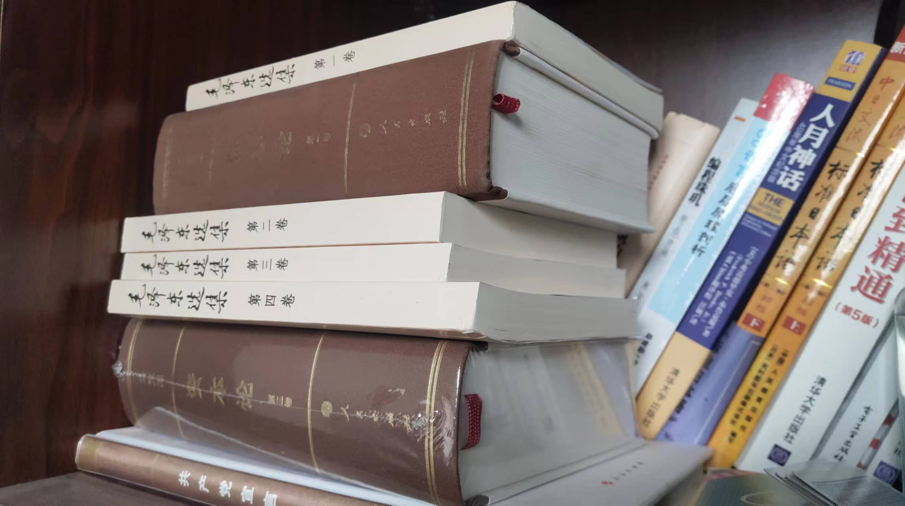
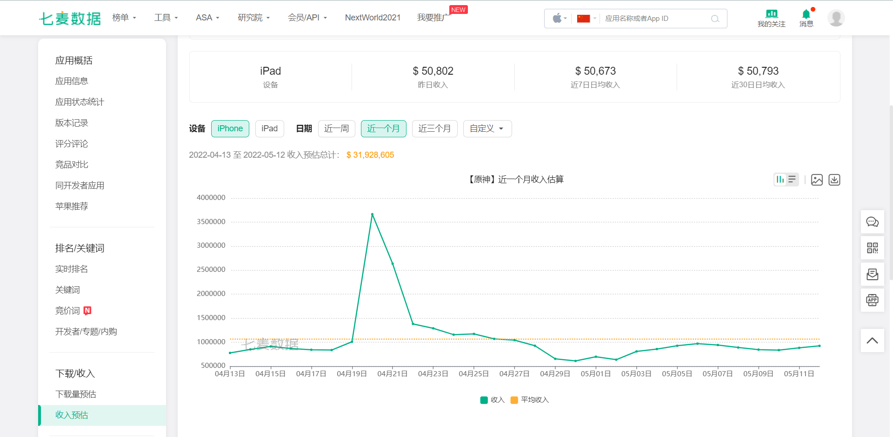
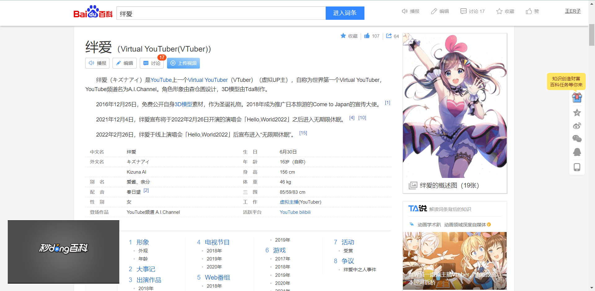

## 前言

上海2022年春，疫情袭来前，我看完了《毛泽东选集 第一卷》，**毛主席对战略战术，大局形式的思考让我印象颇深**，第一卷的最后两个小节 **《实践论》和《矛盾论》则是其中精华所在**，疫情期间又拿出来翻阅，映射到行业发展、个人发展又涌现出一些新的感悟。

## 理念

整篇文章想表达的观念就是，通过**实际体验，看到、感受到各个事物的现象，进而整理出事情的本质、内在联系、矛盾，进而把握周围世界的发展**。

毛主席是希望通过这篇文章进而规劝党内同志不要犯”教条主义“、”主观主义“错误，软件行业也有句出自《人月神话》的名言有着异曲同工之妙：**”软件工程没有银弹“**。

### 实践与人类认知的关系

> 人们的认识，不论对于自然界方面，对于社会方面，也都是一步又一步地由低级向高级发展，即由浅入深，由片面到更多的方面。 《实践论》

从我的理解来讲，认知是人们透过感知器官对外界的一种直观感受，所以首先得有这个事物，然后才能说得上对它的认知。

而认知的过程一般是这样的

- 第一个阶段，先看到了这个事物的外在表现
  
  - 比如你想学习区块链，**首先你看到了他各种各样的产品形态，NFT、虚拟币等等**

- 然后经过持续的观察，对其越来越了解
  
  - 比如区块链相关的文档、博客看得多了，或者去实际的各种产品上体验了，你知道了 NFT 和代币是怎么造的，怎么交易的；

- 第二个阶段，基于持续的观察了解为基础，脑内对此产生了**概念和理论**
  
  - 比如你通过观察上面的交易和更多的资料阅读，理解了区块链的运行原理，对区块链的共识机制和运行原理在脑内有了**概念**

- 第三个阶段，根据产生的概念，就能理解更多与此相关的事物，并且举一反三**推导出符合逻辑的结论**
  
  - 比如你就会根据自己理解的概念，知道了何为“矿工”，他们的目的是什么，怎么谋取利益，进而推导出为何“矿工”们是怎么内卷的，为何会导致显卡供不应求等等

所以整体过程就是 **实践获得感性的认知** -> **多方面多角度的实践，获得理性的概念和理论** -> **通过所得理论重新认知世界**

第三个阶段实践的过程中，**如果推出的结论取得了预想的结果，认知才真正的被证实了**，反过来**如果我们想要取得预想的效果，就需要符合客观世界规律，与之不合就会导致失败。**

### 直接经验与间接经验

自己**实际去感受**去整理出来的知识属于**直接经验**，从**他人感受、流传或整理**下来的知识属于**间接经验**。

一切真知都源于直接经验，但世上大多数知识都是间接经验。如果这些间接经验带来的知识是**科学客观的反应客观事物，那么知识是有效的，反之不可靠**。

像编程领域，设计模式在面试中经常被问到，**这种经由他人总结流传下来的设计经验和知识，就属于间接经验**，而且还是经过无数实践证实的科学理论。

### 事物的发展过程

认识的发展过程

- 看到事物的各个现象，看到事物的**片面、现象以及外在联系，这是感性的**，感觉和印象的阶段。
- 多次看到现象，**深入思考，形成概念，了解其内在联系，这是理性的**，进而得出合乎论理的结论。

文章中举了两个例子，第一个是马克思主义诞生的历程，第二个是中国人民反帝反封建的历程，整体上也是 实践获得感性认知 -> 形成理论 -> 回到实践中去 这么个历程。

#### 马克思主义的诞生历程

一开始工人们的抗争都是**感性的，片面的**，打砸机器，罢工等等直接的手段。经过一系列罢工事件，马克思以科学的方式**整理其中经验，形成了马斯克理论**以使工人们明白什么是剥削什么是资本主义，然后才开始用经济及政治的手段进行**进一步的抗争**。

#### 中国人民抗争的历程

一开始人民对帝国主义的**认识是表象的**，义和团，太平天国，均以为推翻清朝或者击退外敌就可以获得解放，然后都失败了。后来民族意识崛起，逐渐**看清封建买办，帝国主义对人民的剥削的实质**，迸发出的思潮和起义，直至**最后推翻剥削者**，建立新中国。

#### 映射到互联网产品开发

一开始我们**接触一个产品或者需求，都是片面的**，比如我知道这边需要一个表单，那么这个表单收集上去什么作用，可能不太清楚，为什么需要这样一个系统，也不清楚。

随着开发工作的进行，以及工作环境、产品背景的熟悉，我们会逐渐领悟，做这个事情的目的是什么，**对整个系统有了概念**，进而在实际开发的过程中就能**带上“产品化”的思考**，提出行之有效的建议，**解决实际的问题**。

工作中不少遇到**只管埋头做事，不闻前因后果**，经常会导致的结果是，时间花出去了，但是跟产品传达的需求不一致，或者在关键的细节上没有思考，写出来的代码灵活性、扩展性都会与真实需要有所偏差。

## 思考

### 行业的未来

身处互联网行业，客观世界是一直变化的，业内一直涌现出新的技术方案，互联网适配的生活场景也越来越多变灵活。

近几年互联网热度不减，大厂们用高工资签走业内顶尖人才，相较其他行业，平均的工作环境和薪资待遇都还不赖，吸引了越来越多的人选择互联网；

##### 从业人士的现状

而从行业总体以及**我个人所处的职位上看，岗位流动相对频繁，技术焦虑都是比较常见的问题。**

就以我目前所带的公司来看，**小规模、轻资产、花销精打细算是我可以给它贴的标签**，而任何一位从业者对于工资的期望都是无止境的，而从业者身边总会有技术水平参差不齐，薪资水平有高有低的人。互联网公司又大多轻资产，现金流转不过来，或者公司收益无法达到预期，员工对工资的期望就可能落空，进而期望精进自己的技术，进入那些薪资更高，规模更大的厂里去。

人往高处走，与同期从业者薪资的比较带来了工资焦虑，与大厂高薪对应的技术能力，又会给从业者带来技术焦虑。记得一两年前，**面试时人人高并发，工作时天天 CURD**，在每天重复的工作中技术焦虑、薪资焦虑也会逐步增长，进而触发下一次跳槽。

不过技术始终还是用来解决现实问题的，频繁跳槽和对新技术的追求也有两面性，好处上，可以在各种各样的岗位上接触新的场景，**提升自己的能力**，公司在招聘上也能有更多的选则。不好的地方，工作平均任期短，代码几经人手，就需要付出额外的对接交付理解成本，我觉得这也是一种行业生产力的**内耗**。

##### 互联网需求的土壤

而在我目前的认知里，催生互联网需求的土壤分两个部分，一个是**为现实世界提效和扩展**的，比如各类 Sass 系统，网购，外卖、快递、官网宣传、分销推广等等。另一个部分是在互联网的虚拟世界中，比如游戏、论坛、NFT等等形态，**共同组成互联网精神世界**。

部分业务可能是两边都占的，但前者的需求并非永无止境，只是因为技术不断更迭，用代码描述现实需求的场景不断复杂，以及认识到互联网带来效益增幅的企业越来越多，所以需求量不减，**但未来随着我们工具的升级，生产效率的提升，实现同样的需求，成本会越来越低。** 

比如我们搭建一个仅展示用途的官网，十年前可能需一个团队来实现、维护代码运行，而现在各种 SASS 平台和建站工具，付费的免费的，几分钟就能出来一个能看能用的官网，**低代码平台通过配置和工具就能实现一个适应需求的后台管理系统**。十年前，这样的需求能养活无数个团队，而现在可能只能养活部分建站公司的程序员们。

自建电商也是同样的道理，境内的有赞、微盟，境外的 Shopify、Shopbase 能让用户迅速的创建一个满足基础功能的自己的商店，而无需投入高额的研发成本去开发或者折腾开源项目。

而互联网虚拟世界中，**随着使用和认可的人越来越多，需求也会愈发庞大**，比如安全的线上交易，角色皮肤，个人精神享受产品等等。

比如最近爆火的《原神》，现在处于 2.6 绫华复刻末期，国区一月收入 3kw

还有近年来 Vtuber 等纯线上交互的产品形态在二次元社区大火，逐渐形成了一个产业。

> 缅怀第世界上一个 Vtuber 绊爱，当时刚出就开始关注，今年初关机了

### 个人的发展未来

个人发展和行业发展是分不开的，毕竟我喜欢互联网喜欢计算机，对这个行业还保有热情，希望能在这条路上走的更远，那么也对应前面《毛选》所述，**如果我们想要取得预想的效果，就需要符合客观世界规律，与之不合就会导致失败。**

所以在我的认知中，**业内先进生产工具的生产和利用、为互联网世界添砖加瓦是顺应趋势的**，应该优先走向这个方向；而小型系统外包、官网类、基于落后生产工具的尾大不掉的系统维护等工作会逐步被更合适的生产工具升级和替代。

但未来总是多变的，我的行为也只是对我这么些年对行业形成的认知映射，**如果发现未来的发展和现象与我的概念一致，那么我形成的认知就是在一定程度上正确的，反之就是有问题的**，需要调整的。

在新的概念和事物层出不穷的世界中，随着客观世界的变化能屈能伸，才能更好的适应社会，适应生活。

## 总结

我现在很认同 **“《毛选》中蕴藏大智慧”** 这句话，记得我刚入社会，看到工位对面有人看《毛泽东选集》这类书，我甚至会觉得很奇怪，毕竟大学的《思修》十堂课有八堂课都是混过来的。

但实际阅读并理解其中思想和观念时，就能真实的领会到其中的智慧，受益匪浅，令人由衷感叹，**教员千古永存**。
