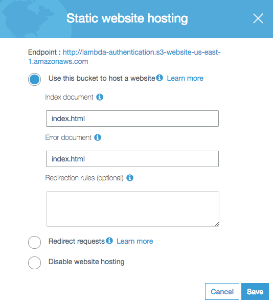

## 译者前言

本篇文章主要介绍如何通过 AWS 中的 CloudFront 以及 Lambda 实现简单的无服务器架构( Serverless )网站下的 Basic 鉴权，在理解架构之后不难，但是想锻炼下自己的英文阅读能力，于是翻译了一下原博文。 原文链接：[https://douglasduhaime.com/posts/s3-lambda-auth.html](https://douglasduhaime.com/posts/s3-lambda-auth.html "https://douglasduhaime.com/posts/s3-lambda-auth.html") 原作者：[duhaime](https://github.com/duhaime "duhaime") 译者：[Jeffrey Wang](https://github.com/wangerzi) 本篇翻译已获得作者授权：[Can I translate your article to chinese and republish to my blog?](https://github.com/duhaime/douglasduhaime.com/issues/19 "Can I translate your article to chinese and republish to my blog?")

### 基础概念科普

为保证普通读者能读懂本文，基于博主本人的理解提前科普一点基础概念：

#### S3 是什么？

S3 是 AWS 中类似于国内 『七牛云』『阿里云-OSS』『腾讯云-COS』存储桶的概念，**能够存放用户的文件**，并且能做到文件粒度的权限管理，还可以把存储桶设置为 `Static Web Hosting`，译为静态网站托管，可以像常见的 Apache 那样提供静态网站服务。 **但是 S3 的 web 流量价格相对 `CloudFront` 较高**，一般都使用`CloudFront` 做 CDN 分发，流量成本相对低廉，那么什么是`CloudFront` 请看下文。

#### CloudFront 是什么？

CloudFront 是 AWS 中用于**分发静态资源，加速请求的工具**，其实就是常见的 CDN，CDN都知道，可以让用户访问某个 WEB 资源的时候自动分发到距离用户最近的节点，不过 CloudFront 比较灵活，**可以在用户发起请求、自动回源、响应请求 等节点执行自定义的逻辑**，这种逻辑在 AWS 中被称为 `Lambda`，`Lambda` 的介绍如下。

#### Lambda 是什么？

一提到 Lambda 相信很多人会想到 Lamda 函数，在 AWS 中，Lambda 就是一段自定义功能的代码，可以用 go/nodejs/python 等语言进行编写，类似于面向切面编程的思想，在 AWS 其他组件的特定节点可以触发这一段逻辑，比如 `CloudFront` 中就可以在用户请求时触发自定义逻辑，鉴权成功则返回内容，否则响应401，提示鉴权失败。

#### Serverless 是什么？

字面含义就是**不需要管理服务器，但是能提供高稳定可扩展服务的一种架构**，我们常见的 WEB 服务可以在服务器上由 Apache、Nginx 等软件提供，但是现在我们也可以通过云计算厂商提供的函数计算，对象存储，队列等功能，无需管理服务器但是能提供稳定高效的后端服务。 [](../static/uploads/2020/07/626bfddfdd6664714ff47708f988d975.png) 其他概念就不再赘述，下面正文开始：

# 使用AWS Lambda 为 Serverless 架构下的静态网站做基础认证

Many websites require authentication to protect private data. When working on a website that uses a server, it’s usually not too much trouble to create some server-side middleware that protects certain routes or web pages. When working on a serverless website served by Apache or Nginx, one can use htpasswd files to challenge users to authenticate. When working on a serverless website hosted from an S3 bucket, however, creating an authentication layer is a little more tricky. This post will attempt to make the process a little easier for others to create password-protected static sites with S3, CloudFront, and Lambda.

> 很多网站需要用鉴权认证去保护隐私数据，当我们使用服务器上的服务端中间件去保护某一个路由或者网页时并不会遇到太大的问题。当我们使用 Apache 或者Nginx 搭建一个非 Serverless 网站的时候，可以通过 [htpasswd 文件](https://httpd.apache.org/docs/2.4/programs/htpasswd.html) 对用户进行鉴权。但当我们试图通过 S3 存储桶建立无服务器的网站（Serverless）并希望对其鉴权时，创建一个鉴权层会比较棘手。本片文章将尝试去创建一个基于S3、CloudFront、Lambda的，带密码保护的静态网站。

## 在S3上创建一个静态文件

To get started, you’ll want to create a sample web page. Here’s the one I’ll be using:

> 准备开始，首先你需要创建一个简单的 web 页面，如下即是我们使用的页面文件。

```markup
<!DOCTYPE html>
<html>
  <head>
    <meta charset='UTF-8'>
    <title>HELLO!</title>
  <style>
  body {
    background-color: #ffcb50;
    background-image: url(iam.png);
    background-size: 50px;
  }
  </style>
  </head>
  <body />
</html>
```

Once you have an HTML page to display, you’ll need to [register for an AWS account](https://aws.amazon.com/free/) if you don’t already have one. Then, after signing in, go to your [list of S3 buckets](https://console.aws.amazon.com/s3/home), click “**Create bucket**” and give your bucket a name. I’ll name my bucket **lambda-authentication**:

> 一旦你想要展示一个 HTML 文件，首先你需要注册一个 [AWS 账号](https://aws.amazon.com/free/)（如果你没有的话）。在使用账号登录之后，进入 [S3 存储桶列表](https://console.aws.amazon.com/s3/home)，点击 **创建桶**，然后给你的桶取一个名字，这里我给桶取名为 **lambda-authentication**:

[](../static/uploads/2020/07/953f030fec3af398e307142a9d7b150c.png) When prompted to set the permissions for the bucket, under **“Manage public permissions”** select **“Grant public read acess to this bucket”**. That will display a little orange message confirming that your bucket contents will be public (we’ll change this later):

> 点击下一步，当我们试图为本存储桶设置权限的时候，在**"管理公共权限"** 下选择 **"给本存储桶授予公共读权限"**，这里将会显示一个橙色信息让你确认这个桶的内容将会被公开（随后会改回来） 译者注：这里不会直接将存储桶设为公开的，原博文在此只是为了展示 S3 的 Web-Host 能力，**如果公开了不就意味着谁都可以不经授权访问桶内文件的内容了，那还做鉴权干哈**。

[](../static/uploads/2020/07/ff2bb56b1611f791f3c19ce84ad01218.png) All other defaults are fine to accept. Once the bucket is created, you can upload your HTML file to the bucket by clicking the bucket, then clicking the “Upload” button. Drag your HTML file (which should be named index.html) into the filepicker, click **“Next”** until you are prompted to **“Manage public permissions”** for your uploaded file, and select **“Grant public read access to this object(s)”**:

> 其他默认配置直接下一步就行，这个桶创建好之后，你就可以点击这个桶，然后点击“上传”按钮来上传你的 HTML 文件了。拖动你的 HTML 文件（需要命名为 index.html）到文件选择器中，点击**“下一步”** 直到你被提醒为上传到的文件**“管理公共权限”**， **然后选择“为这些个对象授权公共读访问”**

[](../static/uploads/2020/07/ff2bb56b1611f791f3c19ce84ad01218.png) Then keep clicking **“Next”** until you get to the end, and click **“Upload”**. Next click the **“Properties”** tab in your bucket, select **“ website hosting”**, select **“Use this bucket to host a website”**, and specify **“index.html”** as the default and error documents:

> 然后一直点下一步到最后，点击“上传”。然后点开你存储桶的“属性”标签，再选择“静态网站托管”，然后把“index.html” 作为默认页面和错误页面：

[](../static/uploads/2020/07/3ed826adc2051b867f0fbe7498886ad1.png) Finally save your settings. If you want to get fancy later, you can upload a special 404 page and specify that file as the error document, but let’s keep things simple for now.

> 最后保存设置，如果你想更完善一点，可以传一个 404 页面过去，然后指定为错误页面

If you click on the **“Static website hosting”** card again, you should see an **“Endpoint”** specified. If you visit that web address, you should see your website:

> 如果你再次点击“静态网站托管”卡片，可以看到指定的“节点”。访问这个web地址就能看到你的网站。

[](../static/uploads/2020/07/435757a90bb5d756e0c11e98d5543bfa.png) Great! You’re now ready to create a user-authentication layer by configuring a CloudFront distribution for your site.

> 秀儿！你现在已经做好准备，可以在 CloudFront 为你的网站创建一个用户授权层了。

## 使用CloudFront分发你的S3

CloudFront is AWS’s content distribution network, which distributes your S3 site content to servers around the world, getting your content to viewers faster. CloudFront also allows us to add authentication to an S3 site.

> CloudFront 是 AWS 的内容分发网络（CDN），可以把你的 S3 里边的内容分发到全世界，加速你的文件获取和浏览。CloudFront 也可以给我们的S3网站添加授权认证。

To get started with CloudFront, return to the AWS [console](https://console.aws.amazon.com/console/home?region=us-east-1) and click the CloudFront link, then click the big blue button that says **“Create Distribution”**:

> 接下来开始使用 CloudFront，首先回到 [AWS 控制台](https://console.aws.amazon.com/console/home?region=us-east-1) 然后点击 CloudFront 链接，然后点击那个又大又蓝的叫做**“创建分配”**的按钮：

[](../static/uploads/2020/07/5f6c44c46c0f1214dce04775126ef7b2.png) On the following screen, click the blue button that says **“Get Started”** under the **“Web”** section, then select your S3 bucket address under **“Origin Domain Name”**. Under **“Restrict Bucket Access”** select **“Yes”**, set **“access-identity-lambda-authentication”** as the identity to use, and finally choose **“Yes, Update Bucket Policy”**:

> 在接下来的界面里，点击那个在**“web”**模块下的蓝蓝的**“开始使用”**按钮，然后在**“原始域名称”** 中选择你的 S3存储桶地址。在 **“限制桶访问”** 右侧选中 **“Yes”**，在访问身份那里选中 **“access-identity-lambda-authentication”**，最后在“授予桶的读权限”右侧选择 “是的，请更新桶权限” 译者注： 这里的 Grant Read Permissions on Bucket 是关键，这里会自动给你的 S3 加上 CloudFront 的访问权限，**所以在你关闭掉 S3 的公有读权限后，CloudFront还能正常访问到你的 S3**，AWS 中权限控制粒度特别细也特别严格，每一个资源每一个行为都可以控制。 除此之外，这里还需要选择 Origin Access Identities（源访问身份），如果选择**自动创建新身份的话需要你拥有创建 IAM 角色的权限**，否则请让管理员帮忙创建好能访问对应S3桶的角色。 博主在中文版下的创建界面如下： [](../static/uploads/2020/07/94a57782bc61fa324e78700caf264b4b.png)

原版图如下： [](../static/uploads/2020/07/7685bc75b9b692349dd8f133389f2eec.png) In the text field labelled **“Default Root Object”** below, type **“index.html”**, then click **“Create Distribution”**. From the next page, you should be able to click the **“Distributions”** link in the left sidebar to see your new distribution’s status. Take a note of the value under **“Domain Name”** – in just a few moments that value will become the new address of your new website. The **“Status”** field will say **“in progress”** for a few minutes, so while it's generating we can configure the Lambda function that will provide the actual authentication mechanism.

> 在**“默认根对象”**字段中写入**“index.html”**，然后点击**“创建分配”**按钮。到了下一页，点击左侧边栏的**“分配”**链接就可以看到新建出来的分配(CDN)状态。还可以在 **“主机名称”** 下拿到一个链接，这个链接将是你的新的网站地址。短暂的几分钟内**“状态”**字段将会是**“处理中”**，所以在生成过程中我们先去配置好一个可以提供认证机制的Lambda函数。

## 创建 IAM 凭证

In order to configure Lambda to work with an S3 bucket, we’ll need to create an IAM profile that has access to the bucket. To do so, navigate back go the AWS [console](https://console.aws.amazon.com/console/home?region=us-east-1) and click the link for the [IAM](https://console.aws.amazon.com/iam/home?region=us-east-1#/home) service. Once there, click **“Roles”** in the left-hand sidebar, then **“Create role”**. On the next screen, under **“Choose the service that will use this role”** click **“Lambda”**, then click **“Next: Permissions”** at the bottom of the screen. Search for and select the **“AWSLambdaExecute”** role:

> 为了使 Lambda 和 S3 存储桶一起工作，我们需要创建一个可以访问存储桶的 IAM 信息。可以按照如下的步骤来做，首先顶部导航回到 [AWS 控制台](https://console.aws.amazon.com/console/home?region=us-east-1)，然后点击 [IAM](https://console.aws.amazon.com/iam/home?region=us-east-1#/home) 服务的链接，进入之后在左侧边栏点击**“角色”**，然后**“创建角色”**。在接下来的界面里，找到“选择这个角色需要用到的服务”点击 **“Lambda”**，然后在界面底部点击**“下一步：权限”**。搜索并选择**“AWSLambdaExecute”** 角色： 译者注：这个权限是Lambda执行的基础权限，这里为某个函数单独建一个权限方便扩展，比如想要在Lambda中对其他资源进行操作，则需要在此额外赋予权限。

[](../static/uploads/2020/07/c06f7972aaba0a43c39d809bf0b0d78e.png) Then click **“Next: Review”** at the bottom of the page. On the next screen, name your role **“lambda-execute-role”**, then click **“Create role”**:

> 然后在页面底部点击**“下一步：审查”**。在下一步的界面为你的角色命名为**“lambda-execute-role”**，然后点击**“创建角色”**。

[](../static/uploads/2020/07/2c45e2f99cd2074a2df7beaa1231111a.png) On the next page you should see that your Lambda role has been created. Once it’s created, click on the link to the role, then click **“Trust relationships”**, then click **“Edit trust relationship”** and replace the contents with the following:

> 在下一步的界面，你就可以看到你的Lambda角色已经创建成功了。创建成功后，点击链接进去角色信息，然后点击**“信任关系”**，然后点击**“编辑信任关系”**然后用下面的内容替换掉其中的内容。

```json
{
  "Version": "2012-10-17",
  "Statement": [
    {
      "Effect": "Allow",
      "Principal": {
        "Service": [
            "lambda.amazonaws.com",
            "edgelambda.amazonaws.com"
        ]
      },
      "Action": "sts:AssumeRole"
    }
  ]
}
```

This little update allows the policy to interact with [Lambda@Edge](https://docs.aws.amazon.com/lambda/latest/dg/lambda-edge.html), which is the service that provides the authentication logic. Once that’s all set, you are ready to proceed to using this role in Lambda itself.

> 这亿点点变动允许这个策略作用到 [Lambda@Edge](https://docs.aws.amazon.com/lambda/latest/dg/lambda-edge.html) 上，我们要提供的鉴权逻辑就在运行在 Lambda@Edge 中。一旦以上操作都进行完毕了，你就可以在 Lambda 中使用这个角色了。 译者注：这一步非常重要，一不小心就踩坑，只有 lambda 服务的权限是不够的，因为这个 Lambda 函数需要跑在 CloudFront 的边缘节点上，边缘 lambda 和普通的 lambda 执行位置和限制都有区别，后续会讲到。

## 使用 AWS lambda 创建鉴权层

With all of the stage-setting in place, we can now create the actual logic that will handle user-authentication. To do so, return once again to the AWS [console](https://console.aws.amazon.com/console/home?region=us-east-1). Once you’re there, take a look at the black navigational bar at the top of your screen. Off to the right you should be able to select the **“region”** in which you wish to operate. For this next step you must be in the N. Virginia region (a.k.a. us-east-1). Once you’re in the N. Virginia region, click the link for **“Lambda”**.

> 有了前面的铺垫，我们现在可以创建一个实际的用户鉴权逻辑了。接下来，返回 [AWS 控制台](https://console.aws.amazon.com/console/home?region=us-east-1)。进入之后，先瞅一瞅顶上那个黑黢黢的导航栏，在那个导航栏的右边，可以选择你要操作的**“区域”**。下一步你需要选择 N. Virginia region (a.k.a. us-east-1)，如果你已经在这个区域了，点击**“Lambda”**链接。 译者注：这里必须是 us-east-1，不然 CloudFront 不认，除了lambda 有这个限制，CloudFront 自定义域名的SSL证书也有这个限制，只能选择 us-east-1 中的资源。

Lambda is a piece of AWS’s “serverless” stack that allows one to run serverside code without having to build, run, and maintain a whole server. We’ll use it to run our authentication logic. On the Lambda landing page, click the orange button that says **“Create a function”**:

> Lambda 是 AWS Serverless 栈中的一部分，他允许运行一段服务器端的代码并且不需要构建、运行、维护在一整个服务器。我们需要用到这个工具去运行鉴权逻辑。在 Lambda 主页，点击那个黄橙橙的叫做**“创建一个函数”**的按钮：

[](../static/uploads/2020/07/f93deae3623b7705cdc3ec3f35a012f5.png) On the next page, keep **“Author from scratch”** selected. Name the function **“authentication”**, select Node.js as the runtime, select **“Choose an existing role”** , and select **“lambda-execute-role”** as the existing role to use (this is the role we just created in the IAM console):

> 在下一个页面，选中 “重头开始”，函数名称叫做**“authentication”**，选中 Node.js 作为运行程序，再中 "选择一个已经存在的角色"（这个角色在上文我们在 IAM 中创建过了）：

[](../static/uploads/2020/07/23b9b8034d5d8b3e41d8c2a059295eec.png) Finally, click **“Create function”** at the bottom of the page. Scroll down to the code editor and paste the following snippet into the input field:

> 最后，在页面底部点击“创建函数”按钮，滚动到diamante编辑器，然后把下边的代码粘贴到输入框里边：

```js
exports.handler = (event, context, callback) => {

  // Get the request and its headers
  const request = event.Records[0].cf.request;
  const headers = request.headers;

  // Specify the username and password to be used
  const user = 'user';
  const pw = 'password';

  // Build a Basic Authentication string
  const authString = 'Basic ' + new Buffer(user + ':' + pw).toString('base64');

  // Challenge for auth if auth credentials are absent or incorrect
  if (typeof headers.authorization == 'undefined'  headers.authorization[0].value != authString) {
    const response = {
      status: '401',
      statusDescription: 'Unauthorized',
      body: 'Unauthorized',
      headers: {
        'www-authenticate': [{key: 'WWW-Authenticate', value:'Basic'}]
      },
    };
    callback(null, response);
  }

  // User has authenticated
  callback(null, request);
};
```

This snippet exports a single function that takes as input the three default arguments Lambda provides to Node.js functions [docs](https://docs.aws.amazon.com/lambda/latest/dg/nodejs-prog-model-handler.html). The function then pulls out the user’s HTTP request and its headers, specifies the correct username and password, and checks to see if the user’s request contained the username and password in its authentication headers. If not, it prompts the user to authenticate; if so it allows the user into the site.

> 这个代码片段导出了一个函数，这个函数有三个默认参数，这三个参数是 Lambda 注入到 Node.js 函数中的，[文档在此](https://docs.aws.amazon.com/lambda/latest/dg/nodejs-prog-model-handler.html)。该函数提取用户的 HTTP 标头，指定好当前的用户名密码，然后检查用户名和密码是否包含在用户的请求头中。

After defining the function, click the big orange **“Save”** button in the upper-right of the screen. Then, in the list of **“Actions”** at the top of the screen, click **“Publish”**, enter a version statement, and click **“Publish”**:

> 在定义完函数之后，点击你屏幕右上角那个大大的橘色按钮**“保存”**。然后在你屏幕顶上有个 **“操作”** 列表，点**“发布”**，**输入一个版本号**，然后点击**“发布”** 译者注：这里一定要注意，版本号是必须的，每次更新完函数都需要发一个新版本，Lambda Edge 有要求必须指定版本号。 然后这里的代码也需要注意，不能给代码设置环境变量（比如你想用来管理用户名和密码），因为 Lambda Edge 是在边缘节点执行的，环境变量不能全局控制所有的节点。

[](../static/uploads/2020/07/99c5278fff24bc327c92f4f98f2e2164.png) Next, under the **“Designer”** section toward the top of the page, click **“CloudFront”**, which will move CloudFront into the triggers portion of the displayed diagram:

> 然后，在页面顶部 “设计蓝图” 这个部分下，点击**“CloudFront”**，可以把 CloudFront 作为这个设计图的触发器：

[](../static/uploads/2020/07/908a5c20f4fbe77a05497b3cd09baa70.png) If you then scroll down a bit, you’ll see a section titled **“Configure triggers”**. Select your CloudFront distribution’s ID under the **“Distribution”** selector (this is displayed under the ID column in your CloudFront distribution list), make sure you select **“Viewer request”** as the CloudFront event that will trigger the function defined above, and click the box that says **“Enable trigger and replicate”**:

> 往下划一点点，可以看到一个标题是“配置触发器”的部分，选择你的 CloudFront 分配 ID（CloudFront列表里边的ID列），确保你选择了“查看器请求”事件，这个时间会触发你之前定义的函数。然后勾上“允许触发和复制”

[](../static/uploads/2020/07/9bebfbc4dbdb2cbfe2b2401be79d8624.png) Then click **“Add”**, and click the orange **“Save”** button in the upper-right hand corner. If you then try to access the address specified under the **“Domain Name”** column in your CloudFront distribution list [example](https://dfdm943axhisa.cloudfront.net/), you’ll be prompted for a username and password:

> 然后点击**“添加”**按钮，再点击右上角那个橘黄色的**“保存”**按钮。如果你访问 CloudFront 分配列表中 **“主机名”** 那一列的访问地址，比如这个[案例](https://dfdm943axhisa.cloudfront.net/)，就会被要求输入用户名和密码。

[](../static/uploads/2020/07/c8be2b0f16ec0737a0790a7ca8487323.png) If you type “user” and “password” as the credentials (or whichever values you set as the username and password in your lambda password), you’ll see the site itself!

> 如果你输入了"user"和"pass"作为凭证（或者其他你在 lambda 中设置的用户名和密码），就可以看到网站内容了。 译者注：经过博主实操，这里还可以有另一种关联 CloudFront 的方式，就是在CloudFront中找到对应的分配，找到行为标签页，编辑默认行为(或者其他路径的行为)，然后在页面底部选择“查看器请求”，然后粘贴 lambda 函数某个版本的 arn，如下图所示。 [](../static/uploads/2020/07/66ad46128fb41251d3275e438dfd312e.png) [](../static/uploads/2020/07/ff096fe45a09f547a3859e1c51d90421.png)

## 清理之前的配置

There’s just one problem with the setup we established above. If you request your original S3 bucket address, you’ll be able to access your content without being challenged to authenticate. To fix this, return to the AWS [console](https://console.aws.amazon.com/console/home?region=us-east-1), delete your content, and reupload your web files. This time, don’t add public read permissions to the uploaded files:

> 我们在之前建立的S3，在这里还有一个问题。如果你直接请求 S3 的源地址，是可以不经鉴权直接访问到内容的。为了修复这个问题，返回 AWS 控制台，删除你的内容，重新上传web文件，不要给你新上传的文件选择公共可读权限。 译者注： 这里建议再把 S3 的静态网站托管关掉，让请求都从 CloudFront 走，也可以解决这样的问题。 如果这里想不明白，可以翻阅文档好好理解下 “查看器请求” 触发的 Lambda 在整个请求过程中的位置。

[](../static/uploads/2020/07/5c577ef067c35e83eca31ab7d159e7a1.png) Thereafter, if you request your bucket address directly, you’ll get a 403 response as expected:

> 至此，直接请求桶的访问地址，就会如所预料的一样返回403。

[](../static/uploads/2020/07/7aa96a2aab95d7b9b22ebee32af14b92.png) If you request the address of your distribution instead, you’ll be able to authenticate and see your [website](https://dfdm943axhisa.cloudfront.net/):

> 如果请求分配（CloudFront）的地址，你就可以进行身份认证然后看到你的站了。

[](../static/uploads/2020/07/8ab86d5c0ab47e3589fe329816bd7d1a.png)

## 译者后记

翻译真的是一件比较耗时间的事情，可能看一篇英文技术博客也就几分钟，再按照自己的理解实操加写出来也就两三个小时；但是以我目前的水平，完完全全翻译出来花了至少6个小时，不过看着成果非常开心就是了。