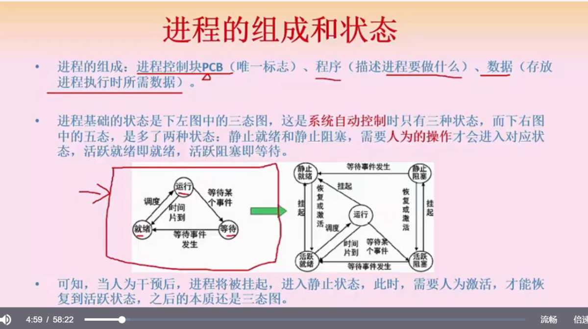
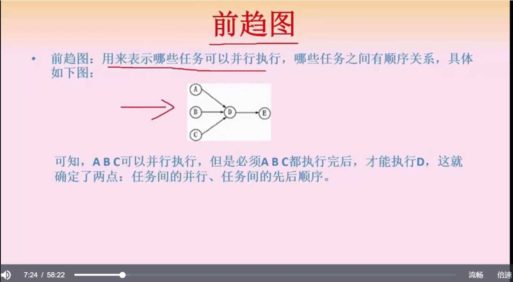
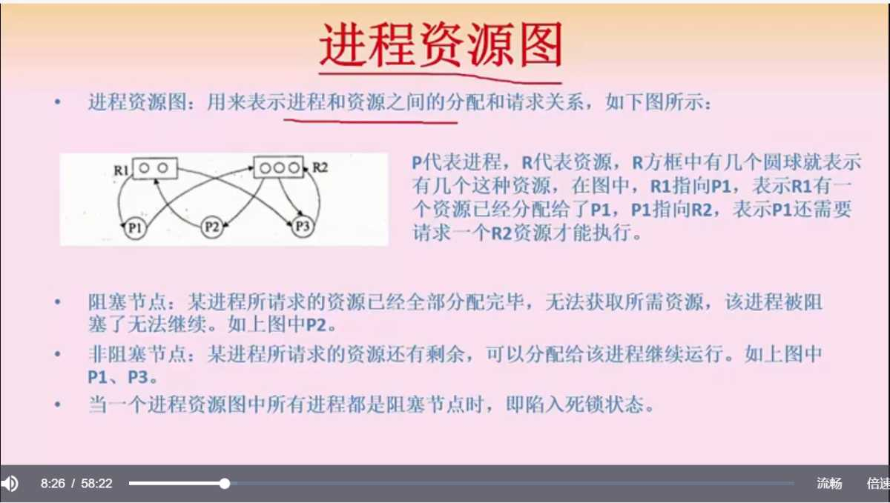
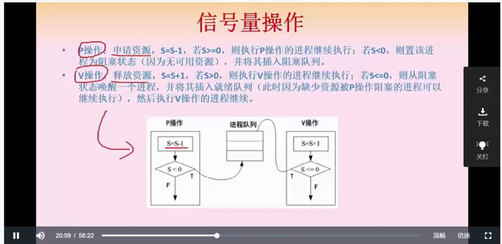
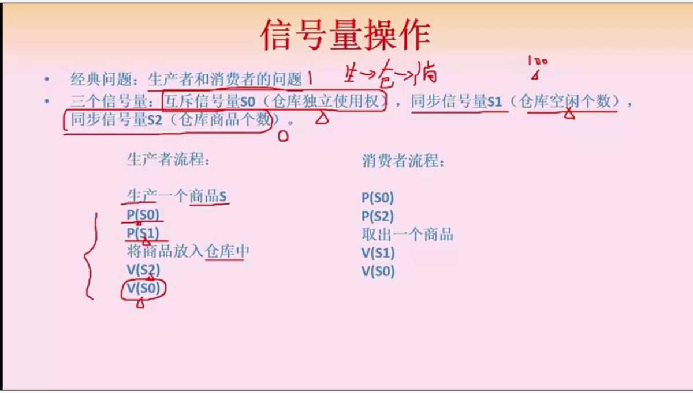
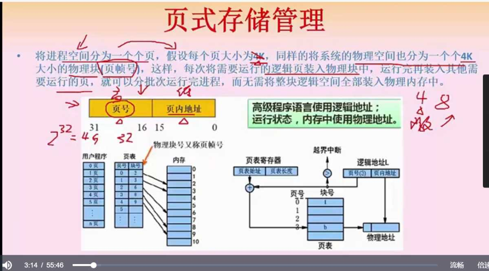
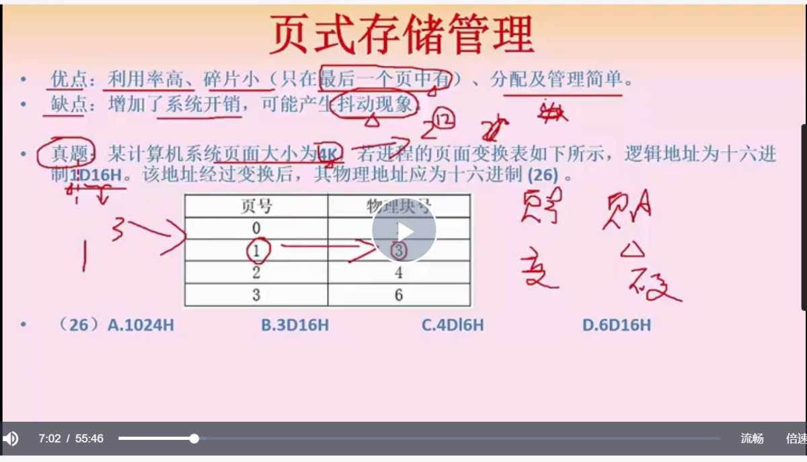
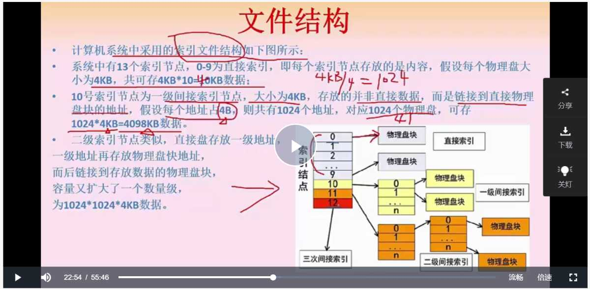
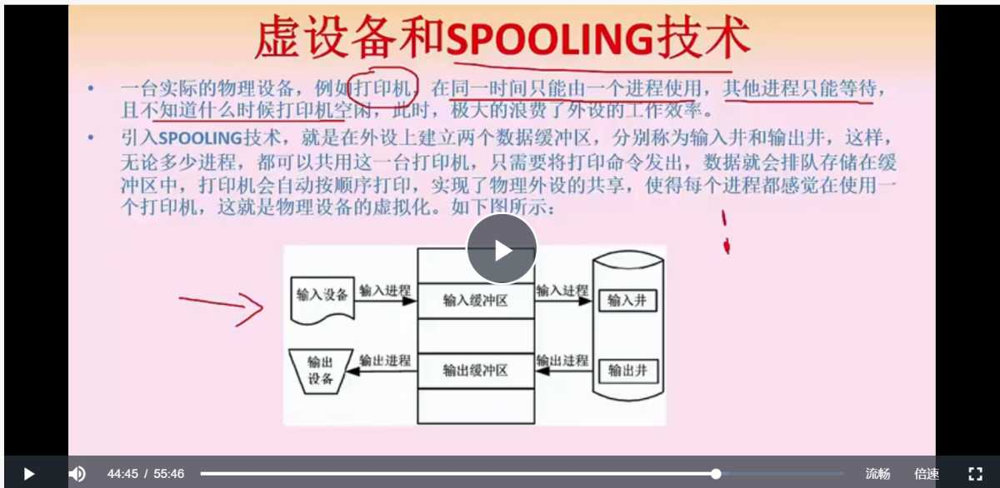
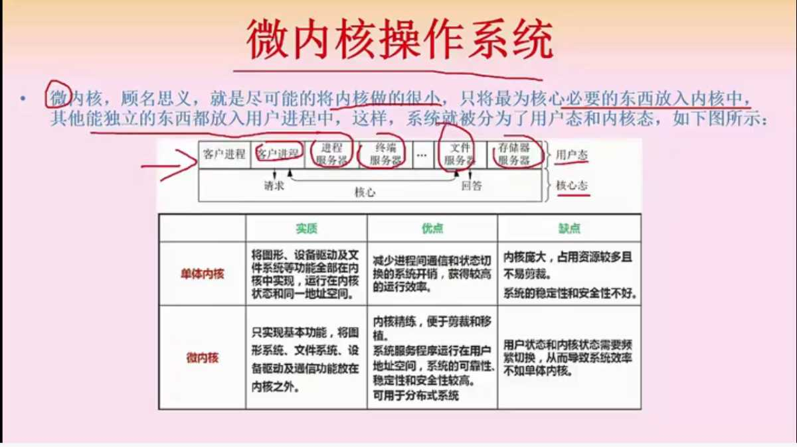

## 前言

操作系统部分的重点是进程状态变化以及文件存储部分，对工作和考是来说还是挺重要的，信号量 PV 的操作是重点中的重点

## 大纲

进程管理

*   状态
*   **前驱图**
*   **PV 操作**
*   进程调度
*   死锁
*   线程

存储管理

*   分区存储
*   **页式存储**
*   段式存储
*   段式页存储

文件管理 - **索引文件** - **树形结构** - **空闲存储管理** 设备管理

*   I/O 软件
*   **输入输出技术**
*   SPOOLING 技术

## 详细知识点

### 操作系统概述

操作系统的特征

*   并发性
*   共享性
*   虚拟性
*   不确定性

操作系统的功能

*   进程管理
*   存储管理
*   文件管理
*   设备管理
*   作业管理

### 进程

#### 进程的三态、五态及其转换（重点）

 系统自动控制时，进程**只有三态，就绪、运行、等待** 五态图，多的两个状态都是人工操作切换的，静止就绪态和静止等待态分别和就绪、等待，有转换关系

#### 进程的前驱图和 PV 操作（重点）

前驱图：表示哪些任务需要并行执行，哪些任务有顺序关系  进程资源图，一个箭头表示一个资源，箭头指向进程表示进程占有资源，箭头指向资源表示进程需要资源  阻塞进程：所需资源被分配完，即被阻塞 非阻塞进程：需要的资源还有剩余，可以在分配资源后继续执行 死锁：所有进程都是阻塞状态 临界资源：各进程间需要以互斥的方式进行资源访问，与之相对的是共享资源 临界区：对临界资源进行操作的那一段代码 互斥：临界资源只能被一个进程占用，比如打印机，与之相对的是共享 同步：任务可以并发执行，但是并发进行的任务可能有执行时间上的差异 互斥信号量，临界资源的可访问控制 同步信号量，对共享资源的访问控制，记录数量 P操作，申请资源，信号量S=S-1，如果减完 <0，进入阻塞进程队列 V操作，释放资源，信号量S=S+1  视频中有一个挺好的例题 

#### 进程死锁

产生死锁的四个条件 - 资源互斥 - 进程都占有并等待其他资源 - 系统不能强行剥夺资源 - 进程资源图是一个环 预防死锁，打破产生死锁的条件 - 避免：一般用银行家算法，提前算出来一条不会死锁的通路（重点） - 检测：查到之后尝试解除 - 解除：强制剥夺资源，杀死进程 死锁计算，系统有 n 个进程，每个进程需要 R 个资源，那么假设每个进程都已经持有了 r-1 个资源，所以发生死锁的最大的资源数量为 n \* (r-1)，那么不发生死锁的最小资源就是上述表达式 + 1

#### 线程

传统进程的属性 - 可拥有资源的独立单位 - 可独立调度和分配的基本单位 **线程是独立调度的最小单位，进程是拥有资源的最小单位，线程可以共享进程的公共数据，但不能共享线程独有的资源**

### 计算机存储

#### 页式存储结构

页存储结构：页号+页内地址，我想的话，应该是为了提高存取、缓存效率  优点：利用率高，管理简单，碎片小（按照 4k 来分配，一个大内存程序一般只会在最后的一个页出现碎片） 缺点：增加系统消耗，抖动 如何由页号表、逻辑地址算出物理地址呢？

*   根据块大小，推算出页号和页内地址占多少位
*   页内地址部分不变，把页号在页号表内找到其物理块号，替换即可，注意进制转换

 页面置换算法（主存和辅存间的分配算法）：进程空间有很多页面，但内存有限，可能同一时间只能有部分页面能被加载，以便进程任务能顺利进行，**置换的意思就是把主存满了的时候，里边存在的部分页被移除，部分辅存被加进来**。 缺页表示进程执行过程中发现页未被加载到内存中，就需要往辅存中取，**缺页率越高，效率越低。** 几种实现方法：

*   最优算法 OPT，选择未来最长时间不被使用的页进行置换
*   先进先出 FIFO，问题比较大
*   最近最少使用 LRU，目前比较好的解决方案

页表是逻辑块号和物理块之间的映射关系，**快表就是把这些关系存起来放到Cache中，慢表是把映射关系存内存里**，所以慢表需要查两次内存，而快表是在 Cache 中查也关系的，所以需要查一次 cache，在查一次内存。

#### 段式存储

段页式存储：先分段再分页，段页表结构中段表部分包含 段号、段基址、段长，段表还对应了一个页表 优点：结合上面两种存放的优点，利用率高碎片少，而且程序逻辑完整 缺点：数据结构复杂，逻辑复杂，开销大，速度慢

#### 文件结构

**对单个文件的存放索引**，共有十三个索引节点，0-9为直接索引，10、11、12 分别为一级间接索引，二级间接索引，三级间接索引  假设物理盘块大小为 4kb，物理盘块地址 4B 直接索引就直接存内容，这里直接对应 4kb 的数据 间接索引的意思就是，不直接存物理盘块，而是存物理盘块的地址，所以 4k 的大小可以存 1024 个地址 一级间接索引存了 1024 个地址，所以就对应了 1024 \* 4kb 的数据 二级间接索引同理，可对应 1024 \* 1024 \* 4kb 的数据 三级同理，1024 \* 1024 \* 4kb 数据 **位视图法表示空闲空间**是重点 

#### 虚设备

虚设备就是虚拟设备，SPOLLING 技术就是把类似打印机这种互斥资源，前面加一个队列，让调用者不会因为打印机被占用而报错，对每个进程的角度来讲，看起来就像是每个进程都有一个自己的打印机（物理设备虚拟化，共用互斥资源）。 

#### 磁盘寻道算法

这里说的是机械硬盘才会有的寻道和扇区，如果是固态的话，可以根据预先布线直接定位到数据，所以快很多，参考链接：https://www.zhihu.com/question/58752580 机械硬盘是由很多双面扇片组成的，每个盘面都有很多同心圆，一个同心圆又有多个扇区，数据就存在扇区上，从硬盘中找到数据分为寻道时间和等待扇区时间，其中寻道时间消耗较长。 寻道时间算法

*   FCFS 先来先服务，速度最慢
*   SSTF 最短寻道优先，可能远处的磁盘数据永远都拿不到
*   SCAN 扫描/电梯算法，一定是从内到外或者从外到内扫，如果有读取需求就读取
*   CSCAN 单向扫描，固定的从内到外或者从外到内，平均读取时间更稳定

#### 微内核

微内核只实现基本功能，优点是内核小，缺点是功能少，需要不停的切换用户态和核心态，影响效率 单体内核，优点是功能多，缺点是庞大  嵌入式操作系统的特点是，微型化设计、实时性强

## 总结

这个章节里边的计算和 PV 以及概念挺多，教材上比较复杂，但应试的话跟着视频的重点走+刷题即可，里边很多细节视频都不求甚解，还需要自己去扩展了解。