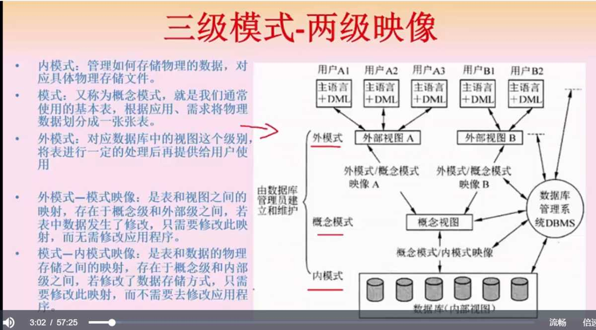
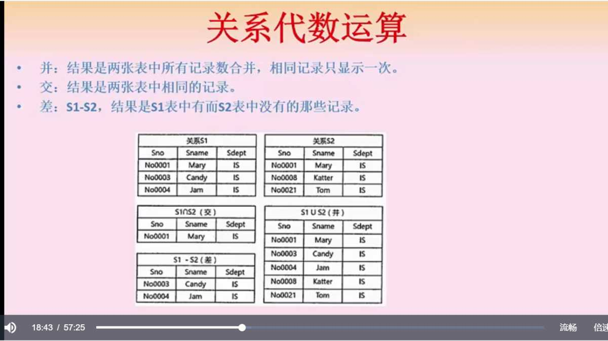
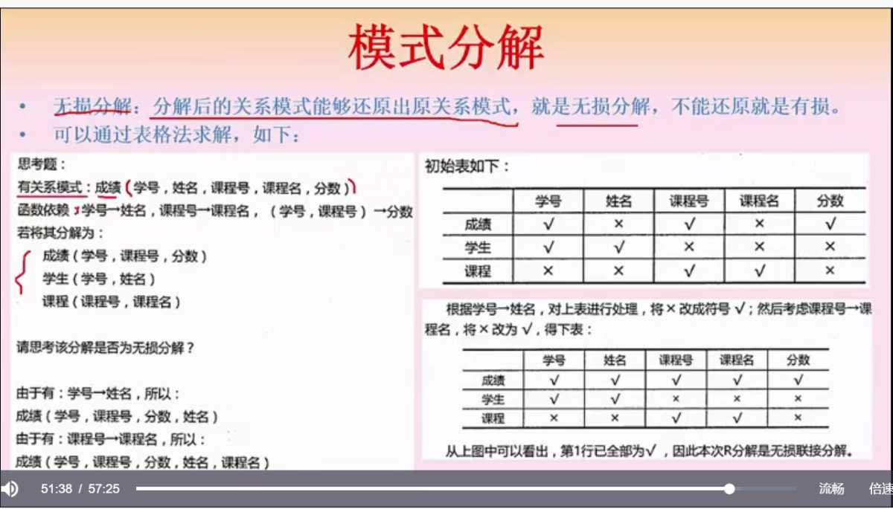
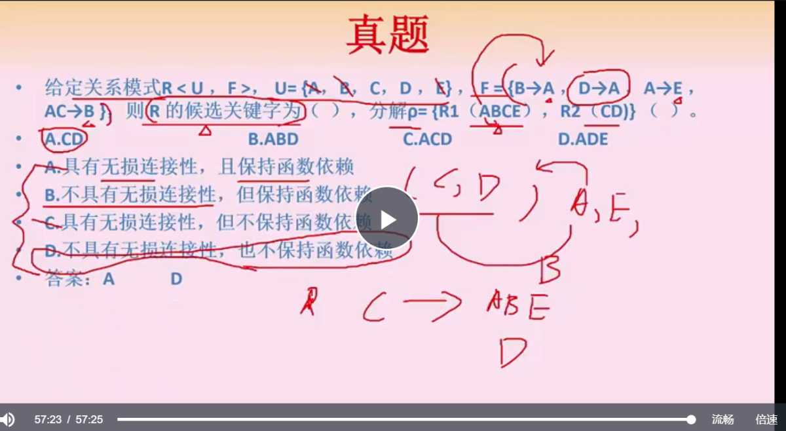
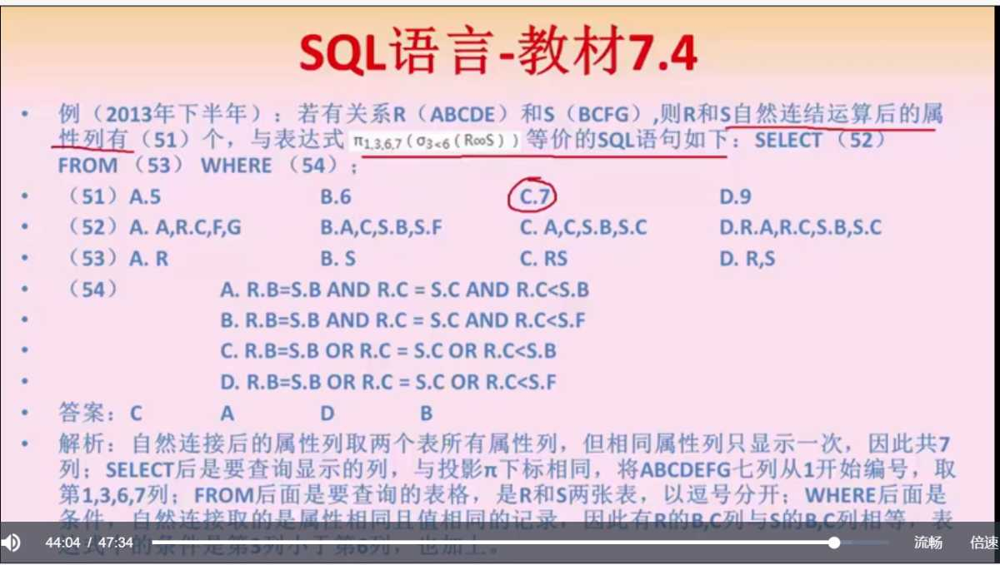

## 前言

作为后端工作者，数据库可以说是平时接触最多的中间件之一了，所以 SQL 使用和实践一般都无甚问题，但是软考里边考的不只是 SQL 应用，还有范式、模式、依赖等等概念化的东西，所以这一章也不能掉以轻心。

## 正文

### 模式和映像（重点）

三级模式

* 内模式，数据库的底层文件存储
* 概念模式，可以理解为表
* 外模式，数据输出给用户前做的一些包装和处理，可以理解为视图

两级映像

* 外模式->概念模式，视图到表的映像，比如表数据修改了，那么修改此映像即可，无需更改视图或者更高层级的东西
* 模式概念->内模式，表到存储的映像，比如修改了表的存储结构，那么修改此映像即可，无需更高更高层级的东西

### 数据库设计

从上到下，从抽象到具体 需求分析：数据流图、数据字典、需求说明书 概念结构设计：E-R 图，实体属性关系 逻辑结构设计：将 E-R 图转为实际的表和列，这里涉及范式 物理设计：实际的表结构生成具体的数据库

### 模型及其运算

数据模型三要素，数据结构（数据类型集合），数据操作（数据可执行操作集合），数据约束 ER图转关系模型的三种情况

* 1对1，直接在某个表内加入另一个表的属性
* 1对N，在对应N的表内加入属性，也可以做联系表
* M对N，联系表，M和N联合主键

关系模型的并交差代数运算：  笛卡尔积 S1 X S2 运算后，属性列的数量是两个表的属性数量相加，数据条目是两个表的行数相乘 投影 Π 1, 2 (S1)，取某一个表的某几个字段 选择 ρ no003 (S1)，选表中的一条记录（一行） 自然连接的结果是两个表全部的属性列，但相同的属性只显示一次（列相同，值相同）不满足匹配条件的行移除，符号为两个三角。 笛卡尔积与自然连接有转换关系，利用投影和选择来筛选列和行

### 函数依赖（重点）

依赖是怎么来的呢，我们拿到 X 就能确定 Y，那么 X 就能确认 Y， 也就是 Y 依赖 X，比如 Y=X\*X 这个函数。 函数依赖有两种

* 部分函数依赖，当拿到 A 之后就可以通过 A 找到 C，那么在一个 (A, B) 的关系中的其中一部分（A）可以确定 C，那么就称为部分函数依赖（A 可以推导 A，C 依赖于 A）
* 传递函数依赖，A 与 B 不等价，但 A 可以确认 B，B 可以确认 C，那么 A 就可以确认 C，这个过程就是传递函数依赖（C 依赖 A）

### 键和约束（重点）

#### 数据库键的分类和约束

数据库的键分为如下几种：

* 超键，可以唯一标识一条数据的属性的集合
* 候选键，从超键中去掉冗余的属性，剩余的即为候选键
* 主键，候选键中选一个
* 外键，其他表的主键
* 主属性，候选键集合包含过的属性为主属性，其他的为非主属性

三个约束

* 实体完整性约束，主键约束，主键唯一不为空且不能重复
* 参照完整性约束，外键需要为其他表已存在的值，或空
* 用户自定义完整性约束，比如某个属性的取值范围

#### 范式（重点）

第一范式 1NF，所有属性不可分割 第二范式 2NF，满足 1NF 的前提下，每一个非主属性都完全依赖主键，**不存在部分函数依赖**（**都依赖主键而不是候选键**，所以单属性候选键不会违反 2NF），目的是去除部分依赖。 第三范式 3NF，满足 2NF 的前提下，没有非主属属性传递依赖候选键，目的是**去除传递依赖**，通过主键去唯一确认非主属性，而非通过候选键去间接确认非主属性。 BC 范式 BCNF，依赖集中的每个决定因素的集合（依赖集的左侧）必须在候选码集合内

> 参考博客：[https://www.cnblogs.com/studyzy/p/5823224.html](https://www.cnblogs.com/studyzy/p/5823224.html)

反范式，本质就是增加冗余，增加查询速度 比如依赖集 F = {SJ->T, T->J} 候选键： (S, T) (S, J) 主属性：S,T,J 非主属性：空 1NF：满足 2NF：满足，因为没有非主属性 3NF：满足，没有非主属性 BCNF：不满足，因为决定因素 (T) 不在候选键的集合中 依赖集题型的解法，从入度为0的依赖属性开始扩散，直到拥有的信息集合能把整个图遍历出来

#### 模式分解

模式分解分两种

* 保持依赖的分解，比如一个 F={A->B, B->C, A->C} 的依赖表，就可以拆为 {A-B} {B->C} 两个依赖表，{A->C} 是冗余的，无需独立
* 无损分解，如果从分解后的关系模式可还原出原关系模式（所有列都能推出来），就是无损的，反之有损

 无损分解定理：关系模式 R 分解为 p={R1, R2}，F 为 R 满足的函数依赖集合，无损分解的充要条件是 R1∩R2 可推到出 R1-R2 或 R2-R1。 这里为啥要 ∩ 呢，因为交集代表两个表可以关联上的查询条件，如果根据这个查询条件能把 R1 表比 R2 表多的字段（或者 R2 表比 R1 表多的字段）都遍历出来，那么就能把这个表所有的字段都遍历出来，于是乎无损的，反之有损。 

### 事务（重点）

事务的四个特性

* 操作原子性，全做/全部做
* 数据一致性，发生后数据变化是一致的
* 执行隔离性，多个事务执行不会串
* 改变持续性，持久化的意思

并发控制中存在的三个问题

* 脏写，违反数据一致性，事务 A 改完但未提交，事务 B 也对同一条记录做了更改覆盖
* 不可重复读，同样的读取条件读取数据，事务进行中两次读取不一样
* 脏读，事务未提交数据被读取
* 幻读，同样的读取条件读取数据，新增的数据会被读取到

三级封锁协议 排他锁 X，共享锁 S 一级封锁：事务修改数据时，加 X 锁，其他事务需要操作这条数据时必须等待数据修改完才可进行，解决脏写 二级封锁：一级封锁基础上，在事务查询数据时，加 S 锁，查完就释放，解决脏写脏读问题 三级封锁：一级封锁基础上，事务查询数据时，加 S 锁，直到事务结束释放，解决脏写脏读以及不可重复读的问题

### 备份

数据库备份方式： 完全备份：备份所有数据 差量备份：上一次完全备份后变化的数据 增量备份：上一次备份后变化的数据 日志文件：精确到每一步操作，可回滚

### 分布式

分片模式

* 水平，每一条行记录拆开放在不同的数据库上
* 垂直，不同的列拆开放到不同的数据库上

分布透明性

* 分片透明性，用户不需要知道数据存在哪里
* 位置透明性，用户不需要知道数据在哪
* 逻辑透明性，用户不需要知道每一个局部机器用的什么数据模型
* 复制透明性，用户不需要知道数据库复制的数据从何而来

### 数据仓库

数据仓库是一种特殊的数据库，比如存放过时的数据，用于做数据分析和挖掘 特点

* 不面向应用，面向主题
* 会集成不同的表
* 相对稳定，一般不做更改
* 拥有比较大量的插入，反应数据历史的变化

分析方法

* 关联分析，不同事件间的关联性，事件 A 发生后，另一个事件也经常发生
* 序列分析，不同事件间隔内接连发生的事件
* 分类分析，分析不同类别的样本特点
* 聚类分析，没有类别的样本聚为不同的组，并对这些组做描述

商业智能系统四个阶段：数据预处理，建立数据仓库，数据分析和数据展现 数据预处理和仓库建立：抽取、转化、加载 数据分析：联机分析处理（OLAP）和数据挖掘

### SQL

sql 方面了解一个例题即可，注意认符号，Π是列选择，rou 是行筛选条件，循环符号表示自然连接，推断 where 条件时需要注意自然连接自带条件（重复数据不展现） 

## 总结

多掌握概念即可，实际工作中怎样设计表，怎样拆分实体，怎样用好冗余字段，都需要根据需求而定，而考试中的内容更接近纯理论，能有个参照。