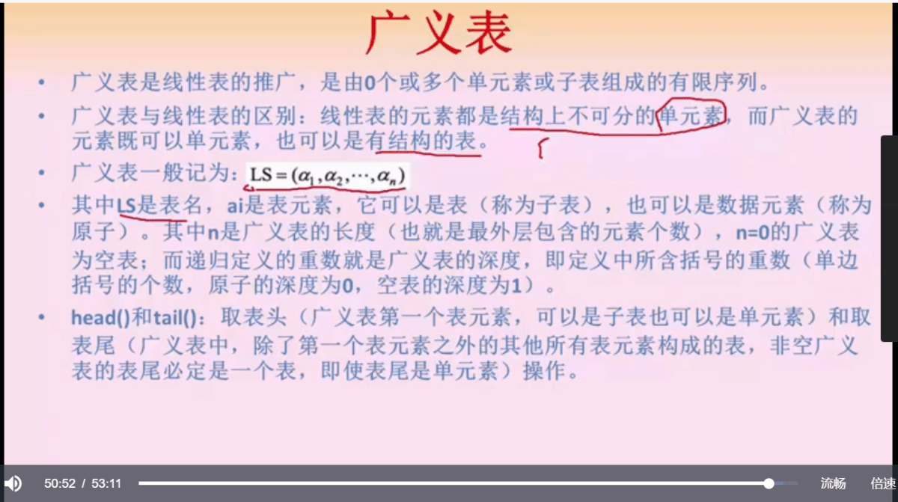

## 前言

这一部分的内容除了选择题会出现，还有最后的大题涉及到算法设计和实现，主要内容就是大学时期讲的数据结构相关的内容，数组、链表、栈、队列、串以及常见的排序和搜索算法。

## 数据结构

### 数组

连续的存储空间，顺序的分配给数据结构，地址计算，本质是起始地址+前面的元素数量*长度

特殊矩阵

- 对称矩阵，a[i][j]=a[j][i]，相当于对角线对称

- 对角矩阵，非零元素集中在对角线中心

- 三角矩阵，主对角线上方全是非零，下方全是零，或者反过来

稀疏矩阵

- 非零元素个数远少于零元素个数，且不规律

- 存的时候，可以直接存非零元素

### 广义表

普通线性表的元素只能是单元素或者单个子表，**广义表可以部分元素是单元素，部分元素是子表**

一般记为 LS = (a1, a2, ..., an)，深度就是最深的括号的个数，比如 LS = (1, (2, {3}))，深度就是3，原子深度为0，空表深度为1

表头可能是单元素或者表，但表尾只能是表，因为**表尾的定义是除去表头之外的其他元素组成的表**

### 树

树的定义是，其中**每一个元素可以有两个或以上的直接后继元素**

#### 二叉树

##### 线索二叉树

线索二叉树，以**比特标记位，利用那些空闲的指针保存前驱和后继**，前驱和后继由遍历形式决定，比如前中后三种遍历方式中，前驱和后继的定义并不一致。

##### 哈夫曼树

哈夫曼树**代价的计算**，叶子节点的权值*根节点到叶子节点的路径长度，并求和

构建哈夫曼树的重点是，**找两个最小的权值节点，加起来作为其父节点，然后把父节点放到集合中，再找两个最小的权值节点，循环往复即可。**

哈夫曼树编码的规则是往 **左走是0，往右走是1，注意左边小右边大，** 构造出来的哈夫曼树是唯一的，所以编码和解码也是唯一的。

#### 树和森林

树和二叉树转换需要掌握

三叉树，主要是把最左边的节点单独拧出来，然后兄弟节点接到最左节点的右边顺着排，然后每个节点的左边就是其下最左的节点，右边就是兄弟，最左节点的规律等同。

还原的时候，也是先把左节点拧出来，然后兄弟列出来，再以同样的方式遍历兄弟节点的最左节点及其兄弟。

查找二叉树，根节点的选择很重要，树的深度影响效率

先序和中序反推树，**先序确认根节点，中序确认左右子树**，一定不要搞反了，确认根节点后，中序中在根节点前的位于其左边，内部的结构同样的，按照先序找到根节点，然后同样的规律求解。

### 图

图的定义：

- 无向图：无箭头，不分方向

- 有向图：有方向

- 完全图：无向完全图和有向完全图，无向完全图中，每个节点两两间都有连线，连线数量为 (n-1) + (n-2)+....1 = n*(n-1)/2，有向完全图的连线数量为无向完全图连线数量的两倍，n*(n-1)

- 度：顶点的度指的是与顶点相关的边的数量，有向图中由顶点指出以及指入顶点的边分别被称为出度和入度，顶点的度为两者之和。

- 路径：从一个顶点到另一个顶点的通路，有向图的路径带方向

- 连通图：如果无向图中所有顶点都是连通的就是连通图

- 连通分量：无向连通图中最大的连通子图就是连通分量

- 强连通图：有向图中所有顶点都是连通的图

- 强连通分量：有向连通图中最大的强连通子图就是连通分量

- 网：边带权值的图称为网

图的存储

- 邻接矩阵，arr[i][j] 表示节点 i 到 节点 j 有单向的通路，所以无向图是延对角线对称的，其数组对应的值也可自定义存储权值等信息

- 邻接表，arr[i] 表示节点 i 到其他节点有单向通路的链表，可附带存储权值等信息

**适合采用什么形式，跟图的类型无关，跟节点数和连接数有关**

图的遍历

- 深度遍历，遍历到底，所以遍历结果不一定是一致的

- 广度遍历，一层层访问所有节点

#### 图的最小生成树

用一个树把所有顶点连起来，树的边权值之和最小，那么这个树就是最小生成树

克鲁斯卡尔算法：把边**按照权值排序，依次引用，碰到环的就排除**，直到所有的节点被连接起来

普里姆算法：从任意顶点出发，**找到最小边，然后把这条边对应的另一个顶点与初始顶点放入集合中，再从这个集合中找最小的边**，重复操作直到把所有的顶点都连接起来

克鲁斯卡尔算法和普里姆算法都用了**贪心的思维**，普利姆算法因为每次都是从集合中的点往外扩散找新的点，所以所有的顶点只会有一个入度，就不会成环。

#### 图的拓扑结构

其诞生是**为了解决活动序列成环检测**，因为作为一个活动执行计划来说，不能出现活动 A 依赖活动B 执行完毕，而活动 B 反向依赖活动 A 执行完毕，那不就死锁了

构造方法：**找到入度为0的节点，然后删掉这个节点和这个节点所对应的边**（表示执行这个节点的活动），然后继续找入度为0的节点，循环往复，**如果能把所有的节点都删完，说明所有的活动都可以执行完毕，反之就存在环。**

## 算法分析

重要特性

- 有穷性，有穷步骤，有穷时间
- 确定性，相同输入得到相同输出
- 可行性，算法中的操作需可行
- 输入，零个或多个输入
- 输出，一个或多个输出

查找

- 顺序查找，O(n)
- 二分查找，已排序的情况，O(logn)
- hash查找

排序

- 稳定，不稳定
- 内和外

### 排序算法

- 插入排序，**顺序序列**找到比较合理的位置插入，稳定排序

- 希尔排序，对**大量数据进行分组**（按照增量序列分组），**每个组内进行插入排序**，然后所有的**组再进行大的插入排序**，同时操作的数据量级可控，**适合大量数据排序**

- 简单选择排序，**找到合理的数据进行交换**，不稳定排序

- 堆排序，初始化一个大/小顶堆，然后不停的**取堆顶，调整堆结构，进而得到顺序的序列，适用于得出仅前几名的场景，效率比较高**

- 冒泡排序，看起来比简单选择交换的数据多，但这是**稳定排序**

- 快速排序，给一个基准，**左边小于基准，右边大于基准**
  
  - 两个指针，尽可能减少基准和指针数据的交换

- 归并排序，从**子序列长度为1的分组归并开始，一步步的把所有数据排到一个集合内**，适合线性表，大文件的排序等

- 基数排序，**多关键字排序**，一般是数据特别庞大的时候适用，比如个位、十位、百位做三轮排序，然后从大到小找出结果

推排序的重点

先用二叉树把元素顺序排列好，然后通过大/小顶堆的规则初始化一个堆，**取堆顶元素就是一个最值，然后把叶子节点放到堆顶** ，再根据大/小堆的规则进行调整，直到取出自己想要的数量。

> 只有插入、冒泡、归并和基数是稳定排序，其他的都是不稳定排序

### 算法理论

分治法：**分解为多个独立子问题**进行处理，**子问题互相独立**，并与原问题形式相同

回溯法：系统性的**搜索所有的解**，深度优先搜索可能解的树

动态规划法：划分子问题，并**保证每一个子问题最优，且全局最优**

贪心法：划分子问题，**子问题是最优的，不考虑全局**，不用穷举所有解，但相对**性能比较好，不一定能得到最优解**

分支限界法：跟回溯法的区别在于，**列出所有子情况并抛弃不合理的情况**，并非回溯法走深度遍历，**相当于广度优先遍历**

概率算法：随机选择下一步，**能接受一定的错误，能很快出解**

近似算法：放弃最优解，使用**近似最优解，换取时间和空间复杂度**

### 数据挖掘

爆炸式增长的数据进行分析和信息挖掘，核心是算法

主要功能包含，**分类，回归，关联和聚类**

考点：

分类是有监督的学习过程

聚类是无监督的学习过程

频繁模式和关联规则挖掘，从频繁模式出发，找到其中关联规则，进而发现交叉销售机会

### 智能优化算法

以数学为基础，求解工程中优化解的应用技术，包括：

- ANN，人工神经网络

- 深度学习

- 遗传算法，基于自然的演化机制

- SA，退火算法，求解全局优化算法，模拟加温、等温、冷却

- TS，禁忌搜索算法，有点贪心的思维，局部近邻搜索的扩展

- 蚁群算法，寻找优化路径的概率型算法，模拟蚁群寻找食物最短路径，留下类似信息素的信号，形成一个类似正反馈的机制

- 鸟群觅食法，模拟鸟群飞行时整体方向一致
  
  - 跟踪个体/全局的极值，通过迭代找到最优解

## 总结

数据结构需要掌握其原理和多种表现形式，算法需要了解其核心逻辑以及特点
