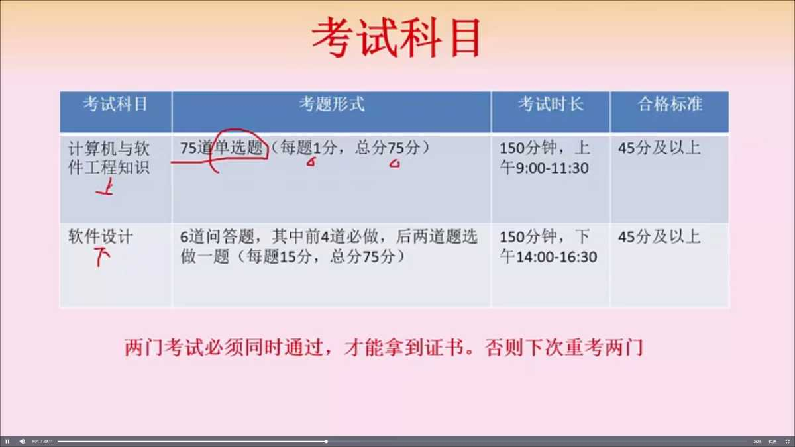
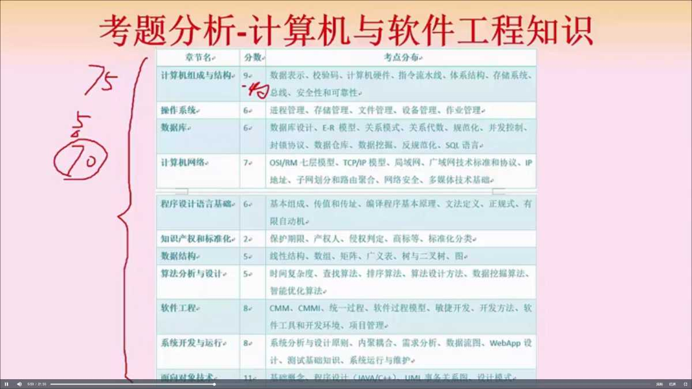

## 前言

博主最近报名了中级软考，自报名那天起正式开始了复习之旅，为期两个月

## 考试构成和目的

### 为啥要考

对在职程序员来说，先考个中级证书主要有这么几个用处

*   影响上海居住证积分
*   有个人所得税减免
*   简历上小加一笔

### 考试总纲

*   **计算机组成**
*   应用数学
*   计算机体系结构
*   **操作系统**
*   **数据结构**
*   计算机网络
*   C、C++/JAVA
*   **软件工程**
*   软件设计
*   信息化，安全性
*   英文资料阅读

### 试题结构

75 道单选+6道问答  重点是组成原理、软件工程、系统开发和面向对象，其次是网络、操作系统和数据库 

### 学习模式

看了一些参考资料，大概顺序就是先看视频理解考试重点，然后不停的从后往前刷真题，视频资料是淘宝买书送的，书未到，就可以开始视频+电子书的形式开始了 视频主要是讲重点、考点，很多细节都是给到算法然后不求甚解的，作为一名从业者可以理解的更深入一些，进而更容易理解以及得到更深的印象

## 总结

工作之后，对于软考这类资格考试还是有一些畏难情绪的，主要是会吞噬大量的业余时间，但估算了下自己的时间，特别是最近魔都疫情严重，居家办公上下班的通勤时间也被释放出来了，花一部分时间在这上面也值得。