## 前言

程序设计这一章节，主要是讲程序的基本组成、编译原理、知识产权、标准化

## 基本概念

### 编程语言的类型

解释和翻译

- 解释型：不生成可执行文件，由运行时**由解释器逐条解释执行**，运行时可以控制源程序，**执行速度慢，效率底**

- 翻译型：生成可执行文件，直接运行，**运行时无法干预源程序，速度快，效率高**

编译过程大概分为几个阶段

- 词法分析

- 语法分析

- 语义分析

- 中间代码生成（可选）

- 代码优化（可选）

- 最终代码生成

程序设计语言的组成：

- 语法（规则）

- 语义（含义）

- 语用（关系）

### 程序基本成分

数据成分：

- 数据和数据类型
  
  - 数据分常量、变量、局部量、全局量
  
  - 数据类型分整数、字符、单/双精度浮点、布尔、字符等

运算成分：

指明的运算符号和规则，算数运算、逻辑运算、关系运算、位运算

控制成分：

控制结构，顺序、循环、选择

传输成分：

指明允许的传输方式，赋值、输入输出等

函数：

**函数是程序运行的主要成分，包含定义、声明、调用**

传值/传址：

传值是拷贝值，函数内修改该值并不会造成原有值的改变，传址是拷贝一个地址，函数内修改该值会造成原有值的改变

实参：

实际参数，调用时传入的参数，可以是变量、常量、表达式、函数调用

形参：

形式参数，函数参数列表中的参数

## 编译原理

编译的目标是把高级程序翻译成目标程序（汇编、机器语言）

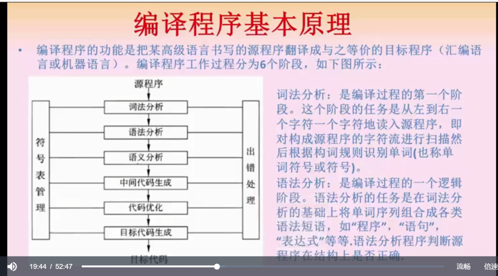

编译过程分为六个阶段

- 词法分析，顺序扫描，识别符号

- 语法分析，判断源程序在结构上是否正确

- 语义分析，进行上下文有关性质的审查，比如类型匹配等
  
  - 静态语义错误就在这个阶段
  
  - 动态语义错误在运行时才能发现

- 中间代码生成，只是根据语义生成的，因为目标代码需要根据机器不同做不同的处理，有一个中间代码可以方便移植有利于跨机器的实现
  
  - 后缀式
  
  - 三元式
  
  - 四元式
  
  - 树

- 代码优化

- 目标代码生成，简洁高效
  
  - 如何生成**较短**目标代码
  
  - 充分**利用寄存器**减少存储单元访问
  
  - 利用指令系统特点，提高代码质量

相关计算：

**掌握中缀式到后缀式，就是通过中缀还原树然后后缀式表达出来即可**，与二叉树部分的遍历类似，相关例题如下，正确答案是B

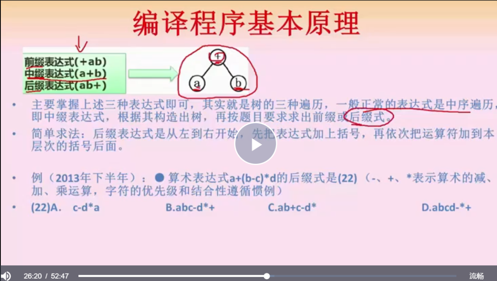

## 文法定义

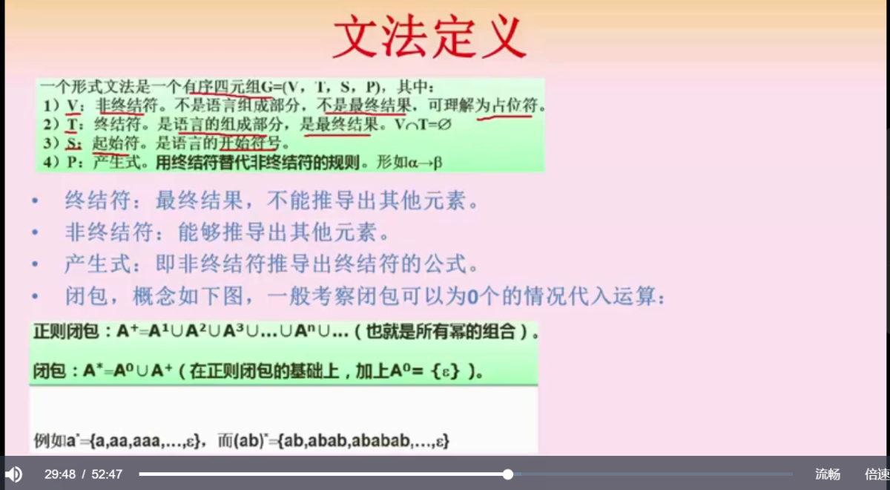

代码被解析抽象为文法，而文法在概念上是一个有序四元组 G = (V, T, S, P)

- V 非终结符

- T 终结符，最终结果

- S 启始符

- P 产生式

大概过程就是 S -> V（在 P 的作用下）->T 这么个过程

闭包只需要记住一个公式

正则闭包：(ab)+ = {ab, abab, ababab, ....}

闭包：(ab)* = {segma} ∪ (ab)+， 正则集合里边加上 {segma} 即可

比如这个例题，需要做的就是把 AB 带入文法，进而得到 S 的可能结果

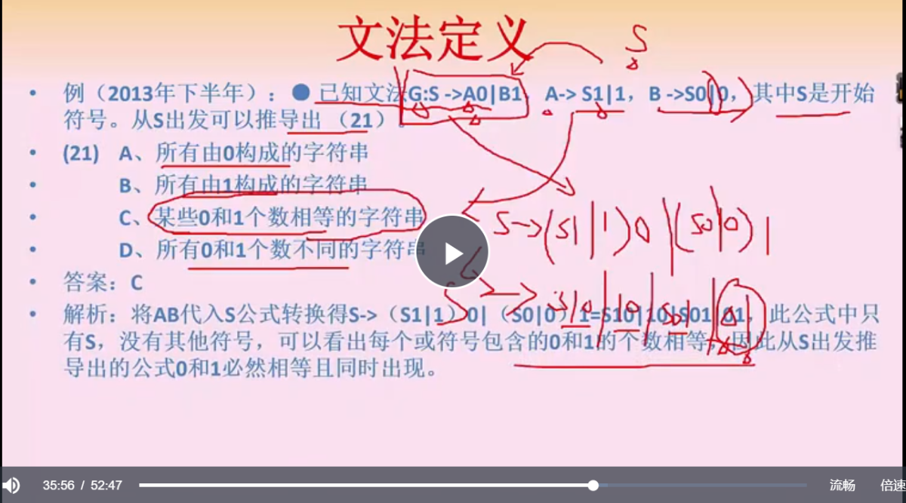

文法类型关键点：

上下文无关->语法

上下文有关->语义

所以这个例题应该选 B，上下文无关描述语法

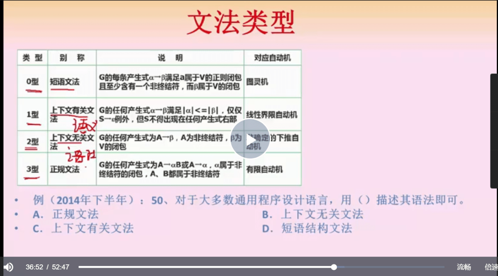

表达式到正规式的转换，一定要注意是**可逆的有充要性的转换**，能否通过有限自动机识别，就看里边有没有动态的不可确认的属性，有无终态即可。

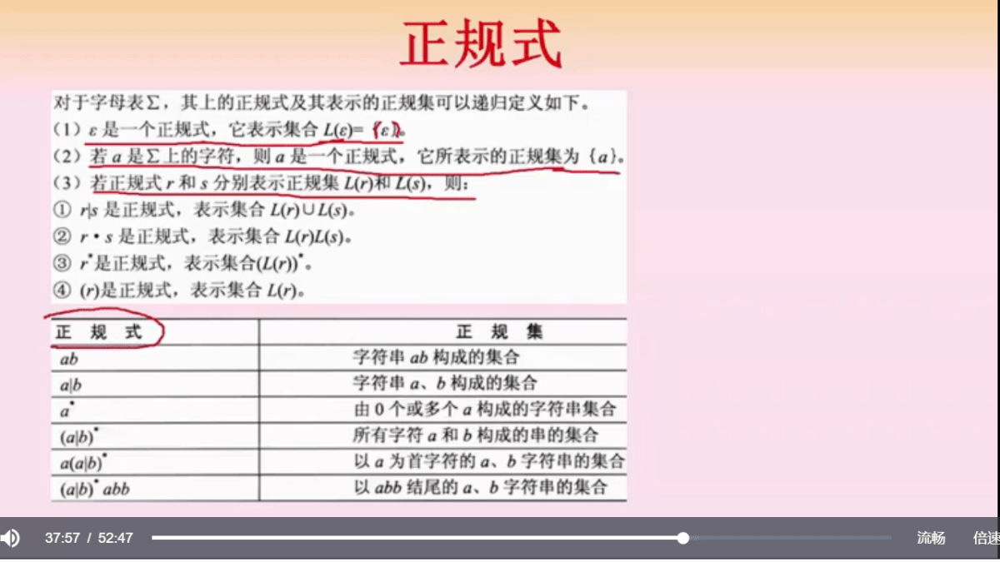

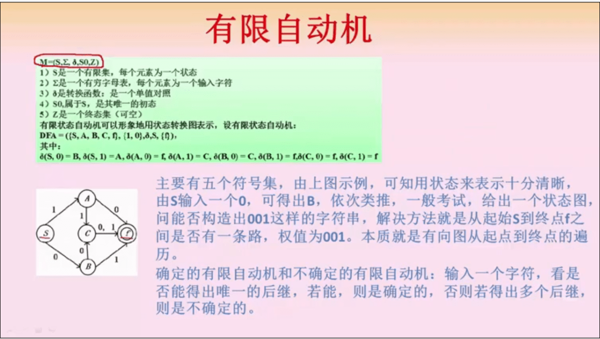

语法分析方法，两个重点

- 自上而下的分析，相当于从左到右的推导

- 自下而上的分析，相当于从右到左的规约

图内例题，移进-规约法是自下而上的分析方法，所以选 B

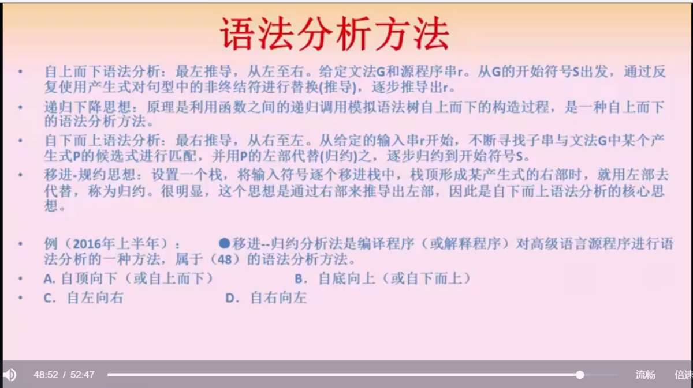

## 知识产权

保护期限重点

- 署名、修改等所属权力，没有限制

- 商业上的权利，50年（12月31日）

- 注册商标10年，需要续注

- 发明专利，20年，不可续注

- 实用新型+外观设计专利，10年

- 商业秘密，不确定

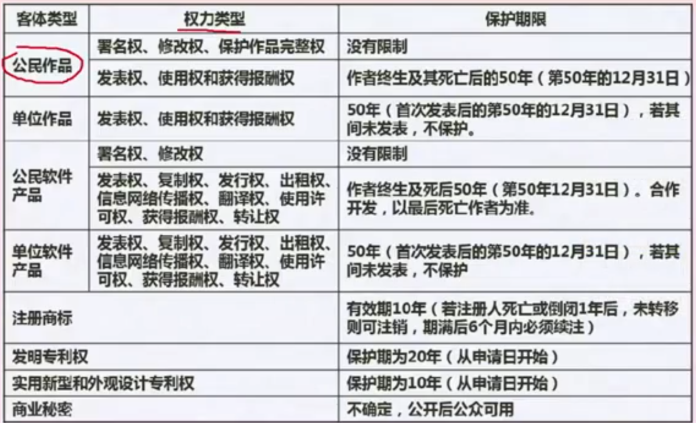

知识产权人重点

- **只有作品与单位一点关系没有，属于其他类别才享有著作权，否则权力都属于单位**

- 作品著作权受保护，使用的数学思想，算法思想不受保护

> 在程序员生涯中，有一点需要注意就是，供职于公司，哪怕业余时间开发的程序，著作权和专利权都是属于公司的，大名鼎鼎的 NGINX 就有这样的纠纷

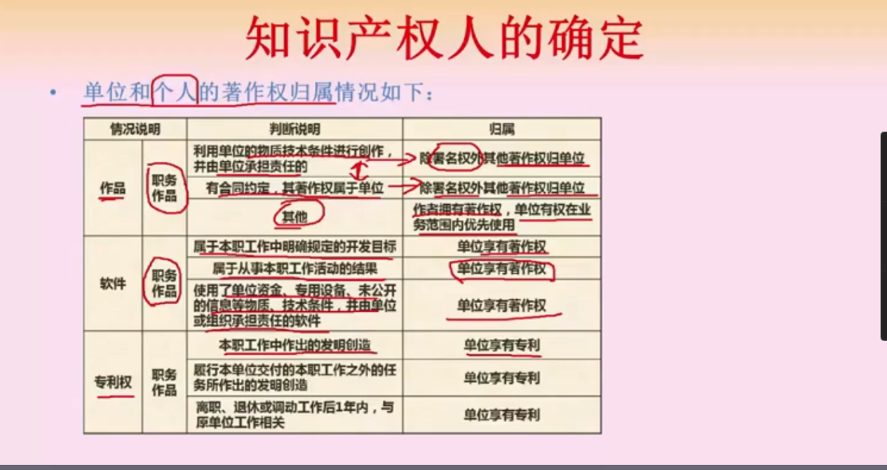

委托开发重点

委托开发合同不做申明，著作权默认属于创作方，有合同的时候，默认归属于单位（委托方）

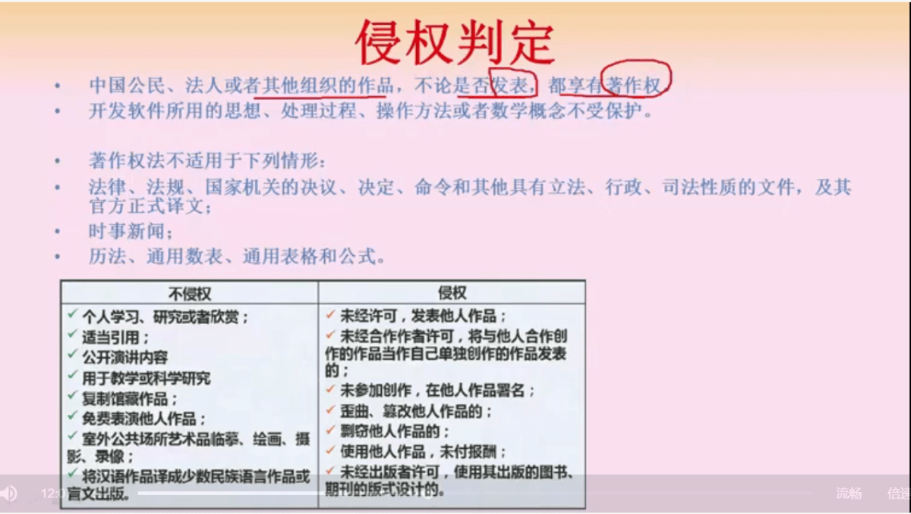

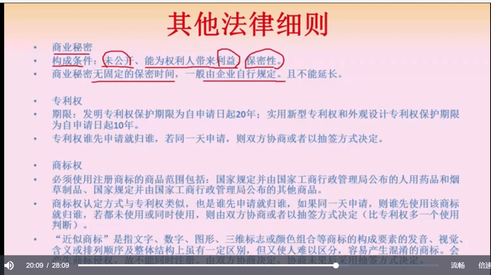

## 标准化

标准分类：

- 国际标准，ISO/IEC 等

- 国家标准，GB 中国，ANSI 美国，BS 英国，JIS 日本等

- 区域标准，PASC 太平洋地区标准

- 行业标准，GJB 中国军用标准

- 地方标准，地方一级机构制定的标准

- 企业标准

- 项目规范

国际标准组成：标准代号+专业类号+顺序号+年代号

我国标准组成：GB 强制国标，GB/T 推荐国标，GB/Z 指导国标

行业标准组成：一般是首拼，比如汽车 QC

地方标准组成：DB + 省级代码前两位

企业标准组成：Q/ 企业代号

## 总结

程序设计这一部分，概念比较多，对应考来说，理解题目的考察模式，结合自身经验进行理解即可，最后的产权、标准化，可作为尝试理解记忆。
