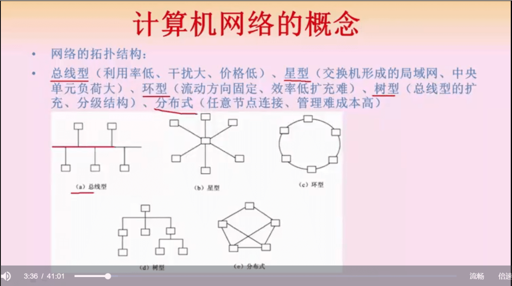
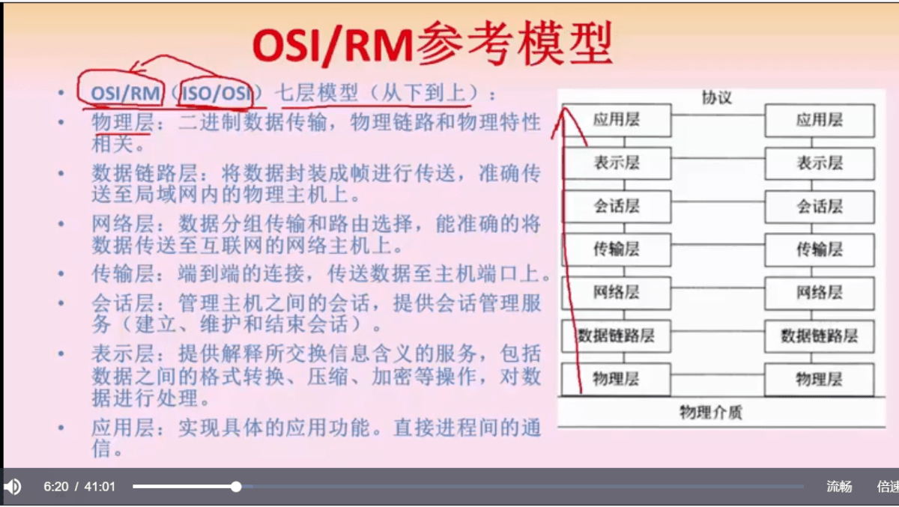
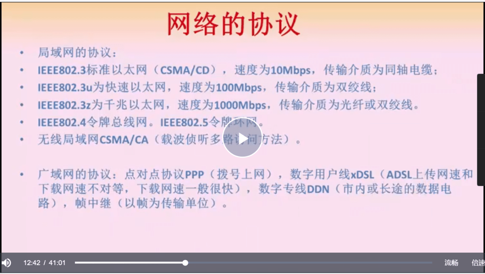
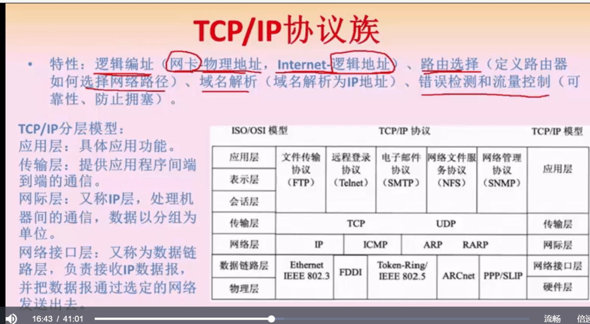
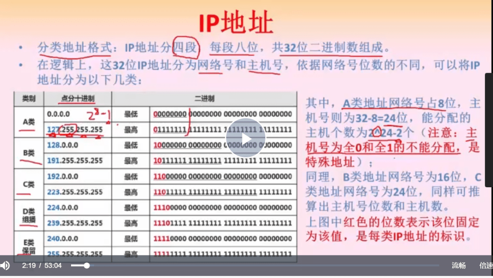
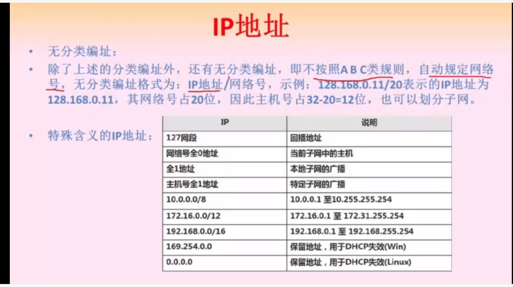
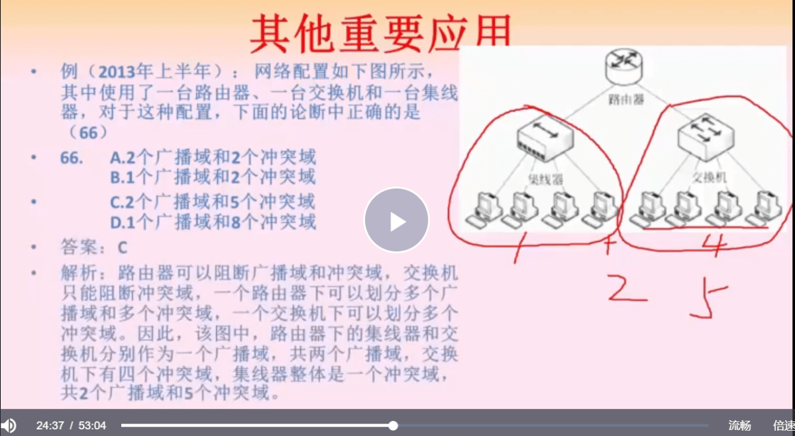
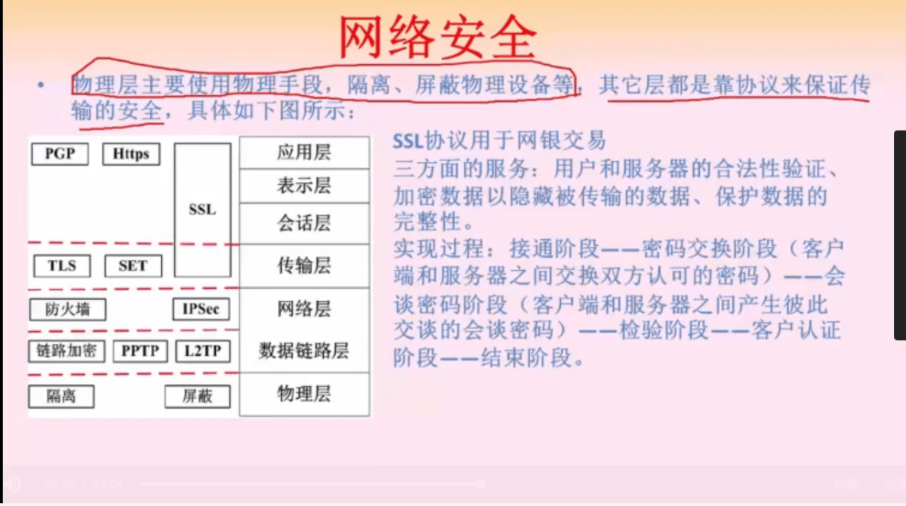
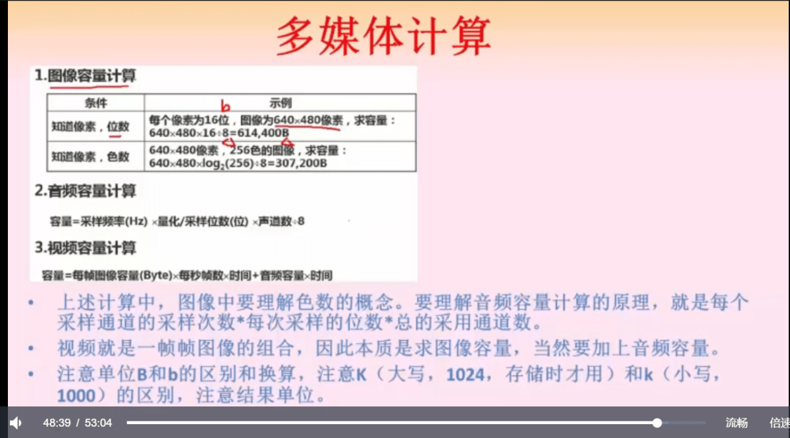
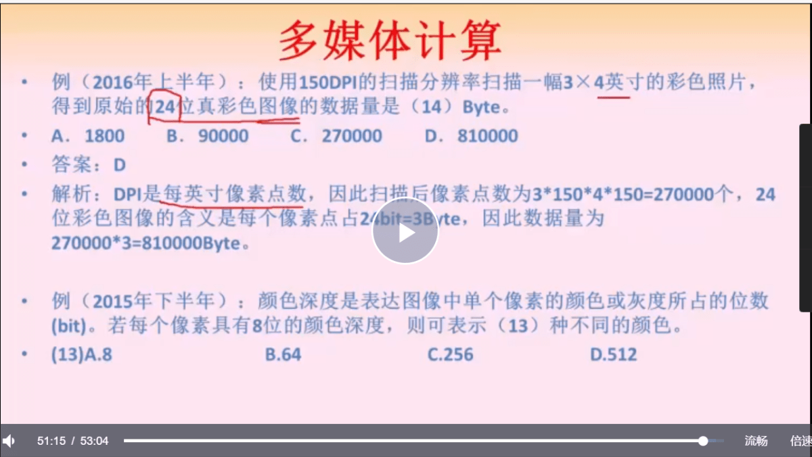

## 前言

### 章节大纲

网络概述

- 概念

- 分类

- 拓扑结构

- **OSI/RM 模型**

互联硬件

- 设备

- 传输介质

- 组网

网络协议

- 局域网协议

- 广域网协议

- **TCP/IP 协议族**

网络应用

- IP 地址

网络安全

- 安全协议

- 防火墙

- 病毒

多媒体

- 声音

- 图像

- **相关计算**

## 网络概述

网络的概念

- 数据通信

- 资源共享

- 负载

- 高可靠

局域网 LAN、城域网 MAN、广域网 WAN，距离越短，传输越快

拓扑结构

- 总线型

- 星型

- 环型

- 树型

- 分布式

### 【重点】OSI 七层模型

物理层，数据链路层，网络层，传输层，会话层，表示层，应用层

## 网络协议

网络协议标准（常识性的知识）

### 【重点】TCP/IP 协议族

#### TCP/IP 协议族的特性

- 逻辑编址（IP地址）

- 路由选择

- 域名解析

- 错误检测，流量控制

#### TCP/IP 分层模型

- **应用层，具体应用功能，对应 OSI 的三层**

- 传输层，端口到端口，对应 OSI 的传输层

- 网络层，对应 OSI 的网络层

- 网络接口层对应 OSI 数据链路层

网络层最重要的协议

- IP 协议

- ICMP 协议，确认存货

- ARP 和 RARP，分别对应 IP 转 mac 地址，mac 地址转 IP

传输层最重要的协议

- **TCP 可靠**，速度慢，有验证，三次握手四次挥手

- **UDP 不可靠**，实时性高，速度快

TCP 下最重要的协议

- **停止等待协议**，发送完一个分组后，等到对方确认后方可发送下一个分组

- 连续 ARQ 协议，维持了一个窗口，窗口内的多个分组可以一起发，然后到窗口内最后一个分组确认后再发下一堆分组

- **滑动窗口协议**，控制一次性发送多少报文，可加速传输且有利于流量控制

#### 应用层协议

基于 TCP 的 FTP/HTTP 都是可靠协议，基于 UDP 的 DHCP DNS 都是不可靠协议

基于 TCP

- FTP：文件传输协议

- HTTP、HTTPS

- SMTP 和 POP3，邮件传输协议

- Telnet 远程连接协议

基于 UDP

- TFTP 不可靠的小文件传输协议

- SNMP 简单网络管理协议

- DHCP 动态 IP 分配协议

- DNS 域名解析协议

##### DNS 的解析

- DNS 服务器，维持域名和 IP 的映射表

- 从下到上：本地域名服务器，权威域名服务器，顶级域名服务器，根域名服务器

查询顺序

- 查本地 DNS 缓存

- 查本地 DNS 服务器

- 然后递归查询上层 DNS 服务器

- 上层 DNS 服务器迭代查询直到查到结果

**查询分递归查询和迭代查询**

递归查询：被查询机器会自动按照层级查询，最后把结果应答客户端

迭代查询：被查询机器没有记录时，**返回其他层次的服务器地址，然后客户端再次向另一个服务器发起查询**

本机向本地域名服务器发起请求一般是递归，而本机域名服务器向其他域名服务器发起请求一般是迭代

## IP 和路由

### 路由选择策略

- 静态路由，只有固定的线路，不能找出最佳路由
  
  - 固定式路由选择，保持一个路由表，保存目的节点的下一跳，然后找到了直接转过去即可
  
  - 泛洪式，每次发包都给相邻的全部节点发消息，最先到达的肯定是走的最短路径，存起来下一次还走，适用于健壮性要求很高的场景
  
  - 随机式，随机抽一条转过去

- 动态路由，由网络状态决定
  
  - 分布式路由选择，距离向量算法和链路状态算法，前者周期性的朝相邻节点发报文以动态刷新路由表，后者各节点独立计算最佳通路，需要做的通信少，但逻辑复杂
  
  - 集中式路由选择，网络中心算好最佳路由后，定期同步到每一个节点
  
  - 混合式动态路由选择，多种路由混合使用

### IP

IPV4 点分十进制表示法，分网络号和主机号

主机个数计算的时候需要注意，全0和全1是不能分配的，所以公式是 2^n -2，其中 n 为主机位数

四个分类

- A 类，8位网络号，其中1位固定

- B类，16位网络号，其中2位固定

- C类，24位网络号，其中3位固定

- D类，多播地址，前缀 1110

- E类，保留地址，前缀 1111

而且 A/B/C 类网络的网络号前几位都是固定的，避免网络号重合的问题

主机号里边划拉出来一部分子网号，将一个完整网络分为不同的子网，网络号和子网号都为1，主机号都为0，这就是子网掩码。

同样，把网络号的几位作为主机号就成为了一个更大的网络，这叫超网，虽然不知道这是怎么解决 IP 冲突的。

### 层次化网络模型

网络模型分三层

- 接入层，功能单一，仅供接入

- 汇聚层，网络访问策略，数据包过滤，寻址等等操作

- 核心层，功能单一，只负责数据交换

NAT 转换

- 仅需要少量 IP 访问互联网，但内部所有主机都可通过少量外网 IP 访问互联网

- 大量地址映射到少量的外网IP，这个过程就叫 NAT 转换

默认网关

机器找不到 IP 对应的 mac 地址，就会把数据发往默认网关，默认网关必须跟本机 IP 处于同一网段下

冲突域和广播域

- 冲突域，一个普通二层交换机下同时只能有一个设备发送和接受消息，因为通信通道同时只能给一个设备用

- 广播域，指网络中可接受到同网络下任意设备发出数据的设备集合

什么是冲突域和广播域：[blog.csdn.net](https://blog.csdn.net/cwl421/article/details/49639399?msclkid=a6e8a77ab0ac11ecb184c466e0d418d1)

路由器可以划分广播域和冲突域，虚拟机只能划分冲突域，集线器不能划分冲突域/广播域（重点）

VLAN，虚拟局域网，基于路由器实现不同局域网下冲突域和广播域的隔离，能有效提高转发性能

VPN，可通过网络或其他非物理链路直连的方式，安全的访问网络内部资源。

#### 一个例题

## 网络

不同网络层次有不同的安全控制手段

- 物理层：隔离和屏蔽

- 数据链路层：链路加密 PPTP、L2TP

- 网络层：防火墙、IPSEC

- 传输层：TLS、SET

- 会话层、表示层、应用层：HTTPS

跨越传输层、会话层、表示层、应用层的安全控制手段是 SSL，SSL 的过程大概分为如下几步

- 接通阶段

- 交换对称加密密码阶段（用非对称加密的方式确保安全）

- 会谈密码阶段，双方认可此密码（发一条消息双方加解密即可）

- 检验阶段

- 客户认证阶段

防火墙，参考资料：[www.docin.com](https://www.docin.com/p-827926767.html)

- 网络级，层次低，效率高

- 应用级，层次高，效率低，会拆开包检查
  
  - **被屏蔽子网方案**，内网所有机器网络通信都强制经过一个屏蔽子网，也就一定会被防火墙过滤，这层网络叫 DMZ（非军事区）
  
  - 双宿主机网关，防火墙拥有对内和对外的两个网卡，设备的网关设为防火墙，所有数据一定要通过防火墙机器才能发出和接收
  
  - 屏蔽主机网关，顾名思义，网关就是防火墙的地址
    
    - 单宿堡垒主机，防火墙只需要一个网卡，只需要保证所有机器的网关指向防火墙，路由器也只将外部回传的数据转发给防火墙即可
    
    - 双宿堡垒主机，防火墙拥有对内和对外的两个网卡，所有数据一定要通过防火墙机器才能发出和接收

病毒和木马

- 病毒主要是破坏计算机功能和数据的，能够自我复制的一串代码或程序
  
  - 具有传染性，隐蔽性，潜伏性，破坏性，针对性，衍生性，寄生性，未知性

- 木马一般用于监控、窃取数据

## 多媒体

多媒体的分类：

- 感觉媒体，直接作用于人的器官，听觉，触觉等等

- 表示媒体，传输感觉的中介媒体，就是数据的编码，比如图像声音的编码

- 表现媒体，进行输入输出的媒体

- 存储媒体，存储介质，内存，硬盘等

- 传输媒体，网线，光纤等

### 声音

以声音的带宽衡量声音的大小，单位 HZ，从模拟信号转为数字信号有三个步骤

- 采样

- 量化

- 编码

人耳能听到的声音在 20Hz ~ 20KHz 之间

一般来说，采样频率为声音最高频率的两倍才能不失真

未经压缩传输率计算公式：

传输率(bps) = 采样频率(Hz) * 量化位数(bit) * 声道数

数字调频合成法 FM，可合成电子模拟音

波表合成法 WaveTable，记录所有真实乐器能发出的所有声音，存为波表文件，然后合成并加工回放

#### 声音的特性

音量：响度，强弱程度，由振幅决定

音高：音量的高低，取决于声波震动频率，频率越高音越高

音调：调子的高低，声音本身的频率而定

音色：也称音品

### 图像

#### 颜色三要素

亮度：颜色明暗深浅程度

色调：偏红还是偏绿，颜色分类

饱和度：某颜色的深浅程度

#### 彩色空间

一般显示器使用 RGB 彩色空间，除了红黄蓝三原色，其他色都是三原色叠加形成

电视使用 YUV 色彩空间，主要为了兼容黑白电视，不同的亮度显示不同的颜色

印刷使用 CMY，用和 RGB 相反的减法原理

HSV，按照艺术角度划分的色彩

图像属性：分辨率（单位 dpi）、像素深度（存储每个像素用的二进制数，单位 bit）

水平分辨率：横向具有的像素点数量

垂直分辨率：纵向具有的像素点数量

#### 矢量图和位图

矢量图的基本组成单元是图元，位图的基本组成单位是像素，视频和动画的基本组成单元式帧。

计算的时候注意单位，DPI 表示单位英寸像素点数，分水平和垂直，截图的题只告诉 150 dpi，意思是水平和垂直都为 150

#### ISO 标准

MPEG 是 Moving Picture Expert Group 简称，1/2/4 是音视频编码，7是多媒体内容描述接口标准，21是多媒体应用框架标准。

VCD 用的 MPEG-1

DVD 用的 MPEG-2

## 总结

网络是一个比较重点的部分，需要重点理解里边的协议、TCP/IP协议簇、IP和子网等等，多媒体部分的知识点主要是常识和概念性的东西。
