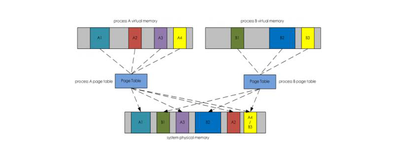

## 前言

日常工作生活中，总是会遇到查看Linux内某进程占用内存的场景，但打开 `top` 或 `htop` 就会看到内存栏其实被分为了三个指标：VIRT、RES、SHR，分别代表 虚拟内存（Virtual Memory）、驻留内存（Resident Memory）、共享内存（Share Memory）

```bash
进程号 USER      PR  NI    VIRT    RES    SHR    %CPU  %MEM     TIME+ COMMAND
 837833 root      20   0  722628  22684  13948 S   4.3   0.1   6:22.89 aliyunpan
```

本篇博客会尝试通过一张参考图讲清这三者之间的关系和用途

## 几种内存概念



随后会根据上图两个进程的内存占用图做具体的分析

### 虚拟内存

虚拟内存是一个逻辑意义上的内存空间，程序运行过程中需要被访问到的部分会映射到实际的物理内存空间中。

**虚拟内存较大只能表示程序运行时的可访问空间大**，不代表真实内存的空间占用。

在上图中：

- A进程的 A1+A2+A3+A4+灰色部分=A进程虚拟内存大小

- B进程的 B1+B2+B3+灰色部分=B进程虚拟内存大小

每个进程都有一个**内存页映射表**，用于存放虚拟内存=>物理内存的映射关系

### 共享内存

不同进程依赖的同一部分内存，比如多个程序依赖同一个动态库（.so），**这些动态库的内存在系统中只保留一份，在进程需要使用时动态的映射到进程的虚拟内存空间中**（使用上面提到的内存页映射表）。

在上图中：

- A 进程的 A4 = A 进程共享内存

- B 进程的 B3 = B 进程共享内存

### 驻留内存

顾名思义，程序实际在物理内存中驻留使用的内存，一般看进程的内存占用就看这个指标，值得注意的是，这里是包括共享内存的。

在上图中：

- A 进程的 A1+A2+A3+A4 = A进程的驻留内存

- B 进程的 B1+B2+B3 = B进程的驻留内存

## 总结

虚拟内存是逻辑内存空间，通过页映射表与物理内存空间对应；共享内存是不同进程间的相同依赖；驻留内存是进程实际使用的部分内存。
