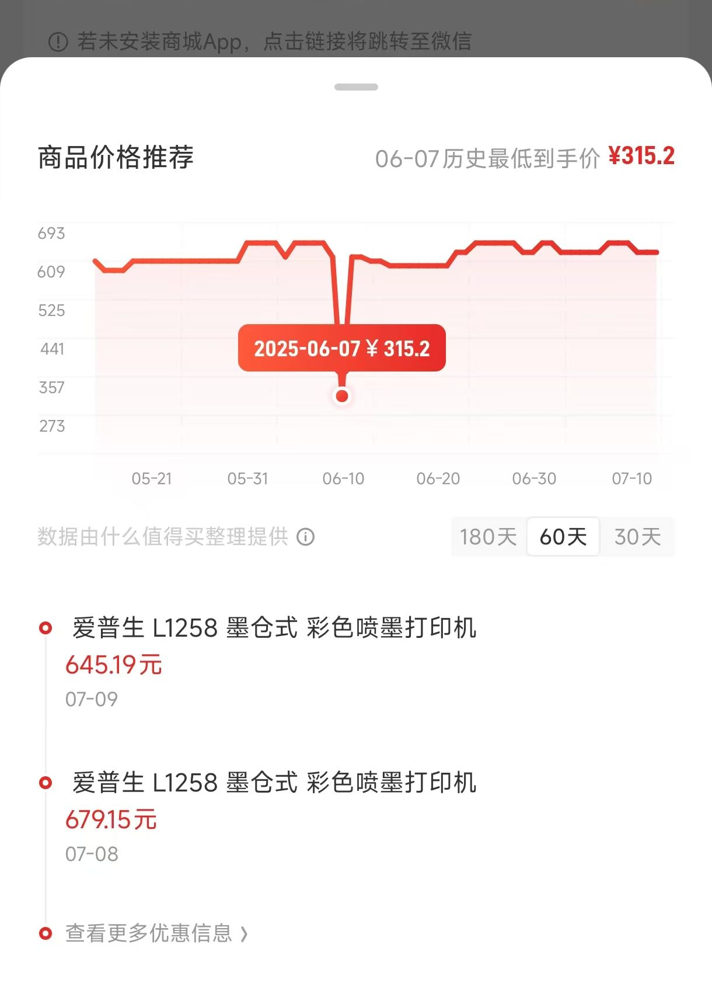
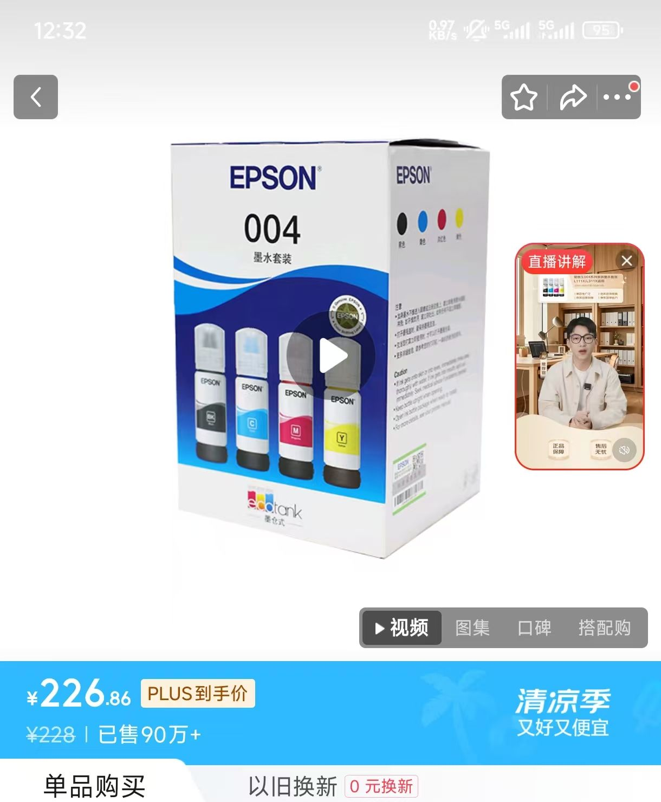

## 前言

本来平时对打印机是没什么需求的，这不最近想打印一批照片，做一面照片墙教小朋友认识亲属，还为了以后可以给孩子打印一些 DIY 绘本，就动了买个打印机的念头

​

这次需求很明确：

- 可以**彩打照片，质量不能太差**
- 可以彩打 DIY 绘本
- **塑封膜要软**一点的
- 未来可能打印练字帖等场景
- 重点：**耗材成本不能比电商冲印高（不超过每张￥0.59）** ，机器成本千元左右可接受

## 机器

因为首先比较关注的是照片质量，所以先针对照片打印的场景让 AI 帮我总结了一下现阶段打印机分类和二手购买的注意事项，目前主流的家用照片打印机分为三大类：**喷墨照片打印机**、**热升华照片打印机** 和 **ZINK无墨打印机**

|项目|**喷墨照片打印机 (Inkjet Photo Printer)**|**热升华照片打印机 (Dye-Sublimation Printer)**|**ZINK 无墨打印机 (ZINK Zero Ink Printer)**|
| ------| ------------------------------------------------------------------------------------------------------------------------------------------------------------| ----------------------------------------------------------------------------------------------------------------------------------------------------------------------------------------| -----------------------------------------------------------------------------------------------------------------------------------------------------------|
|**主要特点**|**画质上限高**：色彩还原精准，分辨率高，细节表现力最强。 **尺寸/纸张灵活**：可打印从A6到A4甚至更大尺寸，支持光面、绒面、艺术纸等多种介质。 **功能多样**：通常集打印、复印、扫描于一体（一体机）。 |**照片质感好**：打印成品有覆膜，防水防指纹，色彩过渡自然，没有墨点，观感类似传统冲印照片。 **成本固定**：耗材（相纸+色带）打包售卖，单张成本非常明确。 **便携小巧**：多为小型便携设计，专注于打印标准尺寸照片（如6寸）。 |**极致便携**：体积最小，通常和充电宝差不多大，可随身携带。 **无需墨水**：耗材只有ZINK相纸，使用简单。 **即时趣味**：打印出来的照片通常自带背胶，可以当贴纸用，适合手账和派对。 |
|**工作原理**|通过打印头上的微小喷嘴，将液态墨水点喷射到纸张上形成图像。墨水颜色越多（如6色、8色），色彩过渡和表现力越好。|使用一个含有青(C)、品红(M)、黄(Y)三色染料的色带。打印头通过精确加热，使色带上的固态染料直接升华为气体，渗透到专用相纸表层，最后再覆盖一层保护膜。|“ZINK”意为“Zero Ink”（零墨水）。其秘密在于专用相纸，纸张内含有无色的染料晶体。打印机通过精确的脉冲加热，激活相纸内的晶体，使其显现出相应的颜色。|
|**耗材与单张成本**|**耗材**：墨盒/墨水、照片纸。 **成本**：波动较大。  **墨仓式**：单张成本较低，约 **¥0.1** ~  **￥0.4**(6寸)。  **墨盒式**：单张成本差不多，看具体型号。 |**耗材**：专用的“相纸+色带”套装。 **成本**：非常稳定，单张成本约 **¥1 - ¥3** (6寸) **（看具体型号）** 。 |**耗材**：专用的ZINK相纸。 **成本**：相对较高，一张2x3英寸的小照片约 **¥2 - ¥4（看具体型号）**  |
|**适合人群**|对照片画质有较高要求的摄影爱好者。 希望打印不同尺寸、不同材质照片的用户。 需要兼顾文档打印的家庭用户。 |追求方便、快捷，希望照片能长久保存的家庭用户。 主要用于记录生活、制作旅行相册。 “懒人”首选，无需担心堵头等维护问题。 |手账爱好者、年轻用户、派对达人。 追求即时打印、即时分享的乐趣。 对画质要求不高，便携性是第一位的用户。 |
|**代表品牌/型号**|**佳能(Canon)** ：TS系列（如TS8380）、G系列（G580/G680）。 **爱普生(Epson)** ：L系列（如L805/L1800）。 |**佳能(Canon)** ：SELPHY CP系列（如CP1300, CP1500）是绝对的主流。 **小米/汉印**等也有类似产品。 |**小米/华为/惠普(HP)/宝丽来(Polaroid)**  等品牌都有推出。|
|**购买二手核心注意事项**| **【致命问题】喷头堵塞！** 是二手喷墨打印机最大的风险。 **务必索要“喷嘴检查”测试页的打印照片或视频**，确保所有颜色的线条都完整无断线。 优先选择**墨仓式**机型，前任用户使用成本低，打印频率可能更高，堵头风险相对小。 询问**废墨垫/维护箱**的使用寿命。 | **【核心检查】打印头**。 让卖家打印一张纯色（或色彩丰富的）照片，检查照片上是否有**规律性的白色细线**，这通常意味着打印头发热元件损坏，无法修复。 检查机器外观、进纸滚轮等物理结构是否完好。 | **【核心检查】电池健康度**。 这类打印机多为内置电池，询问卖家电池续航情况，充满电大概能打多少张。 打印一张照片，检查加热是否均匀，有无明显的色块或条纹。 检查APP连接是否顺畅。 |

> 注：根据 AI 和实际调查，都不推荐用激光打印机彩打照片，这是因为激光的原理是把碳粉静电吸附到纸上，再高温加热融化固定，打印颗粒感会比较强，色彩真实性差，而且纸张兼容性等方面也不如喷墨，但维护成本低，打印成本低，家用也蛮合适的。

|**特性**|**激光打印机**|**墨仓式喷墨打印机**|
| ------| --------------------------| ----------------------|
|**照片打印质量**|较差，颗粒感强，色彩失真|**极佳**，色彩鲜艳，细节丰富|
|**文档打印质量**|**极佳**，文字锐利，防水|优秀，文字清晰|
|**打印速度（文档）**|**快**|适中|
|**单页打印成本**|较低|**极低**|
|**机器购买成本**|中等到高|中等|
|**照片纸兼容性**|差|**极佳**|
|**核心优势**|打印文档速度快、文字锐利|**照片质量高、综合成本低**|

综合考虑后，还是喷墨比较适合我，**成本低、效果好，就是得每周打印一次避免堵头**，后面可以每周打印测试页或者打印一张本周最佳照片留念。
‍
确认品类之后开始找产品，AI 推荐了我三个产品：爱普生墨仓系列、佳能加墨式系列、惠普连供系列

由于追求性价比再加上**二手打印机的搬运和检查成本较高**，就先去京东找到了符合需求的三个候选型号，墨水成本看起来差不多，官方墨水都在两百多

|**品牌**|**型号**|**价格**|**备注**|
| --------| -------| ------------------------------| ---------------------------------------------------------|
|爱普生|L1285|京东自营 ￥503（咸鱼￥379）|四色染料墨水，无扫描仪（可用 APP 扫描代替），无自动双面|
|佳能|G3800|京东自营￥479.2（咸鱼￥320）|四色染料墨水，带扫描仪|
|惠普|215|京东自营￥559（咸鱼￥450）|四色染料墨水，无扫描仪|

调查了一下，因为存在专利壁垒，**惠普和佳能的喷头都是热发泡技术，爱普生和兄弟是微压电技术**，目的都是让墨滴从喷头喷射到纸张上进行染色，只是实现方式和效果侧重有不少差别，但我想都是较为成熟的技术，推测在低端机上各有所长，影响并不明显。

​

|**特性**|**热发泡技术 (Thermal Bubble Jet)**|**微压电技术 (Micro Piezo)**|
| ------| ---------------------------------| --------------------------------------|
|**代表品牌**|佳能 (Canon)、惠普 (HP)|爱普生 (Epson)|
|**工作原理**|加热墨水产生气泡，喷射墨滴|对压电晶体施加电压，使其变形挤出墨滴|
|**墨滴控制**|较好|**极佳**，可控制墨滴大小和形状|
|**喷头结构**|通常为消耗品（与墨盒一体）|**永久性部件**（与机身一体）|
|**喷头寿命**|较短|**很长**|
|**堵头处理**|简单，更换墨盒即可|麻烦，需清洗，严重则需专业维修|
|**墨水兼容性**|一般，墨水需耐高温|**极强**，对墨水化学性质要求宽泛|
|**制造成本**|较低|较高|

考虑最终打印效果、稳定性、维保成本等因素，还是觉得爱普生的墨仓系列适合我。

​

‍
爱普生有两款让我特别心动，一款是 L1258 因为性价比高，另一款是 L8058 因为打印质量和可打印纸的范围都比较好

|**特性**|**爱普生 L1258（￥503）**|**爱普生 L8058（￥2199）**|**备注**|
| ------| ----------------------------| ------------------------------| ------------------------------------------------|
|**产品定位**|**家用打印机**|**专业级照片打印机**|**这是最核心的区别**|
|**墨水系统**|**4色染料墨水 (CMYK)**|**6色染料墨水 (CMYK, LC, LM)**|都是染料墨，L8058 色彩过渡更平滑，照片质量更高|
|**核心功能**|**仅打印，最大A4**|**仅打印，最大A4**||
|**介质支持**|普通纸、信封、普通照片纸|专业照片纸 (更厚)、**PVC卡片**、**光盘盘面**|L8058 的介质兼容性更好|
|**照片质量**|日常可用，色彩过渡有颗粒感|**专业水准**，色彩细腻平滑|追求照片品质，必选 L8058|
|**文档打印**|优秀，速度较快|可以，但不是强项|L1258 更适合大量打印文档|
|**连接方式**|USB, Wi-Fi, Wi-Fi Direct|USB, Wi-Fi, Wi-Fi Direct|两者现代连接方式都支持|
|**机身与价格**|机身小巧，价格更亲民|机身较大，价格更高||
|**适用人群**|学生、家庭用户、小型办公室|**摄影爱好者**、设计师、小型影楼、手账达人|需求决定选择|

‍

至于染料墨水和颜料墨水，我自己觉得家用场景中没什么特别大的区别，主要是在防水性上有差异，但这可以用过塑来解决，我看**网上有换国产颜料墨水堵头的情况**，大家慎重。

|**特性**|**染料墨水 (Dye Ink)**|**颜料墨水 (Pigment Ink)**|**通俗解释**|
| ------| ------------------------| ------------------------------| --------------------------------------------------------------------------------|
|**成分原理**|分子级，完全溶解|微小固体颗粒，悬浮|**糖水 vs 泥水**|
|**打印原理**|**渗透**到纸张纤维内部进行染色|**附着**在纸张表面形成涂层|**染色 vs 上漆**|
|**色彩表现**|**色彩鲜艳、通透**，色域更广|色彩沉稳、厚重，饱和度略低|糖水是透明的，光能穿透，所以颜色亮丽；泥沙是不透明的，覆盖力强，颜色更扎实。|
|**防水性能**|**不防水**，遇水会晕开|**防水**，墨迹基本不受影响|糖水干了再遇水，糖会再次溶解；而泥沙干了变成泥块，再浇水也不会轻易化开。|
|**耐光/持久性**|**较差**，在光照下容易褪色|**极佳**，能长久保存，抗紫外线能力强|染料分子结构容易被紫外线破坏而分解；颜料的固体颗粒结构稳定，不易分解。|
|**适用介质**|在**光面/高光照片纸**上表现绝佳|在**普通纸、亚光纸、艺术纸**上表现出色|染料渗透进光面纸的涂层，色彩通透；颜料附着在亚光纸粗糙表面，文字锐利，质感好。|
|**堵头风险**|风险较低，因为是溶液|风险相对较高，因为有固体颗粒|糖水不容易堵塞管道；但泥沙放久了会沉淀，可能堵塞管道。|
|**成本**|相对**便宜**|相对**昂贵**|生产工艺和原材料决定了价格。|

考虑到价格和需求，￥2199 的 L8058 确实效果很赞，打印速度还快，但就目前需求来说，L1258 看起来也足够了。如果后面对打照片、材料介质要求更高时，再考虑升级到能打 A3 的 L18058 也不迟，毕竟 L1258 价格如此低廉，哪怕最后**真吃灰了也亏不到哪去**。
‍

所以最终下单了爱普生的 L1285，这是爱普生目前在售最便宜的机型，送一套原装 004 墨水，性价比很高。

> 注：25年7月上海国补后 ￥503，618 期间还出现过 ￥315 的神价，可惜错过了，真是拍大腿。

​

拆箱之后比想象中的轻，占地空间也还好，比横放的 PS5 普通版长一点点

​

## 耗材选择

### 墨水

墨水从稳定性和效果出发还是选官方的 004 系列，京东价格 ￥226

​

### 相片纸

相片纸的核心区别在于两大要素：**基材**（决定了纸张的物理特性和耐久性）和**表面涂层**（决定了视觉效果和触感）。

**核心区别：基材 (Base Material)**

1. **RC 基材 (Resin-Coated / 树脂涂层)** : 专业级相纸的基础。它是在纸芯两面都覆盖了树脂（塑料）层，使其**防水、厚实、稳定**，不易卷曲。这是高品质输出的保证。
2. **纸基 (Paper Base)** : 消费级相纸的基础。基材就是普通纸，表面有吸墨涂层。**不防水**，耐久性较差，成本低。
3. **艺术纸基 (Fine Art Base)** : 收藏级相纸的基础。通常由棉绒或α-纤维素制成，无酸，有纹理，为实现**艺术感和长期保存**而设计。

|类型|表面光泽|色彩与细节表现|抗指纹性|核心用途|
| -----------------------| --------------------| --------------------------| ----------| --------------------------|
|**RC 高光** (RC Glossy)|镜面高光，反光强|色彩最鲜艳，细节最锐利|差|风光、商业、强视觉冲击力|
|**RC 绒面/绸面** (RC Luster/Satin)|低调光泽，细腻纹理|色彩浓郁，肤色自然|极佳|**人像、婚纱、专业展览（首选）**|
|**哑光** (Matte)|完全无光泽|色彩柔和沉稳，艺术感强|极佳|黑白、艺术作品、装裱展示|
|**普通高光** (Cast-Coated Glossy)|高光，质感普通|色彩鲜艳，但层次感弱于RC|较差|日常快照、低成本打印|
|**艺术纸** (Fine Art Paper)|无光泽，有明显纹理|色彩层次丰富，质感独特|极佳|艺术品复制、收藏级输出|

‍
官方 255g 6寸 RC 相纸听说效果特别好，但着实有点贵了，**单张相纸成本直接打到 ￥0.58，四色打印机有点不配**。

​

之前网上清洗照片用过乐凯的相纸，网上再看了下相纸对比测试，感觉这家品质还不错。

于是京东找了乐凯 180g（￥0.08）/ 200g（￥0.13） 的 6寸高光相片纸，四色打印机本就不适合打印太厚的纸，买这个够用了。

​

> 注：因为绒面相纸有时候影响锐度，所以冲印时个人更喜欢光面的，但发现目前状态下打印机性能才是影响效果的瓶颈，所以后面我可能两种纸都买，视题材而定，尽可能发挥出来打印机的色彩性能。

打印设置：

- 高质量光泽纸
- 自动优化开（提亮了一点点）

相比手机屏幕效果有点偏白偏灰，色彩层次等细节确实差远了，不过整体质量属于可以接受范围内。

​

> 注：由于打印机的原因，光面纸会残留轱辘印，斜着看比较明显，不影响整体感官，强迫症慎入，听说绒面会好很多。

### 塑封

塑封照片分为冷裱和热裱，**冷裱膜一般较软可以手动操作**；热裱有不同厚度规格，**热裱一定要用覆膜机**（按理说卷发棒也能行，就是操作起来麻烦点）

塑封机的技术含量不高，我是京东花了￥58 随便选的，原理是加热到指定温度后，滚轮把照片往后拉，塑封膜的热粘胶就会粘合到一起

​

“丝”是中国工业生产中一个非常常用的非标准长度单位，专门用来表示**厚度**。

- **1 丝**  **=**  **0.01 毫米 (mm)**
- **100 丝**  **=**  **1 毫米 (mm)**

| 厚度 (丝) | 标准厚度 (mm / μm)    | 硬度与手感     | 核心特点                 | 适用场景                                   |
| ----------- | ------------------------ | ---------------- | -------------------------- | -------------------------------------------- |
| **5-6 丝**          | 0.05-0.06mm / 50-60μm | **柔软**，可轻松弯曲   | 最薄软，基础保护，成本低 | 不常翻阅的文档、存档资料、追求柔软度的场合 |
| **7-8 丝**          | 0.07-0.08mm / 70-80μm | **软硬适中**，有一定挺度   | **最通用/万能选择**，性价比最高             | **照片**、日常文件、奖状、海报、儿童涂鸦           |
| **10 丝**          | 0.10mm / 100μm        | **硬挺**，不易弯折     | 加强保护，耐用性好       | **菜单**、价目表、教学卡片、游戏道具、常用资料     |
| **12 丝+**          | ≥0.12mm / ≥120μm    | **非常坚硬**，类似塑料卡片 | 卡片级硬度，极度耐磨     | **自制证件卡**、胸牌、会员卡、设备操作牌                 |

在塑封膜的选择上，因为家里有宝宝，担心孩子拿着照片玩划伤自己，所以选了**带倒角**的 8丝（单张 ￥0.1）和 5.5丝（单张￥0.08）的塑封膜，后者明显更软。

​

塑封膜的品牌是千帆，看网上说这家厂专注塑封膜做了挺久，蛮不错的国产品牌。

​

购买时发现很多机器说明书上都说不支持 5.5 丝塑封，但我看 5.5 丝和 8 丝塑封膜的温度范围是一样的，所以都买来试了下，塑封效果正常。

塑封后效果如下

​

> 小贴士：如果发现封完有点卷边或者弯曲，可能是塑封机的温度过高了，小红书上有个办法是底部垫一张普通纸让塑封温度低一点

### 绘本打印

喷墨打印机也挺适合做绘本和纸盒模型的，图2是小红书上有人用 160g 的铜版纸做的，问了一下说不算很脆皮。

​

绘本会用到的常见纸张类型和特点如下：

|特性|**光面铜版纸 (Glossy Coated Paper)**|**双喷纸 (Double-sided Inkjet Paper)**|**双胶纸 (Uncoated / Offset Paper)**|
| ------| ----------------------------------| ----------------------------------| --------------------------------|
|**核心特点**|表面有涂层，光滑亮丽，专为印刷|表面有特殊涂层，为喷墨打印优化|表面无涂层，质感自然，适合书写|
|**表面处理**|双面涂布高岭土等，并经过压光处理|双面有为吸收墨水设计的特殊涂层|仅施胶处理，无额外涂层|
|**光泽度**|高光泽，反光明显|通常为哑光，不反光|无光泽，表面粗糙|
|**手感**|非常光滑，甚至有点滑手|比较平滑，但不滑手，有一定质感|略带粗糙感，有纸张的天然质感|
|**适用打印**|**胶印/激光打印**（不适合喷墨）|**喷墨打印**（不适合激光）|**胶印/激光/喷墨/书写**均可|
|**打印效果**|色彩鲜艳饱和，图像清晰锐利|图像清晰，色彩还原好，无洇墨现象|色彩偏沉稳、柔和，有文艺感|
|**主要用途**|宣传画册、杂志、海报、传单|高质量标书、效果图、个人作品集|书籍内页、笔记本、文件、信纸|
|**常见别称**|铜版纸、铜板纸、C2S Art Paper|彩喷纸、喷墨打印纸|胶版纸、道林纸、书写纸、影印纸|

扒了 PDD 上某商家的纸质说明，调查了类似的四色打印机可以打印 160g 以内的双面铜版纸，140g 以下的双喷纸

​

打印绘本根据小红书上博主的经验，一般用这些组合：

- 【安全护眼】封面、内容都用 120g 双喷纸
- 【好看皮实】封面用 160g 铜版纸，内容用 140g 铜版纸
- 【综合】封面用 160g/140g 铜版纸，内容用 A4 纸或 120g 双喷纸

根据网上的实测推荐买了科美达的 A4 140g 双喷纸和 A4 160g 双面高光，下单了还没到，所以暂时没法展示

​

**成本上**：

- 双面高光铜版纸 A4，140g，￥0.22 每张
- 双面哑光（彩喷纸）A4，140g ￥0.13 每张

**注意事项**：

- 双喷选打印时选爱普生高质量彩喷纸，高质量或者标准鲜艳，打印完放 5~10 分钟
- 铜版纸用光泽纸模式打印
- 160g 双面铜板打印没问题，但黑色会掉色，可以覆膜解决
- 双喷纸色彩还原度不及铜版纸

‍

下图左侧是双喷纸，右侧是高光铜版纸，色差对比起来还是蛮明显的

​

## 成本计算

L1258 满墨状态下，官方宣称 A4 普通纸黑白4500张，彩打 7500 张，均下来每张彩打 A4 墨水成本在 ￥0.03

​

但彩打 7500 张是基于2007年发布的国际标准 [ISO/IEC 24712](https://www.iso.org/standard/50017.html)，所以基于下面的信息结合 AI 可以推导一下高质量 6 寸照片的单张成本：

- A4 彩打文档 CMYK 墨水覆盖率估算为 20%，而6寸照片几乎是 100%
- 6寸照片的大小是 A4 纸的 1/4
- 高质量比普通质量多消耗 2~4 倍的墨水（根据实际照片有所区别，可以取三倍）

‍

计算：

- A4 纸面积：21 cm × 29.7 cm \= 623.7 cm²
- 6 寸照片面积 (4R)：10.2 cm × 15.2 cm ≈ 155 cm²
- 打印一张 A4 文档的墨水消耗量 ≈ `(A4 面积) × (A4 覆盖率)`​ \= 623.7 × 20% \= **124.7 单位墨水**
- 打印一张 6 寸普通照片的墨水消耗量 ≈ `(6寸面积) × (6寸覆盖率)`​ \= 155 × 100% \= **155 单位墨水**
- 6 寸普通照片消耗的墨水成本在 ￥0.03 x (155/124.7) = ￥0.037
- 6 寸高质量照片的实际墨耗 ≈ 155 (基础墨量) × 3 (质量系数) = **465 单位墨水**
- 6 寸高质量消耗的墨水约等于 `465 / 124.7`​ ≈ **3.7** 张标准 A4 文档。
- 6 寸高质量消耗的墨水成本在 ￥0.03*3.7 = ￥0.111
- 相纸成本，按照最低乐凯 6 寸高光 180g 算单张 ￥0.08
- 塑封成本，按照最低千帆 5.5丝来算，最低单张 ￥0.08

‍

最低成本：180g相纸+5.5丝塑封+普通墨耗 = ￥0.197

高质量打印成本：200g相纸+8丝塑封+高质量墨耗=￥0.341

## 结语

不小心写了一个大长篇，打印机还是蛮有意思的，可以低成本的按需打印照片、文档、DIY 绘本，顺带了解了一些印刷行业的知识，特别是在用纸用墨艺术上比较感触，希望可以帮到大家选择符合自身需求的打印机。
