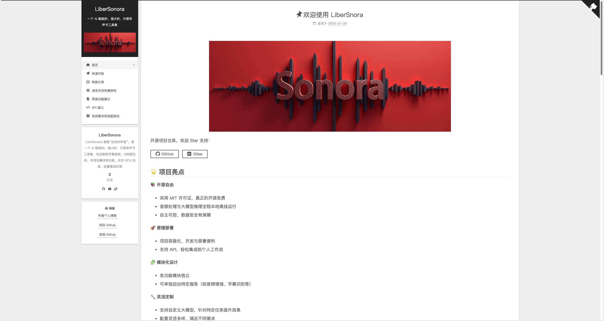
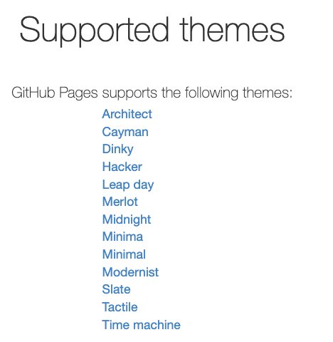
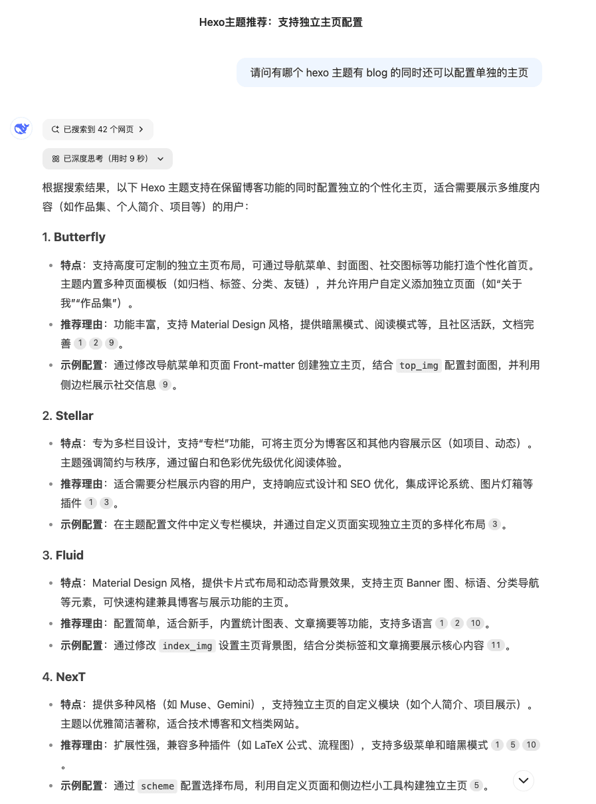
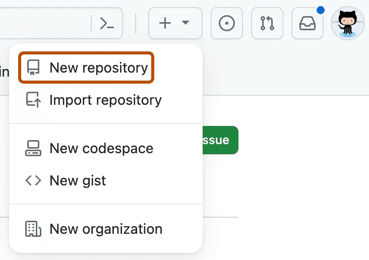
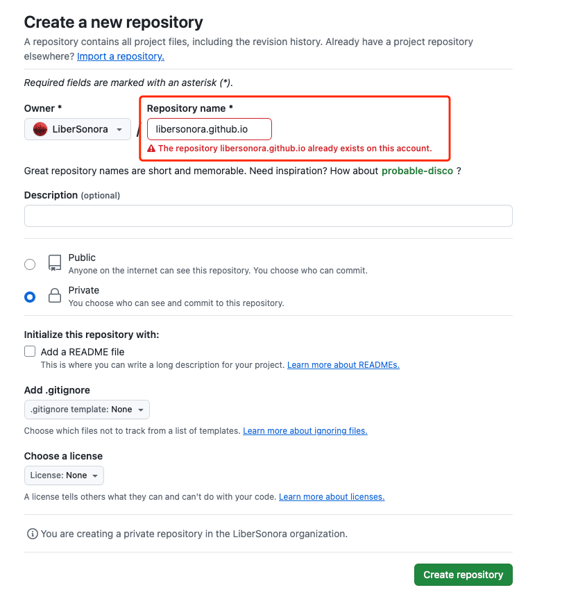
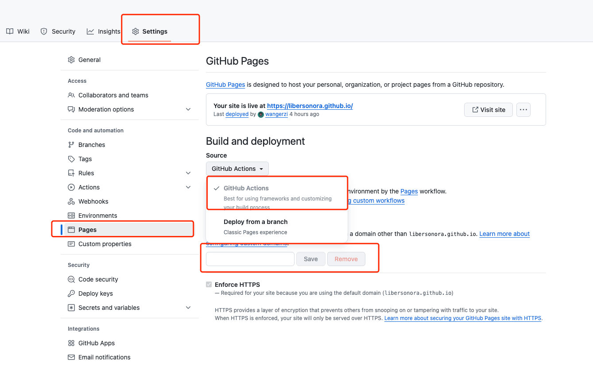
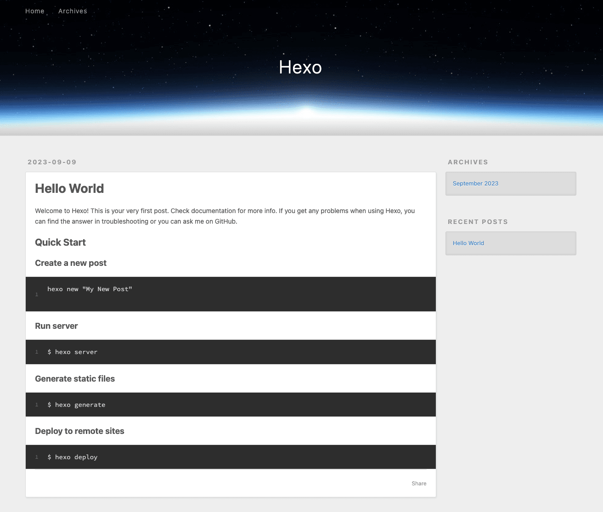
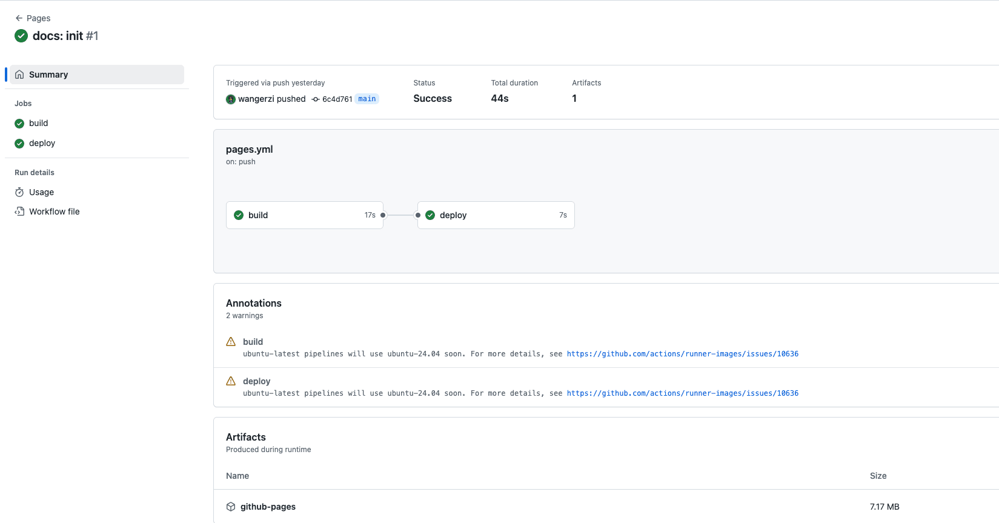

# 前言

蛇年春节在即，在这里祝大家蛇年大吉，财源广进！！！🧨🧨🧨

博主就乘着节前还有点业余时间继续搞一搞开源项目，背景是大概在 2025 年元旦，我使用 Cursor + DeepSeek V3 快速的写完了一个开源项目的核心功能，也就是 [LiberSonora - 一个 AI 赋能的、强大的、开源有声书工具集](https://github.com/LiberSonora/LiberSonora)。

但这个项目的相关介绍、愿景、功能、API 接口等等信息很长，放在 README 里边非常不雅观，放 Wiki 里边又觉得不够好看，所以还是决定给这个项目搞一个官网，把 README 里边冗杂的各种信息分门别类都放到项目官网里，以及未来的更新日志都可以在官网中以博客的方式体现。

想到这里，做一个项目官网需要的核心功能就出来了：

* 简单明了，主页不能直接是一个文章列表，主要的视觉集中处需要有充足的内容空间介绍项目情况
* 侧边栏菜单需要支持独立页
* 需要支持友情链接配置
* 支持点击放大图片
* 移动端访问友好
* 支持接入 Google Analysis 等分析工具
* 展示网站访问 PV UV

项目官网预览：[https://libersonora.github.io/](https://libersonora.github.io/)
官网开源地址：[https://github.com/LiberSonora/libersonora.github.io](https://github.com/LiberSonora/libersonora.github.io)

完全配置完是这样的展示效果，且在提交后会自动打包内容更新网站：

​

## 技术选型

目前并不打算为这个开源项目单独申请域名，所以在部署上就打算使用 [Github Pages](https://pages.github.com/) 和自带的 github.io 域名。

Github Pages 本身是内置支持 Jekyll 的，[Jekyll](https://jekyllrb.com/) 是一个静态网站生成器，可以把 Markdown 文档转换为静态网站 html，进而在 Github Pages 中部署。

这个工具本身没有问题，用的人比较多，但在 Github Pages 中内置支持的模板比较少，可以再[这个链接](https://pages.github.com/themes/)中查看，我挨个点进去看了，都只适合做博客，不适合做项目官网。

​​

如果跳出内置的主题，用[自定义 actions 打包](https://docs.github.com/en/pages/getting-started-with-github-pages/using-custom-workflows-with-github-pages)的话，就不用限定在 Jekyll 这一个静态网站生成器上。

最后经过手工挑选+Deepseek R1 的推荐，最终选择了 Hexo + NexT 主题来完成这个功能

​​

Hexo 文档：[hexo.io/zh-cn/docs/](https://hexo.io/zh-cn/docs/)

Hexo NexT 主题文档：[theme-next.js.org/docs/](https://theme-next.js.org/docs/)

## 操作记录

整体思路如下：

* 创建一个 github pages 仓库
* 安装 hexo 、hexo-next 主题
* 调整 hexo 和主题配置

### Github Pages 配置

跟着这个指引 [Quickstart for GitHub Pages](https://docs.github.com/en/pages/quickstart) 就可以初始化好一个网站仓库，接下来往这个仓库填充内容就好了。

创建一个新的仓库​

​​

仓库名称为 [project/username].github.io

> 需要注意的是，**如果项目名称是驼峰的，在创建仓库的时候需要都转为小写**，比如我的开源项目组织名字为 LiberSonora，在创建仓库时只能写 libersonora.github.io，访问地址同样也都只能是小写 [https://libersonora.github.io](https://libersonora.github.io/)

​​

设置里边打开 Pages 的支持，注意这里的构建 Source 要选 github actions，如果有自己的域名可以在输入框内填写并配置解析

​​

把仓库克隆到本地，运行如下命令进行初始化

进入到仓库目录后

```bash
npm i -g hexo
npx hexo init web-app
cd web-app
```

进入到项目目录后，跟踪为刚才新建的远程仓库

```bash
git init
git remote add origin https://github.com/LiberSonora/libersonora.github.io.git
```

配置 github workflow

把如下 pages.yml 放到 `.github/workflows/`​ 下

```yml
name: Pages

on:
  push:
    branches:
      - main # default branch

jobs:
  build:
    runs-on: ubuntu-latest
    steps:
      - uses: actions/checkout@v4
        with:
          token: ${{ secrets.GITHUB_TOKEN }}
          # If your repository depends on submodule, please see: https://github.com/actions/checkout
          submodules: recursive
      - name: Use Node.js 20
        uses: actions/setup-node@v4
        with:
          # Examples: 20, 18.19, >=16.20.2, lts/Iron, lts/Hydrogen, *, latest, current, node
          # Ref: https://github.com/actions/setup-node#supported-version-syntax
          node-version: "20"
      - name: Install Yarn
        run: npm install --global yarn
      - name: Cache Yarn dependencies
        uses: actions/cache@v4
        with:
          path: ~/.yarn/cache
          key: ${{ runner.OS }}-yarn-cache
          restore-keys: |
            ${{ runner.OS }}-yarn-cache
      - name: Install Dependencies
        run: yarn install
      - name: Build
        run: yarn build
      - name: Upload Pages artifact
        uses: actions/upload-pages-artifact@v3
        with:
          path: ./public
  deploy:
    needs: build
    permissions:
      pages: write
      id-token: write
    environment:
      name: github-pages
      url: ${{ steps.deployment.outputs.page_url }}
    runs-on: ubuntu-latest
    steps:
      - name: Deploy to GitHub Pages
        id: deployment
        uses: actions/deploy-pages@v4
```

本地运行项目

```bash
yarn install
yarn server
```

如果一切正常，那么访问 `http://localhost:4000`​ 可以看到一个默认的 Hello World 页面

​​

推送到远程，观察 Actions，一个正常的 Action 可以参考：[https://github.com/LiberSonora/libersonora.github.io/actions/runs/12974707962](https://github.com/LiberSonora/libersonora.github.io/actions/runs/12974707962)，然后就可以在 `[name].github.io` 上访问到刚才配置的网站了

```bash
git add .
git push origin main
```

​​

### Hexo 配置

在网站整体跑通的情况下，下一步就是 hexo 和 hexo-next 的配置了

首先执行如下命令安装 next 主题

```bash
yarn add hexo-theme-next
```

然后复制一份配置模板到项目目录

```bash
cp node_modules/hexo-theme-next/_config.yml _config.next.yml
```

Hexo 中本身有一个 `_config.yml`​，只需配置一下 Site 、URL、Theme 相关的属性，成品配置参考 [_config.yml](https://github.com/LiberSonora/libersonora.github.io/blob/main/_config.yml)

```yml
# Site
title: LiberSonora
subtitle: '一个 AI 赋能的、强大的、开源有声书工具集'
description: 'LiberSonora 寓意“自由的声音”，是一个 AI 赋能的、强大的、开源有声书工具集，包含智能字幕提取、AI标题生成、多语言翻译等功能，支持 GPU 加速、批量离线处理'
keywords: 'subtitle,audio-books,subtitles-generator,llm,ollama,translate,deepseek'
author: LiberSonora
language: zh-CN
timezone: 'Asia/Shanghai'
# URL
## Set your site url here. For example, if you use GitHub Page, set url as 'https://username.github.io/project'
url: https://libersonora.github.io/
# ...
theme: next
# ...
```

然后是 next 主题的配置，可以参考他家的官方文档 [theme-settings](https://theme-next.js.org/docs/theme-settings/) 一步步的调试，成品配置参考 [_config.next.yml](https://github.com/LiberSonora/libersonora.github.io/blob/main/_config.next.yml)

比较重要的几个配置列举如下，[realfavicongenerator.net](https://realfavicongenerator.net/) 可以做 favicon，不过里边的 16x16  32x32 多尺寸的 favcion 得在 [resize.com](https://resize.com/) 中二次处理下

```yml
scheme: Gemini # Gemini 主题比较适合做项目官网
# favicon 得去 https://realfavicongenerator.net/ 做一下
favicon:
  small: /favicon/favicon-16x16.png
  medium: /favicon/favicon-32x32.png
  apple_touch_icon: /favicon/apple-touch-icon.png
  safari_pinned_tab: /favicon/favicon.svg
  android_manifest: favicon//manifest.json

# Custom Logo (Warning: Do not support scheme Mist)
custom_logo: /images/logo-head.jpg
# Menu 是左侧的菜单，需要先建好单页再继续
menu:
  home: / || fa fa-home
  快速开始: /quick-start/ || fa fa-rocket
  转换示例: /demo/ || fa fa-laptop-code
  语言支持和兼容性: /support/ || fa fa-life-ring
  界面功能展示: /pages/ || fa fa-file-alt
  API 接口: /api/ || fa fa-code
  系统要求和性能测试: /system-requirement/ || fa fa-server
# 友链
links:
  作者个人博客: https://blog.wj2015.com
  项目 Github: https://github.com/LiberSonora/LiberSonora
  官网 Github: https://github.com/LiberSonora/libersonora.github.io
# 打赏功能
reward_settings:
  # If true, a donate button will be displayed in every article by default.
  enable: true
  animation: true
reward:
  wechatpay: /images/wechatpay.png
# 支持点击打开图片
fancybox: true
# 谷歌分析的配置
google_analytics:
  tracking_id: # <app_id>
# 访客统计功能
busuanzi_count:
  enable: true
```

> 创建单页的命令是 `npx hexo new page [page-router]`​，创建完成后在 `source/[page-router]/index.md`​ 中修改页面即可

### 置顶文章

可以使用 `npx hexo new post "文章标题"`​ 创建文章，也可以直接在 `source/_posts`​ 中新建 `[router].md`​，然后手动填充如下头部信息

* title 是文章标题
* sticky 是置顶配置，普通文章不需要，sticky 越大越靠前（这个点在文档里边没找到，翻了源代码才确认这个逻辑，所以单独拧出来提一下）
* date 是选填的，默认会取文件的创建时间，不过我对这个系统维护的文件时间不太信任，不嫌麻烦还是自己硬编码一下比较好

```md
---
title: 欢迎使用 LiberSnora
sticky: 1
date: "2025-01-26"
---
```

而在 next 主题中，设置了 sticky 的文章会被完整的展示到首页，所以特别适合把项目情况、愿景等重要信息放到这里，就像下面这样。

​​

> 其他发版 blog、项目进展 blog 就按照同样的方法创建文章，只不过不需要配置 sticky

所有配置都完成后，再次提交到 github 并等待 actions 完成，整个网站就部署完了，还可以随个人喜好，加入评论系统、本地搜索、聊天等等功能，可以跟随 Next 主题文档按需配置，[Comment System](https://theme-next.js.org/docs/third-party-services/comments)。

如果考虑国内用户访问更加友好，或者希望从 WordPress 导入文章，以及希望加上文章分类、标签等功能，以及展示的更个性一点，也可以参考我的个人博客搭建总结[《Hexo 博客迁移》](https://blog.wj2015.com/2022/05/08/hexo%E5%8D%9A%E5%AE%A2%E8%BF%81%E7%A7%BB/)

## 总结

现在的静态网站搭建工具很完善，搭一个静态网站的时间成本很低，虽然我梳理需求、找主题、准备内容、调整模板等等事情加起来搞了一下午，但单纯上一个自己的个人站确实可以 10分钟左右搞定，Enjoy！

