[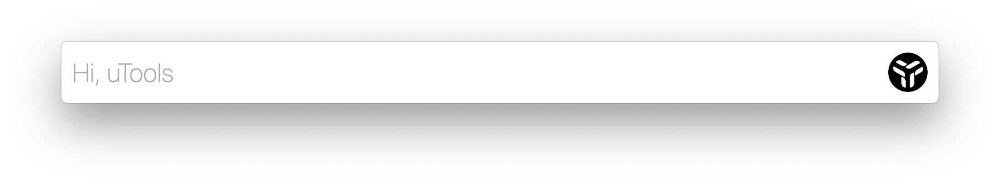](../static/uploads/2021/08/wp_editor_md_2ac49382f138dd58872b7151056eca99.jpg) 

## 目的

博主个人已经用了很久的 Utools 了，会员也续到了 2024 年，它跟随博主从 Deepin 到 Manjaro，再到 Windows 再到 MacOS，在很多场景下都非常方便，比如选中文本中键翻译、复制 JSON 后自动格式化、正则表达式匹配小工具、计算稿纸等。已推荐给很多同事、朋友使用，无不夸其高效便捷。 [](../static/uploads/2021/08/wp_editor_md_caa59a234ecad2dac37d0b52ee546460.jpg) 而在使用的同时，也想为社区出一份力，实现一些插件为自己为他人提供更多的便利，**Utools 为实现多端兼容，主要使用 JS 开发插件**，界面 UI 与组件交互与传统的 web 开发别无二致，只不过可以利用更多的系统能力去做传统 web 开发不能做到的事情。 [](../static/uploads/2021/08/wp_editor_md_f5c05cf892a8820a62ed1b11398a8ec6.jpg)

### 开发文档整理

Utools 开发者文档：http://u.tools/docs/developer/welcome.html ElementUI开发文档：https://element-plus.org/#/zh-CN/component/installation Vue3 开发文档：https://v3.vuejs.org/guide/introduction.html Vite 开发文档：https://vitejs.dev/config/ 在开发者文档中，快速上手仅提供了原生 JS + utools 能力的调用结合，这篇文档的目标是**将 Vue3 与 Utools 开发结合，并将国内比较流行的 ElementUI 框架集成在一起**，最终会基于这些技术创造出一个简易的 Markdown 编辑器，Utools 上搜索 **『清爽 Markdown 编辑器』** 即可体验。 [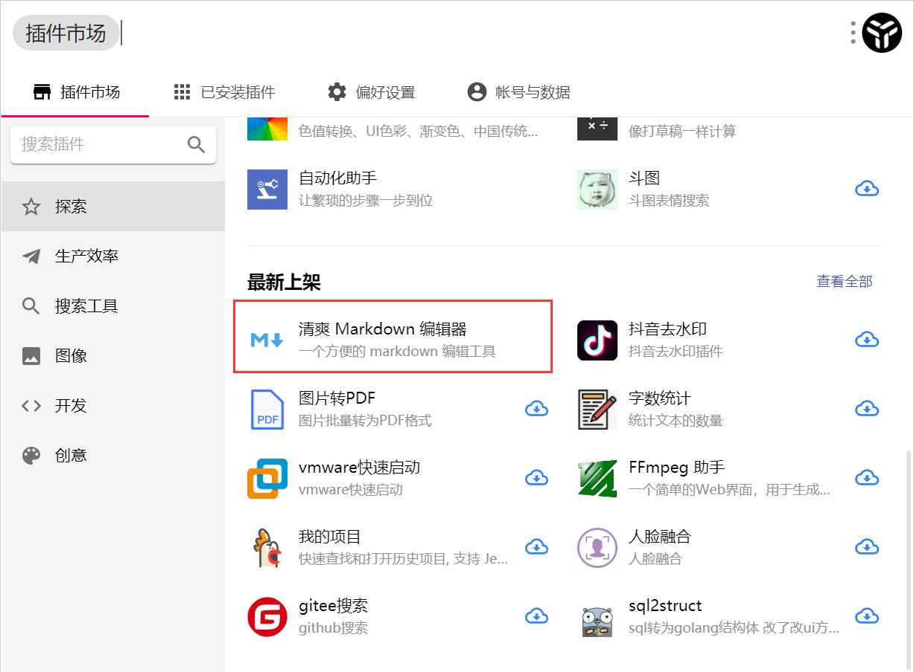](../static/uploads/2021/08/wp_editor_md_79861a0615b3fba0215da77bdaafb508.jpg) 具体代码见： Github：https://github.com/wangerzi/utools-vue3-markdown-editor Gitee：https://gitee.com/wangerzi/utools-vue3-markdown-editor 界面效果如下： [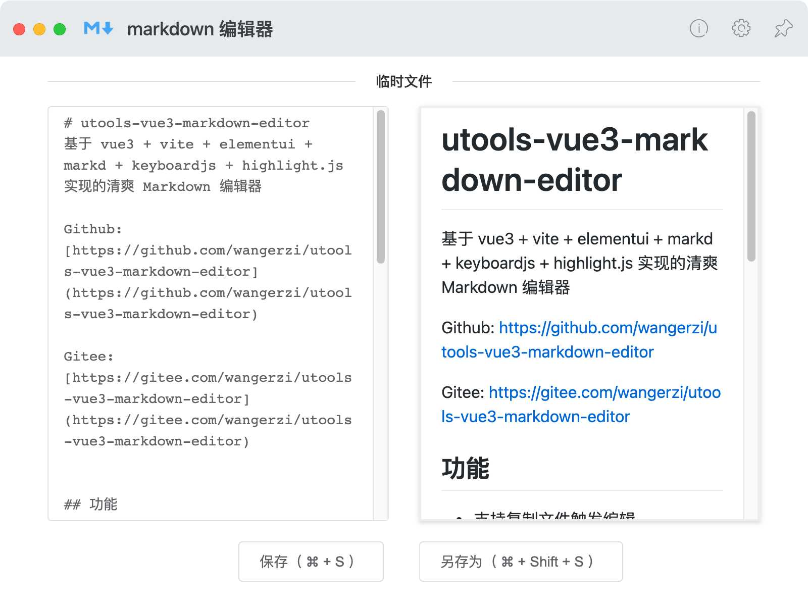](../static/uploads/2021/08/wp_editor_md_03fa153f98a6b7131bd78234b8fcfc9e.jpg) 还有一些优秀的开源插件可参考： [https://github.com/xiaou66/utools-pictureBed](https://github.com/xiaou66/utools-pictureBed) [https://github.com/xkloveme/utools-calendar](https://github.com/xkloveme/utools-calendar) [https://github.com/in3102/upassword](https://github.com/in3102/upassword)

## 基础工具的集成

这一小节的目的主要是将业务框架和主要依赖安装好，为实现业务做准备。 空白项目只有一个 `README.md` 和 `.gitignore` 本阶段的配置和代码执行已放入 [https://github.com/wangerzi/utools-vue3-markdown-editor/tree/element-template](https://github.com/wangerzi/utools-vue3-markdown-editor/tree/element-template) ，如果想基于同样的技术栈做研发，可以直接把代码下载下来改。

### 初始化项目

首先，这是一个 vue3 + vite 的项目，根据官方的 [快速上手指引](https://v3.vuejs.org/guide/installation.html#vite)，在项目根目录下执行如下指令，注意对比执行结果和 node 版本

> 其中 `mv utools-vue3-markdown-editor/* ./` 是因为项目初始化在子文件夹中，不在主目录初始化是因为会删除该目录所有文件，而空白项目中已经有 .git/README.md/.gitignore 了，初始化到本目录中，会导致这些数据被清理掉，规避风险所以创建在了子目录中。

```shell
$ node -v
v12.16.1

$ npm -v
6.13.4

$ npm init vite utools-vue3-markdown-editor -- --template vue
npx: 6 安装成功，用时 3.61 秒
√ Select a framework: » vue
√ Select a variant: » vue

Scaffolding project in D:\phpStudy\WWW\github\utools-vue3-markdown-editor\utools-vue3-markdown-editor...

Done. Now run:

  cd utools-vue3-markdown-editor
  npm install
  npm run dev

$ mv utools-vue3-markdown-editor/* ./

$ rm -rf utools-vue3-markdown-editor\

$ npm install

> esbuild@0.12.18 postinstall D:\phpStudy\WWW\github\utools-vue3-markdown-editor\node_modules\esbuild
> node install.js

npm notice created a lockfile as package-lock.json. You should commit this file.
npm WARN utools-vue3-markdown-editor@0.0.0 No repository field.
npm WARN utools-vue3-markdown-editor@0.0.0 No license field.
npm WARN optional SKIPPING OPTIONAL DEPENDENCY: fsevents@2.3.2 (node_modules\fsevents):
npm WARN notsup SKIPPING OPTIONAL DEPENDENCY: Unsupported platform for fsevents@2.3.2: wanted {"os":"darwin","arch":"any"} (current: {"os":"win32","arch":"x64"})

added 57 packages from 78 contributors in 10.725s

3 packages are looking for funding
  run `npm fund` for details


$ npm run dev

> utools-vue3-markdown-editor@0.0.0 dev D:\phpStudy\WWW\github\utools-vue3-markdown-editor
> vite

Pre-bundling dependencies:
  vue
(this will be run only when your dependencies or config have changed)

  vite v2.4.4 dev server running at:

  > Local: http://localhost:3000/
  > Network: use `--host` to expose

  ready in 1375ms.
```

此时访问 http://localhost:3000/ 将会看到如下界面，表示项目初始化完成 [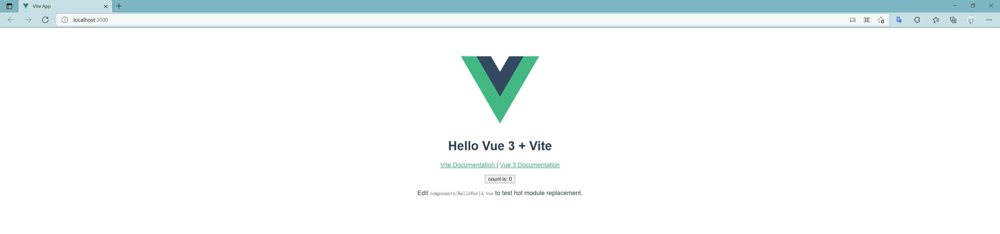](../static/uploads/2021/08/wp_editor_md_351fe3c5194528957a7dbbd354d05644.jpg)

### 框架引入

下一步引入 element 框架，主要参考 [官方安装文档](https://element-plus.org/#/zh-CN/component/installation) 执行如下指令

```shell
$ npm install element-plus --save
npm WARN utools-vue3-markdown-editor@0.0.0 No repository field.
npm WARN utools-vue3-markdown-editor@0.0.0 No license field.
npm WARN optional SKIPPING OPTIONAL DEPENDENCY: fsevents@2.3.2 (node_modules\fsevents):
npm WARN notsup SKIPPING OPTIONAL DEPENDENCY: Unsupported platform for fsevents@2.3.2: wanted {"os":"darwin","arch":"any"} (current: {"os":"win32","arch":"x64"})

+ element-plus@1.0.2-beta.70
added 9 packages from 6 contributors in 11.379s

4 packages are looking for funding
  run `npm fund` for details

```

#### 按需引用和 SASS

由于 vite 、 webpack 等打包工具会用 tree-shaking 剔除未使用的代码，做按需引用可最大程度的利用此功能，减少打包体积。ElementUI 官方也提供了 [element 按需引用的使用说明](https://element-plus.org/#/zh-CN/component/quickstart)。 这一步的目的是安装 vite 的 style 引入插件，并安装 sass 和 sass-loader 以兼容 sass 的加载，执行如下指令：

```shell
$ npm install vite-plugin-style-import -D
npm WARN utools-vue3-markdown-editor@0.0.0 No repository field.
npm WARN utools-vue3-markdown-editor@0.0.0 No license field.
npm WARN optional SKIPPING OPTIONAL DEPENDENCY: fsevents@2.3.2 (node_modules\fsevents):
npm WARN notsup SKIPPING OPTIONAL DEPENDENCY: Unsupported platform for fsevents@2.3.2: wanted {"os":"darwin","arch":"any"} (current: {"os":"win32","arch":"x64"})

+ vite-plugin-style-import@1.1.1
added 22 packages from 10 contributors in 3.215s

5 packages are looking for funding
  run `npm fund` for details

$ npm install sass sass-loader
npm WARN sass-loader@12.1.0 requires a peer of fibers@>= 3.1.0 but none is installed. You must install peer dependencies yourself.
npm WARN sass-loader@12.1.0 requires a peer of node-sass@^4.0.0  ^5.0.0  ^6.0.0 but none is installed. You must install peer dependencies yourself.
npm WARN sass-loader@12.1.0 requires a peer of webpack@^5.0.0 but none is installed. You must install peer dependencies yourself.
npm WARN utools-vue3-markdown-editor@0.0.0 No repository field.
npm WARN utools-vue3-markdown-editor@0.0.0 No license field.
npm WARN optional SKIPPING OPTIONAL DEPENDENCY: fsevents@2.3.2 (node_modules\fsevents):
npm WARN notsup SKIPPING OPTIONAL DEPENDENCY: Unsupported platform for fsevents@2.3.2: wanted {"os":"darwin","arch":"any"} (current: {"os":"win32","arch":"x64"})

+ sass@1.37.5
+ sass-loader@12.1.0
added 17 packages from 20 contributors in 3.052s

6 packages are looking for funding
  run `npm fund` for details
```

编辑 `vite.config.js`，调整为如下格式，这一步的目的有两个

*   指定明确的开发端口，这在 utools 的开发配置中也将有所体现
*   按需加载 elementUI 的 .scss 文件处理

```js
import {defineConfig} from 'vite'
import vue from '@vitejs/plugin-vue'
import styleImport from 'vite-plugin-style-import'

// https://vitejs.dev/config/
export default defineConfig({
  base: './', // !!!!!!! 非常重要，否则打包后无法访问 !!!!!!!
  server: {
    port: 3000,
  },
  plugins: [
    vue(),
    styleImport({
      libs: [{
        libraryName: 'element-plus',
        esModule: true,
        ensureStyleFile: true,
        resolveStyle: (name) => {
          name = name.slice(3)
          return `element-plus/packages/theme-chalk/src/${name}.scss`
        },
        resolveComponent: (name) => {
          return `element-plus/lib/${name}`
        },
      }]
    })
  ]
})
```

随后，修改 `src/main.js`，在其中添入按需引入的 ElementUI 插件和 `base.scss`

```js
import { createApp } from 'vue'
import App from './App.vue'

import { ElButton, ElSelect } from 'element-plus'
import 'element-plus/packages/theme-chalk/src/base.scss'

const app = createApp(App);

app.component(ElButton.name, ElButton)
app.component(ElSelect.name, ElSelect)

app.mount('#app')
```

#### 引入验证

在 `src/components/HelloWorld.vue` 中小改一下

```vue
<template>
  <el-button>Hello World</el-button>
  <h1>{{ msg }}</h1>

  <p>
    <a href="https://vitejs.dev/guide/features.html" target="_blank">
      Vite Documentation
    </a>
    
    <a href="https://v3.vuejs.org/" target="_blank">Vue 3 Documentation</a>
  </p>

  <button type="button" @click="state.count++">
    count is: {{ state.count }}
  </button>
  <p>
    Edit
    <code>components/HelloWorld.vue</code> to test hot module replacement.
  </p>
</template>

<script setup>
import { defineProps, reactive } from 'vue'

defineProps({
  msg: String
})

const state = reactive({ count: 0 })
</script>

<style scoped>
a {
  color: #42b983;
}
</style>
```

执行 `npm run dev` 并访问 `http://localhost:3000/`，看到 ElementUI 风格的按钮展现在页面上即表示成功 [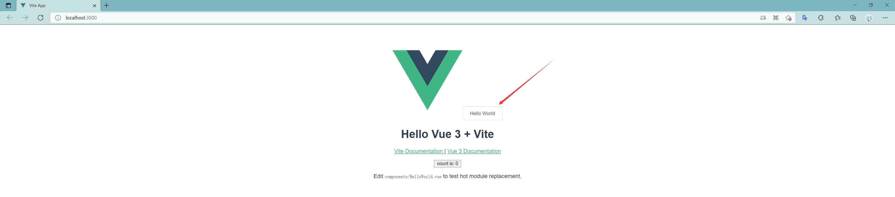](../static/uploads/2021/08/wp_editor_md_05005799edf5402c602ea2ab31421932.jpg)

### utools 开发配置

上面的步骤操作完毕后，开发框架和基础目录都已经建好了，但 utools 与传统 web 开发有区别的地方在于，它可以利用客户端的能力，并能在 utools 中快速调用，所以我们需要定义两个文件 `plugin.json` 和 `preload.js` 用来指定插件的配置，封装插件可使用的客户端能力。 官方配置文档：[http://u.tools/docs/developer/welcome.html](http://u.tools/docs/developer/welcome.html) 由于我们调试环境是运行在 `localhost:3000` 上的，utools 也考虑到了这种调试需求，根据文档可以做出配置 而这次要实现插件可以由两个入口进入，可定义两个 `feature`

*   关键字 『markdown 编辑器』进入主页面
*   复制后缀名为 `.md` 的文件后，唤醒 utools，我们将会自动读取对应文件并做相关编辑

考虑到 **打包后的 `plugin.json` 和 `preload.js` `logo.png` 均需要出现在 `dist/` 目录下** ，所以我将这三个文件都放到了 `public/` 中，这样打包后这三个文件将会出现在 `dist/plugin.json` 、 `dist/preload.js` `dist/logo.png`，符合打包要求，utools 需要加载的目标文件就是 `dist/index.html`，所以 `plugin.json` 中的 `main` 配置写 `index.html` 即可。 logo 去 [https://www.iconfont.cn/](https://www.iconfont.cn/) 随便找了个跟文本编辑相关的拿来用了 public/plugin.json

```json
{
  "main": "index.html",
  "logo": "logo.png",
  "platform": ["win32", "darwin", "linux"],
  "preload": "preload.js",
  "development": {
    "main": "http://127.0.0.1:3000"
  },
  "features": [
    {
      "code": "main",
      "explain": "一个方便的 markdown 编辑工具",
      "cmds":["markdown 编辑器"]
    },
    {
      "code": "copy",
      "explain": "复制文件预览及编辑",
      "cmds": [
        {
          "type": "files",
          "label": "markdown 文件预览",
          "fileType": "file",
          "match": "/\\.md$/i",
          "minLength": 1,
          "maxLength": 1
        }
      ]
    }
  ]
}
```

preload 先简单写一个 console，具体需要用到 node / electron 相关能力了，再回来补全。 public/preload.js

```js
console.log("preload js loaded")
```

运行 `npm run dev` 尝试下打包：

```shell
$ npm run build

> utools-vue3-markdown-editor@0.0.0 build D:\phpStudy\WWW\github\utools-vue3-markdown-editor
> vite build

vite v2.4.4 building for production...
✓ 358 modules transformed.
dist/assets/logo.03d6d6da.png             6.69kb
dist/assets/element-icons.9c88a535.woff   24.24kb
dist/assets/element-icons.de5eb258.ttf    49.19kb
dist/index.html                           0.48kb
dist/assets/index.5be5297f.js             1.02kb / brotli: 0.52kb
dist/assets/index.66070cd5.css            52.22kb / brotli: 7.52kb
dist/assets/vendor.27ac3d2d.js            211.72kb / brotli: 63.94kb
```

#### 调试和打包插件

首先去 utools 插件中搜索『开发者工具』，打开后点击新建项目，补齐相关信息 [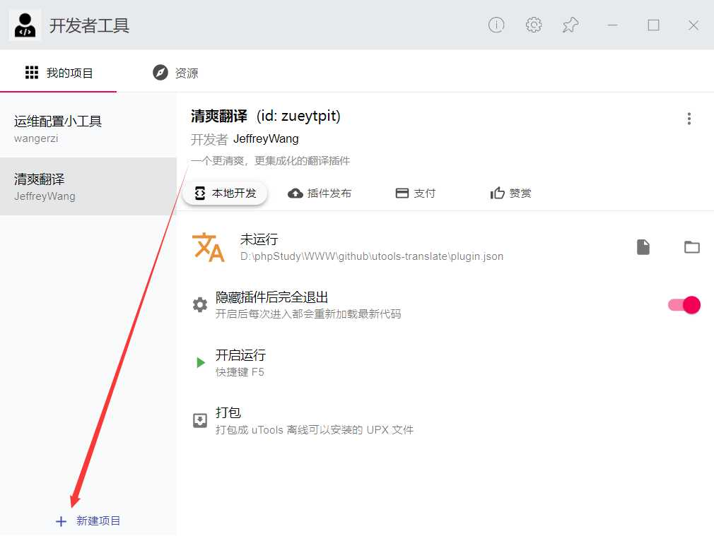](../static/uploads/2021/08/wp_editor_md_6964053e6c5db9d7ac218d450fec68f4.jpg) [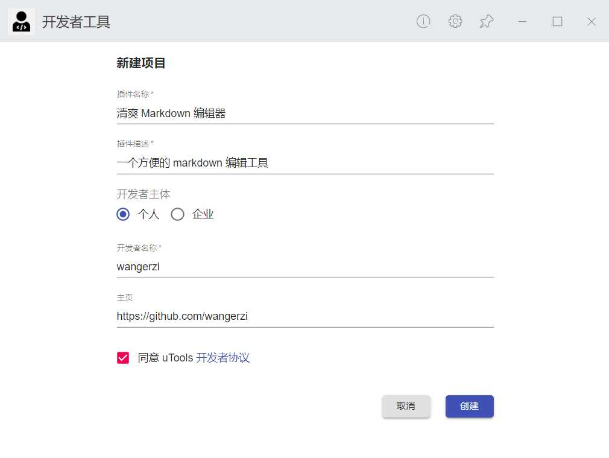](../static/uploads/2021/08/wp_editor_md_b3dbf29945d410ba504e3370c39aaf3c.jpg) 上一步 `npm build` 后，会产生一个 `dist/` 目录，将其下的 `dist/plugin.json` 拖到开发者工具中，点击运行 [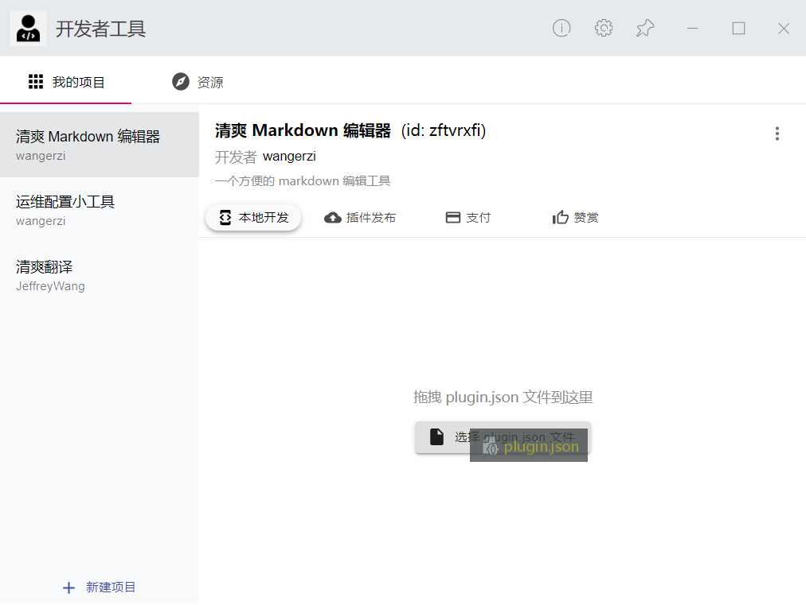](../static/uploads/2021/08/wp_editor_md_b314f853096dc1539c13ce06c547e3bf.jpg) [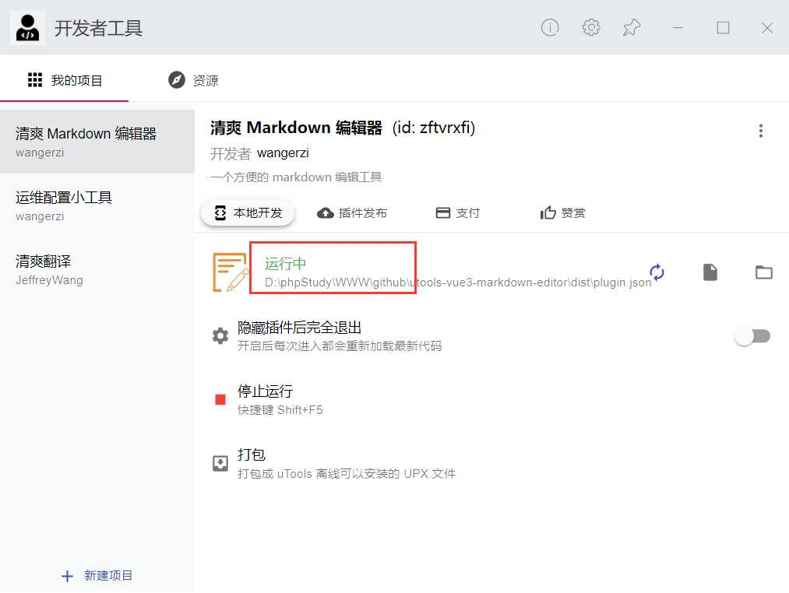](../static/uploads/2021/08/wp_editor_md_a7d3a7601deac820b902bbe66eb4948f.jpg) 由于是调试模式，并且我们在 `plugin.json` 中制定了 `development.main` 为 `localhost:3000`，所以在调试期间需要 `npm run dev` 把 devserver 跑起来

```shell
$ npm run dev

> utools-vue3-markdown-editor@0.0.0 dev D:\phpStudy\WWW\github\utools-vue3-markdown-editor
> vite


  vite v2.4.4 dev server running at:

  > Local: http://localhost:3000/
  > Network: use `--host` to expose

  ready in 1238ms.

[@vue/compiler-sfc] <script setup> is still an experimental proposal.
Follow its status at https://github.com/vuejs/rfcs/pull/227.

[@vue/compiler-sfc] When using experimental features,
it is recommended to pin your vue dependencies to exact versions to avoid breakage.

[@vue/compiler-sfc] `defineProps` is a compiler macro and no longer needs to be imported.
```

然后 utools 中输入关键字 『markdown』即可看到处于 dev 状态下的插件 [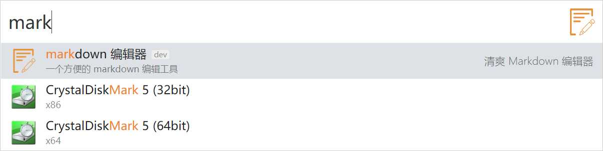](../static/uploads/2021/08/wp_editor_md_d1426f0cf2d191d207f337b4a57d0351.jpg) 进入插件后，点击右上角按钮或者 ctrl+sfhit+i 可进入开发者模式，开发者模式中可以看到 `preload.js` 正常运行，输出了 『preload js loaded』 [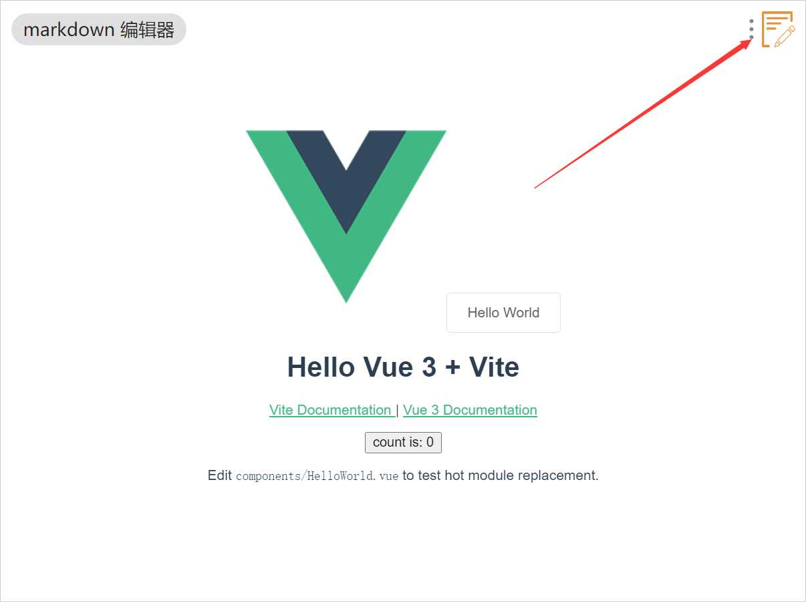](../static/uploads/2021/08/wp_editor_md_e3ad758990d218f4d845f19c5d284dc5.jpg) [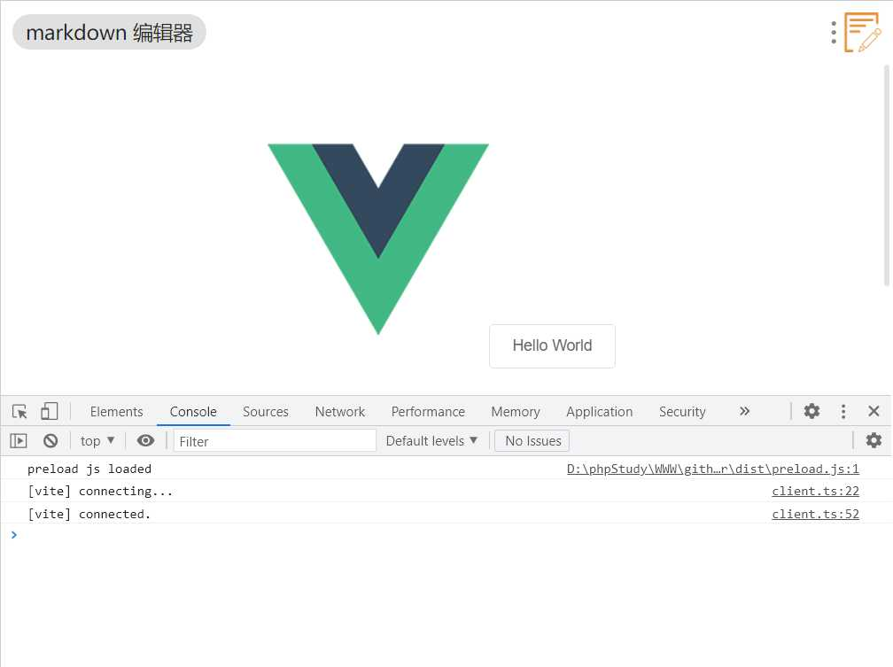](../static/uploads/2021/08/wp_editor_md_30e0b6bad7f7f5d9884428a3a8b773e7.jpg)

> 注意：指定的 plugin.json 为 `dev/plugin.json`，所以 `public/plugin.json` 、 `public/preload.js` 有任何修改，需要手动复制或者 `npm run build` 重新打包，然后 utools 开发者工具点击按钮刷新 plugin.json 即可。

## 功能实现

功能整体比较简单，左侧为编辑区，由 textarea 实现，右侧为预览区，实时渲染左侧编辑区域的 markdown 语法的结果，下方为两个控制按钮，分别是保存和另存。 [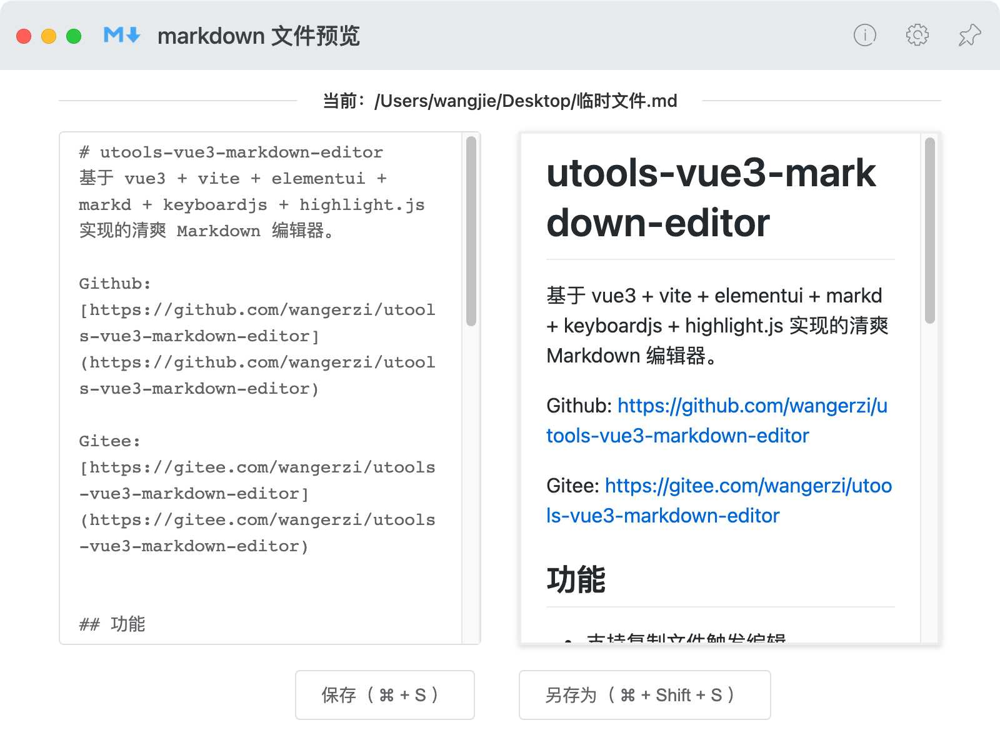](../static/uploads/2021/08/wp_editor_md_6440d39f4c109823505bb18de6dca1d3.jpg)

### 依赖库的安装调用

```shell
$ npm i marked keyboardjs github-markdown-css highlight.js
npm WARN sass-loader@12.1.0 requires a peer of webpack@^5.0.0 but none is installed. You must install peer dependencies yourself.
npm WARN utools-vue3-markdown-editor@0.0.0 No repository field.
npm WARN utools-vue3-markdown-editor@0.0.0 No license field.
npm WARN optional SKIPPING OPTIONAL DEPENDENCY: fsevents@2.3.2 (node_modules\fsevents):
npm WARN notsup SKIPPING OPTIONAL DEPENDENCY: Unsupported platform for fsevents@2.3.2: wanted {"os":"darwin","arch":"any"} (current: {"os":"win32","arch":"x64"})

+ marked@2.1.3
added 1 package from 1 contributor in 33.831s

6 packages are looking for funding
  run `npm fund` for details
```

### 布局实现

由于此应用单页即可完成，所以简单改造下 `src/App.vue` 和 `src/components/HelloWorld.vue` 即可，其中 `HelloWorld.vue` 在项目中被重命名为了 `Editor.vue`，目录结构如下图所示： [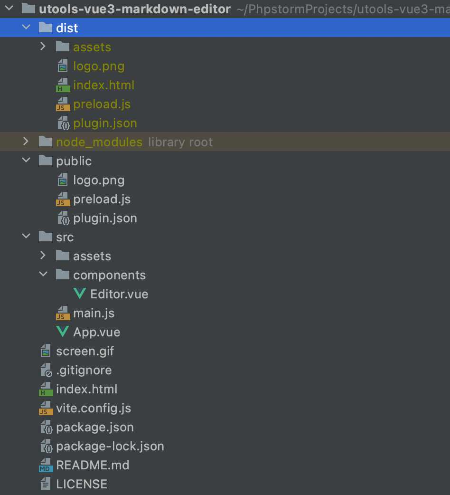](../static/uploads/2021/08/wp_editor_md_488df0b2674602bde37f94811ac9c965.jpg)

#### Editor.vue

模板部分用了 Element 的 el-row 和 el-col，规划好基础布局

```vue
<template>
  <div class="container">
    <el-divider content-position="center">{{props.path?('当前：'+props.path):'临时文件'}}</el-divider>
    <el-row :gutter="30">
      <el-col :span="12">
        <el-input type="textarea" placeholder="markdown..." resize="none" :rows="19" :autofocus="true" v-model="state.content"></el-input>
      </el-col>
      <el-col :span="12">
        <div class="rendered markdown-body" v-html="renderedContent"></div>
      </el-col>
    </el-row>

    <el-row justify="center" :gutter="30">
      <el-col :span="6">
        <el-button class="save-button" @click="handleSave">{{saveText}}</el-button>
      </el-col>
      <el-col :span="6">
        <el-button class="save-button" @click="handleSaveAs">{{saveAsText}}</el-button>
      </el-col>
    </el-row>
  </div>
</template>
```

样式部分，手动做了些阴影和高度、换行限制

```markup
<style scoped>
.el-row {
  margin-bottom: 20px;
}
.container {
  width: 90%;
  margin: 20px auto;
}
.rendered {
  /*height: calc(100% - 20px);*/

  height: calc(407px - 20px);

  word-break: break-all;

  box-shadow: 0 2px 4px rgba(0,0,0,0.12),0 0 6px rgba(0,0,0,0.04);

  border: 2px solid #eee;
  padding: 10px 20px;

  overflow-y: auto;
}

.save-button {
  margin: 0 auto;
  display: block;
}
</style>
```

处理逻辑里边，使用了 vue3 的 setup api，定义了 `state.path` 和 `state.content` 两个关键的响应式变量，调用了 `markd`, `highlight`, `keyboardjs` 等项目实现功能。

```markup
<script setup>
import { defineProps, defineEmits, reactive, watch, computed } from 'vue'
import marked from 'marked'
import "github-markdown-css/github-markdown.css"

import hljs from 'highlight.js'
import "highlight.js/scss/default.scss"

import keyboard from "keyboardjs"

marked.setOptions({
  renderer: new marked.Renderer(),
  highlight: function(code, lang) {
    const language = hljs.getLanguage(lang) ? lang : 'plaintext';
    return hljs.highlight(code, { language }).value;
  },
  pedantic: false,
  gfm: true,
  breaks: false,
  sanitize: false,
  smartLists: true,
  smartypants: false,
  xhtml: false
});

const props = defineProps({
  content: String,
  path: String,
})

const state = reactive({ content: props.content })

watch(() => props.content, () => {
  state.content = props.content
})

watch(() => props.path, () => {
  state.path = props.path
})

const renderedContent = computed(() => {
  return marked(state.content)
})


// save and save as
const emits = defineEmits(['save'])

const saveText = "保存（ " + (utools.isMacOs() ? "⌘" : 'Ctrl') + " + S ）"
const saveAsText = "另存为（ " + (utools.isMacOs() ? "⌘" : 'Ctrl') + " + Shift + S ）"

function handleSave() {
  if (props.path === "") {
    handleSaveAs()
  } else {
    emits('save', props.path, state.content);
  }
}

function handleSaveAs() {
  const savePath = utools.showSaveDialog({
    title: '保存位置',
    defaultPath: "临时文件.md",
    buttonLabel: '保存'
  })
  if (savePath) {
    emits('save', savePath, state.content);
  }
}

// keyboard
keyboard.bind("mod > s", () => {
  handleSave()
});
keyboard.bind("mod + shift > s", () => {
  handleSaveAs()
});

</script>
```

### 调用 utools 能力做保存

#### preload.js

上一节提到了 preload.js 可以实现一些 web 无法实现的客户端功能，比如读取、保存客户端文件，官方规定，需要上架插件市场的插件，均需要明文 preload.js 以便审核，这里的需要用到的核心能力就是读取和保存用户文件了，这里针对读取和保存也做了收口，减少由于业务层 BUG 穿透过去影响系统正常运行的可能性。

```js
const fs = require('fs');

console.log("preload js loaded")

window.readMarkdownFile = function (path) {
  if (path.match(/\.md$/i)) {
    return fs.readFileSync(path, {
      encoding: "utf-8"
    });
  } else {
    return "";
  }
}

window.writeMarkdownFile = function (path, content) {
  if (fs.existsSync(path)) {
    if (path.match(/\.md$/i)) {
      fs.writeFileSync(path, content)
      return true;
    } else {
      return false;
    }
  } else {
    fs.writeFileSync(path, content)
    return true;
  }
}
```

#### App.vue

在业务层中即可调用经过 window 变量暴露出来的 `readMarkdownFile` 和 `writeMarkdownFile` 方法，使用 utools 的钩子函数（[onPluginEnter](http://u.tools/docs/developer/api.html#%E4%BA%8B%E4%BB%B6)）即可识别入口为复制了 markdown 文件还是直接打开。

```vue
<template>
  <Editor :content="state.content" :path="state.path" @save="handleSave" />
</template>

<script setup>
import {reactive} from 'vue';
import { ElMessage } from 'element-plus'
import Editor from './components/Editor.vue'

const state = reactive({
  content: "",
  path: "",
})

function handleSave(path, content) {
  if (path && content !== state.content) {
    writeMarkdownFile(path, content)
    ElMessage.success({
      message: '保存成功',
      type: 'success'
    });

    if (state.path === '') {
      state.path = path
      state.content = readMarkdownFile(state.path)
    }
  }
}

utools.onPluginEnter(({code, type, payload}) => {
  console.log('用户进入插件', code, type, payload)

  if (type === 'files') {
    state.path = payload[0].path;
    state.content = readMarkdownFile(state.path)
  } else {
    state.path = ""
    state.content = ""
  }
})
</script>

<style>
</style>
```

### 打包 upx 或发布到插件中心

调试无误后，点击打包为 upx 即可自行安装测试或分发 [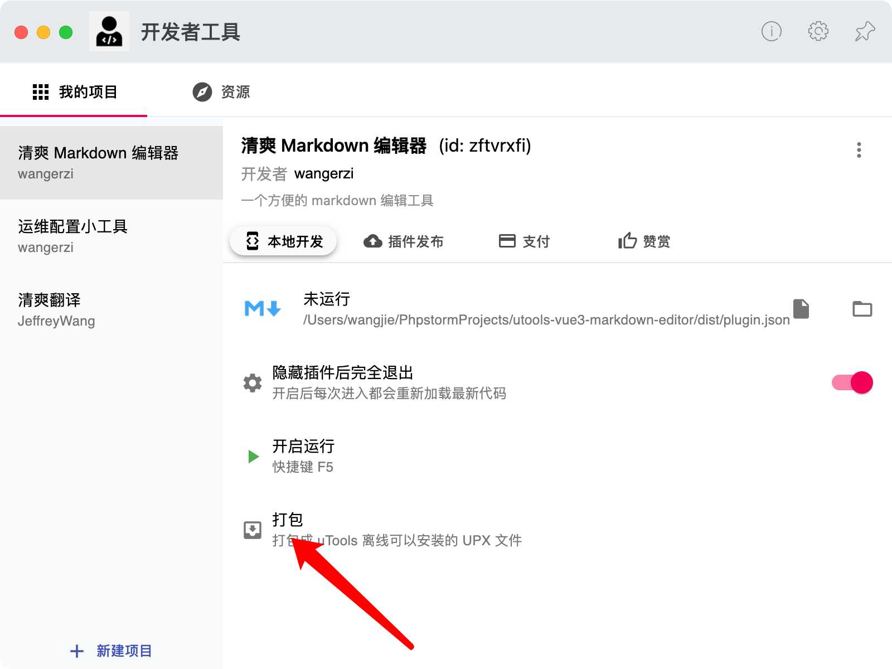](../static/uploads/2021/08/wp_editor_md_9c839b65f108be43c2316fba14d174db.jpg) 也可以在『插件发布中』点击发布插件，填写相关信息，审核后即可在插件市场看到发布的插件。 [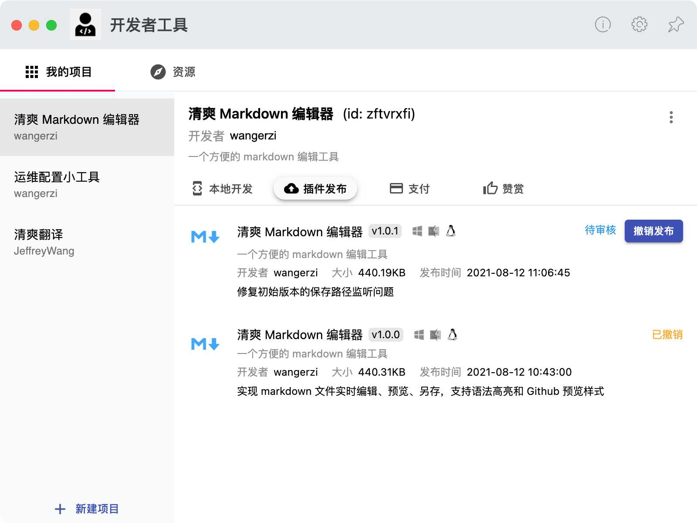](../static/uploads/2021/08/wp_editor_md_e1cdddbccf8c285262e833d393a7d89e.jpg)

## 常见问题和总结

不论是使用 webpack 还是 vite ，打包时一定要注意打包路径（base: "./"），因为 utools 需要根据相对路径索引打包资源，否则调试模式下是好的，只要发布为 upx 就出问题。 开发 utools 插件上手也很快的，本博客对应的插件在基础框架引入后，开发、调试、编写文档的时间不到六小时。 最后，祝 utools 越做越好，完善 utools 插件生态的人越来越多，星星之火可以燎原。