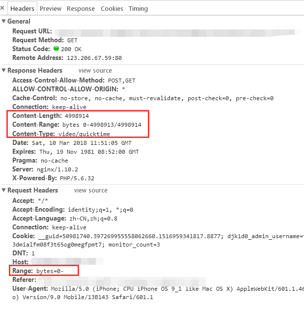
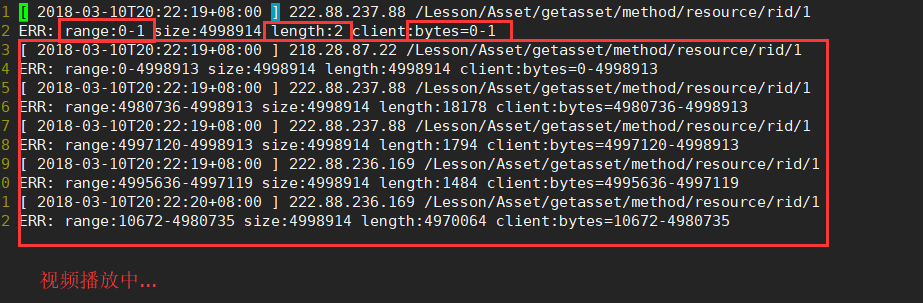

# 背景

项目中遇到了付费视频资源的问题，为隐藏视频真实地址并对观看视频的用户做权限限制，于是就想到了使用php判断当前用户权限读取视频文件，客户端视频地址指向写好的php就好，但是经过简单的代码处理后，电脑和Android并没有发现问题，但是IOS系统播放的时候死活播放不了，进行一番研究之后，得出了解决方案。

# 场景复现

假设我们要做一个付费视频课程的项目，设计数据库数据结构如下：

```sql
/**
资源表，包含资源名称、购买金额、下载量等
*/
CREATE TALBE resource(
    `rid`   INT(11) PRIMARY KEY AUTO_INCREMENT,
    `rname` CHAR(40) NOT NULL COMMENT '资源名称',
    `raddr` CHAR(60) NOT NULL COMMENT '资源在服务器上实际地址',
    `rdownload` INT(11) NOT NULL DEFAULT 0 COMMENT '资源下载量',
    `rmoney`    INT(11) NOT NULL COMMENT '资源费用',
    INDEX(`rname`) COMMENT '搜索资源标题时使用索引'
)ENGINE=INNODB;
/**
资源购买记录表，检查uid和rid在此表中有记录则表示已购买
*/
CREATE TABLE resource_buy(
    `rbid`  INT(11) PRIMARY KEY AUTO_INCREMENT,
    `rid`   INT(11) NOT NULL COMMENT '购买资源id',
    `uid`   INT(11) NOT NULL COMMENT '购买用户id',
    `create_at` DATETIME NOT NULL COMMENT '购买时间',
    INDEX(`rid`, `uid`)
)ENGINE=INNODB;
```

然后新增一个页面（_getresource.php_）（在框架中可用 控制器/方法 代替） 这是比较常规的做法，使用file\_get\_contents()或者readfile();直接将文件读取出来，前端使用video标签读取视频文件并播放。

```markup
<video src="getresource.php" contorls="controls">
```

```php
<?php
// 此处理仅供参考，此处出于照顾对框架不熟悉的人，使用的原生php书写，没有做防sql注入等安全措施，建议使用TP、Laravel等框架的 模型/ORM实现数据库增删改查。
$rid = intval($_GET['rid']);
$uid = $_SESSION['uid'];

$con = mysql_connect('127.0.0.1', 'root', 'root');
// 资源有效性
$res = mysql_query('SELECT rid, rname, raddr FROM resource WHERE rid = '.$rid);
$resource = mysql_fetch_array($res);
if($resource){
    // 检测是否购买
    $res = mysql_query('SELECT rbid FROM resource_buy WHERE rid = '.$rid.' AND uid = '.$uid.' LIMIT 1');
    $buydata = mysql_fetch_array($res);
    if($buydata){
        // 已购买资源，返回资源内容
        // 检测资源是否存在等操作，存在则读取文件
        if(file_exists($resource['raddr'])){
            // 判断文件类型，返回相应的Content-Type，推荐使用fileinfo()
            $fileinfo = finfo_open(FILEINFO_MIME);
            $mime = file_info($fileinfo, $resource['raddr']);
            finfo_close($fileinfo);
            header('Content-Type:'.$mime);
            // 读取文件，不考虑视频分段，使用readfile()/file_get_content()均可
            readfile($resource['raddr']);
        } else {
            echo '资源地址无效，请联系管理员';
        }
    } else {
        echo '请购买后重试';
    }
} else {
    echo '资源不存在';
}
mysql_close($con);
```

我最开始的想法就是这样，然后使用Chrome、Android进行测试也并没有发现问题，直到有一天，我拿出了IOS。。。点击 播放 ，然后出现了一个小叉叉，视频无法加载。 当时的我百思不得其解，于是开始在全网搜集资料，然后我发现并不是我一个人遇到了这个问题，经过搜索，最终我锁定了一片知乎上的帖子，根据答主所述原理，成功使用PHP解决了这个问题。 吃水不忘挖井人，原帖奉上：[video标签在iPhone手机上不能播放？万能的知乎大神请指引我，实在没办法了](https://www.zhihu.com/question/41818719 "video标签在iPhone手机上不能播放？万能的知乎大神请指引我，实在没办法了")

# 问题成因

chrome对视频的兼容性比较好，有时候请求资源，header里边的"Range"是"0-"，意思是请求获取该视频全部文件，而我们恰好将文件全部返回了，所以Chrome中可以正常使用。 但是在IOS中，无论是自带的safari还是IOS的微信浏览器都是用的safari内核，请求视频资源时都会先发起一个头部包含"Range:0-1" 的请求，目的是为了获取视频文件大小，如果用户不点开视频可以节省流量。 **chorme的video请求：**  **IOS的video请求日志记录**  透过日志可以看到，IOS观看视频时，会先请求一个range:0-1， 此时我回一个length:2 ，bytes=0-1，IOS将会获取到视频大小等信息，以便进行分段请求。

# 解决问题

解决这个问题，其实只需要解析header里边的Range就可以了，比如Range:start-end ，表示获取start-end的所有数据，假设这个文件有 255个字节并且请求header中的Range: 0-，那么我们应该返回Content-Range:bytes 0-254/255。 特别注意：返回的end是广义的end，255个字节，end最大为254，如果请求Range:0-1， 那么我们应该返回前两个字节，而不是1个。 所以，根据规律，start和end都可以根据正则表达式匹配Header的Range可以获取到，读取长度 = end - start + 1，所以，可以将文件读取的部分修改为如下的样子。

```php
<?php
// 假设文件真实地址之前已经获取到
$path = '....';
 // 文件大小以及读取大小
 $file_size = filesize($path);
 $start = 0;
 $end = $file_size - 1;
 $range_str = $_SERVER['HTTP_RANGE'];
 preg_match('/^bytes=(\d+)-(\d+)?$/U', $range_str, $matches);
 // print_r($matches);
 // \Think\Log::write('matches:'.json_encode($matches));
 if($matches){
         $start = $matches[1];
         if(!empty($matches[2])){
                 $end = $matches[2];
         }
 }
 $length = $end - $start + 1;
 // $header专指之前设置的Content-Type或者下载文件的filename等其他header。
 $header = [];
 // 合并现有header
 $header = array_merge(['Content-Range:bytes '.$start.'-'.$end.'/'.$file_size, 'Content-Length:'.$length], $header);
 // print_r($header);
 // return false;
 \Think\Log::write('range:'.$start.'-'.$end.' size:'.$file_size.' length:'.$length.' client:'.$range_str);
 if($header){
         foreach($header as $key => $value){
                 header($value);
         }
 }
 // $content = file_get_contents($path);
 // echo $content;
 // readfile($path);
 $fp = fopen($path, 'rb');
 set_time_limit(0);
 fseek($fp, $start);
 while(!feof($fp)){
         echo fread($fp, $length);
         flush();
 }

```

# 基于TP封装的获取资源类

系统会根据method的不同而调用AssetLogic不同的方法，AssetLogic中可以进行权限判断以及返回视频/其他资源的真实地址、定制header等。 并且针对微信浏览器不能调起下载链接的问题，弄了个100s有效的下载码，提示用户从浏览器打开，打开后即可下载到相关资源。

```php
<?php

/**
 * @Author: JeffreyWang
 * @Date:   2018-03-04 01:01:13
 * @Last Modified by:   JeffreyWang
 * @Last Modified time: 2018-03-06 08:55:21
 */
namespace Lesson\Controller;
use Think\Controller;
/**
* AssetController.class.php
* 此类用于获取资源时候的回调类，可用于隐藏真实播放地址
*/
class AssetController extends Controller
{
    public function _initialize(){
        parent::_initialize();
        if(!$this->is_login() && empty(I('get.code'))){
            $this->error('您还没有登陆，请登陆后重试');
        }
    }
    public function getasset(){
        $method = I('get.method', '');
        $code = I('get.code', '');
        $isdownload = I('get.download', 0, 'intval');
        // 检测方法合法性
        if(!in_array($method, ['lesson', 'resource', 'material'])){
            $this->error('非法的方法');
        }
        // 检测是否是微信以及下载码
        if(sp_is_weixin() && $isdownload && $this->is_login() && empty(S('LESSON_ASSET_'.$code))){
            $param = $_GET;
            $param['code'] = sp_random_string(16);
            // 下载码有效期100s，存储日期
            S('LESSON_ASSET_'.$param['code'], $this->user, 100);
            // print_r(S('LESSON_ASSET_'.$param['code']));
            redirect(UU('Lesson/Asset/getasset', $param));
            return false;
        }
        // 如果是微信浏览器且有下载码，则显示提示图片提示在浏览器打开
        if(sp_is_weixin() && !empty($code)){
            echo '';
            return false;
        }
        // 有下载码则检测下载码正确性
        if(!empty($code)){
            $user = S('LESSON_ASSET_'.$code);
            // var_dump($user);
            // 下载码无效如果处于登陆态则重新生成
            if(empty($user)){
                $this->error('下载校验错误，请刷新资源页重试');
            }
            // 用户信息
            empty($this->user) && $this->user = $user;
        }
        // 执行相应逻辑
        if(file_exists(APP_PATH.'Lesson/Logic/AssetLogic.class.php') && method_exists(D('Lesson/Asset', 'Logic'), $method)){
            $logic = D('Lesson/Asset', 'Logic');
            $logic->init($this->user);
            $ans = $logic->$method();
            if($ans['status']){
                $path = $ans['data'];
                if(file_exists($path)){
                    // 文件大小以及读取大小
                    $file_size = filesize($path);
                    $start = 0;
                    $end = $file_size - 1;
                    $range_str = $_SERVER['HTTP_RANGE'];
                    preg_match('/^bytes=(\d+)-(\d+)?$/U', $range_str, $matches);
                    // print_r($matches);
                    // \Think\Log::write('matches:'.json_encode($matches));
                    if($matches){
                        $start = $matches[1];
                        if(!empty($matches[2])){
                            $end = $matches[2];
                        }
                    }
                    $length = $end - $start + 1;
                    $header = $ans['header'];
                    $header = array_merge(['Content-Range:bytes '.$start.'-'.$end.'/'.$file_size, 'Content-Length:'.$length], $header);
                    // print_r($header);
                    // return false;
                    // \Think\Log::write('range:'.$start.'-'.$end.' size:'.$file_size.' length:'.$length.' client:'.$range_str);
                    if($header){
                        foreach($header as $key => $value){
                            header($value);
                        }
                    }
                    // $content = file_get_contents($path);
                    // echo $content;
                    // readfile($path);
                    $fp = fopen($path, 'rb');
                    set_time_limit(0);
                    fseek($fp, $start);
                    while(!feof($fp)){
                        echo fread($fp, $length);
                        flush();
                    }
                } else {
                    $this->error('资源文件不存在');
                }
            } else {
                $this->error($ans['info']);
            }
        } else {
            $this->error('回调不存在');
        }
    }
}

```