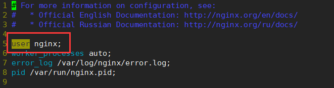
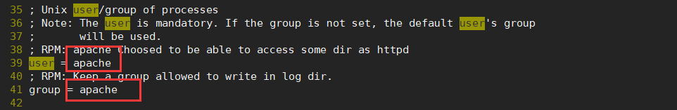
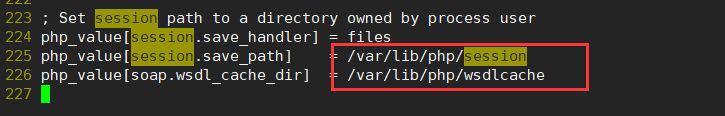
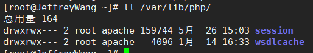

# 背景

在Linux环境下，我一般喜欢用yum快速搭建LNMP环境，但是搭建出来的环境存在一个问题，就是Nginx的默认执行用户是`nginx:nginx`，php-fpm的默认执行用户是`apache:apache`，当我用php保存一个文件时，文件所属自然而然是`apache:apache`，导致网站内的文件所属不统一，最终可能回导致很多由权限引起的bug。

# 解决方案

修改nginx或者php-fpm的执行用户即可，在nginx中，修改执行用户很简单，编辑`/etc/nginx/nginx.conf`，你会在顶部找到一个关键字`user`，编辑为想要的用户即可。  修改完毕之后，记得重启nginx，`service nginx restart` 修改php-fpm的执行用户也很简单，编辑`/etc/php-fpm.d/www.conf`，搜索关键字`user`，会在35行左右，找到运行的用户和用户组，修改为自己需要的就可以了。  修改完毕后，重启php-fpm，`service php-fpm restart`

### 出现问题

修改完php-fpm的运行用户后，重新访问网站，神奇的发现，登陆等一系列**涉及到session的东西都无法使用**。  我想，session失效？？服务器并没有更改session相关的配置，意思是服务器按照最原始的方式将用户session数据存放在某一个文件中，而我刚刚又更改了php的执行用户，会不会是这个用户没有权限写入session导致失效的呢？ 于是，抱着试一试的想法，我打开了`/etc/php-fpm.d/www.conf`，搜索`session`，发现session文件被存放在`/var/lib/php/`下。  ll命令看看情况`ll /var/lib/php/`，果不其然，所属为root:apache的文件，无法由nginx:nginx写入。   最后，使用`chown -R nginx:nginx /var/lib/php`，修改所属即可，这里我使用`nginx:nginx`是因为我把php-fpm的执行用户改成了`nginx:nginx`。

# 结语

Linux里边，文件权限没有设置正确，总是容易导致一些莫名其妙的问题，共勉！