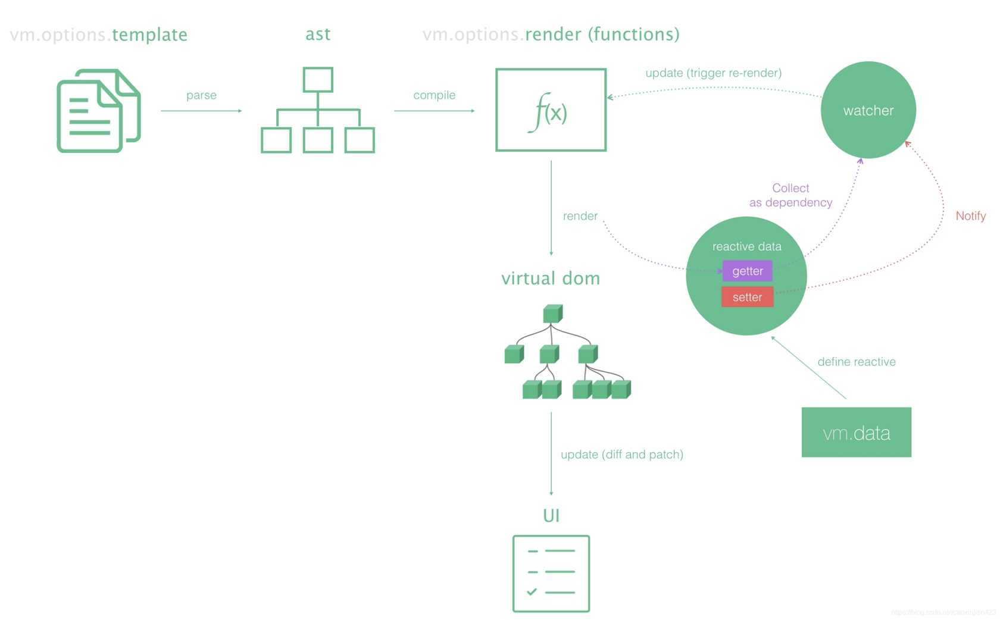

> 本文也发布于 learnku社区，博主最近有部分时间在该社区活跃，翻译文章，讨论问题等，learnku文章链接：https://learnku.com/articles/53633

## 目的

理解下 nextTick 的作用和几个简单的使用场景

## 正文

### 起什么作用？

在下次 DOM 更新循环结束之后执行延迟回调。在修改数据之后立即使用这个方法，获取更新后的 DOM。 我想各位都知道或了解 Vue 的渲染流程，Vue 在监听到数据变化后会重新渲染，配合 VDOM 更新真实的 DOM，而 nextTick 的触发时机就是在调用方法后的第一次重新渲染完毕后。 [](../static/uploads/2021/01/wp_editor_md_1131d00b8d98f0283656b40d6755cf20.jpg)

### 如何使用？

有两种使用方法，一种是传入回调，另一种是 Promise，官方使用示例如下：

```js
// 修改数据
vm.msg = 'Hello'
// DOM 还没有更新
Vue.nextTick(function () {
  // DOM 更新了
})

// 作为一个 Promise 使用 (2.1.0 起新增，详见接下来的提示)
Vue.nextTick()
  .then(function () {
    // DOM 更新了
  })
```

如果在 SPA（单文件组件） 中，可能是这个样子

```vue
<template>
  <div id="test">{{msg}}</div>
</template>

<script>
export default {
  name: 'app',
  data() {
    return {
      "msg": "Hello World!"
    }
  },
  method() {
    this.msg = "Hi World!";
    this.$nextTick(() => {
      console.log('DOM updated:', document.getElementById('test').innerHTML)
    });
  }
}
</script>
```

### 有什么使用场景？

需要等待渲染完成后执行的一些方法

#### 初始化绑定或操作 DOM

比如在 `created` 和 `mounted` 回调中，需要操作渲染好的 DOM，则需要在 `nextTick` 中执行相关逻辑，这在必须使用一些老的需要绑定 DOM 的库时很有用。 比如，在加载 UEditor 时，可能会这样玩

```vue
<template>
<script  id="container"  name="content"  type="text/plain">  这里写你的初始化内容  </script>
</template>
<script>
export default {
    mounted() {
        this.nextTick(() => {
            var ue = UE.getEditor('container');
        });
    }
}
```

#### 获取元素宽度

在 Vue 中获取元素宽度有两种方式，第一种是通过 `$refs[ref名称].style.width`，第二种可以使用传统操作 DOM 的方式获取，但这两者要获取到准确的元素宽度，则需要在 DOM 渲染完毕后执行。

```vue
<template>
<p ref="myWidth" v-if="showMe">{{ message }}</p>  <button @click="getMyWidth">获取p元素宽度</button>
</template>
<script>
export default {
  data() {
    return {
      message: "Hello world!",
      showMe: false,
    },
    methods: {
      getMyWidth() {
        this.showMe = true;
        //this.message = this.$refs.myWidth.offsetWidth; 
        //报错 TypeError: this.$refs.myWidth is undefined 
        this.$nextTick(()=>{
        //dom元素更新后执行，此时能拿到p元素的属性  
        this.message = this.$refs.myWidth.offsetWidth; })
      }
    }
  }
}
</script>
```

## 总结

虽说 Vue 的设计理念并不建议我们去直接操作 DOM，但有些场景下出现了特别令人迷惑的问题，理解 Vue 的渲染逻辑后，使用 nextTick() 可以解决。