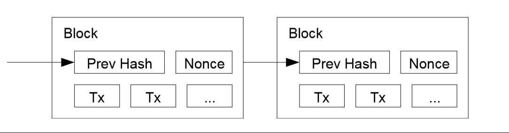
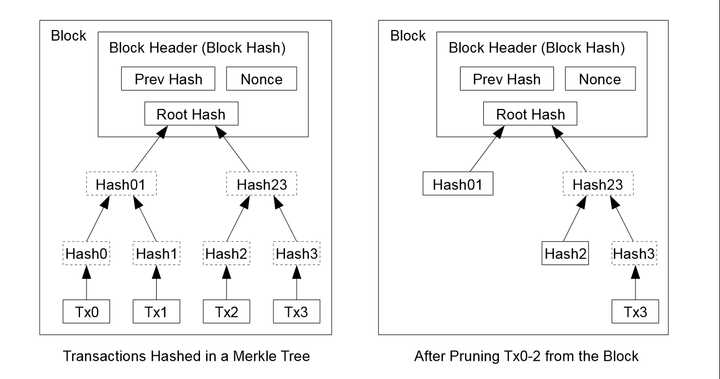
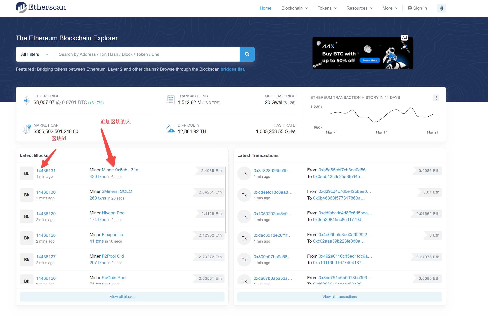
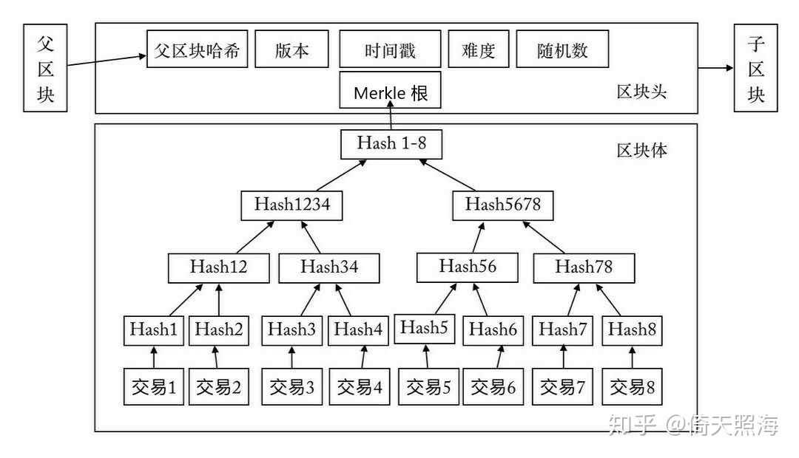
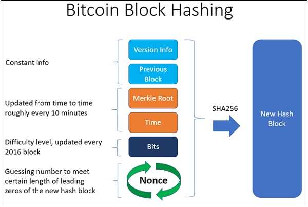

## 前言

真正接触区块链有大半个月了，几年前同做后端的朋友就提到过区块链以及当时大火的虚拟币这个概念，总是不可避免的与骗局、忽悠、违法等等主观印象联系在一起。 最近公司想探索一下 NFT 相关的业务，作为后端自然就需要对区块链的原理、发展、机制有一个整体的了解，而 **『区块链是怎样保证数据不被篡改的？』则是我最开始看比特币白皮书以及以太坊开发时最好奇的问题** ，故整理本篇博客。

## 何谓中心化

以日常生活中常见的交易为例，我们与商贩平时用微信和支付宝付款，是因为我们和商贩都信任这些服务背后的企业，每一笔交易都由我与商贩外的第三方做一个权威的认证，如果对这笔交易有异议，依旧有一个利益第三方可以从中协调或作证。所以我们交易的基础就是基于交易双方对第三方的信任，如果这个第三方服务不靠谱，比如他叫『微付宝』，交易发起方付完钱后，交易接受方没有收到钱，而且这个『微付宝』由于自身数据管理不当，把创建好的交易记录弄丢了，那这笔交易就没人能说的清了。 这里的**第三人就是交易的中心，上述交易就是中心化的交易**。如果我们不想要这个第三方介入两个人的交易，那么势必需要解决中心信任问题，假如 A 在路边摊买一斤橘子，买的时候有好多路人都看到了，看到的路人都可以为这笔交易作证，那就**不需要一个双方都信任的第三方了，这种机制就是去中心化的机制**。

## 何谓不可篡改？

比如我发起了一笔交易，**交易完成后，应该是所有人都认可，并且无法被否认的，这就是不可篡改**。传统的各种各样的 web 系统，淘宝京东、QQ、微信、王者荣耀，他们的数据都存在于各个厂的数据库中，如果各个厂的数据库遭遇黑客攻击，或者你的数据集中放置于郊区的机房，那么某个地方的机房由于不可抗力损坏或者断网了呢，数据也会存在丢失的风险。 互联网的一般做法是，在全球各地建立数据中心，如果一个掉线了，还有备用的机器，也就是分布式系统，需要尽可能保证其数据可用且同步，而这些工作都是由各自企业管理的，数据的修改维护也是由相关企业管理的，**所以在这种集中式的管理中，数据并不是不可篡改的**。 同样的，如果我们不想让数据由中心化的、利益相关的企业来管理，因为企业可能监守自盗或者保管不当；**那么我们就需要一套去中心化的、一旦数据达成共识就谁都不可篡改的机制，这些数据总是有带着先后顺序接踵而至的，所以这就像是一条被全世界公认的链，区块链就是想要实现这样的一条被全世界公认的历史记录不可篡改的数据链。**

## 区块链是如何工作的？

这里有一篇比特币白皮书的翻译，当初是跟着这篇文章入门的，非常有帮助： [https://zhuanlan.zhihu.com/p/25039679](https://zhuanlan.zhihu.com/p/25039679)

### 什么是区块

**数据需要一个存放他的数据结构，区块就是这样一个存储数据的数据结构**，跟链表类似，一个区块总有着下一个区块的地址，从前往后遍历，就能获取所有被公信的数据。  上图是比特币白皮书的区块结构截图，每一个区块有自己的hash，包含的交易信息，以及 Nonce，Nonce 是块结构中一个比较关键的参数，后续会慢慢揭晓。 平时我们使用的数据，诸如图片、文本、音乐等等，如果都塞到区块里边，那么路人需要记录的东西也太多了。因此在**链上只会存关键的可以代表一个具体数据资源的索引**，然后具体的资源就去可被信任的资源存放处获取，因为**这些数据不需要被所有人『记住』，这些数据发生的『交易/所属变化』才值得被大家记住**。  也就是图里表现的，区块里边只存储一个 rootHash，并且这些交易信息也会被压缩、重运算，因为老的交易记录已经被之前的区块公认了，随时溯源可查。

### 什么是交易

区块的示意图中，tx 指的就是交易，刚才也提到过，具体的数据不需要被所有人『记住』，这些数据发生的『交易/所属变化』才值得被大家记住，比如在比特币的世界里，比特币的每一次转账就是一笔交易，最近比较火热的 NFT ，**每一次转手、每一次生成，都是一笔交易，这些信息都需要被『记住』，也就是都需要被打包到区块，然后追加到大家公认的链上去，这笔交易就被大家认可了**。

### 什么是链，链式怎样形成的

**数据链就是由上面的区块一个个连起来而成的**，这个比较容易理解，那么这些链是怎样形成的呢，如果我想往里记录一些数据，应该怎样操作呢？ 这里就需要补充几个关键点了：

*   所有人都可以往链上追加新的区块
*   区块链最长的链被称为主链
*   主链上的信息是经过公认不可被篡改的

#### 所有人都可以往链上追加新的区块

任何一台已经联网的，可以运行区块链节点程序的机器，都可以参与区块链生成的这一过程，简单分为这么几步

*   拉取到需要打包的交易
*   将打包好的交易生成一个区块
*   用自己计算机的性能争夺记账权，让自己的区块能被认可

为什么要争夺记账权呢，因为每一个出块周期只能有一个区块能上链，也就是**全世界无数台计算机，最终只有一台计算机打包的块能够被全世界认可**。 以以太坊为例，[https://etherscan.io/](https://etherscan.io/) 大概十来秒，就会有一个新的区块被追加，以太坊也会奖励这个追加新区块的矿工。 

> 这里还会衍生出来另一个问题，为什么比特币控制在大约 10min 出一个新块，而以太坊十来秒就出一个新块呢？这是因为以太坊希望交易信息能尽快的上链，所以尽可能的压缩了出块时间，但也因此引入了新的问题，比如更多链分叉的出现，网络传播过程中大矿池的抢跑优势更严重等等。

##### 如何争夺记账权

所谓的争夺记账权有一个更专业和准确的名字叫做 **POW(Proof Of Work 工作量证明)**，还记得上文提到的区块中有个很重要的参数 nonce 么，这个 nonce 是矿工们挖矿时可以控制的一个参数，而且这个 Nonce 在出块时保证不会重复。那么如何证明自己的计算工作呢，矿工们把下面的信息打包在一起，version、前一个区块的 hash、Merkle 树根节点（存交易信息的）、时间戳、控制难度的字节以及 **Nonce**，这些信息中 **只有 Nonce 是矿工可变的，因为交易信息是从网络上拉取到的，生成的 Merkle 树算出的 hash 不可控**，如果找到一个 Nonce 可以将上述信息 hash 出来的结果 **与官方设置的难度目标小，那么你打包的区块就会追加到链上并被网络上其他节点所认可**。  那么如何找到这个 Nonce 呢，也很简单，在 Nonce 的可能范围内一个一个试，只需要判断算出来的 hash 是否与预期一致即可。所以一台计算机，或者说一个矿池的算力越高，同一时间内能尝试的 hash 次数就越多，算的就越快，就越可能拿到正确的 nonce。**节点拿到了这个 Nonce 就是这个节点付出的相关工作的证明。** 而难度目标和算出来的 hash 一样，都是一个 256 位的数字，随便拿一个 Nonce 算出来的结果要比固定的难度目标小，这个概率是 难度目标/2^256，进而可以通过该参数控制出块速度，如果出的太快了，就把难度目标降低，反之增加。 

#### 区块链最长的链被称为主链

为什么会有最长的链这么一说呢，因为区块链是一个大型的，全球的分布式系统，所有的数据同步和确认都需要通过网络，如果中国一个矿工打包了一个块并广播了出去，国内的节点间网速比较快，很快就认可了这个块，但几乎与此同时，美国的一个矿工也找到了 Nonce 并广播了出去，美国那边的节点就认可了美国矿工打包的新块，**而国内新打包的区块还没有通过网络传输到海外，在这样的场景下，链就出现了分叉**。 出现了分叉之后怎么办呢，答案是暂时放之不理，因为区块链最初是给比特币交易用的，比特币 10min 出一个块，所以近乎同时算出来 Nonce 的概率是很低的，**下一个块几乎不可能再次出现冲突，所以分叉的两条链中必然会有一条链更长，而新加入的节点和陪跑的节点只认最长的链，那么分叉就被中止了**。 这里可能有人会问，如果我就是想追着短一个区块的链继续工作呢？区块链不阻止你这样做，但因为大多数节点都只在最长链上工作了，最长链只会涨得比次长链快，在短一点的链上工作就没有什么意义了。

#### 主链上的信息是经过公认不可被篡改的

如果一个攻击者想生成一个比诚实链更长的替换链，可以将此问题看做赌博破产问题。 p = 诚实链发现下一个区块的概率 q = 攻击者发现下一个区块的概率 qz = 攻击者花费 z 区块追赶上了 qz = {1 if p <= q; (q/p)^z if p > q} 如果 p > q，也就是攻击者并未掌握 50%+ 的算力，追上的概率 P 可由泊松分布等公示推导而成 最后求得 P < 0.001 的时候，q = 0.1 时，z = 5，也就是说哪怕攻击者掌握了全网 10% 算力，等 6 个区块被算出来，他也绝对改不了。

#### 未被上链的区块，算力是浪费了么？

这是我听到区块链的追加区块规则后就在想，全世界无数的计算机在打包区块，结果一次出块只有一个计算机的区块会被认可，那这么多计算机的工作不就浪费了么。 从区块的角度来讲，**一个区块没有上链那么这个区块的信息确实无法被公认，这些工作就是被浪费掉了**，但这些算力会保障主链免受 51% 算力攻击，因为破坏者想要破坏这个系统时，只有超过全网 51% 的算力，才有可能篡改自己曾今的消费记录，**如果没有这么多的陪跑者，网络会更加脆弱**。

## 总结

区块链正是凭借其独特的运行机制，工作量证明机制，保障主链上的数据都是全网公认安全可信，不可篡改的，其中涉及到的概念都比较笼统不具体，但领会其中设计的深意和博弈，才是最重要的。

## 参考文档

[Bitcoin whitepaper](https://bitcoin.org/bitcoin.pdf) [比特币是什么](https://zhuanlan.zhihu.com/p/133202649) [What is a Nonce in Block Chain?](https://www.tutorialspoint.com/what-is-a-nonce-in-block-chain) [What Is PoW And What Are The Best PoW Coins?](https://paybis.com/blog/what-is-pow/)