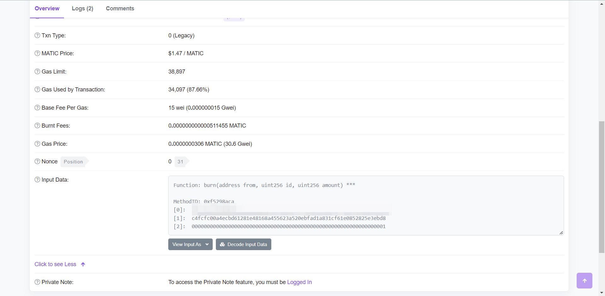

## 前言

在之前的博客中提到，我们不自建节点的时候，可以借助 Alchemy 的 API 实现交易发送、余额获取、合约操作等等功能。

而合约操作中，我们 **经常会根据合约 ABI 和函数调用参数编码为一串 byte** 传到交易的 data 属性中，关于 ABI 可以参考博客：[如何理解以太坊ABI - 应用程序二进制接口 | 登链社区 | 深入浅出区块链技术](https://learnblockchain.cn/2018/08/09/understand-abi/)

在生产环境实践中，**区块链上的交易一般都是要排队的**，不然会有交易累积或者覆盖等等问题，所以可能会有先计算好 InputData ，然后由统一的交易管理服务排队及发送交易。

而计算的过程是不需要 Alchemy 参与的，也就不必要引入一个带 web3 和 alchemy 逻辑的这么大的一个库，**只需要能编码合约方法的短小精悍的库即可**。同样的，交易服务上也应该有解码 InputData 的能力，以便判断业务场景。

比如 PolygonScan 上就提供了这样的解码服务，可以比较方便的看到参数



## 实践

### 编解码核心流程

这里的 ABI 是一个 JSON 数组，以此为例，定义了其中各种 input/output

```json
[
    {
        "constant": false,
        "inputs": [
            {
                "name": "newAddr",
                "type": "address"
            }
        ],
        "name": "setFoundationWallet",
        "outputs": [],
        "payable": false,
        "type": "function"
    },
    {
        "constant": true,
        "inputs": [],
        "name": "name",
        "outputs": [
            {
                "name": "",
                "type": "string"
            }
        ],
        "payable": false,
        "type": "function"
    },
    {
        "constant": true,
        "inputs": [],
        "name": "totalUnrestrictedAssignments",
        "outputs": [
            {
                "name": "",
                "type": "uint256"
            }
        ],
        "payable": false,
        "type": "function"
    }
]
```

编码大概流程是：

- 首先拿到 abi 数组数据

- 根据方法名称找到 abi 数据中对应的方法名、输入和输出

- 根据方法定义计算方法的 signature
  
  - 也就是 web3js abi 基础库的 encodeFunctionSignature 方法， [web3.eth.abi &mdash; web3.js 1.0.0 documentation](https://web3js.readthedocs.io/en/v1.2.11/web3-eth-abi.html#encodefunctionsignature)
  
  - 方法的 signature 是把方法字符串拼接起来，做一个 sha3 取一个4字节
    
    - web3 的实现：[web3.js/index.js at 1.x · ChainSafe/web3.js · GitHub](https://github.com/ChainSafe/web3.js/blob/1.x/packages/web3-eth-abi/src/index.js#L46-L59)

- 将参数列表配合方法的输入参数列表进行编码
  
  - 也就是 web3js abi 基础库的 encodeParameters 方法， [web3.eth.abi &mdash; web3.js 1.0.0 documentation](https://web3js.readthedocs.io/en/v1.2.11/web3-eth-abi.html#encodeparameters)
  - 大意是对应参数和方法对应的参数列表，循环生成最终的 0x 开头，符合标准的编码
    - web3 的实现：[web3.js/index.js at 1.x · ChainSafe/web3.js · GitHub](https://github.com/ChainSafe/web3.js/blob/1.x/packages/web3-eth-abi/src/index.js#L90-L142)

解码的大概流程是：

> 解码一定要 abi ，因为不拿 abi 的话，没法通过方法签名反过来找到方法的输入输出

- 首先拿到 abi 数组数据

- 根据 abi 数据算出来所有的方法签名

- 在 InputData 中截取出来方法签名

- 根据算出来的签名在 abi 所有签名中找到对应的方法名、输入和输出

- 将参数编码从 InputData 中截取出来并解码

- 对照方法的输入，返回对应格式的数据即可


参考代码实现：[ethereum-input-data-decoder/index.js at master · miguelmota/ethereum-input-data-decoder · GitHub](https://github.com/miguelmota/ethereum-input-data-decoder/blob/master/index.js)

Solidity 中对 ABI 的详细介绍：[Contract ABI Specification &mdash; Solidity 0.8.14 documentation](https://docs.soliditylang.org/en/develop/abi-spec.html)

### 编码部分

工作中主要用的 web3.js，官方提供了一个 [web3.eth.Contract &mdash; web3.js 1.0.0 documentation](https://web3js.readthedocs.io/en/v1.7.3/web3-eth-contract.html#methods-mymethod-encodeabi)

官方给了一个用例，`web3-eth-contract` 这个库也是独立的，位于

```js
var Contract = require('web3-eth-contract');

// set provider for all later instances to use
Contract.setProvider('ws://localhost:8546');

var contract = new Contract(jsonInterface, address);

contract.methods.somFunc().send({from: ....})
.on('receipt', function(){
    ...
});
```

但我们只需要编码的话，可以安装完这个包之后，只需要按照文档所述调用 `encodeABI` 即可

```js
var Contract = require('web3-eth-contract');
var contract = new Contract(jsonInterface, address);
contract.methods.mint('0xxxx', '0xxxx').encodeABI();
```

编码部分的核心代码在：

[web3.js/index.js at 1.x · ChainSafe/web3.js · GitHub](https://github.com/ChainSafe/web3.js/blob/1.x/packages/web3-eth-contract/src/index.js#L535-L579)

### 解码部分

解码部分 web3 有一个基础包 web3.eth.abi，但是调用不太方便

https://web3js.readthedocs.io/en/v1.2.11/web3-eth-abi.html

经过一番查找，有找到这么一个包，基于 ethers 实现的，可以做到传入一个 abi 数组以及 InputData 就获取到解码信息

https://www.npmjs.com/package/ethereum-input-data-decoder

给到的测试网站：

https://lab.miguelmota.com/ethereum-input-data-decoder/example/


再做一定的修改和封装

```js
const InputDataDecoder = require('ethereum-input-data-decoder');
function decodeMethodData(abi = [], inputData="") {
        const origin = new InputDataDecoder(abi).decodeData(inputData))
        if (!origin || !origin.method) {
            throw new ContractError('input data is not valid')
        }
        let paramsTmp = []
        for (let i = 0; i < origin.names.length; i++) {
            paramsTmp.push(`${origin.types[i]} ${origin.names[i]}`)
        }

        let params = origin.inputs.map(v => {
            if (v._isBigNumber) {
                return v.toHexString();
            } else {
                return v;
            }
        });

        return {
            method: `${origin.method}(${paramsTmp.join(',')})`,
            params: params,
        }
    }
```

就可以得到类似这样的结果：

```json
{
    "method": "burn(address account,uint256 id,uint256 value)",
    "params": ["0xsdf","0xdsxxxx","0x01"]
}
```

### 一些问题

解码的时候一定需要传入 abi ，但是合约的 ABI 不一定公开，交易服务目前是这样实现的：

- 用常见的预设的 abi 依次检测，如果解码出来数据，那就以此为准
  
  - 比如 1155、721 的预设 abi，循环检测即可

- PolygonScan 有 Verified Contract，可以通过 Polygon 获取并缓存
  
  - https://polygonscan.com/contractsVerified

- 我们只知道 contract 的情况下，用 https://eveem.org/api/ 可以获取到部分 ABI
  
  - 但实际验证下来不那么好用

## 总结

合约交易是以太坊中比较重要组成部分，而其中传递数据的 data 就是调用者跟合约交互的钥匙，整体就是将函数调用按照 abi 约定编译为一个二进制串。
