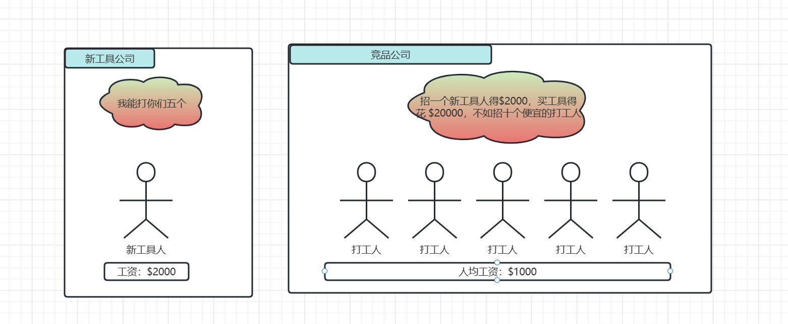
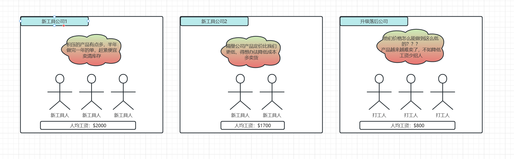
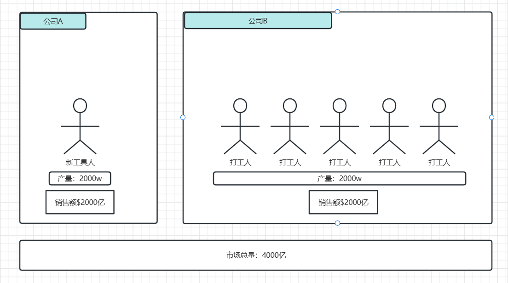
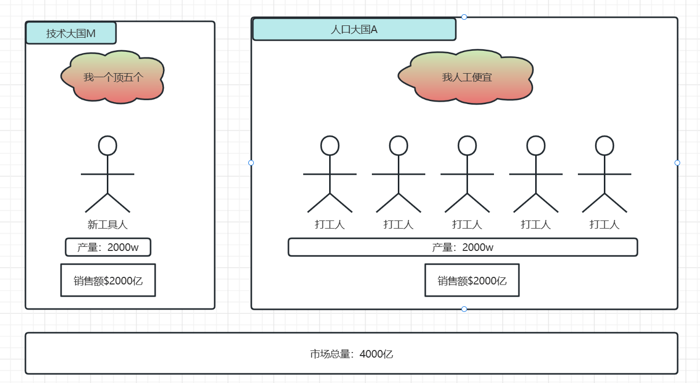

## 引子

ChatGPT 已经出圈大火很长一段时间了，这几个月我试着用它 **解决未知的程序 BUG、开发辅助工具供应公司业务、分析合同条款、解析算法题、生成 AIGC 的提示词等等**，虽然它有时候会胡言乱语、数据也不够即时，但是它展现出来的能力着实让人惊叹。

最近围绕 ChatGPT 有一些重磅话题：

- 微软发布了 Microsoft 365 Coplit 以提升常见办公场景的效率 [https://blogs.microsoft.com/blog/2023/03/16/introducing-microsoft-365-copilot-your-copilot-for-work/](https://blogs.microsoft.com/blog/2023/03/16/introducing-microsoft-365-copilot-your-copilot-for-work/)
- Github 发布了新版 Coplit 以通过 OpenAI 的能力自动生成代码以辅助提高开发效率：[https://github.com/features/copilot](https://github.com/features/copilot)
- 马斯克写了一封公开信，希望暂停比 GPT-4 更先进的 AI 大模型的开发，[https://futureoflife.org/open-letter/pause-giant-ai-experiments/](https://futureoflife.org/open-letter/pause-giant-ai-experiments/)
- 高盛资本在前几天发布了一份研究报告，大概内容是生成式人工智能会推动节约劳动成本、提高生产率，进而替代3亿人当前的工作 [https://www.key4biz.it/wp-content/uploads/2023/03/Global-Economics-Analyst_-The-Potentially-Large-Effects-of-Artificial-Intelligence-on-Economic-Growth-Briggs_Kodnani.pdf](https://www.key4biz.it/wp-content/uploads/2023/03/Global-Economics-Analyst_-The-Potentially-Large-Effects-of-Artificial-Intelligence-on-Economic-Growth-Briggs_Kodnani.pdf)

不难预料，在 ChatGPT 强大的基础能力下，适配各行各业的高效率工具必如雨后春笋般涌现，辐射到我们生活的方方面面；让我不禁想，**ChatGPT 代表的通用AI模型与早期互联网何其类似，本质上都是一种新的高效率工具，那么这些工具的出现对我们、对世界会带来什么样的影响？其中对打工人、对公司又有哪些机会呢？**

> 说在前面：以下内容仅为博主根据已掌握理论知识和个人经验的思考总结，但社会是复杂的，所作推论不一定严谨也不一定完全符合现实社会运转规律，欢迎大家和平的交流讨论；
> 
> 一如毛主席在《实践论》中说到：“人们的认识，不论对于自然界方面，对于社会方面，也都是一步又一步地由低级向高级发展，即由浅入深，由片面到更多的方面。”，博主也会在今后的变化中逐步完善、修正自己的想法。

## 高效率工具一定会带来更高的效益么？

这里有两个发生在生活中的例子：

- 博主所在公司近两年引入了 AWS 的 serverless 架构，在可扩展性增加的同时，后端的**运行、维护成本降到了之前的几十分之一**，在与竞品公司竞争时，在同样的产品的定价上就会有很大的优势，进而在竞争阶段取得较为有利地位
- 博主的父母早年在广州白云区从事服装产业相关的工作，从他们口中得知厂区有一个靠制衣厂起家的传奇老板，厂子做的很大，娶了两个媳妇，事业巅峰时间贷款定制了一套先进的机械制衣车间，**从生产效率和精度上都超过人工**，但最终由于没有匹配到足够的市场需求、机器维护成本过高、定制的机器又找不到合适的买家，最终破产返乡穷困潦倒

上面的例子一正一反，都引入了新的高效率工具，但一个能在以成本优势在市场中攻城略地，另一个却只能走向破产的结局，针对其中更深层次的原因，做了下面的思考。

## 高效率工具和新工具人

假设有一个**成熟稳定的专业细分市场**，当更高效率工具出现的时候，率先用这个工具的打工人（简称新工具人）工作 1h 生产出来的产品相当于业内中间位置打工人平均劳动时间 5h 的产品，按市场价销售后新工具人的老板就能拿到远超 5倍 的效益或者说利润，多出这部分利润会以工资、奖金的形式流入到新工具人的手里。

而业内未跟进的低产力公司之所以还能有口饭吃，甚至短期看业务蒸蒸日上，是因为他的平均**人工成本比较低**、供应链上有足够的**议价权**、**固有资产**还能持续创造价值，或者有其他关联绑定的配套业务、有固定的采购订单等等在**抹平劳动效率的差异**。

但从长期来看，随着新工具的不断推广，新工具人所在**公司的额外利润有一部分是从业内其他低生产力企业中扣出来的**，生产效率带来的生产成本差异会倒逼低产力企业降低用人成本或者跟进新技术，不愿意或者不能跟进的企业内部就会愈发内卷；因为在新工具的普及过程中，**五个打工人才能顶得上业内其他公司一个新工具人创造的效益**，利润降低的情况下下原来的普通打工人能拿到的收益相比之前就更低了。

## 新工具人的未来

新工具人在未来有多少，以及他们的**最终工资完全取决于训练一个普通人成为新工具人的成本**，包括教育成本、训练入行的成本、工具上手门槛等。

随着新工具在业内越来越普及，新工具人越来越多，**业内中间位置的打工人的生产效率也会得到提升**，如果新工具完全普及，无法通过新工具带来的效率收割足够多的利润，**没有格外利润的附加，他们的收益/薪资也会回归到供需市场下的一个平衡值。**（可参照《资本论》第一卷中的”工资“和”机器与大工业“小节）

**所以新工具人其实还是打工人，不过是第一批新工具人能够吃到工具效率提升带来的收益，收益提升的持续时间就看具体行业的高效率工具普及速度了。**

到这里可以想到，打工人的机会之一可能在这里：

- 引入或改造新工具，提升所在行业生产效率，拿效率提升带来的利润差的一部分

- 转向新工具维护和研发相关的岗位和企业，同样是拿利润差额的一部分

> PS：这里还有一个点，所谓新工具人也可能是由原岗位的打工人掌握了新工具转变而来；
> 
> 但随着高效率工具的普及和生产力的提升，市场需求没有增长的情况下，基数最大的原打工人的生存空间会越来越小，包括新工具人在内的整个行业需要的总的打工人也在减少，没有妥善的安置会带来产业工人失业等社会问题。

## 高效率工具的普及

假如我是高效率工具生产端的一个公司，我设计出一个十分高效的机器，名为**哈尔一号**，在**业内每人每分钟只能生产1件商品**，但用这台**机器每台每分钟能生产 1w 件商品**，不过机器售价 5000w，还需要高薪聘请 500 名经验丰富的研究生做日常维护和调试，而且**整个市场每年只能消耗2000w件商品**；可以预料，虽然新工具的生产效率足够高，但这样的新工具是无法投入市场并普及的，但如果我再迭代出一台新机器，名为**哈尔二号**，每分钟能生产 1000件商品，但是维护调试简单耐造，卖 500w，**市场稳定的情况下，哈尔二号的普及速度会远超哈尔一号，因为新工具引入成本低更低，上手和维护的门槛更低。**

| 工具   | 产出效率     | 引入成本  | 维护成本      | 上手门槛 | 预计推广速度 |
| ---- | -------- | ----- | --------- | ---- | ------ |
| 现有工具 | 1/min    | -     | -         | -    | -      |
| 哈尔一号 | 1w/min   | 5000w | 500w/year | 高    | 慢      |
| 哈尔二号 | 1000/min | 500w  | 50w/year  | 低    | 快      |

新工具的普及速度取决于**市场需求、新工具的上手门槛以及新工具引入的成本等因素**，这里的上手门槛特别指**针对某个细分专业从业者的上手门槛**。

| 项目   | 变化  | 对速度的影响 |
| ---- | --- | ------ |
| 市场需求 | 增加  | 加速     |
| 上手门槛 | 增加  | 减速     |
| 引入成本 | 增加  | 减速     |
| 维护成本 | 增加  | 减速     |

所以作为**高效率工具生产端**的公司，机会可能在这里：

- **降低新工具引入成本、维护成本和减少旧资产损失：** 高效率新工具的引入往往意味着部分旧工具的淘汰以及新工具购入维护成本，这对企业来说是一笔固定资产的损失，如果能想办法复用旧资产或降低引入维护成本，更新动力会更足，对应生产端的新工具销量会更高。

- **降低上手门槛：** 可以在某个细分专业从业者没有引入、使用新工具的专业素质时，将工具打造成他们顺手的模样。

做为**新工具消费端或生产效率可进一步提升**的公司，机会可能在这里：

- ChatGPT 类通用人工智能革命性的技术发展会给行业带来更多可能，目前可以看到的是会拉低定制高效率工具的门槛，**企业完全可以通过新技术自己改造出适合这个行业的最顺手的工具**

- 如果自身没有相关能力，或者行业生产过于复杂，暂时不在底层技术革命的辐射范围内，可以关注市场动向，**找到并适时引入合适的高效率工具**，在大公司调头空隙找到自己的生存之路

> 不过现实的情况会比上面的更复杂，比如有一家公司设计了一台白龙一号，穷尽公司所掌握的资源把工具做到了国内领先水平，每分钟能生产 1w件商品，维护调试简单耐造，但需要售价 5000w 才能收回成本；而国外同类产品擎天柱五号能做到每分钟 1.5w 件商品，售价只需要 3000w，常理来说白龙一号是竞争不过擎天柱五号的，但是纯国产化带来的地理优势、售后优势、自主可控等从更长远来看对国内环境和降低维护成本都更有利；
> 
> 不过这些理由也不足够让企业当冤大头，这时候政府就可能会做一些政策倾斜，让白龙一号在市场上更具吸引力，通过定向采购、补贴、牵头融资等手段让白龙一号所在的公司拿到足够的资本积累以继续更新迭代产品，以待未来完全取代甚至领先于国外产品可对外出口。

总之，**对新工具生产端公司来说，给客户创造了更大的价值/利润，客户才会购买你的产品**。因为买你的产品最终会变为客户的资产，客户看重的是这个资产在未来能够创造的利润，所以客户才会把未来未到手的增长利润中的一部分用来购买这个产品。

上面还是基于稳定市场中的思考和推论，如果碰上天灾人祸、外界因素导致需求骤降成本陡升，那么普及过程中的变化也会愈发凶猛，落后企业裁员、破产也不是不可能。

进一步思考，如果高效率工具普及的很快，产业升级迅速，导致行业总体产能极大提升，但市场需求没有与之匹配的增长甚至逐渐萎缩的情况下，生产相对过剩会让整个行业陷入泥潭；

如果一个国家中更多的行业加入到这个过程中，就会有金融危机的风险；但国家在这个过程中也不会袖手旁观，也会从全局出发调控市场避免危机的发生或消弱其影响。

扩展到国际视野，具体产业中的每一个国家可以类比为上面图片中的一家公司，不过其中关系会更加复杂，不会是一张图就能代表的了的，其中也会涉及到就业、劳动分配、社会稳定等等问题，博主了解不够就不做深入了。

### 关于门槛

门槛包括不同行业间竞争的专业壁垒还有行业内竞争的技术壁垒，目前以及未来的工具都较难跨越专业壁垒，更多的是在专业内部做迭代升级，鲜有跨专业的降维打击。

做一件事有了门槛就信息差，高效率工具生产端公司的机会可能在信息差这里，可以尝试打破领域隔阂，或者使用自己近水楼台的优势，为其他产业提供技术支持等等：

- 类似 **"互联网+Anything"** 的思路：想办法进入某个稳定的专业领域，跨入相近高度的专业门槛，再利用高生产力工具提高企业效率

- 类似 **“数码相机淘汰胶卷厂”** 的过程：从其他领域出发使用高生产力工具破除专业壁垒，开发出替代某个专业领域的产品，形成降维打击

- 类似 **“互联网外包”**：以技术的角度辅助业内企业解决问题，为不同的产业场景打造适合他们的提效工具。

- 类似 **“互联网平台”**：标准化、平台化的方式做出较为通用的解决方案并推广

- 使用新工具突破现有技术瓶颈，以新的工具去实现之前不敢想不能做的需求

## 总结

上一个拥有无尽潜力的新工具是互联网，我们尝试把他与之前的旧产业结合，也就是”互联网+“，这次以 ChatGPT 为引写了这么多，也许在未来这类技术更多的与现有产业落地结合后 ，也会在各行各业形成“AI+”的趋势吧。

社会发展在不停发展，工具在不断升级，生产力也在逐步的提升，而历史的车轮不会停止，身为时代中的微小个人，我认为适应变化、抓住变化带来的机会才是我们当前最应该做的。