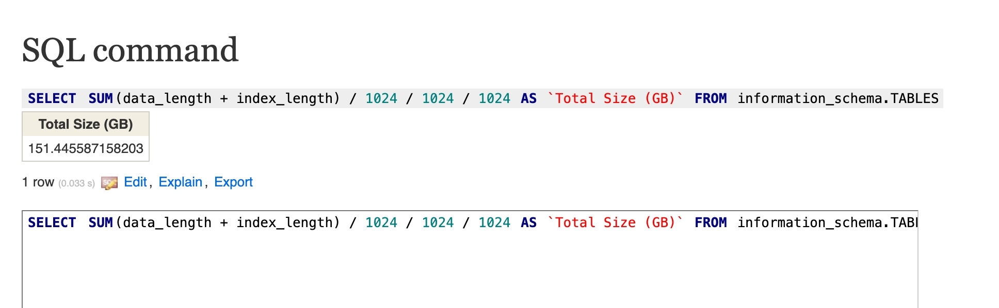
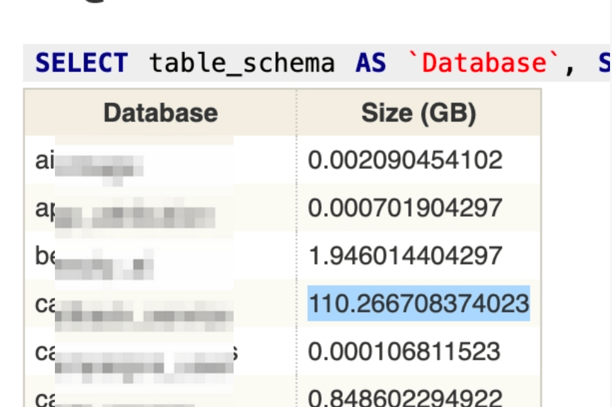
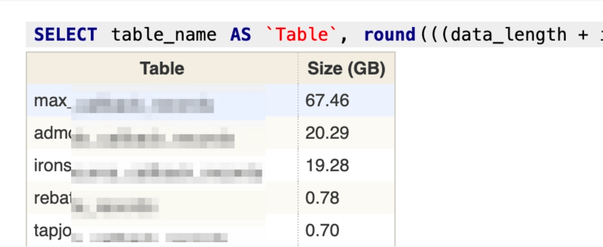
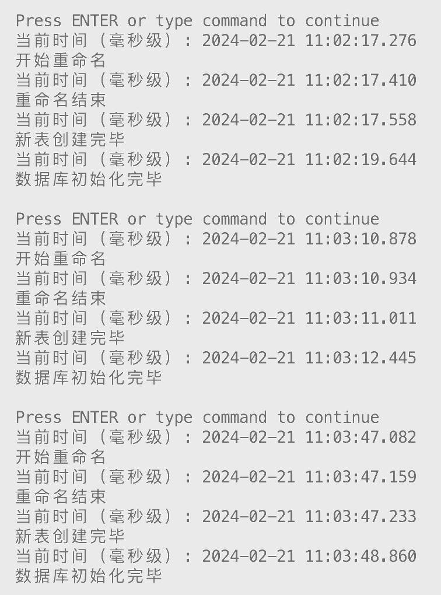

# 如何在一秒内安全清理九千万大表数据

## 前言

博主在工作中碰到这样一个问题，具体场景是公司的数据库需要做升级，而在做升级前需要 **对现有数据表进行数据清理** 以降低维护成本并减少迁移时间

​​在清理的过程中发现一张记录广告回调记录的大表，有 **9kw + 的数据**，以及 **两张 3kw+** 数据的大表需要清理，但同时也需要保留其中大概 3w 条数据，避免正在进行中的业务出现统计问题​

​​

## 如何找到大表

顺便提一下数据清理的时候常用的几个 SQL，通过这些 SQL 可以快速的定位到占用空间最大的数据库及其下占用最大的数据表，进而针对性的对数据进行清理

### 磁盘总占用

下面这个 SQL 可以快速的统计整个 SQL 占用了多少磁盘空间，原理是将所有库的数据空间和索引空间占用的存储加在一起

```sql
SELECT SUM(data_length + index_length) / 1024 / 1024 / 1024 AS `Total Size (GB)` FROM information_schema.TABLES;
```

​​

### 查数据库的存储占用

通过下列可以清楚的看到具体哪个库的存储占用最大

```sql
SELECT table_schema AS `Database`, SUM(data_length + index_length) / 1024 / 1024 / 1024 AS `Size (GB)` FROM information_schema.TABLES GROUP BY table_schema;
```

​​

### 查具体数据表的存储占用

最终会排查到某个表占用了多少存储空间，接下来就可以对不需要的数据进行定向的清理

```sql
SELECT table_name AS `Table`, round(((data_length + index_length) / 1024 / 1024 / 1024), 2) `Size (GB)` FROM information_schema.TABLES WHERE table_schema = 'inssrv' ORDER BY `Size (GB)` DESC;
```

​​

## 整理思路

删除数据无非有这么几条路：

* 【最直接】一条 SQL 删除：DELETE FROM xxx WHERE id < abcde;
* 【最慢】写一个脚本，脚本中循环调用 DELETE * FROM xxx WHERE id < abcde LIMIT 50000;
* 【可能中断】重建数据表并导入需要的老数据

考虑几个问题：

* 业务逻辑中会在什么场景下用到这个表，改动过程中会对这些业务造成多大的影响
* 对插入/查询性能的影响
* 主从同步性能问题
* 执行时间是否可接受
* 如果有从库，从库的同步模式、性能可能影响阻塞时间

这几个方案都有尝试，以及出于对生产数据需要抱有敬畏之心，千万注意：

* 不要直接动生产数据库，需要在测试环境或生产数据库的镜像上做尽可能贴合生产环境的验证
* 如果需要改动脚本参数，一定要在测试数据库上经过充分验证再上生产，不要过于自信（教训之一）

### 直接删除的方案

```sql
DELETE FROM xxx WHERE id < 90000000;
```

‍

本质上执行的操作如下：

* 开启事务
* 扫聚簇索引，从小到大找 id < 指定值的数据，批量打删除标记
* 期间新数据的读写可正常进行，Innodb 数据库下，**id &lt; 指定值的数据会由于 GAP 锁、行锁的原因无法更新**（但即将被清理的历史数据也不会更新）
* 提交事务，相关标记空间为可重用
* 执行 OPTIMIZE TABLE ，清理聚簇索引和非聚簇索引的无用数据并逐步刷到磁盘中
* 从库同步进行

毫无疑问这条 SQL 会一直卡在 MySQL 后台，公司目前使用 2c2g 的 AWS db.t3.small 规格的机器，根据数据量做了水平预估，9kw 数据大概需要 8.3h 可以处理完毕，**有相当大的 IO 开销**，而且没有后悔药可吃，KILL 掉之后会导致 DELETE 标记数据恢复缓慢，查询和更新性能受到影响

### 脚本批量删除

好处是不用改表结构，也不用担心读写中断的问题，这个脚本在 db.t3.small 300w 左右的数据下工作正常，脚本中的 SLEEP 、LIMIT 值需要根据主从库机器性能而定，需要在同性能、同负载下的测试环境中得到一个较佳的数字

```python
import pymysql
import time

master_db_config = dict(
    host="rds.amazonaws.com", port=3306, user="user",
    passwd="pwd", cursorclass=pymysql.cursors.DictCursor)

def get_mysql_connection(mysql_config) -> pymysql.connect:
    try:
        conn = pymysql.connect(**mysql_config, autocommit=True)
    except Exception as e:
        print(str(e))
        print(f"db conn err: {mysql_config}")
    else:
        return conn

con = get_mysql_connection(master_db_config)
con.select_db('db_name')
cursor = con.cursor()

sql = """DELETE FROM `table_records` WHERE `id` < 28374149 limit 50000; """

cursor.execute(sql)

num_rows_deleted = cursor.rowcount
while num_rows_deleted > 0:
    cursor.execute(sql)
    num_rows_deleted = cursor.rowcount
    if num_rows_deleted > 0:
        print(f"成功删除了 {num_rows_deleted} 行。")
    else:
        print("没有符合条件的行被删除。")
    time.sleep(4)
```

> 踩过的坑：
>
> * 测试最佳参数时，一定要注意从库与主库存在一定性能差异，否则差距逐渐拉大可能导致从库同步失败
> * 删除的越多，由于磁盘IO性能的约束会越来越慢，会出现读写阻塞的情况，也跟性能相关，所以采用此方案需要多在同级环境下验证，看下速度能否接受

在从库上，用 root 登录后，执行下面的语句可以拿到 `Seconds_Behind_Master`​ 属性，这个值的含义是从库与主库数据差异，单位是秒数，值越大说明从库数据离主库越久，久到主库把同步数据需要的 binlog 删除的话，从库就无法正常从主库同步，只能重建了，这种情况的外在表现为 `Seconds_Behind_Master`​ 越来越大，并且错误日志中显示同步失败，binlog 不存在，从库不在同步主库的信息

```sql
show slave status;
```

### 【推荐】临时表重建

大表的数据如果一点点删掉的话，会产生插入/查询性能问题、从节点同步性能问题，所以下面这个脚本的思路是：

* 重命名老表为临时表（底层是表空间文件改名，很快）
* 临时表不会有写入（auto_increment 不会增加），所以拿到建表语句后直接创建新表
  * 如果有主键自增，这里的 auto_increment 会继承之前的数据，不会存在冲突
  * 如果主键是 uuid 也不用管 auto_increment 的问题，该怎么插入就怎么插入
  * 改名和建新表时间特别短，在毫秒级，而且改名会等表意向锁解开才会执行，不会导致现有 session 出现问题，但改名后和建表成功之间的短短时间内，查询和插入可能失败
* 拿一些还有用的老数据写入到新表中，期间无法插入新数据，需要等老数据插入完毕 （innodb 间隙锁）
* 最后验证无误后，手动删除临时表即可，大概几秒钟（底层是表空间文件删除，也很快）

实测 9kw 级别的大表也能在极短时间内初始化完毕且不影响新增的数据，整体处理时间大概两秒内，从库的同步压力也很小

​​

```python
import pymysql
import re
import datetime
import time
import sys

def log(*args, **kwargs):
    current_time = time.time()
    formatted_time = datetime.datetime.fromtimestamp(current_time).strftime('%Y-%m-%d %H:%M:%S')
    millis = int((current_time - int(current_time)) * 1000)
    print(f"当前时间（毫秒级）: {formatted_time}.{str(millis).zfill(3)}")
    print(*args, **kwargs)


# 定义数据库连接参数
host = "rds.amazonaws.com"
username = "user"
password = "password"
database = "db_name"
port = 3306
# 创建数据库连接
db = pymysql.connect(host=host, user=username, password=password, db=database, port=port)
# 创建一个游标对象
cursor = db.cursor()

# 定义变量
table_name = 'table_records'
tmp_table_name = 'tmp_old'
num_records = 100000

# 检查 tmp_table_name 是否存在
cursor.execute(f"SHOW TABLES LIKE '{tmp_table_name}';")
result = cursor.fetchone()
if result:
    log(f"{tmp_table_name} 已存在，请检查")
    sys.exit()

log("开始重命名")
# 第一步：重命名 table_name 为 tmp_table_name
cursor.execute(f"RENAME TABLE {table_name} TO {tmp_table_name};")
log("重命名结束")

# 第二步：建立一个新表名为 table_name，表结构与 tmp_table_name 一致，并且自增主键 id 为 tmp_table_name 的最大自增id
# 执行 SHOW CREATE TABLE 获取旧表的创建语句
cursor.execute(f"SHOW CREATE TABLE {tmp_table_name};")
result = cursor.fetchone()
create_table_statement = result[1]

# 使用正则表达式将旧表名替换为新表名
create_table_statement = re.sub(f'CREATE TABLE `{tmp_table_name}`', f'CREATE TABLE `{table_name}`', create_table_statement)

# 执行创建新表的 SQL 语句
cursor.execute(create_table_statement)
log("新表创建完毕")

# 第三步：把 tmp_table_name 表中最新的 num_records 条数据插入到新建的 table_name 中
cursor.execute(f"INSERT INTO {table_name} SELECT * FROM {tmp_table_name} ORDER BY id DESC LIMIT {num_records};")

log("数据库初始化完毕")

# 提交到数据库执行
db.commit()

# 关闭数据库连接
db.close()
```

## 总结

MySQL 大表结构或数据操作都相对麻烦，容易把数据库搞死或者把表锁死，所以数据结构和历史数据的问题，有条件提前暴露，提前规划是最好的。

不得不改底层结构的时候，我们也要敬畏生产，较大的数据库更改一定要在测试环境过一遍，避免直接出生产环境问题。
