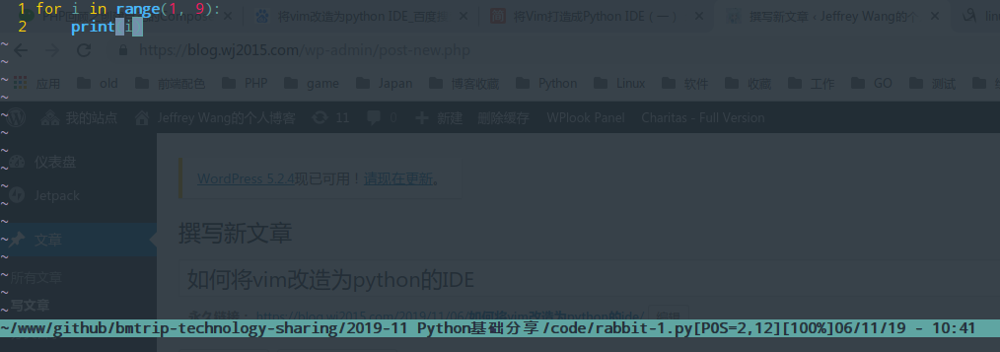
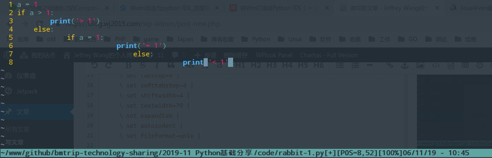
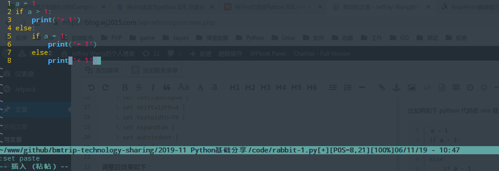
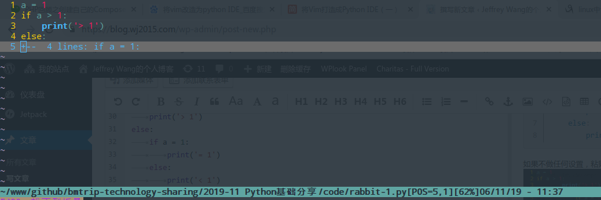
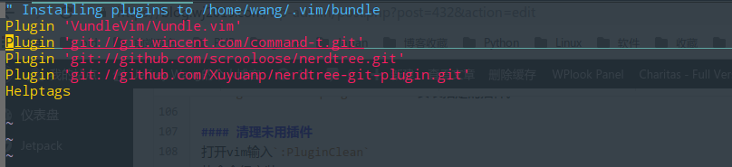
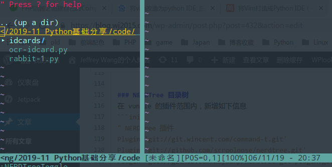
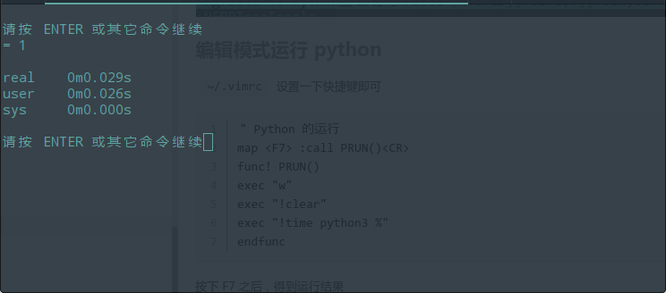

## 前言

博主最近尝试使用 Linux 办公，对比了一下现有 Linux 发行版，再结合之前的折腾经验，最后选择了 deepin 15.11，听说11月23号之后会发布 v20，到时候找机会再升级。 Linux环境下自带 python3.7，但是由于 pycharm 比较占内存，希望能找到一个轻量的 IDE 来编写代码，然后就想到了传说中的编辑器之神 VIM ！

## 基础操作

VIM 的三种模式，命令行模式、插入模式、末行模式 就不在此赘述了，常用快捷键可以参考如下博客：[https://www.cnblogs.com/wsxdev/p/11546217.html](https://www.cnblogs.com/wsxdev/p/11546217.html) Vim 可以自定义配置文件，个人的配置文件在 `~/.vimrc`，全局的配置文件在 `/etc/vim/vimrc` 中

### 自动缩进

Python对缩进比较严格，需要调整 `~/.vimrc` 中的配置

```ini
au BufNewFile,BufRead *.py
    \ set tabstop=4 
    \ set softtabstop=4 
    \ set shiftwidth=4 
    \ set textwidth=79 
    \ set expandtab 
    \ set autoindent 
    \ set fileformat=unix 
```

调整后效果如下： 

### 粘贴代码混乱

比如将如下 python 代码在 vim 插入模式下，粘贴进去

```python
a = 1
if a > 1:
    print('> 1')
else:
    if a = 1:
        print('= 1')
    else:
        print('< 1')
```

如果不做任何设置，粘贴进去是这样的，发现代码错乱  解决方法： 使用 `:set paste` 进入粘贴模式， `:set nopaste` 退出粘贴模式 粘贴模式下，粘贴效果如下 

### 代码折叠

编辑 `~/.vimrc`，新增如下：

```ini
" Enable folding
set foldmethod=indent
set foldlevel=99
" 通过空格键快速打开和关闭折叠
nnoremap <space> za
```

配置完毕后，按空格即可折叠代码 

## 插件篇

vim 默认的功能最多自带关键字颜色区分、自动补全等，想要一些强大的功能就需要强大的插件来完成。

### 如何管理插件

可以使用强大的 vundle 管理

##### 安装 vundle

```shell
$ git clone https://github.com/VundleVim/Vundle.vim.git ~/.vim/bundle/Vundle.vim
正克隆到 '/home/wang/.vim/bundle/Vundle.vim'...
remote: Enumerating objects: 1, done.
remote: Counting objects: 100% (1/1), done.
remote: Total 3140 (delta 0), reused 0 (delta 0), pack-reused 3139
接收对象中: 100% (3140/3140), 935.39 KiB  420.00 KiB/s, 完成.
处理 delta 中: 100% (1106/1106), 完成.
```

然后在 `~/.vimrc` 中加入此配置

```ini
" 在此设置运行时路径 
set rtp+=~/.vim/bundle/Vundle.vim
" vundle初始化 
call vundle#begin()
" 或者传递一个 Vundle 安装插件的路径
"call vundle#begin('~/some/path/here')

" 让 Vundle 管理 Vundle, 必须
Plugin 'VundleVim/Vundle.vim'

" 保持 Plugin 命令 在 vundle#begin 和 end 之间

"每个插件都应该在这一行之前  
call vundle#end()            " 这是必需的 
filetype plugin indent on    " 这是必需的 
" To ignore plugin indent changes, instead use:
"filetype plugin on
"
" Brief help
" :PluginList       - lists configured plugins
" :PluginInstall    - installs plugins; append `!` to update or just :PluginUpdate
" :PluginSearch foo - searches for foo; append `!` to refresh local cache
" :PluginClean      - confirms removal of unused plugins; append `!` to auto-approve removal
"
" see :h vundle for more details or wiki for FAQ
" Put your non-Plugin stuff after this line
```

#### 安装插件

打开vim输入`:BundleInstall`。 `:BundleInstall`命令会安装在`.vimrc`文件中列出来的所有插件。 `:BundleInstall <plugin-name>` 安装指定的插件。

#### 清理未用插件

打开vim输入`:BundleClean` 从命令行安装`vim +:BundleClean`。

#### 搜索插件

打开vim输入`:BundleSearch <text-list>` 从命令行搜索`vim +:BundleSearch <text-list>`。

### NERDTree 目录树

在 vundle 的插件范围内，新增如下信息

```ini
" NERDTree 插件
Plugin 'git://git.wincent.com/command-t.git'
Plugin 'git://github.com/scrooloose/nerdtree.git'
Plugin 'git://github.com/Xuyuanp/nerdtree-git-plugin.git'
```

编辑 `~/.vimrc` 新增如下：

```ini
map <F4> :NERDTreeToggle<CR>
```

然后在 vim 中执行 `:PluginInstall`，进入如下界面，等待安装完毕即可  所有操作完毕后，按 F4 即可在目录树和代码区切换 

### 编辑模式运行 python

`~/.vimrc` 设置一下快捷键即可

```ini
" Python 的运行
map <F7> :call PRUN()<CR>
func! PRUN()
exec "w"
exec "!clear"
exec "!time python3 %"
endfunc
```

按下 F7 之后，得到运行结果 

## 参考文献

[vim 插件管理器 Vundle 安装与配置](https://www.jianshu.com/p/1839f1fb3f08) [linux中vim编辑器三种模式及常用命令的使用](https://www.cnblogs.com/wsxdev/p/11546217.html)