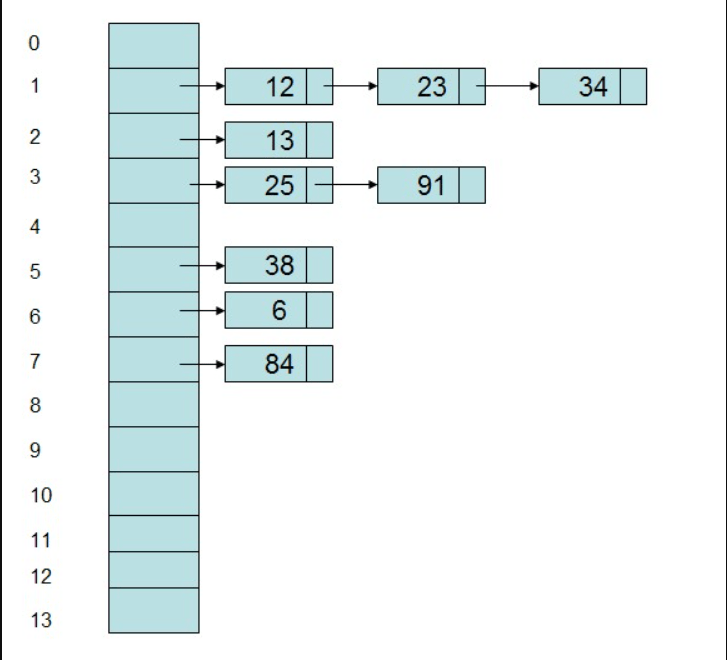
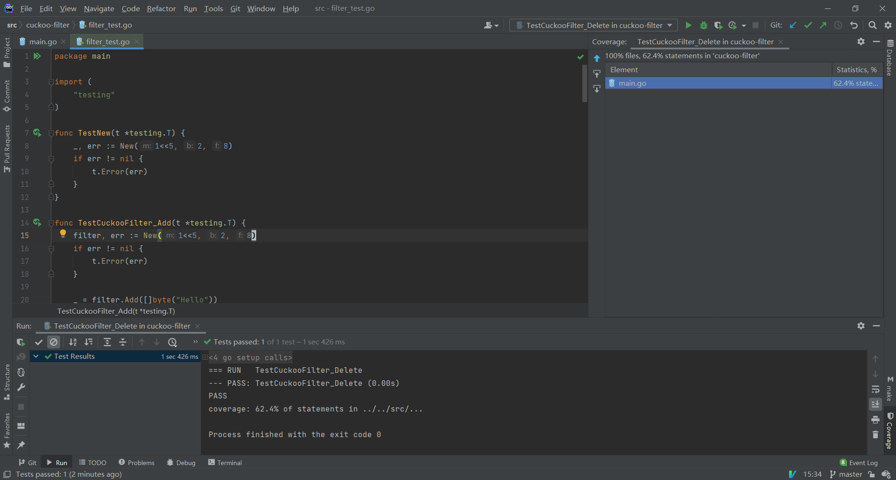

## 前言

业务中时常会有类似**检索一个元素是否在集合中这样的场景**，如果对时间和空间要求不高，我们可能会

- 查表，或者建唯一索引避免重复插入

- Redis 中使用 set 或者类似 hash 表的数据结构，将数据做 hash 后放到 key 上，以待后续查询

而当我们有**大量数据**需要判重并且业务**允许小概率误阳**判断的前提下

- 使用布隆过滤器做大量数据隶属判断，但由于底层实现的原因，无法删除历史已加入集合的数据

- 使用布隆过滤器的升级版，比如 counting bloom 就可以支持删除，但代价是三到四倍的空间占用

但 2014 年的时候，我们有了另一个选择，外网有位大哥提出了布隆鸟过滤器来解决大量数据判重的问题，并且支持删除

论文地址： https://www.cs.cmu.edu/~dga/papers/cuckoo-conext2014.pdf

国内翻译：[布谷鸟过滤器：实际上优于布隆过滤器](http://www.linvon.cn/posts/cuckoo/#sec31)

开源实现：[cuckoo-filter/cuckoofilter.go at main · linvon/cuckoo-filter · GitHub](https://github.com/linvon/cuckoo-filter/blob/main/cuckoofilter.go)

> 译者非常之有耐心，翻译到位并解答了我在理解过程中产生的部分疑惑，👍

通读论文和部分代码后，大致理解了其实现原理，觉着这个算法非常巧妙，就产生了自己动手实现加深理解的想法

通过博客记录下来，**同时也让读者能更快的掌握其中关键，不必通读论文和实现代码**。

> PS：上面给到的开源实现也是 Golang 做的，自定义参数的功能强大，但定制性高带来的就是底层实现复杂，不便于初学者理解

## 实现关键

### 数据结构

理解一个算法第一步就是了解它的存储结构，理解底层数据结构后，算法随后的巧妙构思都会围绕数据结构展开

#### 普通的 Hash

众所周知，普通的 Hash 表的工作原理是给内容生成一段 **“唯一”的摘要**，然后映射到索引数组上，并在数组的每一项上外挂链表或者数组开放寻址以解决 Hash 冲突

结构大概是这样的：



网上找了一篇介绍普通 Hash 的文章，如有不理解可通读此篇：[Hash表 - Matrix海子 - 博客园](https://www.cnblogs.com/dolphin0520/archive/2012/09/28/2700000.html)

#### 布谷鸟 Hash

而布谷鸟 hash 不同，分为如下几个概念

- 指纹：原始数据生成的 **“唯一” 标志**

- 桶：对应一个数组，每个桶可以存储多个指纹

- 桶数组：对应多个桶，可以**理解为一个存指纹的二维数组**

**【重点】** 布谷鸟 Hash 在插入数据时是这样维护桶数组的：

- 通过两个 hash 函数和原始数据 x 算出两个候选桶的位置，**称为 h1 和 h2**

- 从 h1 桶和 h2 桶中随机找一个放数据指纹

- 一个桶可存储的指纹是有限的
  
  - 如果没满，就往后追加存储即可
  
  - 如果存满了，就在桶中随机找一个位置，把原有的踢出去，新的指纹放到那个位置

- 如果过程中踢出去了（Kick out）一个元素，被踢出去的元素**就会找其对应的另一个候选桶**
  
  - 比如某个元素 x，**有固定的两个候选桶** hx1 和 hx2，通过随机选择顺利的**将指纹**存放到了 hx1 中
  
  - 然后新加了一个元素 b，有固定的两个候选桶 hb1 和 hb2，但不巧的是 **hb1 和 hx1 相同** （hb2 和 hx2 再次相同的概率比较低，所以先不考虑这个情况）
  
  - 假设元素b 对应的两个候选桶都满了，通过随机选择，选到了 hb1（也就是 hx1）中元素 x 的指纹，x 的指纹就被踢出去了
  
  - x 的指纹踢出去之后放哪儿呢，它还有**另一个选择就是 hx2**，通过 hash 算法找到 hx2
    
    - 如果 hx2 未满，将 x 的指纹加进去
    
    - 如果 hx2 满了，将 x 的指纹加进去，随机踢一个出去，重复上述过程，直到成功或者超出最大踢出限制


这样做就会始终**保证某个元素 x 对应的指纹一定在 hx1 桶或者 hx2 桶中**，查找和删除的时候就顺着这个规律找即可

由于布谷鸟哈希并不存储原文，仅存储 **“唯一”** 指纹，上述设计还有几个隐藏的问题：

- 布谷鸟 Hash 没有存储原文，踢出元素时我们只会获取到 hx1（或 hx2）以及指纹，**怎么从 hx1 推算出 hx2呢**？（或者反过来）

- 指纹是有长度限制的，如果设置过短，**指纹冲突的可能性就很高**，比如 8 位指纹最多能表示 2 的 8 次方个指纹，也就是 256 种，指纹的冲突会不会导致阳性率升高呢？

- 如果我们插入很多重复的元素，**他们的候选桶一样，指纹也一样**，踢来踢去也插入不进去，这个过滤器不就陷入死循环了？

##### 【重点】踢出时 h1 和 h2 候选桶之间的转换

**标准的布谷鸟 hash，确实是需要用两个 Hash 算法**，通过原文算出两个候选桶的

但布谷鸟过滤器里边，对这个 hash 计算做了优化，**设计了一个公式可以让 h1 和 h2 互相转换**

> h1(x) = hash(x), h2(x) = h1(x) ⊕ hash(x’s fingerprint)
> 
> 两者可以通过同一个公式相互转换
> 
> h1(x) = h2(x) ⊕ hash(fingerprint)
> 
> h2(x) = h1(x) ⊕ hash(fingerprint)

所以**踢出时只需要使用指纹和其中一个候选桶，就可以求到另一个候选桶的位置了**

##### 指纹过短的冲突

指纹设置很短造成表达能力有限，比如 8位最多表示 256 个指纹，但并不代表布谷鸟 Hash 整体表达能力有限

举个例子，假设我们做了 8 位指纹，有个 1024 个桶

假设有这么一个特殊数据 a 和 b，他俩指纹相同，但通过 hash 映射到的候选桶却不一定相同，**因为指纹的生成和桶的选取是两个过程**

假设再有一个特殊的数据 c 和 d，他俩指纹相同，而且两个候选桶也一致，那么这两个数据就会有**假阳性**，也就是如果我把 c 放入了布谷鸟过滤器中，我判断 d 是否存在于过滤器中，会返回 true

> 扩展下，可以根据参数推算出假阳性碰撞的概率，只有指纹相同和 hash 候选桶相同才会有阳性，引用论文的描述
> 
> 让我们首先推导给定一个含有q个项的集合在同一个桶中碰撞的概率。假设第一个项x有它的第一个桶 i_1 和一个指纹 t_x。如果其他 q-1 个项和这个项 x 有相同的两个桶，它们必须[3](http://www.linvon.cn/posts/cuckoo/#fn:3):
> 
> （1）具有相同的指纹，发生概率为 1/2^f
> 
> （2）第一个存储桶为 i_1或 i_1⊕h()，发生概率为2/m
> 
> 因此，这些q个项共享相同两个存储桶的概率为 (2/m·1/2^f)^q-1

##### 重复数据导致无限踢出

这个问题是切实存在的，假设每个桶可以存 b 个指纹，那么不难想到，重复元素最多能占用 2 * b 个空间，然后就踢不动了

所以要么就是先判重再加入，就不会有这个问题，所以要么就是重复数据不要超过预设

## 代码拆解

完整代码可于 [code/cuckoo-filter](https://github.com/wangerzi/blog/tree/master/source/static/assets/code/cuckoo-filter) 处查看，包含基础实现和部分核心用例

### 基础对象定义和操作

这个的约束都是有作用的，以便将实现复杂度约束在一篇博客的范围内

- 桶的数量转换为 2 的次幂是因为 **2的次幂取余数有快捷的位运算算法**

- 指纹的位数一定要是 8 的倍数，**因为 8 位是一个字节存起来比较方便**，指纹位数右移3就是需要的字节数了

- bucket 用 uint8，也是因为 **uint8 代表一个字节**，跟指纹的位数尽可能匹配起来，判空也方便，用 byte 也是一样的效果

```go
const MaxKickOut = 500

type CuckooFilter struct {
    m uint64 // 有多少个桶，强制转换为 2 的次幂
    b uint64 // 每个桶能存多少个指纹
    f uint64 // 每个指纹多少位，方便实现，需要是 8 的倍数，且小于 24 * 8，不然 hash 不够用
    bucket []uint8 // 实际存放桶的空间
}

// New m 为桶的数量，b 为每个桶内含指纹数量，f 为指纹长度，New(1<<10, 4, 8)
func New(m uint64, b uint64, f uint64) (*CuckooFilter, error) {
    // 确保 m 为 2 的 n 次幂，确保 f 为 8 的倍数
    if !checkPow2(m) {
        return nil, errors.New("m needs 2^n")
    }
    if remain, err := fastRemain(f, 8); err != nil || remain > 0 || f < 8 {
        return nil, errors.New("m needs 8*n and > 0")
    }
    return &CuckooFilter{
        m:      m,
        b:      b,
        f:      f,
        bucket: make([]uint8, m * b * (f >> 3)), // 分配的 bit 大小是 m * n * f/8
    }, nil
}

// checkPow2 检查是否为 2 的整次幂
func checkPow2(a uint64) bool {
    return a & (a-1) == 0
}

// fastRemain 求 a % b，前提是 b 需要是 2 的次幂, remain = a & (b - 1)
func fastRemain(a uint64, b uint64) (uint64, error) {
    if !checkPow2(b) {
        return 0, errors.New("fast remain failed")
    }
    return a & (b - 1), nil
}
```

##### 【核心】计算 h1 、 finger 以及 h2

计算比较简单，只是取了个巧，借助 sha256 返回的固定 32 字节数据，首 8 字节取出来**正好可以表达 uint64，对桶数量取余即可得到 h1**，后面还剩 24 个字节，**根据配置的 f 需要几个字节就取几个字节**

h2 就根据公式计算即可

```go
// CalcHash 计算 h1 的，具体分配到哪个桶，sha input % m
func (f *CuckooFilter) CalcHash(input []byte) (h1 uint64, err error) {
    // m 最多 8 字节，返回固定 32 字节的数据，取余即可
    sum := sha256.Sum256(input)

    // 取首 8 字节，转为 uint64
    h1, err = fastRemain(binary.BigEndian.Uint64(sum[:8]), f.m)
    if err != nil {
        return
    }
    return
}
// CalcFinger 计算指纹
func (f *CuckooFilter) CalcFinger(input []byte) []byte {
    sum := sha256.Sum256(input)

    return sum[8:8+f.f>>3]
}

// AltHash 计算 h2 以及 KickOut 的新位置的，h1 ^ sha finger % m
func (f *CuckooFilter) AltHash(h uint64, finger []byte) (uint64, error) {
    fingerHash, err := f.CalcHash(finger)
    if err != nil {
        return 0, err
    }

    return h ^ fingerHash, nil
}
```

#### 桶的基础操作

包含桶是否有空位，桶内是否有目标指纹，桶特定位置的指纹数据，桶特定位置替换等等基础功能，**本质上就是对 bucket 数组的操作**，供随后的上层操作调用

```go
// CheckBucketFull 检查桶是不是满的，检查最后一个 finger 即可
func (f *CuckooFilter) CheckBucketFull(index uint64) bool {
    lastFinger := f.GetBucketFinger(index, f.b - 1)

    for i := 0; i < len(lastFinger); i++ {
        if uint8(lastFinger[i]) != 0 {
            return true
        }
    }
    return false
}

// CheckBucketHaveFinger 检查桶内是否有这个指纹
func (f *CuckooFilter) CheckBucketHaveFinger(index uint64, finger []byte) bool {
    empty := f.GetEmptyFinger()

    for i := uint64(0); i < f.b; i++ {
        currFinger := f.GetBucketFinger(index, i)
        if bytes.Equal(currFinger, finger) {
            return true
        }
        if bytes.Equal(currFinger, empty) {
            // 空了就不用比了
            return false
        }
    }
    return false
}

// InsertBucket 桶内插入数据
func (f *CuckooFilter) InsertBucket(index uint64, finger []byte) error {
    empty := f.GetEmptyFinger()
    // 找到一个空的位置就可以放进去了
    for i := uint64(0); i < f.b; i++ {
        currFinger := f.GetBucketFinger(index, i)
        if bytes.Equal(currFinger, empty) {
            f.ReplaceBucket(index, i, finger)
            return nil
        }
    }
    return errors.New("bucket fulled")
}

// ReplaceBucket 替换 Bucket 中某个 finger
func (f *CuckooFilter) ReplaceBucket(index uint64, bucketIndex uint64, finger []byte) []byte {
    origin := f.GetBucketFinger(index, bucketIndex)

    for i := 0; i < len(finger); i++ {
        origin[i] = finger[i]
    }

    return origin
}
func (f *CuckooFilter) GetBucketFinger(index uint64, bucketIndex uint64) []byte {
    fingerByte := f.f>>3
    bucketBase := index * f.b * fingerByte

    return f.bucket[bucketBase+bucketIndex*fingerByte:bucketBase+(bucketIndex+1)*fingerByte]
}

func (f *CuckooFilter) GetEmptyFinger() []byte {
    fingerByte := f.f>>3
    return make([]byte, fingerByte)
}

// RandomReplaceInFullBucket 随机替换满桶中的某个 finger
func (f *CuckooFilter) RandomReplaceInFullBucket(index uint64, finger []byte) (replaceFinger []byte, err error) {
    if !f.CheckBucketFull(index) {
        return nil, errors.New("bucket not full")
    }
    randomIndex := uint64(rand.Intn(int(f.b)))

    replaceFinger= f.ReplaceBucket(index, randomIndex, finger)

    return
}

// DeleteFingerFromBucket 从桶中删除 finger，类似数组操作
func (f *CuckooFilter) DeleteFingerFromBucket(index uint64, finger []byte) error {
    empty := f.GetEmptyFinger()

    for i := uint64(0); i < f.b; i++ {
        currFinger := f.GetBucketFinger(index, i)
        if bytes.Equal(currFinger, finger) {
            f.ReplaceBucket(index, i, empty)
            for j := i; j < f.b; j++ {
                if j == f.b-1 {
                    f.ReplaceBucket(index, j, empty)
                } else {
                    nextFinger := f.GetBucketFinger(index, j + 1)
                    f.ReplaceBucket(index, j, nextFinger)
                }
            }
            return nil
        }
    }
    return errors.New("finger not found")
}

// GetHashFinger 获取 finger
func (f *CuckooFilter) GetHashFinger(input []byte) (h1 uint64, h2 uint64, finger []byte, err error) {
    h1, err = f.CalcHash(input)
    if err != nil {
        return
    }

    finger = f.CalcFinger(input)

    h2, err = f.AltHash(h1, finger)

    return
}
```

### 判断包含

在上面实现的桶基本功能前提下，包含就很简单了，看是不是在 h1 和 h2 里就好

```go
// Contain 是否包含
func (f *CuckooFilter) Contain(input []byte) (bool, error) {
    h1, h2, finger, err := f.GetHashFinger(input)
    if err != nil {
        return false, err
    }
    return f.CheckBucketHaveFinger(h1, finger) || f.CheckBucketHaveFinger(h2, finger), nil
}
```

### 插入

插入相对比较复杂，整体思路也围绕着

- h1 和 h2 有空的就放进去

- 没有空的就随机把元素踢出去，把换出来的元素换个地方存

```go
// Add 加一个
func (f *CuckooFilter) Add(input []byte) error {
    h1, h2, finger, err := f.GetHashFinger(input)
    if err != nil {
        return err
    }

    h1Full := f.CheckBucketFull(h1)
    h2Full := f.CheckBucketFull(h2)

    rand.Seed(time.Now().UnixNano())
    if !h1Full || !h2Full {
        index := uint64(0)
        if !h1Full && !h2Full {
            // 随机选择 h1 和 h2，有空位就插入
            if rand.Intn(2) > 0 {
                index = h1
            } else {
                index = h2
            }
        } else if !h1Full {
            index = h1
        } else {
            index = h2
        }
        // 放到桶里
        err = f.InsertBucket(index, finger)
        if err != nil {
            return err
        }
        // 成功
        return nil
    } else {
        // kick out
        // 随机选择 h1 和 h2
        currIndex := uint64(0)
        if rand.Intn(2) > 0 {
            currIndex = h1
        } else {
            currIndex = h2
        }
        currFinger := finger
        for i:= 0; i < MaxKickOut; i++ {
            if f.CheckBucketFull(currIndex) {
                // 满了没空位，就随机替换出来
                currFinger, err = f.RandomReplaceInFullBucket(currIndex, currFinger)
                if err != nil {
                    return err
                }

                // 把换出来的数据，换一个桶存
                currIndex, err = f.AltHash(currIndex, currFinger)
                if err != nil {
                    return err
                }
            } else {
                // 有空位就插
                err = f.InsertBucket(currIndex, currFinger)
                if err != nil {
                    return err
                }
                // 成功
                return nil
            }
        }

        return errors.New("over max kick out")
    }
}
```

### 删除

整体逻辑就是，h1 和 h2 能找到就删，找不到就删不了

```go
// Delete 删除一个
func (f *CuckooFilter) Delete(input []byte) error {
    h1, h2, finger, err := f.GetHashFinger(input)
    if err != nil {
        return err
    }

    // 如果能找到的话，就删掉
    if f.CheckBucketHaveFinger(h1, finger) {
        return f.DeleteFingerFromBucket(h1, finger)
    }
    if f.CheckBucketHaveFinger(h2, finger) {
        return f.DeleteFingerFromBucket(h2, finger)
    }

    return errors.New("finger not found")
}
```

### 测试用例

最基本的用法如下，结果应该是 `false, true`

```go
func main() {
    filter, err := New(1<<5, 2, 8)
    if err != nil {
        fmt.Println("err", err)
        return
    }

    _ = filter.Add([]byte("Hello"))
    _ = filter.Add([]byte("World"))

    res1, err := filter.Contain([]byte("hello"))
    res2, err := filter.Contain([]byte("Hello"))

    if err != nil {
        fmt.Println("filter contain", err)
        return
    }

    fmt.Println("hello", res1, "Hello", res2)
}
```

扩展一些特殊的情况，比如插入大量重复数据造成的踢出超限，判重，删除等等，可参见代码中的 `filter_test.go`

执行 `go test .` 运行测试用例的结果



## 总结

布谷鸟过滤器，算法确实挺奇妙的，但理解了其中数据结构以及核心的 h1 、h2 、finger 之间的运算和转换关系，就会变的简单起来。
