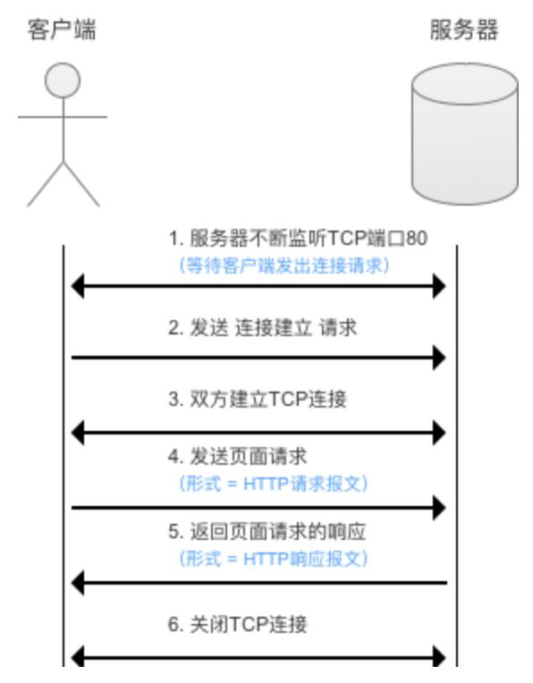
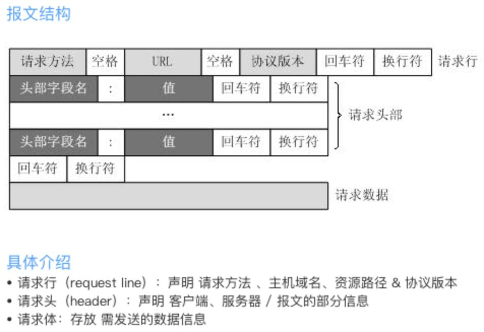
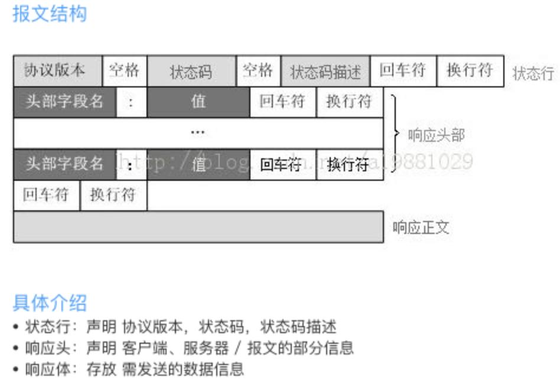
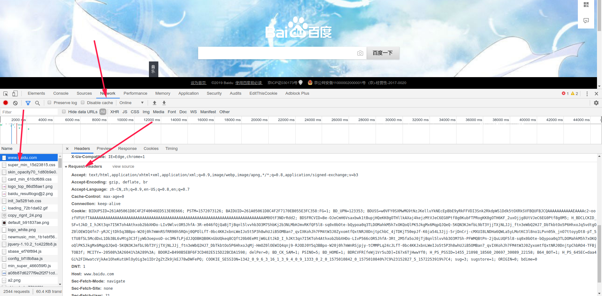
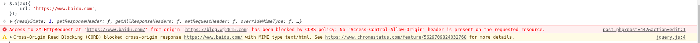
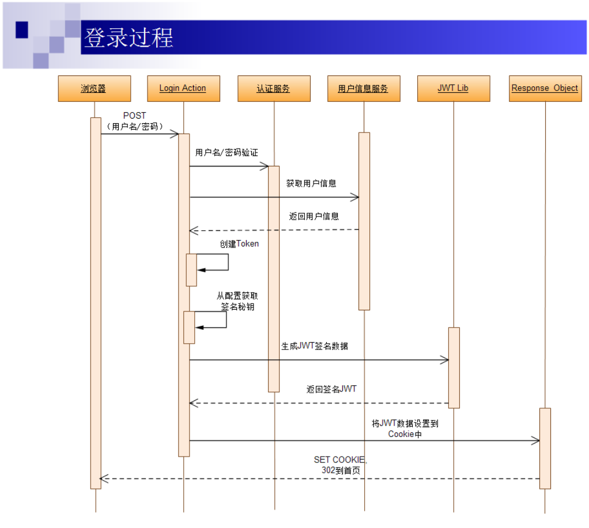
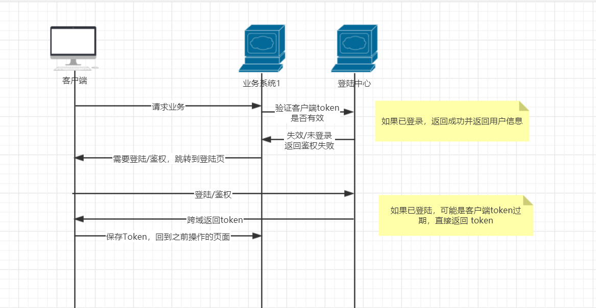
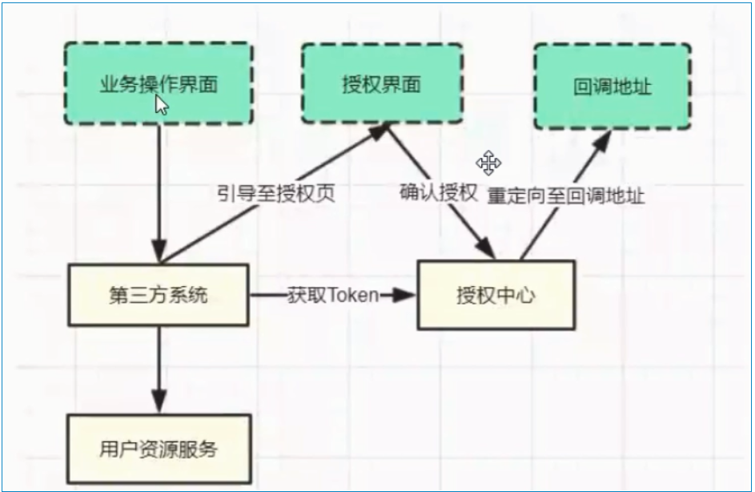
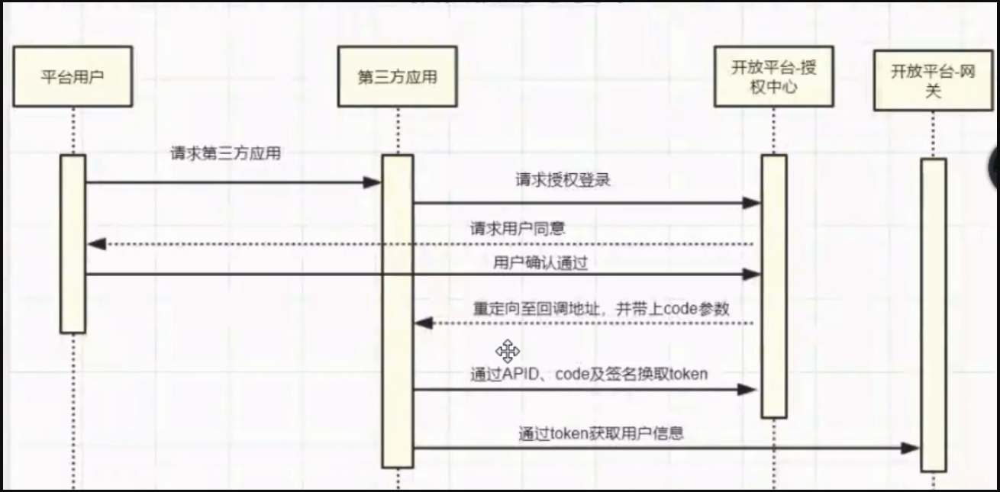

## 前言

本文主要针对 web 授权登陆部分从原理到实现的探讨，首先会从 HTTP 协议的原理讲起，再根据 HTTP 协议的特点探讨如何进行登陆凭证传输和授权；最后整理下常见的授权登陆模式。

## 一些准备

### 了解下 HTTP 协议的特点

#### 什么是 HTTP 协议？

HTTP 协议，就是浏览器与 web 服务器交互的一种规范；浏览器需要根据 HTTP 协议的规范发起请求，服务器也需要根据 HTTP 协议的规范返回响应数据； 

#### 一个 HTTP 请求包含了什么信息？

首先看一个 HTTP 请求的样例

```text
POST http://www.baidu.com?id=1 HTTP/1.0
Accept: text/html
Accept-Encoding: gzip, deflate, br
Accept-Language: zh-CN,zh;q=0.9,en-US;q=0.8,en;q=0.7
Cache-Control: max-age=0
Connection: keep-alive
Cookie: BIDUPSID=261A05061D8C4F2F40046ED513E0E666;
DNT: 1
Host: www.baidu.com
Sec-Fetch-Mode: navigate
Sec-Fetch-Site: none
Sec-Fetch-User: ?1
Upgrade-Insecure-Requests: 1
User-Agent: Mozilla/5.0 (X11; Linux x86_64) AppleWebKit/537.36 (KHTML, like Gecko) Chrome/78.0.3904.97 Safari/537.36

name=1&password=2
```

结构如下：  请求方法包含， GET/POST/PUT/PATCH/DELETE/OPTIONS 等，其余相关知识就先不展开了。

#### 一个标准的 HTTP 服务器响应是怎样的？

首先看一下样例

```text
HTTP/1.0 200 OK
Cache-Control: private
Connection: Keep-Alive
Content-Encoding: gzip
Content-Type: text/html;charset=utf-8
Content-Length: 12345
Date: Fri, 29 Nov 2019 07:26:29 GMT
Expires: Fri, 29 Nov 2019 07:26:29 GMT
Server: BWS/1.1
Set-Cookie: BDSVRTM=104; path=/
Set-Cookie: BD_HOME=1; path=/
Set-Cookie: H_PS_PSSID=1455_21098_18560_20697_30089_22158; path=/; domain=.baidu.com
Strict-Transport-Security: max-age=172800
Traceid: 1575012389282792346617750770023830247734
Transfer-Encoding: chunked
X-Ua-Compatible: IE=Edge,chrome=1

<html>
.....
</html>
```

结构如下：  常见响应状态码包括，200/404/502/500/304/302 等

#### HTTP 协议的特点

HTTP 是无状态的，这次请求和上次请求完全分离；服务器无法判断用户的身份，需要在浏览器的请求头中以特殊的标记获知用户的身份(鉴权)。

##### 如何在 Chrome 中查看请求头、响应头等信息

打开 chrome 浏览器，进入 `http://www.baidu.com`，按 `F12`再 `F5` 刷新一下，点击 `Network`页签，选择第一个请求，下滑找到 `Request Headers` 的内容如下。 

### 什么是域名，什么是子域名，什么又是跨域

域名可以当做是服务器的地址别名，域名首先被 DNS 服务解析到 IP，通过 IP 就能与服务器进行通信了；比如本站的域名就是 `wj2015.com`，是 `.com` 顶级域下的一级域名；`blog.wj2015.com` 是本博客的域名，是 `wj2015.com` 下的一个二级子域名，也叫作二级域名； 博主之前使用过的 `wj2015.com.cn`，这是一个`.cn`顶级域下的二级域名，`blog.wj2015.com.cn` 就是其下的一个三级子域名。

#### 跨域的简短介绍

跨域是浏览器上为了用户安全提出来的一个概念；满足如下三个条件之一的，即跨域：

*   不同域名(如：http://blog.wj2015.com 与 http://excel.wj2015.com)
*   不同端口(如：http://blog.wj2015.com:80 与 http://blog.wj2015.com:8080)
*   不同协议(如：http://blog.wj2015.com 与 https://blog.wj2015.com)

如果请求的服务端与当前页面是跨域的，那么则无法通过正常方法发送 GET/POST 等请求，比如： 在 `blog.wj2015.com` 的页面中，请求 `www.baidu.com` 的某个接口

```javascript
$.ajax({
    url: 'http://www.baidu.com',
});
```

报错结果如下：

> Access to XMLHttpRequest at 'https://www.baidu.com/' from origin 'https://blog.wj2015.com' has been blocked by CORS policy: No 'Access-Control-Allow-Origin' header is present on the requested resource.



##### 为何提到跨域？

因为实际项目中的登陆授权，可能横跨多个业务；而多个业务可能是跨子域名的、跨端口的、甚至是需要给任意域名的请求者授权，所以还需要了解下哪些请求不受跨域限制。 不受跨域限制的一般都是资源类的数据

*   script 脚本加载，可以用 JSONP 实现跨域
*   img/video/audio 媒体资源加载，可以隐藏式的伪造其他域名的 Get 请求
*   iframe 嵌入式页面，但是跨域情况下，父页面不能获取子页面数据，可以用来隐藏式的伪造其他域名的 Post 请求

### 可别再 Cookie 和 Session 傻傻分不清了

Cookie 是存储在 **浏览器端** 的少量数据，每次请求均会将其放置于 `Request Headers` 中的 `Cookies:`中，数据以 `;` 分隔 Session 是存储在 **浏览器端** 的数据，通过客户端上传的 SessionId（凭证）查找存储于服务器对应的数据，服务端可以在响应头 `Set-Cookie` 中控制浏览器端的 Cookie 。 Cookie 和 Session 有关系呢？之前提到 HTTP 是一个无状态的协议，服务器想要确认你是否是之前请求的那个客户端，就需要要传输一个凭证（可以理解为唯一的身份证号），而常规做法就是把这个凭证存放在 Cookie 中，每次请求都会自动带上凭证，后端自动匹配凭证，获取 Session 信息。

## 登陆授权

### 什么是凭证

凭证就相当于服务端给客户端颁发的临时身份证号，用来标记客户端身份

### 常见授权登陆模式

安全性问题 颁发凭证大致可分为两种类型，一种是无论用户是否登陆都颁发凭证；另一种是只有通过验证才会颁发访问凭证，两者仅有细微区别。

#### Cookie、Session 模式

上面提到了，Session 是通过 Cookie 中的 SessionId 来标记用户信息的，所以会存在如下的优势和劣势 优势：

*   发起请求浏览器自动带上凭证，处理起来统一方便
*   做一定配置可以实现跨子域名授权

劣势：

*   每次请求都会带 Cookie，哪怕在图片、js 等资源加载时也会带上，有一定的资源浪费
*   无法做到跨域名（非子域）授权
*   有平台限制，部分平台没有 Cookie 概念，比如小程序

#### AccessToken 模式,使用自定义 Header 携带凭证

这种模式一般是通过登陆验证后会颁发给客户端的凭证，客户端自行存储，比如 Web 浏览器就可以选择存在 LocalStroage，SessionStorage 等，请求的时候放到 Headers、Get 参数等。 优势：

*   多平台通用，安卓、IOS、PC 客户端、小程序等都能使用
*   可以做到跨域名授权
*   相比 Cookie 方案，减少请求中携带 Cookie 的数据
*   防 CSRF 劣势：
*   前后端均需要加特殊逻辑处理 Token 的有效性、获取对应数据等，会造成一定麻烦

#### JWT（JSON WEB TOKEN）

JWT 是一种将数据完全存放于客户端的一种认证机制，使用签名保证数据准确性； JWT 数据由头部、荷载、签名组成

##### 头部

主要指定版本以及签名方式

```json
{
"typ": "JWT",
"alg": "HS256"
}
```

需要进行 Base64 生成字符串

##### 荷载

用于存放实际数据，过期时间，签发时间等

```json
{ "iss": "Online JWT Builder",
  "iat": 1416797419,
  "exp": 1448333419,
  "aud": "www.example.com",
  "sub": "jrocket@example.com",
  "GivenName": "Johnny",
  "Surname": "Rocket",
  "Email": "jrocket@example.com",
  "Role": [ "Manager", "Project Administrator" ]
}
```

依旧需要 Base64 生成字符串

##### 签名

将上方得到的两个字符串拼接在一起，根据 头部 定义的加密算法以及服务器上保护良好的密钥，生成签名 将头部、荷载、签名拼接在一起，即为 JWT 优势：

*   服务器无需存储 SESSION 数据
*   密钥保管良好的话，安全性有保障，不用担心用户端篡改数据 劣势：
*   每次获取、颁发、修改都需要校验/生成签名，造成修改数据很麻烦
*   依附 Cookie，容易造成请求头部过大等问题



### 跨子域名解决方案

默认情况下，Cookie 仅对当前域名有效，当服务端返回`Set-Cookie` 颁发凭证的时候，配置 `Path:/`，则其顶级域名即会带上设置的 Cookie 信息，即可简单实现跨子域名授权； 由于 Accesson-Token 跨域限制，如果需要跨子域名，或者完全跨域 需要用下面一种 跨域登陆中心 的解决方案。

### 跨域登陆中心解决方案



### Oauth2

Oauth2 也是一种跨域的登陆中心解决方案，日常见到的微信授权登录、QQ 授权登陆等均使用此模式。 Oauth2 一共有四种授权模式，授权码模式、简化模式、密码模式、客户端模式； 下方流程图仅针对微信的三方登陆，更加具体的 Oauth2 可查阅下方参考资料；  

## 参考资料

[HTTP 学习笔记](https://www.jianshu.com/p/cc1fea7810b2) [谈谈 OAuth 2.0 与微信授权登录](http://jalan.space/2019/05/03/2019/oauth2.0-and-wechat-oauth/)