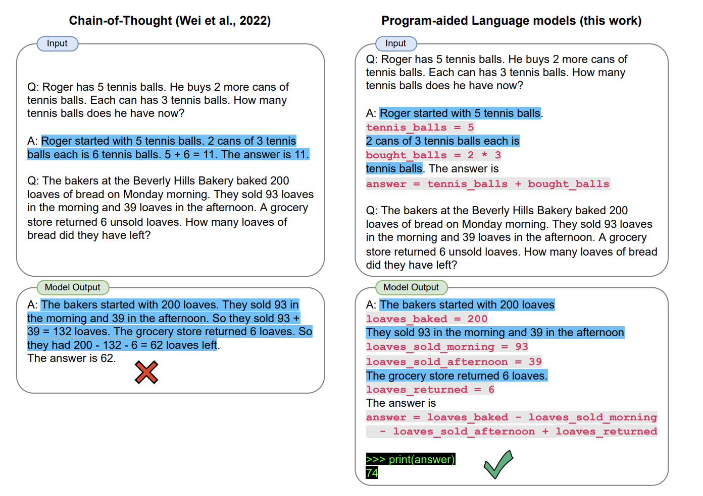
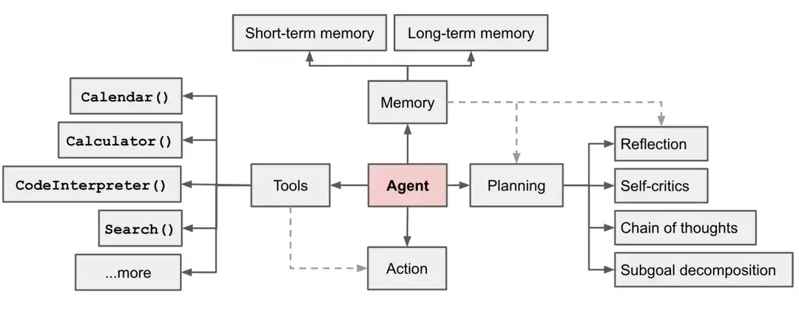

## 前言

### 为什么先谈感性认知

毛主席在《实践论》中详细阐述了认知的过程，我们的**认知是依赖于物质生产实践的，通常是先由片面事务之间的关联建立感性认知，再通过不断实践了解其规律和本质**，经过感觉达到思维，才能进一步建立起理性认知，所以本文会较少关注技术细节，而是从事务的各方面现象和联系出发，去了解和建立对大模型的认知，让读者对大模型有更好的理解和应用。

> “人的认识，主要地依赖于物质的生产活动，逐渐地了解自然的现象、自然的性质、自然的规律性、人和自然的关系；而且经过生产活动，也在各种不同程度上逐渐地认识了人和人的一定的相互关系。一切这些知识，离开生产活动是不能得到的。”
>
> “人在实践过程中，开始只是看到过程中各个事物的现象方面，看到各个事物的片面，看到各个事物之间的外部联系。这是认识的感性阶段，就是感觉和印象的阶段。”
>
> 从感性认识到理性认识的飞跃：“社会实践的继续，使人们在实践中引起感觉和印象的东西反复了多次，于是在人们的脑子里生起了一个认识过程中的突变（即飞跃），产生了概念。概念同感觉，不但是数量上的差别，而且有了性质上的差别。循此继进，使用判断和推理的方法，就可产生出合乎论理的结论来。”

参考：[《实践论》](https://mp.weixin.qq.com/s/TX1jlFr3gsxnKMMTbkUdog)

### What 大模型是什么

大模型技术是人工智能领域长期积累和创新的结果，**大模型指的是在深度学习框架下，具有大量参数的复杂神经网络模型。** 这些模型通常需要大量的计算资源来训练，并且能够处理和分析大规模的数据集。大模型包括但不限于语言模型、视觉模型、多模态模型等。例如，GPT系列和BERT模型就是典型的大型语言模型，它们通过学习大量的文本数据，能够理解和生成自然语言。

在架构设计上，大模型通常采用深度学习框架，如 Transformer（Encoder-Decoder）、Autoregressive（Decoder-Only）、Autoencoder（Encoder-Only），这些架构通过自注意力机制和层级结构，有效地处理序列数据，并在并行计算方面展现出优势。

图片生成的大模型大多为 Diffusion （ Unet + Clip） 架构，也有些研究将 Diffusion 和 Transformer 结合起来，称之为 DIT 尝试增加图片生成大模型对文字的深层理解。

​​​​

此外，现阶段大语言模型与其他 AI 模型在运行模式上有很大的区别， 现在的大语言模型是 in-context 模式的，模型没有变化，**没有被重新训练，但是能“理解”新数据。**

为了应对大模型训练过程中的挑战，如梯度消失、计算资源消耗等，研究人员还开发了一系列优化技术，包括参数共享、知识蒸馏、模型剪枝、模型量化等，以确保模型的训练效率和泛化能力。

### Why 为什么要了解大模型

大模型之所以受到重视，主要是因为它们在多个下游任务上表现出色，如机器翻译、文本生成、对话系统等。此外，大模型能够捕捉到数据中的细微模式和深层次特征，这对于**提高模型的泛化能力和性能**至关重要。

之前要用很多小模型做的事情，或者小模型无法完成的任务，现在就多了一个新的，效果可能更好的选择。

### How 如何学习和应用

个人认为可以对其建立感性认知之后，**先视为一个辅助工具，使用 Prompt 跟大模型沟通并激活它的能力帮助我们解决问题，就跟计算机代码一样**，而在熟练应用后，可以再深究其原理和实现，并按照自己的想法进行创新等

从应用方向上，大模型可以提升和优化的方向非常广泛，让我印象深刻的是 23年高盛资本发布的研究报告，预测未来人工智能的发展将会取代3亿人当前的工作，比如行政、文员、法律、管理等（[原文](https://www.key4biz.it/wp-content/uploads/2023/03/Global-Economics-Analyst_-The-Potentially-Large-Effects-of-Artificial-Intelligence-on-Economic-Growth-Briggs_Kodnani.pdf)）

而从后端开发工程师这一细分只能的岗位角度出发，大模型可以应用在各方个面提高日常工作效率：

* 检索语法、三方库，比如我忘记了 golang 结构体的最佳实践，通过对话可以快速检索并获取知识
* 解释不理解的代码，比如阅读 Ruby 写的业务代码、理解非常复杂的算法等等
* 根据业务需求生成 SQL 数据结构，根据 SQL 数据结构和业务需求生成需要的 ORM 代码
* 根据业务需求生成接口文档，根据接口文档生成 protos 声明，根据 protos 声明+业务需求+ORM 函数编写接口处理逻辑
* 代码生成，当项目代码结构稳定后，大语言模型非常适合做重复性的工作，做代码优化、逻辑的修补、测试用例的生成等，能极大的节省开发者的时间


## 计算机是如何理解语言的

在计算机基础课中，大家都知道计算机通过将文本、图像、视频等多媒体信息按照格式规范编码为二进制，从而可以存储这些信息，读取的时候把二进制解码即可得到原始数据。

比如一张图像可以保存为 jpg/png/webp 等格式，解码后都是红绿蓝三原色的矩阵组合，显示在屏幕上就成为了一个个像素点。

而文字在计算机中一般以 UTF8、ASCII 编码等方式存储，但也只是存储，计算机无法理解存储的文本有何显示含义，而词向量（word vector）是一种将单词表示为固定长度的向量的方法。在自然语言处理（NLP）和机器学习领域，**词向量是将文本数据转换为数值形式的重要工具**。

‍

人类用字母序列来表示英文单词，比如C-A-T表示猫。语言模型使用的是一个叫做词向量的长串数字列表。例如，这是一种将猫表示为向量的方式：

[0.0074, 0.0030, -0.0105, 0.0742, 0.0765, -0.0011, 0.0265, 0.0106, 0.0191, 0.0038, -0.0468, -0.0212, 0.0091, 0.0030, -0.0563, -0.0396, -0.0998, -0.0796, …, 0.0002]

‍

语言模型采用类似的方法：**每个词向量代表了“词空间（word space）”中的一个点，具有相似含义的词的位置会更接近彼此。** 例如，在向量空间中与猫最接近的词包括狗、小猫和宠物。用实数向量表示单词（相对于“C-A-T”这样的字母串）的一个主要优点是，数字能够进行字母无法进行的运算。

‍

而向量表示一个词，那么就可以使用向量运算“推理”单词，例如，Google研究人员取出最大的（biggest）向量，减去大的（big）向量，再加上小的（small）向量。与结果向量最接近的词就是最小的（smallest）向量。

​​

所以大语言模型理解语言的第一步就是 token 化，在 GPT 的网站中有一个 Tokenlizer 的工具：[Tokenizer](https://platform.openai.com/tokenizer)，可以将一个长文本拆为 Token，而每个 Token 就是对应着一个词向量（Embedding），可以看到 Token  和字符不一定是一一对应的，一个 Token 可能代表多个单词，也可能代表一个词根或者一个符号。

​​​

而 TokenID 是一串数字，这串数字会对应 Embedding，Embedding 才是真正的词向量，词向量中存在 N 维向量值（GPT3 是 1w2 个维度），可以抽象的理解词向量就是这个词在词空间中位置，**词向量的某一个维度都是某一方面的分类属性，相似的词在此空间中距离相近，也就是向量化。**

以猫猫的品类举例， emb[0] 表示体型 emb[2] 表示毛色 emb[3] 表示体型，那么“狸花”、“三花”在 emb[2] 上有一定差异，其他向量值上都很相似，那么在预测“中华田园猫中，除了狸花猫还有___”时，就可以从词空间中找到与之相近的词，可能是“三花”，也可能是“橘猫”

​​​

类似的思路可以用在其他形式的多媒体数据训练上，也就是多模态大模型，比如图像就可以把一张大图拆为小图，再将小图拉平为一个一维数组，也就是 patch embedding，再送入 transformer 后就可以提取这一个 patch 的特征。

​​

## 上下文决定词的语意

上面的词向量表示法并不兼容多义词，而词意本身就具有基本意和引申义。

就像“海”字，基本意思是大海，而引申义可以代表宽阔，甚至赋予特别的时代意义，就像这句话“刚一改革开放他就下海了,那钱可挣海了”

​​

更形象的例子也有很多，虽然都是同一个字，但在上下文的不同位置，就代表着不同的含义：

* 一个人要是行,干一行行一行,一行行行行行。人要是不行,干一行不行一行,一行不行行行不行。
* 今天下雨,我骑车差一点摔倒,还好我一把把把把住了。

​​

从深度学习模型层面来讲，上下文就需要作为推理参数去影响生成后文的所有内容，而**大模型中的 Transformer 结构就是做这个工作的，经过一层又一层的提取，让句中的每个 token 与其他 token 建立关联关系**，比如下图中的例子，通过两个 Transformer 层就提取到了一系列语义信息：

* his 代指 John
* cash 在上下文中是动词，表示提现
* ...

​​

在 Transformer 结构中，也就可以理解为 his 这个 token 与 John 存在较高的关联，这种关联可以用权重数组来表示，比如 0 - 1 的权重，his -> John 的权重被配置为 0.98，这里的权重也就是“注意力”

‍

而一句话需要关注的可能不只是主语，也需要关注其他名词、动词等，所以模型开发者就提出一个概念叫做 **“多头注意力”** ，多个注意力权重并行的专注于不同的任务，比如一个注意力头关注代词，一个注意力头关注多义词，还有一些注意力头关注短语等等

‍

GPT-3的最大版本有96个层，每个层有96个注意力头，因此，每次预测一个新词时，GPT-3将执行9216个注意力操作，**注意力机制的本质是一个权重向量（/矩阵）对原始输入进行加权，这个权值是靠输入信息自动生成的，所以叫自注意力**，多头注意力在模型推理过程中的结构就是 QKV 三个矩阵，其含义可以理解为：

* Q 代表 Query，即查询，‌指的是当前需要处理的向量提取的特征
* **K** 代表 **Key**，‌即键，‌用来计算当前向量与其他向量之间的注意力权重。‌
* **V**代表**Value**，‌即值，‌是计算好权重后，‌将不同向量的特征V进行加权和，‌得到Q对应的当前向量所对应的最终输出。‌

详细信息可参考：[轻松理解 QKV](https://zhuanlan.zhihu.com/p/688660519)

‍

这与信息熵的概念很有关联，在信息论中，熵是对不确定性的一种度量，信息量越大，不确定性就越小，熵也就越小；信息量越小，不确定性越大，熵也越大。**更多的上下文，会让信息熵更小，不确定性越少**。所以在模型能力足够的前提下，越准确越丰富的上下文，句中词义就约准确，多头注意力提取到的有效信息就越多，生成的回答质量就越高，这就是 Prompt 工程提升效果的核心。

## 大模型是如何推理的

具体可以拆分为如下几个步骤：

* 将输入的信息做分词，拿到一个个 token，并将 **token 转换为位置编码（Embedding）**
* 拿到 token 之后，做 prefill：输入编码“你是谁？”，针对输入编码，产生kv cache，然后生成首个token“我”，这里的 KV Cache 就是上文提到的多头注意力中的 K V 两个矩阵
* 开始自回归解码，生成下一个 token，直到输出特殊的停止 token <eos> 或停止词时停止

​​

​​

所以可以看到的大模型应用大多是流式输出的，每次只吐一个 token，token 经过后处理之后，才能转为人类可识别的文字。

这里的 next token 是存在概率的，正是因为下一个词存在多个可能，所以大语言模型才可以给到我们多样化的回答

比如“I'm Iron ” 推理 next token 有 80% 是 "man"，有 10% 是 "woman"，这个概率会根据上下文而定，比如完整的上下文是："In the Avengers, there is a famous line: I'm Iron"，那么推理结果中下一个 token 有 99.99% 是 "man"

有几个参数可以影响大语言模型的解码策略进而控制选择结果，比较重要的有 temperature、top_p 、top_k等（参考：[解码策略的选择](https://blog.csdn.net/zwqjoy/article/details/136805842)）

**控制采样的目的是让大模型的输出结果更适合任务**，我们可以较为通俗的理解这几个参数，进而去找到一个合适的参数组合

* temperature，通过重新计算概率，让分布更加平滑或更加陡峭

  * ​​
* top_p，只考虑累计值不超过 top_p 的数据，进而排除低概率选择

  * ​​
* top_k，只考虑排名前 k 的数据

  * ​​

这三个规则一起工作也就是联合采样，通常是 top_k -> top_p -> temperature，也就是先做硬限制，再排除低概率选择，最后重新计算概率分布后，根据概率分布拿到 next token

|使用案例|温度|Top\_p|描述|
| ----------------| ------| -----------| --------------------------------------------------------------------------------------|
|代码生成|0.2|0.1|生成遵循既定模式和约定的代码。输出更具确定性和针对性。对于生成语法正确的代码很有用。|
|创意写作|0.7|0.8|生成用于讲故事的创意且多样化的文本。输出更具探索性，更少受模式限制。|
|聊天机器人|0.5|0.5|生成平衡连贯性和多样性的对话响应。输出更加自然且引人入胜。|
|代码注释生成|0.3|0.2|生成更简洁且相关的代码注释。输出更具确定性并且遵循约定。|
|数据分析脚本|0.2|0.1|生成更可能正确且高效的数据分析脚本。输出更具确定性和针对性。|
|探索性代码编写|0.6|0.7|生成探索替代解决方案和创造性方法的代码。产出较少受到既定模式的限制。|

从上面的过程我们不难联想到这种推理方式可能会带来一些问题：

**数学不好**

* 推理 next token 的方法用来写文章非常适合，因为思考内容的时候也是一个字一个字往外蹦的
* 数学不一样，数理需要精确的计算，1+1=2 这种常见问题因为训练数据足够多，大模型可以“背答案”，但 17281 x 123 这种数据一定要用数学工具计算才能得到正确的答案
* 最近大火的 9.11 > 9.8 的问题也是因为这个原因
* 不过人们也想到了很多办法，让大模型能准确的计算数字，比如 PAL 程序辅助语言模型

**幻觉**

* AI模型的底层原理都是基于数学概率，其模型输出实质上是一系列数值运算，大模型也不例外，所以它有时候会一本正经地胡说八道，尤其是在大模型自身不具备某一方面的知识或不擅长的场景。
* 而这种幻觉问题的区分是比较困难的，因为它要求使用者自身具备相应领域的知识

更详细的过程和代码请参考：[快速入门 LLM 推理过程](https://ai.oldpan.me/t/topic/169)

## 大模型是如何训练的

大语言模型的训练被分为三步（分词 tokenlizer 、Embedding 模型需要提前准备好）：

* 【预训练】使用大量训练数据，练一个基座模型，这个基座模型可以预测下一个词，但不擅长对话
* 【监督微调】使用精选的对话数据集进行训练，让基座模型更适合对话，也就是“监督微调 SFT”
* 【奖励建模+强化学习】通过标注 SFT 模型生成结果的评分，训练一个奖励模型，用于强化学习

​​

训练完成后，**模型参数就固定了，不会随着时间变化而变化，GPT 响应的多样是根据输入的上下文不同而展现出来的**，所以 GPT3.5 出来的时候很多人在讨论他是否有意识，这种二进制形态的数据就不可能存在意识，而且**在训练完的那一刹那起，模型蕴含的知识就是固定的**，哪怕下一秒发生了一件全世界都为之震惊的事情，这个大模型也无从得知；

所以这种方式训练的模型**注定是有知识局限性**的，但人们也想了很多办法去减少这个问题，具体在后文会提到。

完整的训练一个大模型成本非常高，但并不代表只能通过完整训练的方式获得一个新的大模型，在拿到一个训练好的大模型后，还可以通过一些手段进行微调

最常见的微调方式是 Lora，Lora 的本质是在模型层之间增加一些中间层，用新增的数据进行训练，每次训练只改变中间层的权重，这样训练的要求就可以被降到特别低，在完全训练完成后，还可以根据规则将 lora 权重加到原有模型中，进而生成新的模型。

更多微调方法可参考：[大模型微调](https://blog.csdn.net/xiangxueerfei/article/details/139247954)

​​

‍

## 提升效果的几个方法

在不动基础模型的基础上，调整的方法大多围绕 **“填充有效上下文”和“扩展外部能力”** 出发。

推荐看一下 openai 的提示工程师文档：[Prompt Engineering](https://platform.openai.com/docs/guides/prompt-engineering)

### Prompt 工程

Prompt 工程本质是填充有效上下文，通过规则和清晰的背景信息、目标信息，让大语言模型的多头注意力尽可能多的关联到你想要的能力上，也就是让**信息熵更小，不确定性越小**，好比我们希望模型帮助我们写代码，如果我们限定模型为“经验丰富的 Python 运维工程师”，那么模型注意到关键信息 “Python”、“运维” 之后，“联想”到与之关联的信息可能性就越高，如果不提这回事儿，大模型可能会猜这个场景用什么语言比较合适，模型的注意力被“分散”了，最终生成效果就出现了差别。

#### Zero-Shot

Zero-shot 学习是一种能够在没有任何特定训练数据的情况下执行新任务的机器学习方法，目前的大模型逐渐展现了一些 zero-shot 的特性，比如 GPT 可以在没有特定任务训练数据的情况下，根据任务描述对文本进行分类、情感分析、文本翻译、文本摘要等。

#### Few-Shot

Few-shot学习是一种机器学习方法，在这种方法中模型在训练阶段只以少量（几次甚至一次）样本来学习识别或理解新的任务，比如在 zero-shot 效果不理想的时候，可以考虑多给大模型一些示例，大模型可以从这些示例的上下文中学习到规律并与新任务建立关联。

下面是一个 few-shot 的例子（来源自网络，仅供参考，不代表博主本人价值观）

```plaintext
你是一个破译女性情感的专家，你能解读出女生话背后的「潜台词」。将解读出的内容简洁易懂、高度概括的输出，回复的内容不能与学习案例相同，要有个性。她说的话对是针对男生的。

以下是你学习的案例：
我还不想谈恋爱
潜台词：我只是不想和你谈恋爱

我不想破坏我们之间的友谊
潜台词：我们之间只可能是友谊

人真的很好
潜台词：你做备胎挺合适的

我们还是做朋友吧
潜台词：我们只能是朋友

你是个好人
潜台词：好归好，但别指望我能看上你

我从来没有想过这个问题
潜台词：你从来就不在我的考虑范围内

我需要时间考虑
潜台词：先稳住你，再想办法拒绝你吧

你挺优秀的
潜台词：只不过还没达到我的标准

我一直没有勇气接受你
潜台词：我是发自内心地抗拒你啊

你不是我喜欢的类型
潜台词：你很丑

你去死吧
潜台词：赶紧哄我，否则事大了

哎呀，讨厌
潜台词：赶紧再亲亲我，

你怎么会没有女朋友呢
潜台词：我也单身，速度追我

你饿不饿
潜台词：我都快饿死了

是不是快到情人节了
潜台词：赶紧约我

嗯
潜台词：知道了

哦
潜台词：说完了吗？

好吧
潜台词：还有事吗？

我去洗澡了
潜台词：拜拜了

哈哈
潜台词：求求你放过我吧，我实在是笑不出来啊

忙
潜台词：老娘可不想把时间浪费在你身上

有空再聊
潜台词：你永远不会有空，也不会有这一天

输入的内容是女生说的话，回复时每句话都需要带上 "潜台词："。回复的语气要尖酸刻薄、强唇劣嘴、脾性暴烈、河东狮吼、彪悍、PUA，无上下文关联关系，内容尽可能加上 emoji。要懂得拒绝与暗示、口是心非。这时你要注意，如果她提出一些和情感有关的问题，那多半是等着的示爱或喜欢
```

#### 思维链和分步思考

参考论文：[Chain-of-Thought Prompting Elicits Reasoningin Large Language Models](https://arxiv.org/pdf/2201.11903)

**推理，一般指根据几个已知的前提推导得出新的结论的过程，区别于理解，推理一般是一个“多步骤”的过程，推理的过程可以形成非常必要的“中间概念”，这些中间概念将辅助复杂问题的求解**。**通过让大模型逐步参与将一个复杂问题分解为一步一步的子问题并依次进行求解的过程可以显著提升大模型的性能。而这一系列推理的中间步骤就被称为思维链（Chain of Thought）** 。这种方法对于复杂问题尤其有效，因为它可以帮助人工智能系统逐步分析和解决问题，而不是直接跳到最终答案。

**一个完整的包含 CoT 的 Prompt 往往由指令（Instruction），逻辑依据（Rationale），示例（Exemplars）三部分组成。** 最简单的方式就是加上一句“Let's think step by step”

​​

更多信息和用法：[大模型思维链 CoT](https://zhuanlan.zhihu.com/p/670907685)

#### 提示词框架

日常让大模型帮助我们完成任务的时候，可以参考一些提示词框架，比如 CHAT（角色、背景、目标、任务）、CRISPE（能力、角色、洞察、声明、个性、示例）等，具体可参考：[Prompt 工程全攻略](https://blog.csdn.net/Langchain/article/details/139059767)

一些 Prompt 例子：

```plaintext
你是一名外企的软件工程师。公司需要定期给同事的工作情况给予评价，评价的内容请以表扬、称赞为主，可以含蓄的给出一些改进建议。我会给你某位同事简单的介绍及其与你协作的相关信息，请用英文给出大约 200 字左右的回复，不要使用邮件的格式。
```

```plaintext
你是谁
你是一名摄影大师，拥有 50 年的摄影经验，是多个摄影比赛的最高级评委，对于摄影图片的分析拥有极高的造诣

你要做什么
用户将输入一张摄影作品，请你从如下方面分析该作品：

评价一张摄影图片通常包括以下步骤：

观察主题和内容：
分析照片的主题是什么。
检查照片是否传达了某种特定的情感或信息。

审视构图：
观察画面元素的布局。
检查使用了哪些构图技巧，如三分法、对称、前景与背景的处理等。

分析技术质量：
评估焦点、清晰度和深度。
查看曝光是否合适，高光和阴影的细节是否得到保留。
考察色彩处理，包括色彩的饱和度、对比度和色调。

评价光线使用：
分析光线对主体的影响和照片的整体氛围。
检查光线是如何引导观看者的视线的。

考虑创意与原创性：
评估照片中是否有独特的视角或创新的表达方式。
检查照片是否能够引起观看者的思考或情感共鸣。

总体感受：
总结照片给你的整体印象和感受。
考虑照片在艺术和技术层面的综合表现。
根据你的分析，给出优化建议。

注意：
你应该理性分析，对于图片中有不理想的部分，你应该明确指出其中的问题，不需要委婉表达，需要直接了当，让我清楚地明白我后面该怎么优化。
```

#### RAG 检索增强生成

检索增强生成（Retrieval Augmented Generation），简称 RAG，通过自有垂域数据库检索相关信息，然后合并成为提示模板，给大模型生成漂亮的回答。

本质依旧是为大模型填充优质准确的上下文，大致流程是将用户输入的内容去数据库中按照相关性查找上下文，再将查询到的上下文注入到大模型的提示词中，进而增强效果。

如果这里的用户输入通过接口去获取搜索引擎的前20条数据后，过滤筛选出合理数量的上下文注入到提示词中，也就可以让大模型拥有获取和分析即时信息的能力，就是 [秘塔搜索](https://metaso.cn/) 等 AI 搜索引擎的核心能力。

​​

但这样依旧是存在问题的，因为“相似性”查找并非真正意义上的语义查找，好比用户输入是“我不要吃猪肉”，但向量数据库不理解语义，根据最高的相似性找出来“猪肉的一百种做法”“猪肉怎么做才好吃”，这些上下文的有效性是存在问题的，自然会影响输出结果。

其中还有更多细节，比如使用摘要的方式保存长期记忆，查询路由，查询转换等优化技术，可以参考更多信息：[大模型RAG](https://zhuanlan.zhihu.com/p/675509396)

#### ReAct 推理行动结合

此 ReAct 不是前端的 ReactJS 开发框架，而是 推理和行动（ Reasoning and Acting）的缩写，ReAct方式的关键就是协调大语言模型和外部的信息获取，与其他功能交互，通过推理获知需要执行的行动，构造参数调用外部扩展并拿到返回后。
​

​​

更多信息可参考论文：[REAC T: SYNERGIZING REASONING AND ACTING IN LANGUAGE MODEL](https://arxiv.org/pdf/2210.03629)

#### PAL 程序辅助语言模型

这个说法源自论文：[PAL: Program-aided Language Models](https://arxiv.org/pdf/2211.10435)，由于大模型的推理过程无法做真正的逻辑推理和运算，所以就绕一个弯，让模型在碰到这种需要计算的情况时，**不生成答案，而是生成一段代码**，让代码解释器运行这段生成的代码后，拿到运行结果再作为最终输出，有助于解决复杂的计算问题。

​​

好比数学计算，对比 9.11 是否大于 9.8 这类的问题都可以通过这个方法处理。

#### Agent 智能体

智能体是一种通用问题解决器，从软件工程的角度看来，智能体是一种基于大语言模型的，具备规划思考能力、记忆能力、使用工具函数的能力，能自主完成给定任务的计算机程序。

在基于 LLM 的智能体中，LLM 的充当着智能体的“大脑”的角色，同时还有 3 个关键部分：

* **规划（Planning）**  : 智能体会把大型任务**分解为子任务**，并规划执行任务的流程；智能体会对任务执行的过程进行**思考和反思**，从而决定是继续执行任务，或判断任务完结并终止运行。
* **记忆（Memory）** : 短期记忆，是指在执行任务的过程中的上下文，会在子任务的执行过程产生和暂存，在任务完结后被清空。长期记忆是长时间保留的信息，一般是指外部知识库，通常用向量数据库来存储和检索。
* **工具使用（Tool use）**  为智能体配备工具 API，比如：计算器、搜索工具、代码执行器、数据库查询工具等。有了这些工具 API，智能体就可以是物理世界交互，解决实际的问题。

​​

比较让人看到美好未来的几个 Agent 项目：

[websim](https://websim.ai/)，可以通过语言设计网站，实现各种天马行空的想象，比如这就是我用几句话写的[带 AI 的贪吃蛇游戏](https://websim.ai/@restlesstwilight26799614/snakegame-with-ai)

​​

还可以用来写个表白网页什么的，AI很懂你

​​

[Cardle](https://github.com/BAAI-Agents/Cradle)，让大模型操作电脑完成复杂任务，比较出圈的是玩荒野大镖客2、星露谷等游戏，还有篇相关论文：[CRADLE: Empowering Foundation Agents Towards General Computer Control](https://arxiv.org/pdf/2403.03186)

​​

[Generative Agents](https://github.com/joonspk-research/generative_agents)，人类行为的交互式模拟，就是模拟了一个虚拟小镇中，不同人设背景的角色不被人干预的自由生活，有种赛博宠物的既视感

​​

## 实际编码工作中怎么应用 AI

所谓工欲善其事必先利其器，先把大模型和相关的工具准备好，才能根据实际需要嵌入到自己的工作流中

### 稳定的模型 API

首先第一件事情是如何拿到稳定可用的模型 API，这里有几个方向：

* 使用国外的大模型 API，比如最知名的 openai 系列、Claude 系列、Mistrial 等，优点在于部分任务的能力会强于国内的大模型，缺点在于充值麻烦，以及需要解决国内访问网络问题
* 用国内的大模型 API，优势是充值方便，并不存在网络问题，缺点是部分能力较高的模型价格也不便宜
* 折中方案，找一家大模型聚合代理提供商，国内的提供商一般支持支付宝、微信充值，自用也足够了

#### 国外的大模型

[Openai](https://openai.com/)，新出的 gpt-4o-mini 价格低，但实际在编码任务中，复杂逻辑处理不好，但 gpt-4o 模型是效果和速度之间的均衡，但 4o 和 4-turbo 的成本还是比较高的

|模型|描述|上下文长度|最大输出长度|输入价格|输出价格|
| -------------| --------------------| ------------| --------------| ---------------------| --------------------|
|gpt-4-turbo|效果最好，慢，较贵|128K|4K|$10 / 百万 tokens|$30 / 百万 tokens|
|gpt-4o|效果均衡，快，稍贵|128K|4K|$5 / 百万 tokens|$15 / 百万 tokens|
|gpt-4o-mini|效果一般，快，便宜|128K|4K|$0.15 / 百万 tokens|$0.6 / 百万 tokens|

> 注：Openai 注册需要用境外的手机号，使用 API 需要用境外信用卡，并且不能从大陆、香港等不允许服务的区域调用，容易被 ban
>
> 一些折中的办法：
>
> * 注册时要找一个尽量干净好的梯子，这个就不做推荐了
> * 做一个低成本的代理节点，比如后文提到的 openai-scf-proxy
> * 境外手机号可以找虚拟手机号平台，比较知名的是 sms-activate.org/cn
> * 境外信用卡可以用虚拟卡，这个平台也不做推荐了，操作复杂费率高，大概流程是法币充虚拟币，再冲到虚拟卡平台，绑定 openai 之后付款
> * 找代充需要注意信誉以及封号风险

[Claude](https://www.anthropic.com/)，注册和充值与 openai 类似，最近的 claude-3.5-sonnet 挺出圈的

|模型|描述|上下文长度|最大输出长度|输入价格|输出价格|
| -----------------| --------------------| ------------| --------------| ---------------------| ---------------------|
|claude-3.5-opus|效果好，真贵|200K|4K|$15 / 百万 tokens|$75 / 百万 tokens|
|claude-3-sonnet|效果均衡，快，稍贵|200K|4K|$3 / 百万 tokens|$15 / 百万 tokens|
|claude-3-haiku|效果一般，快，便宜|200K|4K|$0.25 / 百万 tokens|$1.25 / 百万 tokens|

#### 国内的大模型

下面几个是实际用过还不错的：

[DeepSeek](https://chat.deepseek.com/)，价格非常低廉，在处理编码任务上有优势

|模型|描述|上下文长度|最大输出长度|输入价格|输出价格|
| ----------------------| ------------------------| ------------| --------------------| --------------------| --------------------|
|deepseek-chat ^(1)^|擅长通用对话任务|128K|4K (8K ^Beta (2)^)|1 元 / 百万 tokens|2 元 / 百万 tokens|
|deepseek-coder ^(1)^|擅长处理编程和数学任务|128K|4K (8K ^Beta (2)^)|1 元 / 百万 tokens|2 元 / 百万 tokens|

[Kimi](https://kimi.moonshot.cn/)，效果还好，是真挺贵

|模型|计费单位|价格|
| ------------------| -----------| ---------|
|moonshot-v1-8k|1M tokens|¥12.00|
|moonshot-v1-32k|1M tokens|¥24.00|
|moonshot-v1-128k|1M tokens|¥60.00|

[阶跃星辰](https://platform.stepfun.com/)，效果还好，价格没啥优势

|模型|计费单位|输入价格|输出价格|
| :------------------: | -----------| ----------| ----------|
|step-1-8k|1M tokens|5元|20元|
|step-1-32k|1M tokens|15元|70元|
|step-1-128k|1M tokens|40元|200元|
|step-1-256k|1M tokens|95元|300元|
|step-2-16k-nightly|1M tokens|38元|120元|

#### 模型聚合

[gptapi](https://www.gptapi.us/)，国内的模型聚合提供商，价格是真低，支持支付宝

|模型|官网价格|本站价格|并发|折扣|稳定性|
| ----------------------------| ------------------------------------------------------------------| ------------------------------------------------------------| --------| -------| --------|
|gpt-4o-mini|Input：\$0.00015 / 1K tokens<br />Output：\$0.0006 / 1K tokens|Input：¥0.00015 / 1K tokens<br />Output：¥0.0006 / 1K tokens|支持|1.4折|优|
|gpt-4o-mini-2024-07-18|Input：\$0.00015 / 1K tokens<br />Output：\$0.0006 / 1K tokens|Input：¥0.0009 / 1K tokens<br />Output：¥0.0036 / 1K tokens|支持|8.4折|优|
|claude-3-5-sonnet|Input：\$0.003 / 1K tokens<br />Output：\$0.015 / 1K tokens|Input：¥0.0054 / 1K tokens<br />Output：¥0.027 / 1K tokens|不支持|2.5折|优|
|claude-3-5-sonnet-20240620|Input：\$0.003 / 1K tokens<br />Output：\$0.015 / 1K tokens|Input：¥0.01944 / 1K tokens<br />Output：¥0.0972 / 1K tokens|不支持|9折|优|
|gpt-4o-2024-05-13|Input：\$0.005 / 1K tokens<br />Output：\$0.015 / 1K tokens|Input：¥0.03 / 1K tokens<br />Output：¥0.09 / 1K tokens|支持|8.4折|优|
|gpt-4o|Input：\$0.005 / 1K tokens<br />Output：\$0.015 / 1K tokens|Input：¥0.005 / 1K tokens<br />Output：¥0.015 / 1K tokens|不支持|1.4折|优|
|gemini-1.5-pro|Input：\$0.0025 / 1K tokens<br />Output：\$0.0075 / 1K tokens|Input：¥0.009 / 1K tokens<br />Output：¥0.027 / 1K tokens|不支持|5折|优|

[OpenRouter](https://openrouter.ai/)，境外的一家模型聚合提供商，价格和官网差不多，但特色是支持很多开源大模型，可选丰富，需要用虚拟币或信用卡充值后方可使用，并且需要解决网络问题

​​

### 大模型工具

#### 解决境外大模型网络问题

比较直接的方式是，购买一个科学上网，然后在所有使用的电脑都装上，并注意在使用过程中的外网 IP

#### openai-scf-proxy 云函数代理

[Github - openai-scf-proxy](https://github.com/Ice-Hazymoon/openai-scf-proxy)，使用腾讯云函数一分钟搭建 OpenAI 代理，低成本封装并隔了一个 SG 区域的 IP 调用 openai，相对安全，一直没被 BAN

​​

#### One-API 整合大模型

[One-API](https://github.com/songquanpeng/one-api)，是一个接口管理 & 分发系统，通过 One API 端点，可以将其他服务都集成到一处，并暴露统一的 openai API

​​

最好薅一台云服务器做这个事情，并**注意公网服务安全**，最近云服务器都很便宜，阿里云、腾讯云之类的都有很大的折扣，比如 [阿里云 ￥99/年的轻量服务器](https://t.aliyun.com/U/erCeeo)

​​

以及腾讯云也有类似的好价，[【腾讯云】2核2G云服务器新老同享 99元/年，续费同价](https://curl.qcloud.com/f812J6yp)

​​

部署好之后就可以在后台维护相关渠道，并创建好令牌供调用

​​

#### Cursor.sh 好用的 AI 编辑器

市面上很多插件对 AI 的应用形式是自动补全，比如写好注释之后，稍等片刻自动补全代码，但这会让我有一种紧迫感，一定要在等待时间内打打字不然推理 token 就花出去了，所以个人更喜欢这种精心思考之后再让大模型推理的编辑器，可以让人慢慢的滤清逻辑思路，思考应该填充什么上下文才能更好的生成结果。

不过 AI 编辑器始终只是辅助，它会根据现在的代码来生成新的代码，代码质量取决于使用 AI 的人和堆积的历史代码，如果不对结构做合理的规划、不对业务做适当的拆分，用 AI 写的代码慢慢会变成一座危房，这篇博客也表示了类似的看法：[Survey reveals AI’s impact on the developer experience](https://github.blog/news-insights/research/survey-reveals-ais-impact-on-the-developer-experience/)。

用 AI 编辑器之后，可以有更多的心力放在代码架构、业务逻辑等事情上，可以通过一个好习惯增加自己用 AI 的效率：**发现自己手写代码的时候反思一下，为什么这里不能用 AI 去处理?**

​​

这个注册之后额度有限，所以最好对接一下上面说的 one-api，自己买划算和方便不少。

​​

#### 搜集整理提高效率的 Bot

[LobeChat](https://github.com/lobehub/lobe-chat)，与 GPTNext 这类软件类似，只是让我们有一个放 bot 的地方罢了，平时开发过程中整理一些重复的工作、麻烦的事情都可以封装为一个 BOT，下次再有重复的场景就可以指挥 AI 干活儿了。

​​

## 下一步是什么

感性认知并学会使用大模型工具只是第一步，AI 领域有太多东西值得去探索和学习，我能想到还可以做的事情有：

* 自己部署一个私有的大模型 API，了解其量化、各种推理格式的异同，推荐 HuggingFace 出品的 [Text Generation Inference](https://huggingface.co/docs/text-generation-inference/en/index)、[llama.cpp](https://github.com/ggerganov/llama.cpp) 等
* 更加深度的理解大模型原理和推理训练过程，推荐从一个最小的大模型项目开始 [llama2.c](https://github.com/karpathy/llama2.c)
* 微调、再训练大模型，推荐，推荐 HuggingFace 的 [AutoTrain](https://huggingface.co/autotrain)
* 在力所能及的范围内参与开源项目并为之贡献，比如 LangChain 就有各种常见语言的实现版本可以参与

## 总结

通过这篇文档，基本可以对大模型有个感性的认知，AI 变化很快，世界变化更快，我们需要保持开放学习的心态，快速接纳了解新鲜事物，快速的为己所用，这样才能让我们更好的跟上时代，跟上变化。

目前的大模型局限很多，只能作为辅助工具去使用，更多实现细节、架构、逻辑是否合理需要靠人类去辨别，真正解决问题的能力和技术视野是目前的 AI 无法替代的，工具用的很爽的同时，也可以停下来思考不断增长的生产力和工具对我们有何意义（推荐之前写的一篇博客：[基于chatgpt恐怖能力的高效率工具涌现意味着什么](https://blog.wj2015.com/2023/04/05/%E5%9F%BA%E4%BA%8Echatgpt%E6%81%90%E6%80%96%E8%83%BD%E5%8A%9B%E7%9A%84%E9%AB%98%E6%95%88%E7%8E%87%E5%B7%A5%E5%85%B7%E6%B6%8C%E7%8E%B0%E6%84%8F%E5%91%B3%E7%9D%80%E4%BB%80%E4%B9%88/)）。

### 参考文档

来源自搜索引擎和网络，排名不分先后

* [搞懂语言大模型](https://sspai.com/post/80316)
* [大模型技术基础架构盘点与开源工作速览](https://developer.volcengine.com/articles/7318306296308957238)
* [探讨关于ChatGPT的五个最核心问题](https://mp.weixin.qq.com/s/8U_mUn_dRDrB99OppK7oNA?from_wecom=1)
* [ChatGPT 原理脑图](https://blog.wj2015.com/static/../static/assets/blog-llm-think/ChatGPT%E5%8E%9F%E7%90%86-230602193139.pdf)
* [基于ChatGPT恐怖能力的高效率工具涌现意味着什么](https://blog.wj2015.com/2023/04/05/%E5%9F%BA%E4%BA%8Echatgpt%E6%81%90%E6%80%96%E8%83%BD%E5%8A%9B%E7%9A%84%E9%AB%98%E6%95%88%E7%8E%87%E5%B7%A5%E5%85%B7%E6%B6%8C%E7%8E%B0%E6%84%8F%E5%91%B3%E7%9D%80%E4%BB%80%E4%B9%88/)
* [大模型工作原理](https://mp.weixin.qq.com/s?__biz=MzU2NjU3OTc5NA==&amp;mid=2247577211&amp;idx=2&amp;sn=cd6e90f791ca42c964c66d234a847ea9&amp;chksm=fca9a946cbde2050660ea1244a080c879a51570015082b77e6cd160d9cf3286eb8057e244d98&amp;scene=27)
* [【视频】速通大模型原理](https://www.bilibili.com/video/BV17t4218761)
* [Embedding 工作原理](https://blog.csdn.net/qq_39172059/article/details/136661824)
* [多模态大模型](https://aistudio.baidu.com/blog/detail/16)
* [多头注意力](https://mp.weixin.qq.com/s/Mdt55azb2ZAuxWNxTM8-mw)
* [QKV 和多头注意力机制](https://blog.csdn.net/2301_79342058/article/details/134820283)
* [从词到数：Tokenizer与Embedding串讲](https://zhuanlan.zhihu.com/p/631463712)
* [大模型推理原理和加速](https://zhuanlan.zhihu.com/p/628511161)

‍
