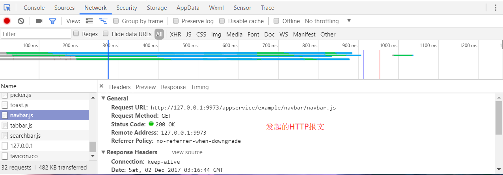

# 写在前面

本文仅供学习交流之用途，适用于未接触过小程序的开发人员，通过本教程，你将学到 如何创建小程序，如何使用小程序开发工具，如何调用后台API，如何使用前端框架WEUI小程序版来快速开发一款小程序。 本系列博客还会以一个“学习平台系统”为例子，教你如何使用小程序开发工具+WEUI+ThinkPHP开发一个完整的系统。 观看本博客，如果您拥有"HTML/XML"、"JS"、"php"、"前端模板引擎"基础，学习起来将会非常容易，甚至相关部分的说明可以跳过。 小程序官方文档：[文档地址](https://mp.weixin.qq.com/debug/wxadoc/dev/index.html?t=2017118 "文档地址")，个人觉得官方文档写的挺好的，上手也不难，特别是在有JS、mvvm基础的情况下。

# 本篇博客内容概览

* [注册微信小程序](#注册微信小程序)
* [利器-小程序开发工具](#利器-小程序开发工具)
* [开发工具安装](#开发工具安装)
* [开发工具-登陆、新建项目](#开发工具-登陆、新建项目)
* [开发工具-功能介绍](#开发工具-功能介绍)
* [结语](#结语)

# 注册微信小程序

目前，微信小程序已面向个人开发者，可直接通过[注册小程序](https://mp.weixin.qq.com/wxopen/waregister?action=step1 "注册小程序")注册一个个人的小程序（每个邮箱只能申请一个小程序）。  注册过程中需要绑定微信管理员，可使用个人微信绑定。 然后转向[登陆页面](https://mp.weixin.qq.com/)，输入账号密码，验证管理员身份之后可进入小程序管理平台。   新账号进入平台后，可在 "设置" => "开发设置"中找到appid,appSecret等信息，这些参数是调用某些微信官方API所必要的。  **特别注意：AppSecret微信平台中只能 生成/重置 不能保存，处于安全考虑appSecret也不要直接出现在小程序的前端代码中** 至此，一个微信小程序就建好了，下一步我们来介绍小程序的开发工具及小程序运行流程。

# 利器-小程序开发工具

古人云，工欲善其事必先利其器，微信为了方便开发者对小程序和微信公众号的开发，推出了一款及调试、预览、上传代码、体验测试等一系列方便功能的软件：[小程序开发工具](https://mp.weixin.qq.com/debug/wxadoc/dev/devtools/download.html?t=2017119 "小程序开发工具")

## 开发工具安装

首先，安装这个工具，选择自己系统对应的小程序版本，下载完毕之后进行安装，[小程序开发各版本下载](https://mp.weixin.qq.com/debug/wxadoc/dev/devtools/download.html?t=2017119 "小程序开发工具")  然后点击下一步，下一步，下一步，傻瓜式的安装：    

## 开发工具-登陆、新建项目

安装完毕之后打开，需要使用微信登录，就用注册时绑定的微信扫码即可：  然后选择小程序  刚安装的开发工具，里边是没有项目的，所以需要我们自己新建一个  填写相关的项目信息，以及我们在"设置" > "开发设置"里边的appid  注1：这里的项目路径，文中指定的是“WEUI小程序版”的demo，可以从[下载WEUI](https://github.com/weui/weui-wxss/)中获取并体验，打开的时候记得是打开项目目录下的dist目录(**D:/project/weui/dist/**)，而不是直接的项目目录(**D:/project/weui/**)。 注2：对于初学者来说，使用"WEUI小程序DEMO"可能会比较混乱，所以，这里的路径也可以选择一个空目录，然后建立微信官方的小程序DEMO。  官方样例打开之后就像这样： 

## 开发工具-功能介绍

点击项目进去之后主页面是这个样子的，跟Chrome的调试工具很像有木有O(∩\_∩)O，亲切感一下就上来了：  区域划分(详细说明请见[官方文档](https://mp.weixin.qq.com/debug/wxadoc/dev/devtools/devtools.html "官方文档")) 预览区：在编辑器区ctrl+s或者点击编译按钮，预览区自动刷新，方便调试。  编辑器区：主要的编码工作可以在这里完成，虽然比不上sublime，atom之类的文本编辑器，但微信针对微信开发做的API提示用起来也挺方便的。  调试区：与chrome的调试区功能基本一致，支持按CTRL+SHIFT+C快速调试，network区域能对微信调用API等网络操作进行监听，点击详情就能看到这次发包的详细内容。 

# 结语

至此，小程序的基本准备工作就做好了，下一步我们就从认识小程序的执行机制、目录结构、模板解析引擎来进一步了解小程序。