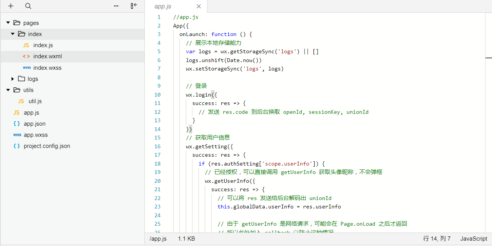
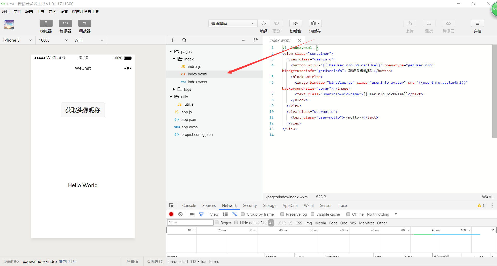

# 写在前面

这篇博客的内容比较浅显，主要是讲小程序的文件结构和执行流程，基础比较好的可以稍微看一遍了解一下就好，下一篇博文才开始讲述wxml语法的相关内容。

# 小程序组织结构

以上篇博文中创建的微信官方DEMO中，我们可以清晰的看到一个简单小程序的目录结构。  其中一些文件在每个小程序中都会出现，并扮演着相似的角色，比如：

### 小程序全局配置文件 _app.json_

这个配置文件是对小程序整体做一个配置，包括所有页面路径的定义，界面，底部TAB、网络超时时间等。 官方配置样例

```json
{
  "pages": [
    "pages/index/index",
    "pages/logs/index"
  ],
  "window": {
    "navigationBarTitleText": "Demo"
  },
  "tabBar": {
    "list": [{
      "pagePath": "pages/index/index",
      "text": "首页"
    }, {
      "pagePath": "pages/logs/logs",
      "text": "日志"
    }]
  },
  "networkTimeout": {
    "request": 10000,
    "downloadFile": 10000
  },
  "debug": true
}
```

比较重要的配置如下： - 页面配置 参数：pages，类型：数组 数组内每一行都是【路径+文件名】代表一个页面，路径位置是相对app.json而言的相对路径，配置时省略.wxml 注意：第一行为入口页面，小程序首先加载第一行的页面。 - 界面配置 参数：window，类型：对象 作用：用于设置小程序的状态栏、导航条、标题、窗口背景色。 比较重要的几个配置项： navigationBarTitleText: '默认的标题名称', navigationBarBackgroundColor: '#000' 导航栏背景色 backgroundColor: '#fff' 窗体背景色  - 底部TAB配置 参数：tabBar，类型：对象 作用：配置底部TAB的字体颜色，图片，边框等信息 比较重要的几个配置 color:'#000' 说明：正常显示的时候，字体颜色 selectedColor: '#f00' 说明：激活状态时字体颜色 position: 'top' 说明：top/bottom表示TAB在顶部或底部 list:

```javascript
[{pagePath: '/pages/index', iconPath: '/img/xx.jpg', selectedIconPath: '/img/xx_2.jpg', text: '首页' },... ] 
```

说明：pagePath表示pages里的路径，iconPath表示正常情况下的图标，selectedIconPath表示激活状态下的图标,text表示显示的文字 

*   完全参数说明：[官方说明](https://mp.weixin.qq.com/debug/wxadoc/dev/framework/config.html) 注：每个页面都有以【页面名字】为名的局部配置文件\*.json，但里边的配置项只能配置**app.json**中window配置里边的内容。

## 程序主逻辑_app.js_

这个.js文件主要是对小程序做一个全局的管理，主要任务就是实例化了一个App()对象，任何一个小程序都有且只能有一个APP()对象。 官方配置：

```javascript
App({
  onLaunch: function(options) {
    // Do something initial when launch.
  },
  onShow: function(options) {
      // Do something when show.
  },
  onHide: function() {
      // Do something when hide.
  },
  onError: function(msg) {
    console.log(msg)
  },
  globalData: 'I am global data'
})
```

参数

类型

作用

onLaunch

function

在小程序启动的时候执行的回调

onShow

function

在小程序显示，从后台进入前台时执行

onHide

function

小程序从前台被隐藏到后台时执行

onError

function

小程序出现错误的时候执行

globalData

function

通常作为全局数据实用

## 程序公共样式_app.wxss_

.wxss文件相当于网页开发中的CSS样式文件，拥有CSS的大部分特性。 app.wxss文件是全局自动加载的样式文件，所有页面都会生效。 小程序还对CSS做了扩展，可以通过import 来引入其他样式文件。

```css
@import "./test.wxss";
p{text-alian:center;}
```

特殊优化：尺寸单位：rpx(responsive pixel)，不同手机屏幕会显示出不同的效果。

设备

rpx换算px

px换算rpx

iPhone5

1rpx = 0.42px

1px = 2.34rpx

iPhone6

1rpx = 0.5px

1px = 2rpx

iPhone5 Plus

1rpx = 0.552px

1px = 1.81rpx

## 小结

在/目录下的app.json,app.js,app.wxss均为小程序初始化时用到的文件，分别代表全局配置文件，App()对象实例化文件，全局样式文件。 App()对象每个小程序只能有一个，实例化时可以指定回掉函数，小程序在对应状态下会自动执行。 wxss样式与CSS有区别，主要是：import "common.wxss"引入其他wxss文件，还有rpx尺寸单位，不同手机屏幕将显示出不同的效果。

# 执行流程

小程序的执行与普通WEB-APP执行方式不一样，小程序执行时，可以理解为如下三个步骤：

## 下载软件包，载入配置文件

小程序执行时会将软件包的所有内容下载到用户手机中，这也注定了软件包的体积不能过大，我记得微信上的限制是2M，所以像视频资源，大的图片资源最好就不要放进去了。 下载完成后，首先加载app.json配置，读取window,tab等界面配置，以及得到上文所讲的pages参数，为加载第一个页面做准备。

## 加载app.js，实例化APP()

实例化每个小程序都会有的唯一一个App()对象，执行onLaunch()回调进行准备工作，回调执行完毕后开始渲染第一个页面。

## 渲染页面

假设，我们的**app.json**中的**pages**配置第一条是_/pages/index/index_，那么小程序将加载页面文件_/pages/index/index.wxml_，然后加载和这个页面相关的_/pages/index/index.json_、_/pages/index/index.wxss_，_/pages/index/index.js_，分别代表页面配置文件，页面样式文件，页面js文件。  注：wxml语法和index.js中的Page()对象的使用将会在下一篇博客中讲解。

# 总结

本篇博客简单介绍了各个文件的作用，以及简述了小程序的执行流程和页面渲染流程，由于wxml语法和Page()对象这部分的知识会比较多，所以拆分到下一篇博客中讲述。