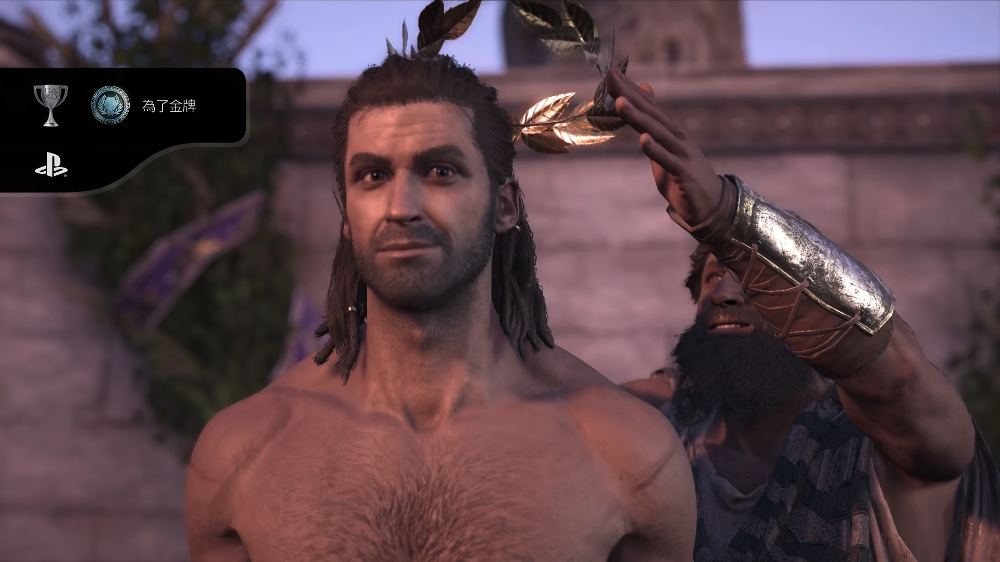

## 前言

PS5 买来已经有一个多月了，它暂时治好了我的电子 ED，让我一个半月通关了五部单机佳作并且乐在其中，这是此前一直没做到过的事情

这篇文主要想分享一下当时为什么抛弃了心心念很多年的 XSX 投向了 PS5 的阵营[，]()面对索尼高昂的游戏价格，我要说上一句：**“索尼罪大恶极”**，但从一个多月的体验来看，现在是丝毫不后悔

​​

**【叠BUFF】** 我的选择并不适合所有人，只是从我当前的需求出发做出的决定，有条件肯定 PC + PS5 + XSX + Switch 拉满了

> 附图：“你怎么知道我老婆给我买了 PS5.jpg“

​​

## 为什么要买游戏机

家中硬件情况是这样的：

* SWITCH 日版长续
* Intel(R) Core(TM) i5-7300HQ 16.0 GB 1050Ti 游戏本
* NAS 主机、家庭服务器（G4600T 32.0GB P104 台式）
* DELL S2721QS 4K@60Hz 显示器

虽然有 Switch 作为轻度娱乐的手段，但日用 PC 和服务器都无法承载我大型 3A 游戏的需求，打工人平时空闲时间也有限，坐下就可以立即沉浸开玩的体验对我来说比较重要。

​​​

所以当时 XSX 一出来还是非常心动的，可以说完美打到我对游戏硬件的需求上，然而出于价格、预算、精力上的考虑一直没有上车，直到开售三年后的双十一，XSX 和 PS5 的价格降到我可以接受的程度，而且 Switch 借给朋友玩塞尔达了，买机器的想法就愈发强烈了。

## PS5如何顶替 XSX 成为第一顺位的

虽然已成为一名光荣的无产阶级劳动者，手里握着一笔不算太低的预算，但我的习惯是买东西的时候会不断对比挑选，直到摸透里边的门道，选出一个最适合自己的产品

第一步从高到低明确需求：

* **游戏阵容值得玩，设备沉浸感要好**，支持 4K@60Hz HDR
* 打工人的游戏时间有限，快速唤醒，坐下就玩
* 扩展性越高越好
* 游戏价格越低越好
* 噪音越低越好

当时从成本考虑，也调研过上一代机型，也就是 Xbox One X 和 Xbox One S、PS4 和 PS4 Pro，但阵容和帧率始终无法接受，所以都排除掉了

| 机型            | 价格(2023-12) | 备注               |
| ------------- | ----------- | ---------------- |
| Xbox One S    | 500         | 性能孱弱             |
| Xbox One X    | 880         | 部分游戏降分辨率也只能 30帧  |
| PS4/ PS4 Slim | 680         | 性能孱弱，游戏阵容缺失      |
| PS4 Pro       | 1000        | 部分游戏只能30帧，游戏阵容缺失 |

在我的需求中，游戏阵容、设备沉浸感、画质是首位的，所以只会在 XSX 和 PS5 中挑选

| 机型            | 价格(2023-11) | 备注      |
| ------------- | ----------- | ------- |
| Xbox Series S | 1800        | 无法支持 4k |
| Xbox Series X | 3000        | 决赛圈     |
| PS5           | 3000        | 决赛圈     |

### 游戏阵容

于是先对比了一下我比较的游戏阵容，并且我没有高配 PC，所以不管是否上了 PC 对我来说都是主机独占，单机大作一圈看下来梳理出来了一个主机可玩的阵容表

> 游戏属于萝卜青菜各有所爱了，从这一步开始就注定我的决定不一定适合所有人
> 
> 个人偏向 ARPG 的单机游戏，GTA5、2077、泰坦陨落2就很合我的胃口，有很多人喜欢的 PS 下的美末、生化危机，出于对恐怖游戏的抗拒，就不是我的菜

不难看出，**索尼有很多我想体验的 “主机独占”**，阵营上 PS5 胜，但 XSX 也不是完全没了机会，因为列表中还有很多游戏并非单个平台独占

| 平台  | 游戏            |
| --- | ------------- |
| PS5 | 蜘蛛侠系列         |
|     | 战神系列          |
|     | 瑞奇叮当     |
|     | 对马岛之魂    |
|     | 尼尔机械纪元        |
|     | 地平线系列         |
| XSX | 模拟飞行          |
|     | 极限竞速地平线系列     |
| 都有的 | GTA5          |
|     | 2077          |
|     | 巫师3           |
|     | 双人成行          |
|     | 刺客信条系列        |
|     | 杀手系列          |
|     | 毛线小精灵2        |
|     | 只狼            |
|     | 荒野大镖客系列       |
|     | 老头环           |
|     | 究极风暴系列        |
|     | 上古卷轴          |
|     | 无人星空          |
|     | 古墓丽影系列        |
|     | 伊迪芬奇的秘密  |
|     | 极限国度          |
|     | 尘埃系列          |
|     | 泰坦陨落          |
|     | 死亡搁浅          |

### 沉浸感

我个人是很习惯手柄的，喜欢细腻的震感以及线性扳机的感觉，前几年一直用着北通 x360 布局的手柄玩单机很是享受

​​​​​​

而在这一世代主机中，对我来说 Xbox 手柄和 PS5 手柄主要区别在：

* PS5 有自适应扳机、麦克风、扬声器、触摸板，交互更多样一点
* 摇杆布局不一样
* 【仅个人】XBOX A/B 按键与 Switch 是反的，需要适应

​​

自适应扳机增加了更多维度的交互，我相信**在震感反馈、线性扳机这类基本功上上不会拉开太大的差距**，所以在“沉浸感”维度来说对比 Xbox 手柄已经是压倒性的优势

然后还有问题是，支持自适应扳机的游戏在我游戏列表中有多少，简单做了下筛选，已经值得为这个功能买单了：

* 蜘蛛侠系列
* 战神系列
* 对马岛之魂
* 赛博朋克 2077
* GTA5
* 巫师三
* 小机器人
* 等等

### 扩展性、购入价格、游戏价格等其他方面

当时喜欢 XSX 有一部分原因就是扩展性，以及 XSX 独有的多个游戏切换也挺适合一直开机不关的我，还可以用 EDGE 浏览器以及微软商店中的各类 APP，反观索尼就那么几个视频 APP，软件平台不够开放，非游戏功能外的其他交互在我看来都不很好，对于一个折腾党来说会少一个电视盒子（但也不缺这个电视盒子）

购入价格对当时的我来说都差不多，2023 双十一的时候两台机器的外版在京东上的价格都在 3000 上下

游戏价格上，XGP 确实太香了，索尼完败，不过骨折作品买数字版，大作买游戏光盘置换亏个邮费还可以接受，比如双十一买的赛博朋克2077和蜘蛛侠迈尔斯，算上7元邮费，**每款游戏实际花费 ￥26**，大作可能波动大一点，但属于可接受的范围。

购入价：
​​​​
回收价：
​​

## 游戏体验分享

### 机器

双十一当时 PS5 Slim 并没有开卖，所以买的老款 1200A，硬盘只有 800GB，用起来捉襟见肘；当时已经可以判断未来很长一段时间固态硬盘的价格上涨是大趋势，所以乘着双十一没结束，买了个 S790 PRO 2TB 给 PS5 用，现在看来还是挺明智的。

​
​​​

还记得 PS5 送达的那天加班到凌晨十二点多才到家，拆开机器第一件事当然是，小机器人和 **“原神启动.jpg”** 啦【狗头】

​​

​​​​

### 游戏

再分享几个骨折游戏以及这一个多月通关过的游戏吧，不喜欢清问号，更喜欢推剧情和灵活探索

> 都是游戏实机画面截图或内置拍照模式

#### 赛博朋克2077

游玩时间：40h 左右

入手价格：150 实体盘

个人打分：7

个人简评：沉浸剧情不错，世界还不够开放，探索欲不高

第一人称有点晕，但是习惯之后沉浸感莫名的好，虽然已经是修复过很多次 BUG 的版本，但在游玩过程中还是经常有无法召唤车辆、闪退之类的影响体验的 BUG，最后太阳结局达成

对我个人而言，2077是一个神作，他的开放世界对比 GTA5，探索欲望并不会那么强，主观感受是：

* 架空的背景环境熟悉而陌生，没有现实中的深切体会不会自发的迸发出很多探索欲望
* 主线和重要支线都比较线性，在剧情引导中方能窥见世界全貌，离开了任务引导玩家很难找到一个合适的探索方向
​​
​
​
​
​​​
​​​​

#### 蜘蛛侠迈尔斯

游玩时间：20h 左右

入手价格：175 实体盘

个人打分：8

个人简评：让我知道什么是第一方大作，前所未有的体验

没有体验过的打击感，蛛丝荡来荡去真的棒，风景也是真美，剧情合理合格

​
​
​
​
​​​​​​

#### 泰坦陨落2

游玩时间：15h 左右

入手价格：35 数字终极版

个人打分：8

个人简评：关卡设计很赞，全程基本不重复，我的 BT 啊 /(ㄒoㄒ)/~~

​​

​​

#### 宇宙机器人无线控制器使用指南

游玩时间：3h左右

个人打分：8

个人简评：自适应扳机带来的体验感真好

绝对的佳作，我目前体验过的游戏中，自适应扳机应用的最好的游戏，2h通关，对于其他大作来说时间确实很短，但对很久没有沉浸玩游戏的我来说，不多也不少体验刚刚好

​

​​

​​​​

​​

#### 原神

游玩时间：1h内

个人打分：6

个人简评：搓玻璃久了，手柄下的交互是真不习惯

之前都是在 IPad 上玩的原神，后来家里工作事情忙起来再加上重复的每日任务、经常长草，后来就弃坑了，有了 PS5 自然要体验下 4K@60Hz HDR 的原神画面表现如何

​

​​

​​​

#### 伊迪芬奇的秘密

游玩时间：2h 左右

入手价格：32 数字版

个人打分：7

个人简评：只有30帧很晕，故事讲的很不错，前后呼应来了个反转挺感慨的

​​

​​

​​

#### 刺客信条奥德赛

游玩时间：30h 左右（主线未通关）

入手价格：154 数字终极版

个人打分：7

个人简评：地图特别大，风景震撼，还没玩到亚特兰蒂斯 DLC，就当旅行拍照模拟器，实在是太肝了，等级的设计也不适合剧情党和探索党

​

​​​

​​

​​​​

​​

​​

​​

​​

​​

## 结语

作为一名已婚无产阶级劳动者，如何高质量的利用好不算充裕的业余娱乐时间更为重要，所以哪怕 XSX 心心念再久，也是那位不适合自己的TA，最终还是会选择适合自己生活的 PS5，以后条件合适了再包养下一世代的 XBOX【狗头】。