## 大纲

2020在疫情中启程，也在疫情中结束；首先是工作上先体验了一波 `停工+自由职业` 的感觉，2月到4月也是我博客输出最多的时间，随后在4月找到了新工作，开始在新的业务场景中探索，技术大方向上了解并研究了 `机器学习、NodeJs、ElasticSearch、Serverless、CI/CD、容器化` 等等一系列的东西； 与之前做内部系统的公司不同，进入到做 App的公司让我 **对生产环境更为谨慎和敬畏，更多的考虑到细节和退路** 。再持续为公司招聘大半年终于把后端运维团队凑齐，基于 `nodejs 和 AWS Lambda 的 Serverless 架构` 也在探索过程中逐步成型。

## 工作

### 海外旅游公司的衰落

由于疫情的影响，公司的春节旺季直接变成了亏本求生存的状态，特别是公司主要做海外轻奢定制游，收入变 0，供应商还有款项拖欠。旅游行业从渠道到供应商全体变老赖，公司全体进入 **停工状态** ，领上海最低公司。 当时刚过年，看着海外疫情和国内感染人数蹭蹭往上涨，觉着旅游公司至少大半年没有起色（实际上是一整年了，还是没有一点起色），工作属于挂着简历，没多少面试的状态。但还好与公司 PM 比较熟悉，接了两个外包的活儿，靠着公司低保和外包结款，再加上疫情期间支出也缩减了，一月花呗 1400多，收支平衡还是做到了。 [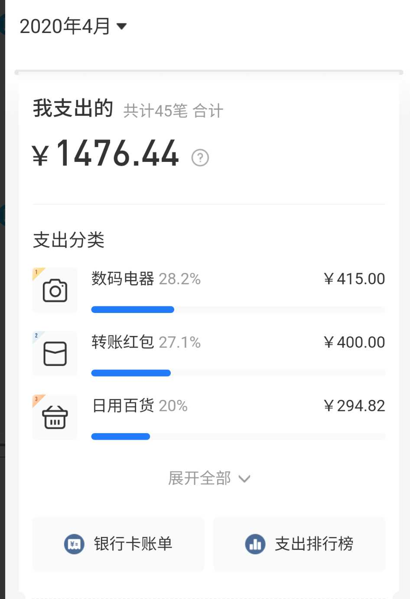](../static/uploads/2021/02/wp_editor_md_151bafec821834074a668f6a7c8c9d70.jpg) 随后在公司进一步缩减规模前，我找到了新工作，是一家做海外APP发行的小公司，吸引我的是深度学习的实践场景、技术氛围的承诺和创业公司依旧 965 的作风，**至少意味着技术方向上能有不少的补全以及充足的时间自我提升。**

> PS：老板还是非常义气的，在几乎没有收入的情境下，六七月还把 19年的年终奖发了

### 我的征程也是公司的征程

入职后发现公司正好处于分家、搬家、老员工离职的过渡期，给了两天时间交接工作，了解后端状况，然后就搬到了通勤 1h 的中科路（之前面百度去过的地方，真没想到日后会经常走这条路） 随后就接手了越来越多的工作，核心产品请求加密算法改造、AWS `Serverless`、`AWS` 的容器化方案 `Fargate` 和阿里云的 `Serverless` `K8S`、过亿 ES 数据清理和迁移、`logstash` 日志手机方案、`CodeReview`、性能优化、`CI/CD` 及持续了大半年的针对运维和开发的招聘。 [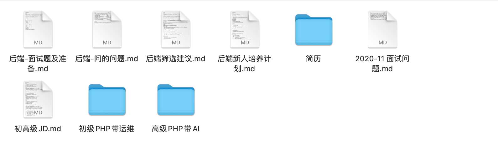](../static/uploads/2021/02/wp_editor_md_35ad07e6fad9b10b2702c917b6115cd6.jpg) 不断招聘的这大半年，经过 HR 初筛 + 题目初筛到我手上的后端开发简历 33份，运维简历 32份，听说 HR 这半年把符合的都聊了个遍，到最后还是靠着缘分，**在12月到元旦这个时间找到了满足需求的人。** 持久面试也是一种锻炼，最多的一天排了四个面试，每次都需要从拟好的角度配合对方的经历进行交流， **从一开始控制不住面试时间，到后来渐渐把控好交流节奏，一点点的对这个过程变得熟悉。面试中遇到过从业二十年但知识也随着两侧的斑白慢慢过期的老兵，也遇到过半瓶水但莽撞桀骜的面试者，还有满足技术需求但经历作假被 HR 淘汰的各式各样的人。** [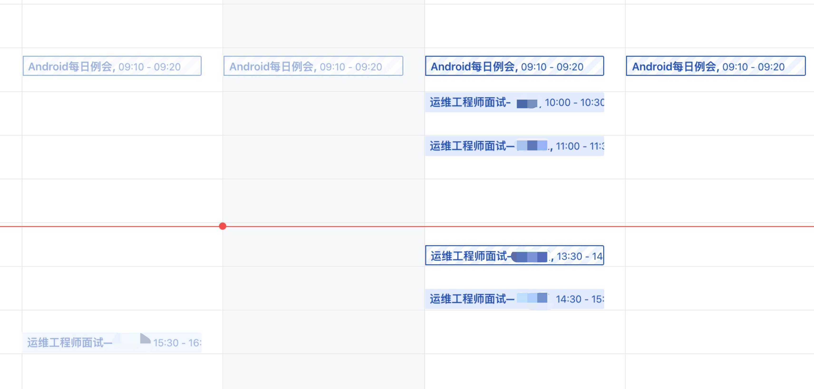](../static/uploads/2021/02/wp_editor_md_cd5de3784ad86556ee5e47c1accc7beb.jpg) 到2020年底，团队各角色也已齐整，大部分架构已经搭建完毕趋于稳定，各个组件也都已经调整到符合当前业务的状态，**回头一望，一切过往皆为序章；身为后端或身为全栈或为更好的将来做打算，技术生涯不能只放眼于现在，路在脚下，慢慢走。**

## 社区

### 个人开源

 今年的开源贡献算是稳定吧，连续一段时间都能持续输出，新增了 `Web3d` 模型转换和展示相关的项目和为招聘而写的 `hire-tools`，还有数据库迁移、API签名计算等零散的小项目。 得知我的 BUG 被深藏北极冰封上千年，心情一阵激动，甚至还为此发了朋友圈。 **也许是觉得自己也许并不能在漫漫历史上有所笔墨，但我的 BUG 会比我存在的更久，在岁月中留下痕迹，也许以后它还会被送进历史博物馆也说不准呢。** [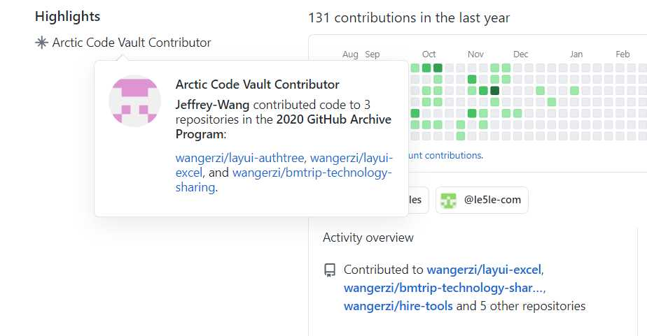](../static/uploads/2021/02/wp_editor_md_62383e4fc6596f7a2d7a4bdcd06a0a74.jpg) `lay-excel` 项目继续修修补补，中间用了 `webpack` 重新做了打包，在11月发布了 `1.7.2`，能帮助到更多的人，让我的代码跑在世界各地的机器上，非常开心且荣幸。 [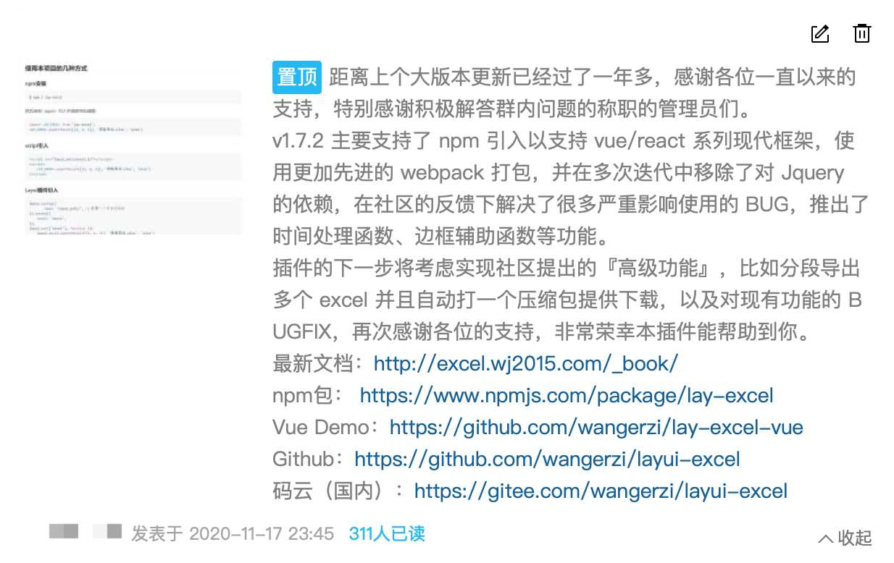](../static/uploads/2021/02/wp_editor_md_d746d83c63549fb77a454b9ce7af2f19.jpg)

### Learnku

[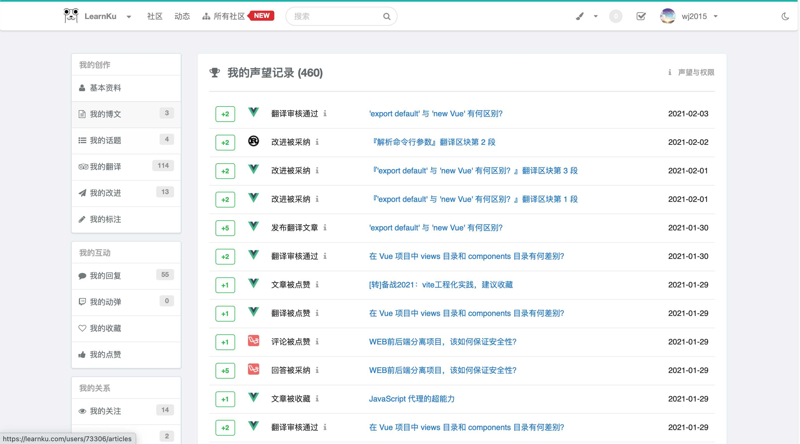](../static/uploads/2021/02/wp_editor_md_ef02fcf2dd3186a3a25e81999215b97a.jpg) 自 `2020.12` 发现这个平台以来，贡献了一百多个翻译分段，`VueJS` 见习版主已经到第 10周了，还有两周达到版主的要求。几乎每周都会译者排行截图留恋，霸榜的感觉真好😁。 [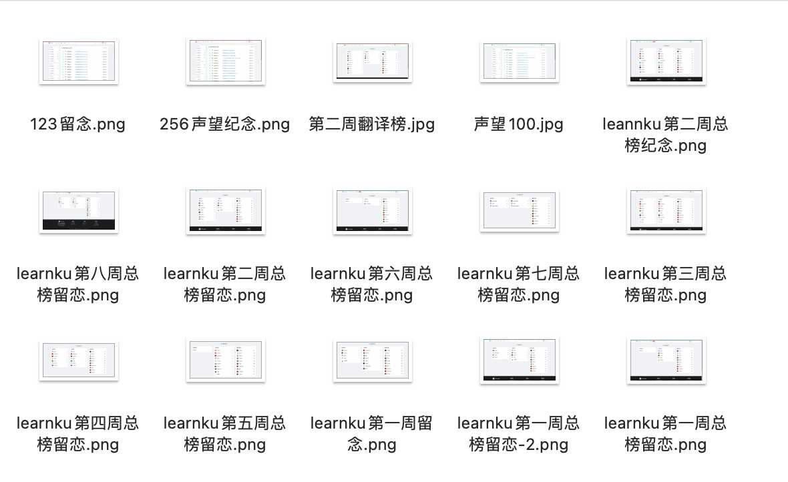](../static/uploads/2021/02/wp_editor_md_c87c25f7d23409792cfe9ec22740f142.jpg) 社区的新帖子每个都点开看，基本每个帖子都点赞，基本每个问题都尝试答，但是社区本身就不太活跃的样子，所以大多数声望都来自翻译；其实想在见习版主结束后转到 go 社区，因为目前个人大的学习方向就是 golang，多在社区交流发帖有利提升。 [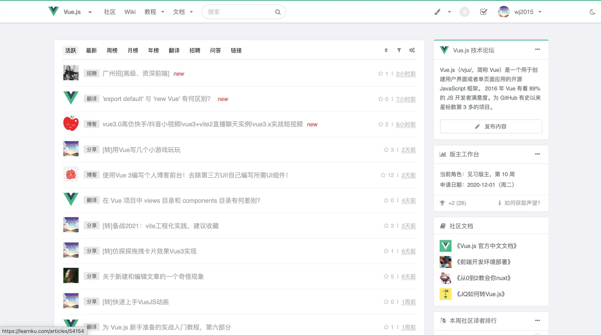](../static/uploads/2021/02/wp_editor_md_5506b6b6b7bdd590aa2541b51e00e653.jpg) 在这个平台的一两个月，也建立起了对英文技术翻译的一些兴趣和自信，虽然遇到长句翻译也很容易蒙圈，但看到那些英文文档和文章都没这么怕了。

### 开发者大会

[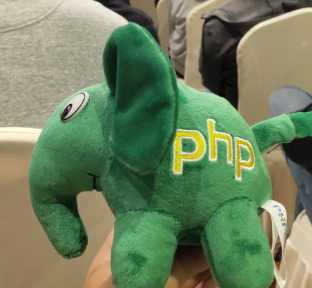](../static/uploads/2021/02/wp_editor_md_3a7553f9d9a7fc266a543a8ad1a9e7d9.jpg) 参加了今年的 PHP 开发者大会，了解了一些相对前沿一些的应用和架构开阔眼界，积极互动还得了一堆小奖品 `Golang` 学差不多考虑去听听 `Gopher China`，听说 20 年分享的干货还是有不少的。

## 个人技术提升

#### 深度学习

这门子技术在去年就一直很感兴趣，停工期间公司有技术分享的计划，在自己看了基础入门书籍后，做了两堂关于深度学习的分享。 那本书现在还记忆犹新，名字叫做 **《深度学习的数学》** ，主要涉及到的都是数学基础以及卷积、向量机的原理，基于此写了一系列博客，两三星期的样子，写了11篇，有两篇阅读量还出乎意料的不错。 [机器学习](https://blog.wj2015.com/category/%e6%9c%ba%e5%99%a8%e5%ad%a6%e4%b9%a0/) [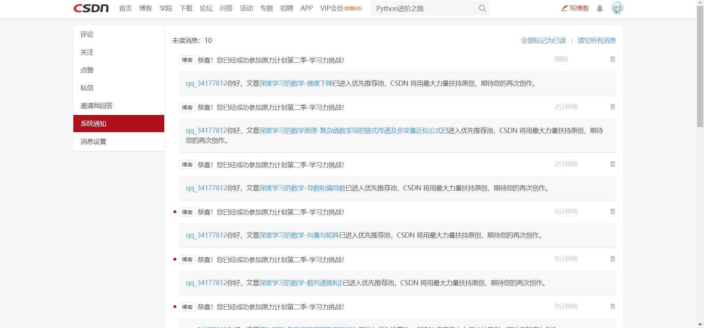](../static/uploads/2021/02/wp_editor_md_730568dc32b989db86425a3908aceda9.jpg) 随后进入了现在这家公司，规模不是太大，里边也有部分深度学习的技术场景，基于 `VGG19` 做的图像风格迁移，当时招聘还专门考察了这部分的基础能力； 进公司后第二天老板就送了我两本书，一本 **《深度学习之美》**，一本 **《DEEP LEARNING》** ，第一本看了个多月刷完了，对基本的卷积、时序、OSTM、胶囊网络有了个概念，但是没上手写多少代码，实操还停留在手写数字识别上，也没有整理相关的博客。 体验到了炼丹师的快乐，hhhhh [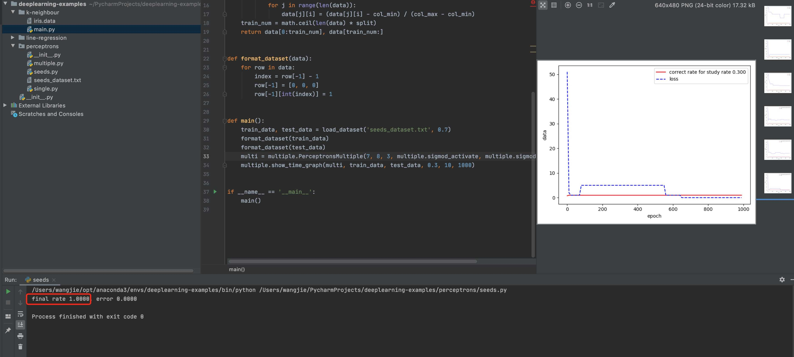](../static/uploads/2021/02/wp_editor_md_c56df5c7066357f4f233ca5c48082664.jpg) [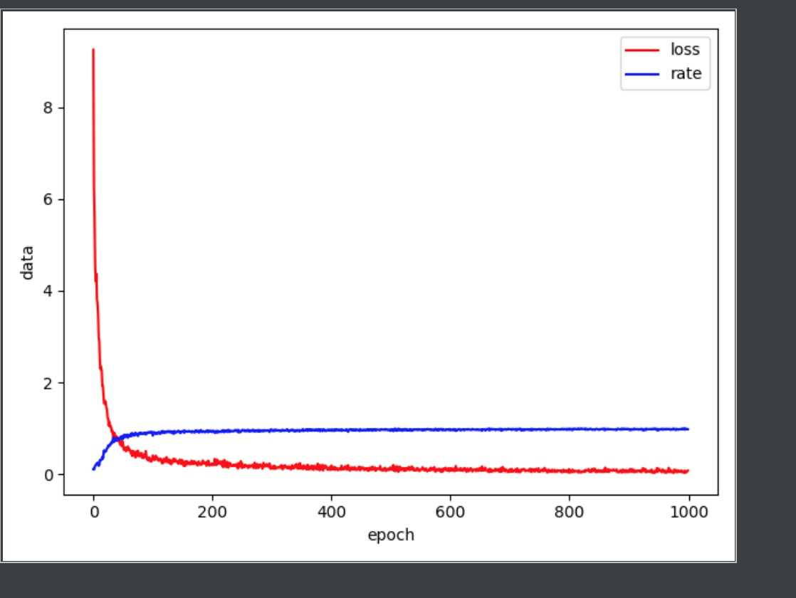](../static/uploads/2021/02/wp_editor_md_980846a95915e8c326c4eb90ea8dfeec.jpg) 现在这两本书还在我的案头（并没有垫显示器） [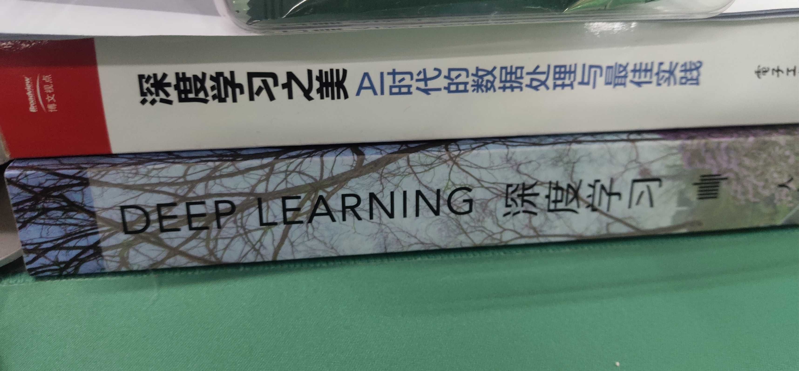](../static/uploads/2021/02/wp_editor_md_c13b2f268c3aefbc74e32e49e120b4c3.jpg) 随后公司让调研了很多深度学习相关的产品方向，包括 `黑白图转彩色，动漫画风迁移，AI抠图` 等等，给一些项目提过一些简单的 PR，能上生产的方向特别少，最后对比多家采用了百度的抠图 API 并针对海外场景做了中转，随后由于产品停滞，进入维护阶段后就没有相关工作了，有点遗憾。 个人对这个方向还是很感兴趣的，就是积累和实践所需成本暂时无法给到，因为其他的 **后端、前端方向还需要加精，不能走成了四不像。**

#### MySQL底层

[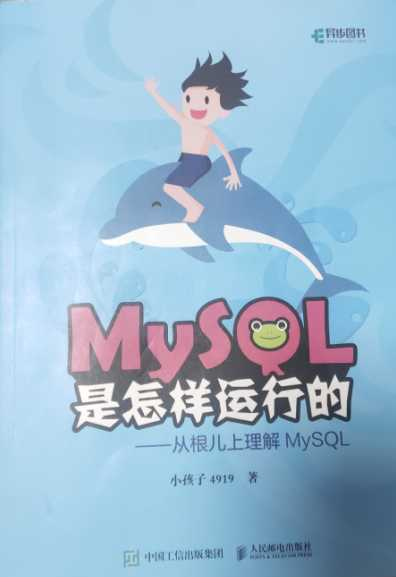](../static/uploads/2021/02/wp_editor_md_00e8ad70ee4285c6f0f305ecfbbd09bc.jpg) 今年把 **《从根上理解MySQL》** 这本书读了两遍，电子版一遍，纸质版一遍，对 MySQL 的理解个人觉得得到了不少的增强，从底层行结构到页再到表空间，再从索引原理到 JOIN 再到查询优化器，以及 页Buffer 和锁，都是之前业务代码中不曾想到的东西，理解底层之后对 SQL 优化的理解更深，遇到问题的时候更加有方向。

#### Redis 底层

**《Redis 设计与实现》** 这本书去年看了一遍底层数据结构，今年重新刷了一遍，看到哨兵和集群还有槽分配的时候，身边的场景不足，了解但不够理解，还需要继续加深。

#### 算法

[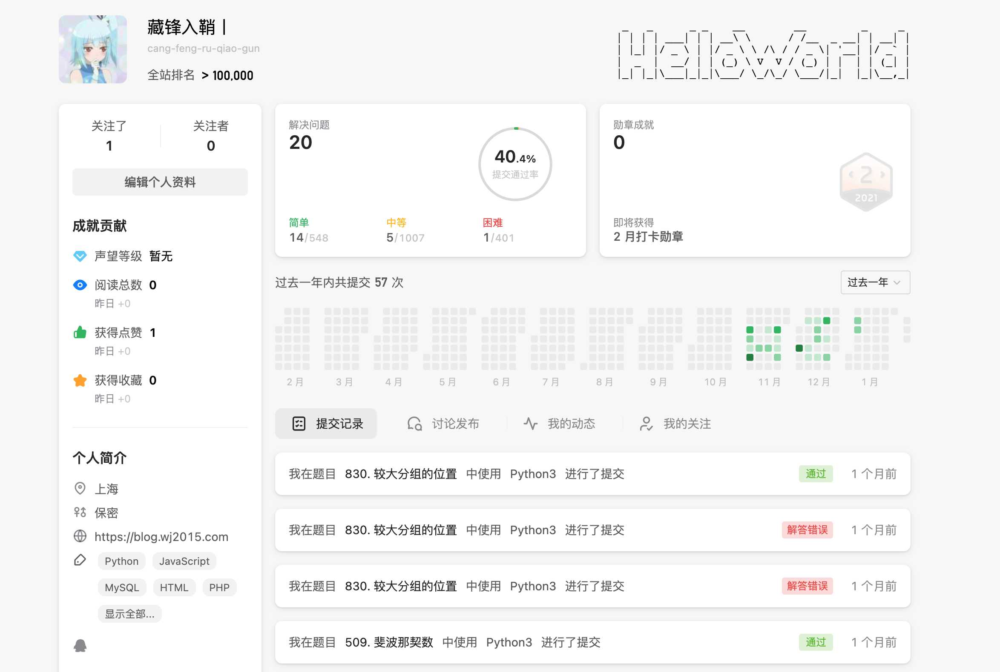](../static/uploads/2021/02/wp_editor_md_72dc99b003e7b354b5d877f1d412672d.jpg) 年初买了本 **《小灰的算法之旅》** 很快就看完了，对算法思想有了初步的认识，但是 **动手太少了** 的问题依旧存在，导致很快就会忘掉。  后来刷了半个月的 `LeetCode` 每日一题，有思路的都尝试实现掉，但是很多题都找不到思路，于是乎买了一本 **《labuladong 的算法小抄》** ，公众号写的很不错的就买了实体书，但问题又出现了，本来我是去食堂吃饭 12:30 回来就可以刷刷算法，但是新的运维和后端小伙伴来了之后，经常外边吃，本就不充裕的时间通常就来不及看算法了。这本书看了 `DFS/BFS/动态规划` 后就被放到了桌角，有所斩获，但是跟预想的收获有点差别。 [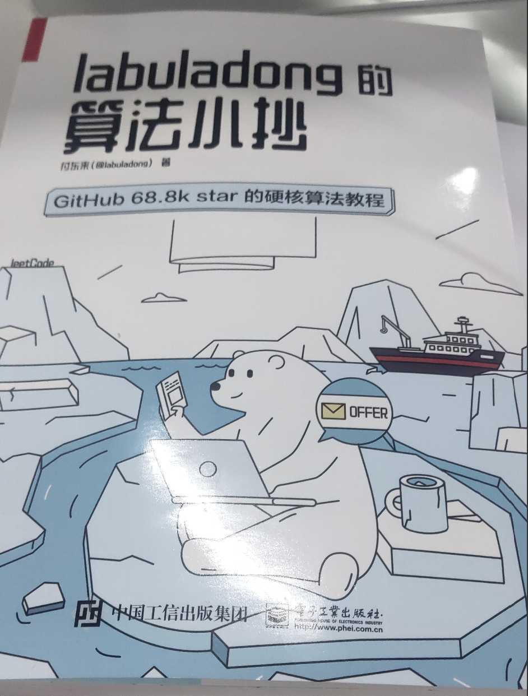](../static/uploads/2021/02/wp_editor_md_35085ef1f3264c853de324437183cbf2.jpg)

#### Web3D

`Web3d` 这个方向是疫情期间研究的，正好女朋友公司也在做这个调研，我顺着 `threejs` 折腾出来了一个效果还行的渲染，还对模型格式有了一定的理解； 还参与了部分 [vue-3d-model](https://github.com/hujiulong/vue-3d-model) 的开发，后来找到新工作后，就没继续往里边提 PR 了。 配合之前的 python 基础以及 node 基础，结合 Docker 整了一个转换模型格式的工具出来，这就是新开源的 [3d-model-convert-to-gltf](https://github.com/wangerzi/3d-model-convert-to-gltf) 可以 **将 STL/IGES/STEP/OBJ/FBX 格式的模型转换为 GLTF 格式** ，并自动压缩，有利于 web3d 的模型展示和渲染。

文件类型

文件名

转换时间

原大小

转换后大小

stl

assets/test.stl

2368.890ms

7.6 MB

86 KB

iges

assets/test.iges

1641.226ms

1 M

111 KB

stp

assets/test.stp

2969.200ms

5.1 MB

217 KB

fbx

assets/Samba Dancing.fbx

<1000ms

3.7 MB

614 KB

[STEP和IGES模型转换为适用Web的glb格式](https://blog.wj2015.com/2020/03/08/step%e5%92%8ciges%e6%a8%a1%e5%9e%8b%e8%bd%ac%e6%8d%a2%e4%b8%ba%e9%80%82%e7%94%a8web%e7%9a%84glb%e6%a0%bc%e5%bc%8f/) 还有折腾出的一些 demo 级别的东西 比如 threejs 官方 [头盔渲染](http://3d-works.wj2015.com/#/work-helmet)  比如一个带监控报表的 [高达工厂](http://3d-works.wj2015.com/#/work-factory-robot) [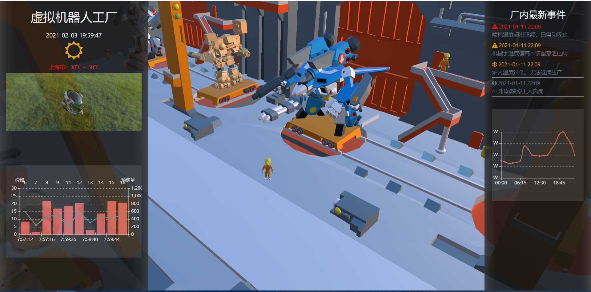](../static/uploads/2021/02/wp_editor_md_0fafc399515674d90881a7ff7dde2232.jpg) 还有带简单交互，体积计算的小模型 [眼骨](http://3d-works.wj2015.com/#/work-eye-bone) [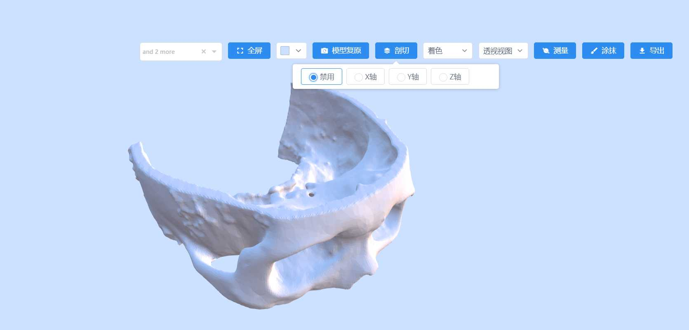](../static/uploads/2021/02/wp_editor_md_3f6618165e396c554a6099979adefebf.jpg) 模型场景 [编辑器](https://preview.mobox3d.com/index.html#/Manage/editor/EAAYIrBA) [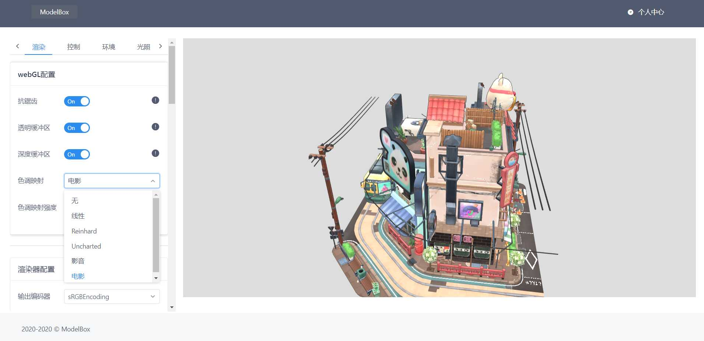](../static/uploads/2021/02/wp_editor_md_0fdb59be14a2317b35a000bc754a1c77.jpg) 还有 [modelbox-sdk](https://github.com/wangerzi/modelbox-sdk) 项目，可以动态的 [上传模型](https://wangerzi.gitee.io/modelbox-sdk/examples/index.html) ，转换模型，然后直接生成 [预览链接](http://preview.mobox3d.com/index.html#/PreviewModel/EAAYIrBA) 嵌入到项目中 [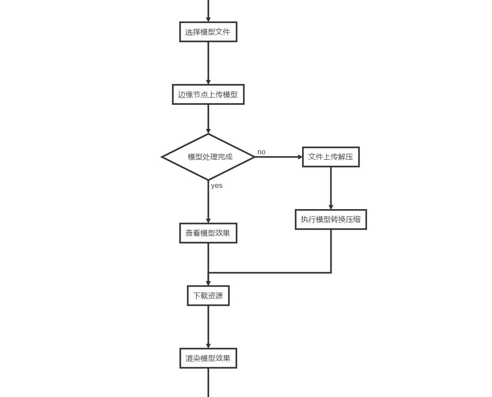](../static/uploads/2021/02/wp_editor_md_b31dc89635b240a2ad0fd7bad2b95253.jpg) [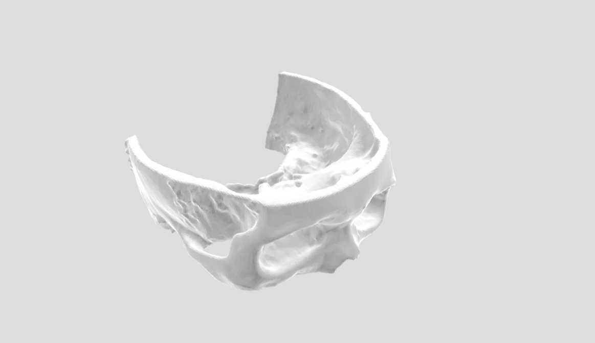](../static/uploads/2021/02/wp_editor_md_ae5e652fa9385b8d6f8d0d5a33c7a9c7.jpg)

#### CSS及泛前端

日常工作和方向都偏向后端、运维方面，但前端来说还是很感兴趣，抽空看了 **《CSS权威指南·上卷》** 以了解 CSS 属性的全局和部分实现机制，介绍还是很清楚，如果工作需要的话当速查书也是很不错的选择。 [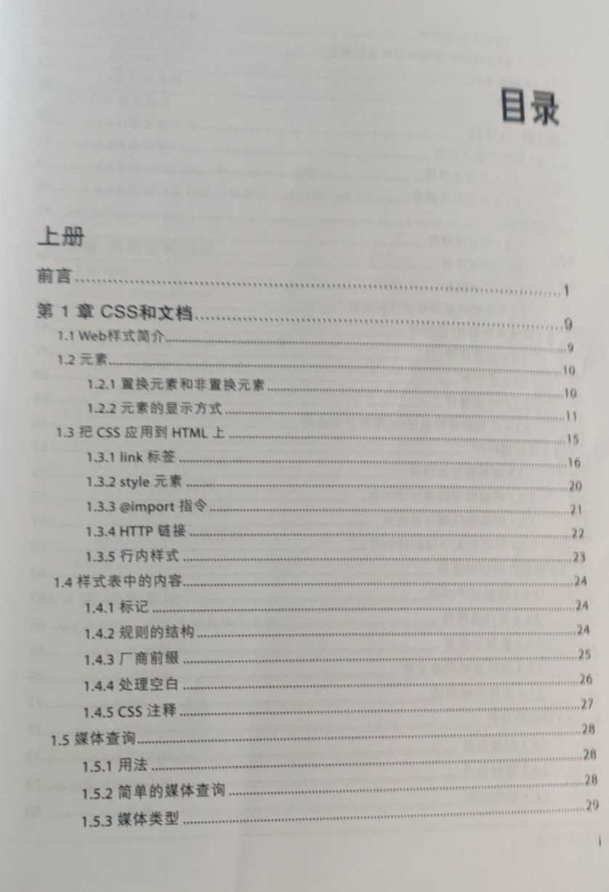](../static/uploads/2021/02/wp_editor_md_7e34fd55d711ef39377351e1c71615ca.jpg) 还在拉钩教育上一分钱薅羊毛买了不少课，写得还是很好的，比如当时追更看的 **《前端高手进阶》**、**《Webpack原理与实践》** 高手进阶里边对 DOM树、 AST 语法树和浏览器渲染的部分让我印象挺深刻的  Webpack 那本小册对执行机制和插件机制讲的很浅显易懂，看完我就 **反手把之前用 `glup` 打包的 `lay-excel` 开源项目改为 `webpack` 了。**

> 并不是只看了 8m，追更到第8讲把 plugin 之类的都讲过了

[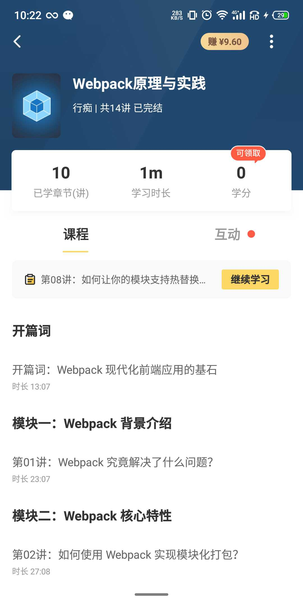](../static/uploads/2021/02/wp_editor_md_4c8f9013a2d24e2db9fa9ebcbcad5bd9.jpg)

#### ElasticSearch

ES 方面之前接触比较少，主要是在换公司之后，有大量业务数据存在了 ES 集群中，而集群的配置又很不合理，于是乎开始了整理老数据和集群优化之旅。 其中最为惊心动魄的就是数据迁移，来之前 ES 的 `rollover` 都是由特定机器上的定时脚本跑的，不知道何时这个脚本突然不跑了，间接导致了一个超大索引，具体细节记不太清了，大概是 60G，数据量妥妥过亿；有些索引迁移到一半还给误操作删掉了，大概一千万条，还好不是特别重要的数据，至此除了那些立马要执行的删除，我 **再也不敢把 DELETE 语句放到 Console 里边了** 。

> 其实这一千万条还能通过备份找回来，但当时问过了没关系就算了

随后对 ES 的存储部分做了比较详细的调研，最后选择用 `AWS ElasticSearch` 的 IAM 来做索引的自动过期删除，原有老逻辑的 `rollover` 还是走自动脚本。 还针对索引的分片策略进行过优化，配合无用数据清理，成功在合理的数据范围内把分片数量从 **1000个降到 100个** ，配置也从 **三主六数据降到了一主两数据** ，速度还比之前快。

#### Golang

想写 golang 不是一天两天了，中间尝试过两次但都由于各种各样的原因没有持续下来，直到后来耐住性子抽出俩星期把基础语法和 `net/http` `gin` `gorm` 的常用库弄懂了，才算正式入门，目前做出的东西暂时还没有值得一提的，就是编译产物直接能在 `alphine` 的基础 Docker 镜像上跑还是很吸引我的，对容器大小压缩和部署很有帮助。 这两天发现了 [go-zero](https://github.com/tal-tech/go-zero) 这个开源项目，非常强大，作者微信直连，很赞。

#### Nodejs - Serverless

来到新公司的另一个收获是对无服务化的理解，`AWS Lambda` 只是 `FAAS` 的一种实现方式，目前支持 `python/nodejs` 两种语言；在 `Lambda` 中，时间就是金钱，最近修改计费维度为 1ms，省钱的作用就更明显了，代码写越好执行时间越短越省。 两种语言我都写过，都是弱类型的脚本语言，在包管理和逻辑编写上还是 JS 相对更舒服一点，而且 `Nodejs` 前端也能很快上手，维护成本相对低一些。 曾写过一个 `dynamo` 数据流同步 `ES` 的需求，官方代码是 `Python` 的，部署上去的包特别大，还老是莫名其妙执行超时导致后继所有流推送失败，跑得还特别慢（记得是 1s 上下）；随后用 `NodeJs` 重写了一份相同的逻辑，运行非常稳定，一次推送平均 40ms（算上启动时间）。 写这么久 `Lambda`，要想真正发挥其作用还是需要与生态相结合，比如 `AWS` 中的 `CDN`、`API GATEWAY` 以及整合 `Lambda` 的神器 `step function` 工作流，可惜现在还不支持 `RESTFUL` 风格的 `API GATEWAY`，不然就作为公司无服务架构的核心了。 `Serverless` 也不全是好的方面，首当其冲 **冷启动问题** ，比如长时间没有请求进来，lambda 的运行池中没有你部署的代码，第一次启动就会非常慢，甚至能有几百个毫秒；亦或者请求比较零散，没有做预启动实例的情况下，长时间都只有一个实例在运行，突然请求多起来了，出现了两个实例并行运行的情况，冷启动问题又出现了，这种问题目前的云厂商都还没有好的解决方案。 还有偶现的全局变量连接复用时，连接超时、连接被关闭等问题持续存在，需要经常分析日志和报表才能从中发现和解决。

#### Docker 容器化及 CI/CD

这一年运维任务上接触最多的就是 `Docker` 了，从我进入新公司开始，就开始了环境容器化之旅，先是基于 `docker-compose` 做了一个可复用的测试环境，随后开始为项目编写 `Dockerfile`，搭建镜像仓库，做项目基础镜像等等工作。 随后新项目要部署，调研了 `AWS Fargate` 容器化方案以及 `Aliyun Serverless K8S` 容器化方案对项目做了流程化的部署，弹性伸缩和自动滚动发布是真好用，偶尔看着高峰期自动加上的机器就有种莫名成就感hhhh。 毕竟要容器化部署，打包之类的自然得自动化，公司仓库用的 `Github`，于是顺理成章用来 `GithubActions`，跟 `Gitlab-CI` 用起来差不太多，大多数场景用封装好的 `action` 就能实现，挺简洁的。 测试分支推送后会自动更新到测试环境，生产环境需要打 `tag` 生成对应镜像后半手工上线，已经比之前人肉运维逐个机器进行灰度发布好太多了。

## 个人

### 旅行

去年和女朋友定下的主题是 **“陪你一起看世界”**，所以 2020 年农历春节本来打算一起桂林深圳游玩一下，请假、旅行计划和机票都准备好了，但是疫情突如其来，全盘打乱，哪儿也去不成，返沪后疫情未曾好转，还有外包和找工作悬着，所以直到下半年才开始慢慢出游。 单论去过的地方，今年还是有不少的，八月去了黄山，十一回了趟重庆，元旦前去了南阳，再去了杭州，然后去了绍兴。 元旦之行还借了单反，学会了单反的基础操作，也拍出来了一些看起来不错的照片。

### 黄山之行

 黄山真的超美，烟雾朦胧，时不时露出人造小亭和嶙峋奇石，恍若仙境。  黄山给我印象最深的除了日出，还有凌晨四点为了看日出出门后看到的第一眼星空， **它不像城市内看到的星星那么暗淡无光，也不像虚拟星空软件里边每颗星都那么刺眼，但就是那么清晰，buling buling 的闪，抬头看到的那一刹那我感觉眼泪都快涌出来了**，无际的星光以及皎洁的月光洒在额头上，自己就像变身成了光，置身于空旷无际的宇宙。 [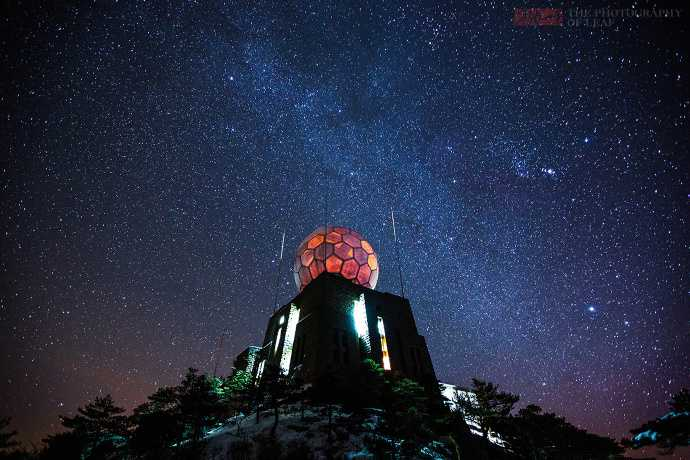](../static/uploads/2021/02/wp_editor_md_df7c9bd95db30ba5a384261519148e5d.jpg) 当时拍照全靠手机，无法照下这震撼的一幕，网上找了拍摄图，但跟身临其境的体验差别还是很大的。

### 国庆之行

 十一国庆去了绍兴见了家长，天气不冷不热，温度刚好，风儿喧嚣，充满了生活的气息。 [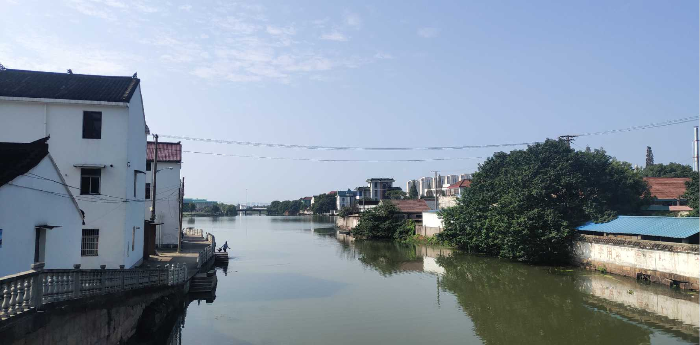](../static/uploads/2021/02/wp_editor_md_74a1b5afd8da9f25e299b74d28e48b4a.jpg) 还跟大学室友、女朋友一起在重庆齐聚一堂，虽然我是土生土长的重庆人，但有些地方也是第一次去，有些店也是第一次吃。 洪崖洞不管去几次都会有一种华灯初上，千与千寻的感觉~  到了重庆自然是少不了的火锅，较场口佩姐火锅（伙伴们搜出来的，本地人只听过没去吃过） [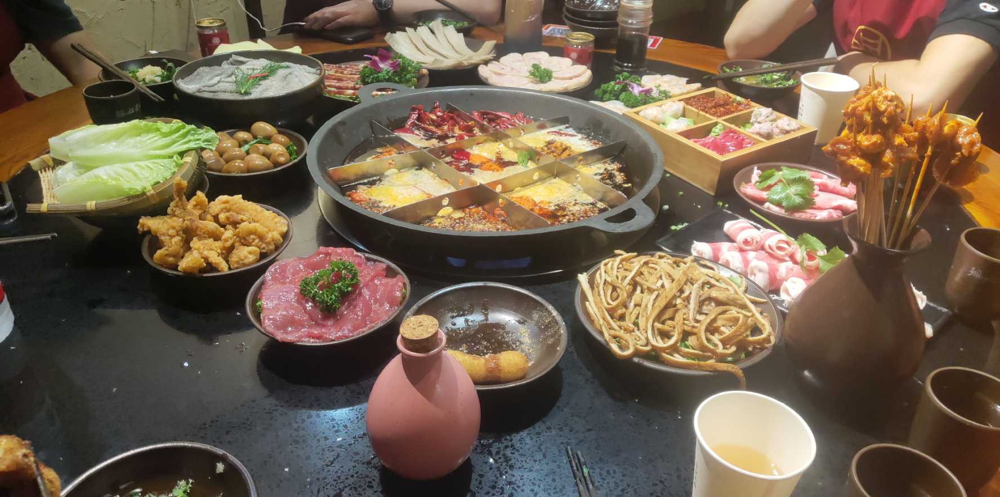](../static/uploads/2021/02/wp_editor_md_dffc413e7966df31512392bbf5ef2a47.jpg) 国庆生活还是很丰富多彩的，连续十一天，从东到西又从西到东。 [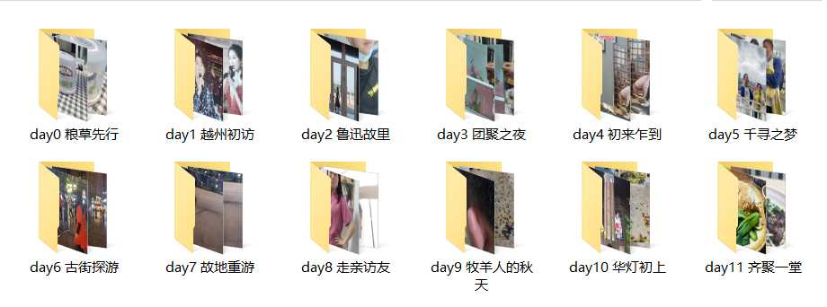](../static/uploads/2021/02/wp_editor_md_4634ddf3801f8917cb714320b18811c1.jpg)

### 元旦之行

 元旦九天的安排更为松散，学了两晚上的单反，然后就带着一路游一路拍，从上海到南阳与记忆中的人和物团聚，再从南阳到杭州领略西湖风光，最后再拜访了女方家长，收官！

#### 记忆和现实交触的校园

[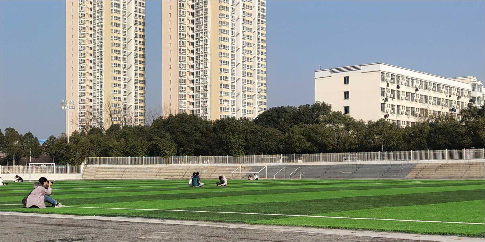](../static/uploads/2021/02/wp_editor_md_d2c5e4011aa345c204368bea839564ce.jpg) 总是能回想起踏上技术之路的点点滴滴，熟悉的学生社团、熟悉的教室，位置没变场景没变，但是人变了，变得都不认识了，教室也没有我们的位置了。 

#### 蒙出来的精选作品分享

 [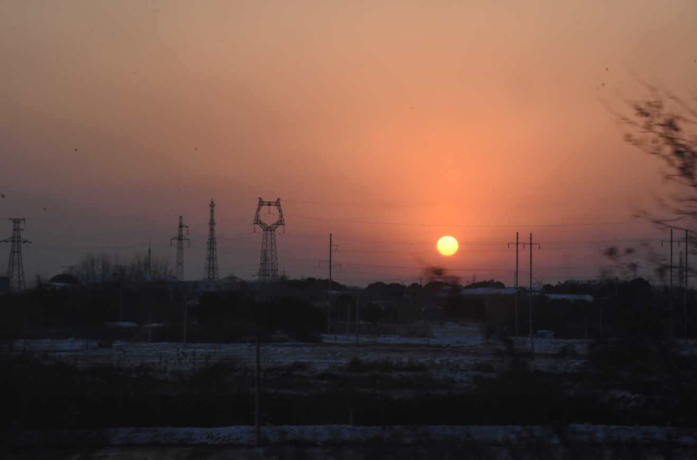](../static/uploads/2021/02/wp_editor_md_30c98d7257622bfb08fe69e148030667.jpg)   [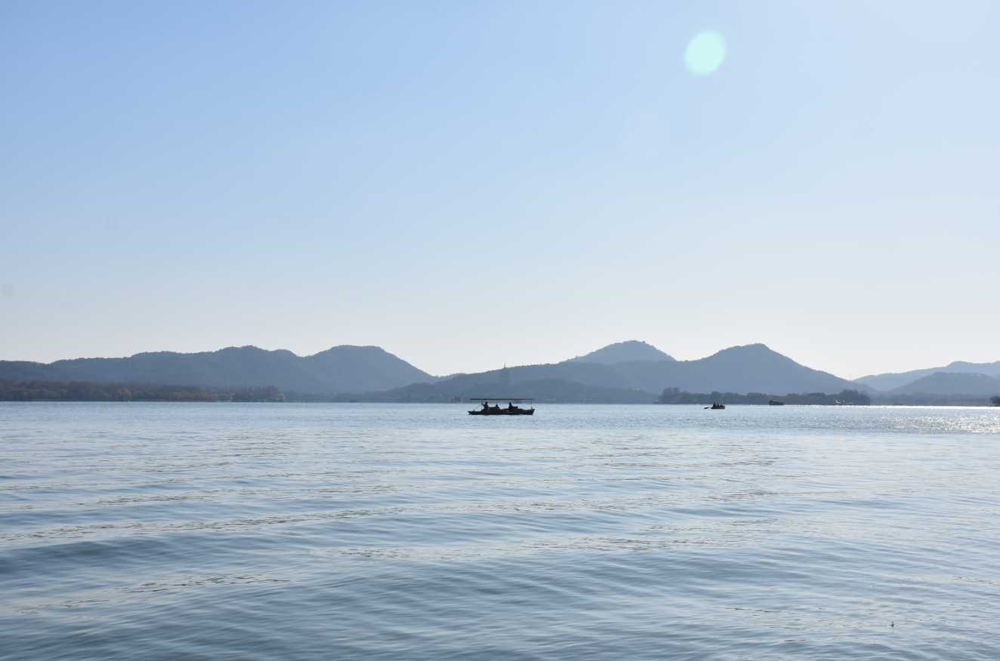](../static/uploads/2021/02/wp_editor_md_e4b2a264fae8b6c7071b0564fea992a1.jpg) [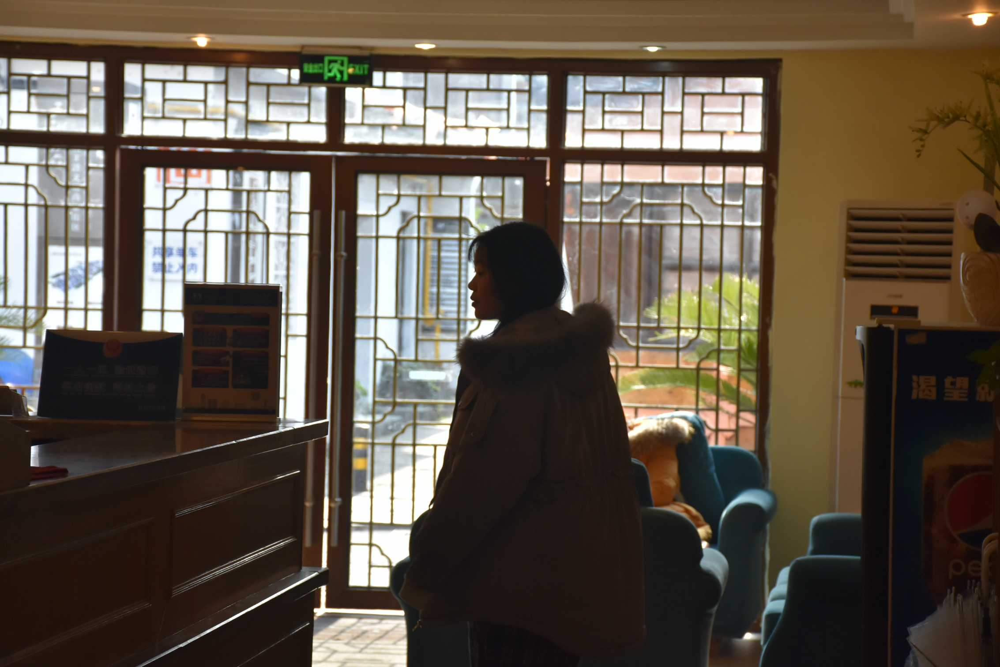](../static/uploads/2021/02/wp_editor_md_70a37b55602d24ea21c674d2914c429a.jpg)

## 关于未来

**时间不会停下来等待任何人，变化总在时时刻刻的发生着** ，从实习进入互联网工作的这两年中，经历过数次业务缩减裁员，公司由盛转衰再到疫情打击下的举步维艰。再经历了停工+自由职业，再慢慢稳定找到了一个适合当前阶段的公司开始新征程。 之前看 **《谁偷了我的奶酪》**，就喜欢像 匆匆、嗅嗅 那样，不放松警惕，**发现周围的变化，脚踏实地去做，用以应对突然可能发生的变动，尽量把主动权握到自己手里！** **在平时也都会有一种危机感和焦虑感，一是来自技术，二是来自生活。** 互联网行业现在相对传统行业确实有着相对高的薪资，有点机器逐步淘汰和剥削传统手工业的感觉。举个可能不很恰当的例子，当年煤矿业也是令人羡慕的赚钱行当，资深矿工也能拿到相对不错的高薪资，但是随着产业和大工业的发展，矿工的工资也变得与普通工种一样。**像程序猿这个行当，在智能化和滚滚后浪推前浪的趋势下，在未来也可能变成普通工种，唯像前文说的 “匆匆”、“嗅嗅” 那样关注及适应变化，方可在时代的大潮起伏中向前游去。**