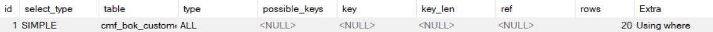
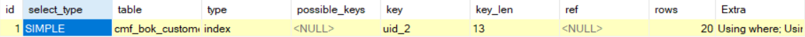
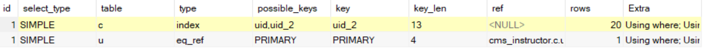
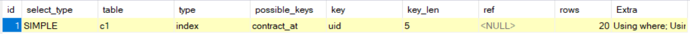

# 背景

项目中遇到了这样一个需求：显示出在某一时间范围内，按照推荐客户人数降序排列的用户列表。用户表与推荐客户表属于1:n的关系。针对此类需求，特作此总结。

# 情景复现

## 数据库搭建

假设数据库结构如下： 用户表：

```mysql
CREATE TABLE users(
    `id`    INT(11) PRIMARY KEY AUTO_INCREMENT,
    `name`  CHAR(20) NOT NULL COMMENT '用户名',
    `mobile`    CHAR(15) NOT NULL COMMENT '电话'
)ENGINE=INNODB;
```

推荐客户表：

```mysql
CREATE TABLE customer(
    `id`    INT(11) PRIMARY KEY AUTO_INCREMENT,
    `uid`   INT(11)  NOT NULL COMMENT '推荐人ID',
    `name`  CHAR(20) NOT NULL COMMENT '客户姓名',
    `mobile` CHAR(15) NOT NULL COMMENT '客户电话',
    `recommend_at`  DATETIME NOT NULL COMMENT '推荐时间'
)ENGINE=INNODB;
```

## 需要解决的问题

首先，排序需要分页显示，而分页需要有两个参数：数据总量、每页数据数量 每页数据量可以自行设置，但是数据总量又怎么得出呢？这里的数据总量，不能是所有的用户，因为不一定所有用户推荐过客户，这里需要统计推荐过客户的用户即可。

### 获取数据总量

`SELECT COUNT(DISTINCT(uid)) FROM customer WHERE recommend_at > '开始时间' and recommend_at < '结束时间';`

> 语句解析： 我们仅需要显示在规定时间内推荐过的用户，那么只需要在customer表里边，将uid去重后统计即可。

`DESCRIBE SELECT COUNT(DISTINCT(uid)) FROM customer WHERE recommend_at > '开始时间' and recommend_at < '结束时间';` 

> 语句优化：使用 DESCRIBE 语句可以发现，此方法会扫描全表（type=ALL），效率不高，如果这个功能使用比较勤，或者对效率要求比较高的话，可以考虑给customer建立相关索引，如：INDEX(\`uid, recommend\_at\`)



### 获取数据

这次的重头戏就是获取数据了，经过一番研究，发现有两种解决方案。 假设users表和customer表的内容如下： users:

id

name

mobile

1

王一

13012345671

2

王二

13012345672

3

王三

13012345673

customer表:

id

uid

name

mobile

contract\_at

1

1

张一

15012345671

2018-04-09 01:31

2

1

张二

15012345672

2018-04-09 01:31

3

1

张三

15012345673

2018-04-09 01:31

4

2

张四

15012345674

2018-04-09 01:31

即：王一 推荐了 3个客户，王二 推荐了 1个用户， 王三没有推荐用户 最终结果预测：

uid

num

1

3

2

1

#### 方案1 JOIN+GROUP（不推荐）

使用 JOIN 将users表和customer表串联起来，使用where子句筛选出符合条件的信息，最后使用GROUP BY 按照uid进行分组，然后逆序排列即可。 `SELECT users.id, COUNT(*) AS num FROM users LEFT JOIN customer ON customer.uid = users.id AND recommend_at > '开始时间' AND recommend_at < '结束时间' WHERE customer.uid IS NOT NULL GROUP BY users.id ORDER BY num LIMIT 0, 10;`

> 语句分析： 首先，使用 LEFT JOIN 将customer与users内联起来，直接内联结果如下表。用WHERE子句过滤掉没有推荐客户的users后，使用GROUP BY 进行分组，将统计数量 num 逆序排序，输出结果。

id(u)

name(u)

mobile(u)

id(c)

uid(c)

name(c)

mobile(c)

recommend\_at(c)

1

王一

13012345671

1

1

张一

15012345671

2018-04-09 01:31

1

王一

13012345671

2

1

张二

15012345672

2018-04-09 01:31

1

王一

13012345671

3

1

张三

15012345673

2018-04-09 01:31

2

王二

13012345671

4

2

张四

15012345674

2018-04-09 01:31

3

王三

13012345671

NULL

NULL

NULL

NULL

NULL

> 语句优化：同理，如果不建立索引，那么使用 DESCRIBE 语句可以发现，type=ALL，可给customer增加INDEX(\`uid, recommend\_at\`)。又由于用户表的id是主键id，所以不用考虑索引的问题了。



##### 不推荐理由

通过DESCRIBE和JOIN的原理就可以看出来，这种方式是要跨两个表查询的，即先查询 users表中符合条件的数据，再按照关联查询出 customer中的数据，效率较低，最后再对统计数据中的 num建立临时表，倒序输出。

#### 方案二 GROUP BY（推荐）

直接对customer先使用where筛选出符合条件的数据，再对其进行GROUP分组即可。至于我为什么没有一开始就想到这个方法，只是因为惯性思维，认为统计用户信息需要从用户表着手罢了。 `SELECT uid,COUNT(*) AS num FROM customer WHERE recommend_at > '开始时间' AND recommend_at < '结束时间' GROUP BY uid ORDER BY num LIMIT 0, 10;`

> 语句分析：查询customer表中符合时间段的数据，查询完毕后进行GROUP BY uid，就可以把uid对应时间的数据统计出来了。 语句优化：普通查询语句，仅需加INDEX(\`recommend\_at\`, \`uid\`);即可。



#### 两种方案差别

方案一，由于是基于users表，所以查询出结果时，可以直接附带上用户表中的树形。 方案二，只针对customer表进行统计，速度会比较快，但是只能获取users表和customer表的关联属性uid，如若获取用户其他信息，则只能再次查询数据库。

# 总结

主表(users),从表(customer)，跨表统计需要解决两个问题，一个是数据总量，一个是数据。 数据总量可以通过从表使用DISTINCT去重+COUNT(\*)得出。 数据获取有两种方式，第一种方式：主表+JOIN+从表+GROUP，这样可以在获取数据的时候顺便获取主表的信息，效率相比较低；第二种方式：从表+GROUP，这种方式可以获取到从表与主表之间的关联ID和统计数据，效率较高。