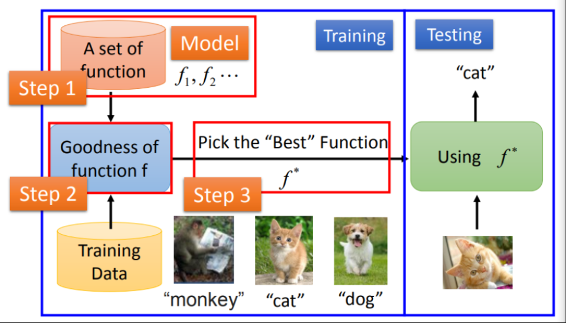
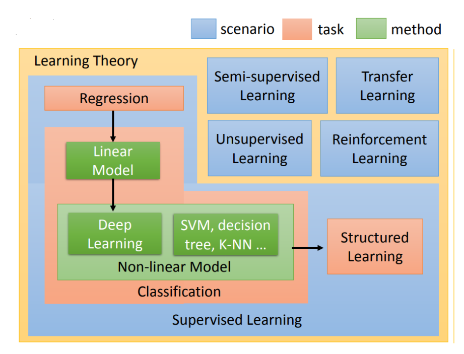
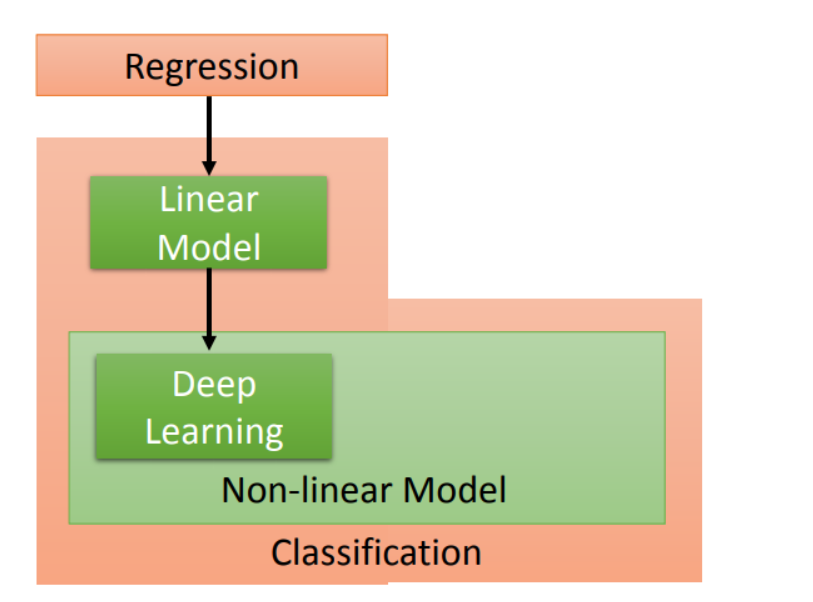
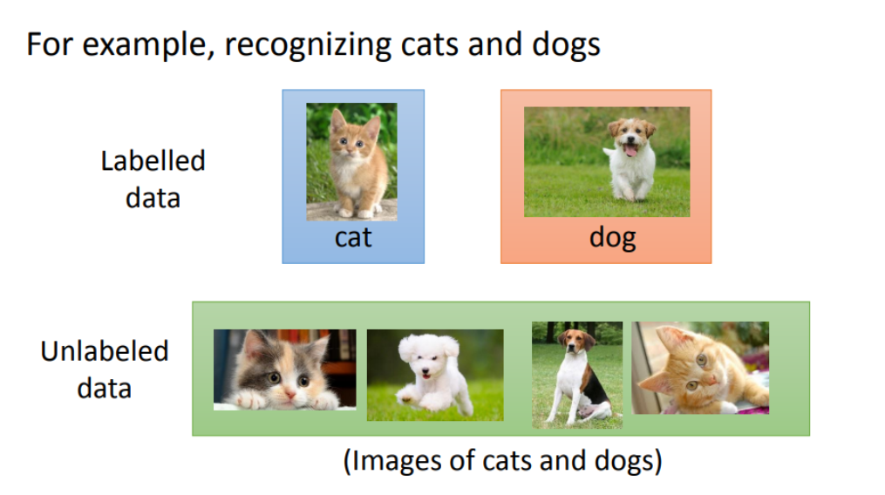
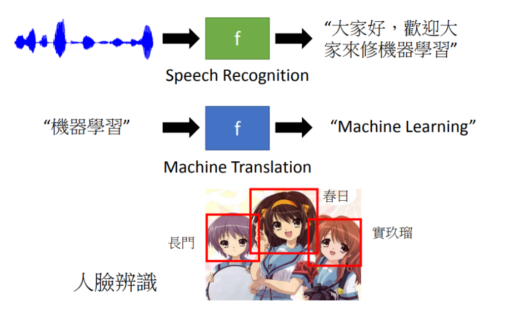

## 前言

系列博客均提取自李宏毅教授的机器学习课程，配套笔记如下：https://datawhalechina.github.io/leeml-notes/#/chapter1/chapter1 ，B站视频地址如下：https://www.bilibili.com/video/av59538266

## 机器学习的目标和手段

人工智能是人们想要达到的目标，机器学习是达成目标的一个手段，希望机器拥有自我学习的能力，而深度学习就是机器学习的其中一种方法。

## 机器学习的三个步骤

语音识别也好、图片识别也罢，都有一个共同的特点，就是需要找到一个 `function(函数)`，把原始数据（语音、文字、图片）输入进去，得到我们期望的结果，就比如输入一张图片的信息，得到图片对应的文字转换结果，输入一篇邮件内容，得到这是否是一封垃圾邮件等。 整个机器学习分为两个部分，一个部分是 `training(训练)`，另一个部分是 `testing(测试)` 就跟“把大象放进冰箱”一样，机器学习也分为三个步骤 - 定义函数集合（自动生成很多个函数） - 衡量一个函数是好还是不好 - 选择最好的一个函数 

## 相关技术以及其特点

### 监督学习

监督学习有一个很大的特点，就是需要准备大量训练资料，以筛选出合适的最佳的函数 

#### 预测场景

比如我们希望输入昨日和前日的PM2.5，预测明日的PM2.5，就需要提供一些训练资料，比如如下表格的资料

第一天

第二天

第三天

02月14日 PM2.5 63

02月15日 PM2.5 64

02月16日 PM2.5 65

02月15日 PM2.5 64

02月16日 PM2.5 65

02月17日 PM2.5 60

02月16日 PM2.5 65

02月17日 PM2.5 60

02月17日 PM2.5 70

根据训练资料筛选出最佳的函数后，我们就可以输入昨天和今天的PM2.5数据拿到明天的预测数值

#### 分类场景

比如想要识别垃圾邮件，输入是邮件内容，输出为是或否(0/1)，就需要准备大量的垃圾邮件和正常邮件的训练资料，筛选出最佳函数后，输入新的邮件内容，最终得到是否为垃圾邮件 或者存在多分类场景，比如新闻分类，输入新闻正文内容，输出其中一个分类： `体育`、`政治`、`金融`、`其他`，训练筛选出最佳函数后，输入新的新闻正文，最终得到新闻分类

### 半监督学习

 比如需要分类一张图片是 猫/狗，如果按照监督学习的思路，需要准备大量的被标记为 猫/狗/其他 的照片，但是半监督学习相关的技术能使用没有打标记的图片，配合部分打了标记的图片，筛选出合适的函数（模型），减少标记工作量

### 迁移学习

同样是分类 猫/狗，但是目前只有少量的标记图片，然后还有一堆与其不想关的图片，可以利用这些图片为模型带来一些帮助 PS:视频浅尝辄止，个人理解是类似排除法的思路

### 无监督学习

也就是谷歌之前的，机器本来不认识猫，但是通过自我学习，识别出一张图片是否是猫； 还比如输入很多动物的图片，让模型自动生成世界上没有的动物，像是牛头蛇身、狗头马身等，随手用鼠标涂抹，自动生成风景图片等。 下边是博主搜集的例子，能自动生成不存在的人脸 [https://thispersondoesnotexist.com/](https://thispersondoesnotexist.com/)

### 监督学习中的结构化学习

比如语音识别、人脸识别等场景，输入语音 `Hello World！`，会输出为对应的文字，给定一张照片，输出照片中的所有人脸数据 

### 强化学习

就像是一个打分系统，比如目标是训练一个聊天机器人，我们不会告诉机器人正确回答应该是什么，但是会给机器人的答复打分，最后目标就是机器人的回复越来越自然。 PS:不过实际产品上看，就算是微软出的聊天机器人小冰，很多回复也不自然，都是以转移话题的形式继续聊 

## 总结

机器学习可以分为三步，定义一个函数集合（自动生成），衡量函数是好还是不好（规则），选择一个最好的函数（自动）； 机器学习可细分为 监督学习、半监督学习、迁移学习、无监督学习、监督学习中的结构化学习、强化学习 等，核心思想是通过大量的训练资料和期望需求得到最佳处理函数，最终希望机器能拥有自我学习的能力；