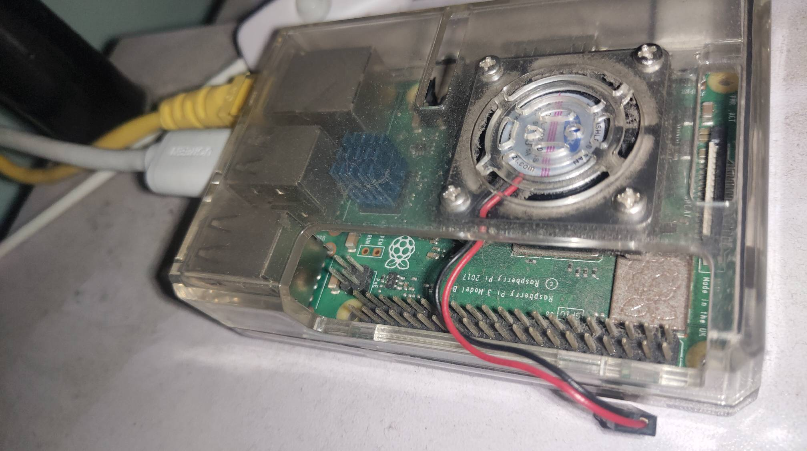
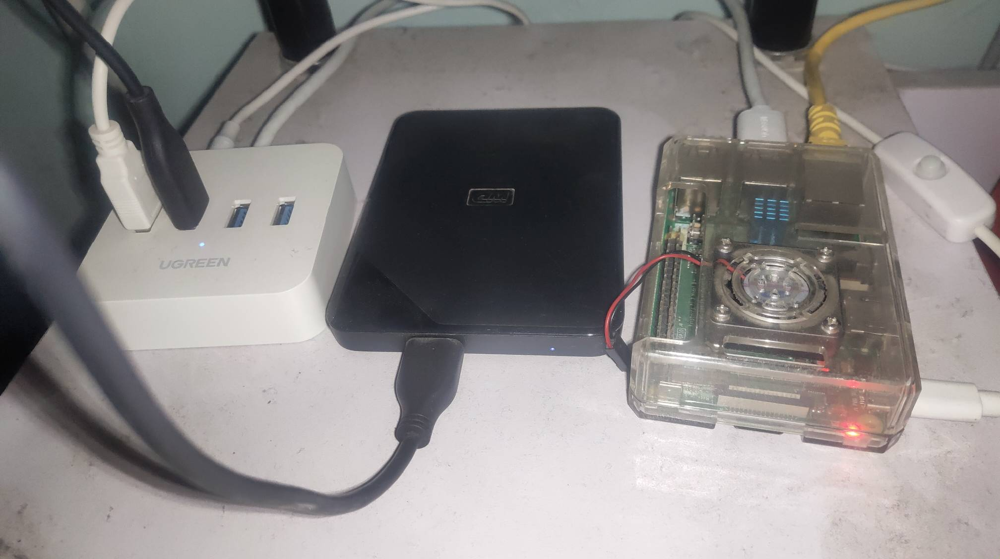
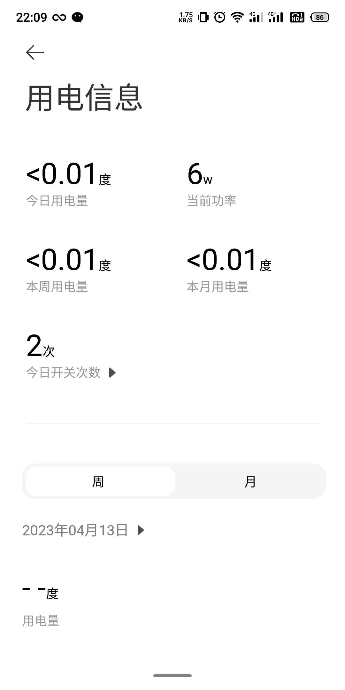
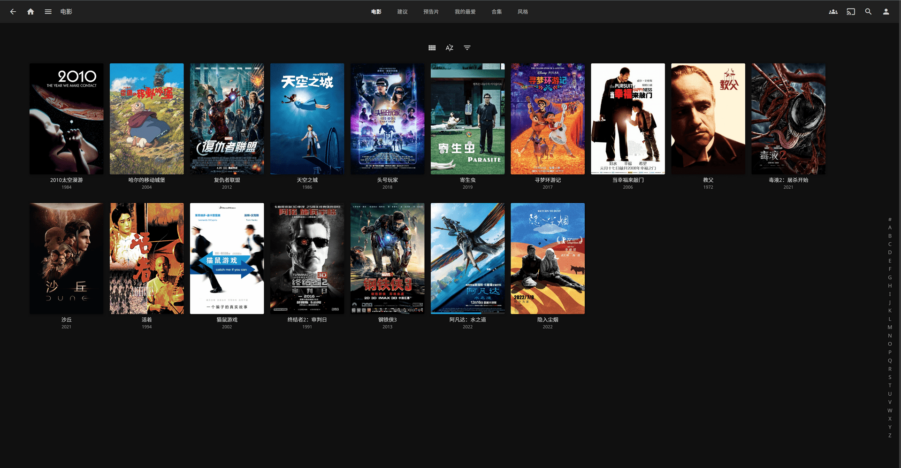
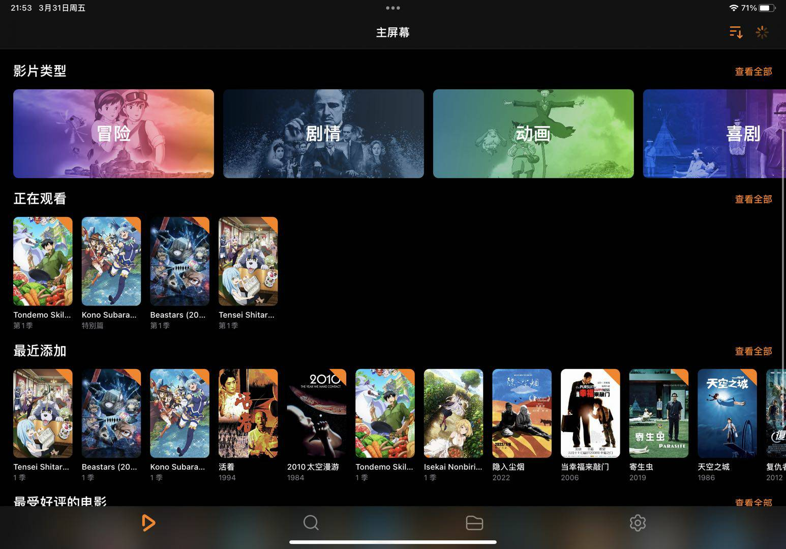
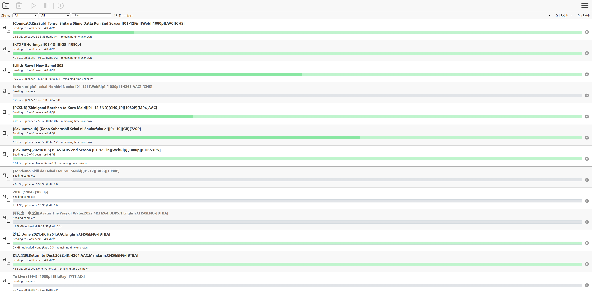
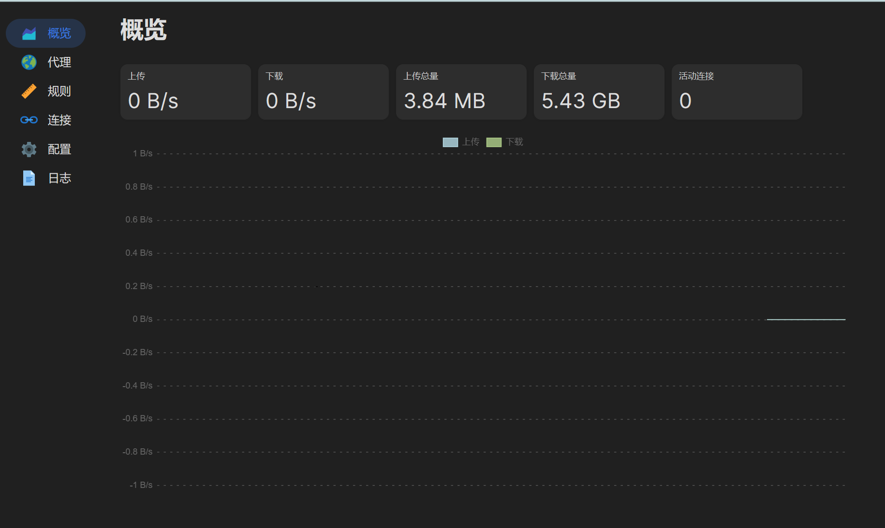
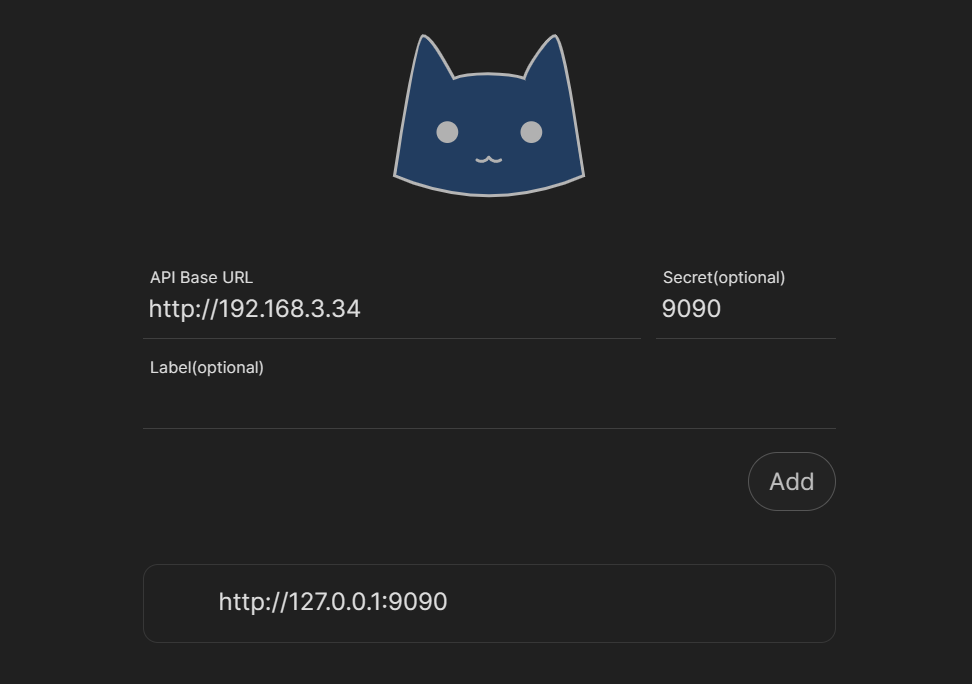
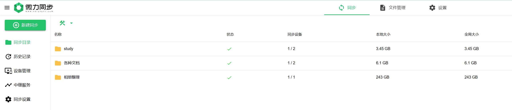

## 前言

这篇博客我继续说说我的树莓派 3B+，它已经陪伴我很多年了，从我刚毕业时候起，**折腾过网盘、机顶盒 、内网穿透，陪我搬了三次家**；现在的它有点锈迹斑斑，赠送的风扇也被灰尘堵塞再也无法运转，哪怕现在树莓派的价格水涨船高，比我几年前买它的时候贵了3倍有余，也还没有卖掉它的念头，总想着让它再帮我再做做这跑跑那。

它最近又帮我做了不少事儿，所以这篇博客算是一个阶段性的总结帖，看看小小的它还能迸发出多少能量。

其中大部分的能力都是 docker 部署的，如果你也有相关需求的话，复制粘贴直接运行，能力无缝迁移到你的设备上。



参见：

[树莓派基于Docker快速搭建nextcloud，附性能测试 - 九层台](http://localhost:4000/2020/07/02/%E6%A0%91%E8%8E%93%E6%B4%BE%E5%9F%BA%E4%BA%8Edocker%E5%BF%AB%E9%80%9F%E6%90%AD%E5%BB%BAnextcloud%EF%BC%8C%E9%99%84%E6%80%A7%E8%83%BD%E6%B5%8B%E8%AF%95/)

[测试环境升级整理实录 - 九层台](http://localhost:4000/2022/05/11/%E6%B5%8B%E8%AF%95%E7%8E%AF%E5%A2%83%E5%8D%87%E7%BA%A7%E6%95%B4%E7%90%86%E5%AE%9E%E5%BD%95/)

之前它运行过机顶盒系统 OSMC(https://osmc.tv/) ，也折腾过 Android TV 之类的系统，最终我还是为它烧录了官方的 raspbian，需要什么就自己配置什么。

## 配件

增添了一个 2T 的移动硬盘，一个带额外供电的 USB HUB，还有一根网线



这里有个点要注意，树莓派本身的 USB 电流很小，所有 USB 供电加起来最大 5V 1200mAh，所以外接硬盘需要购买一个带额外供电的 USB HUB，否则会有搞坏数据的风险（我就弄坏过，大家小心），并且如果树莓派的供电也依赖这个 HUB 的话，需要买有源带隔离的 USB HUB，否则可能造成拔插硬盘自动重启或者插上硬盘自动开机等奇怪的现象。

## 能耗

树莓派本来就以低功耗著称，带上一块儿 2T 的移动硬盘，静息状态也就 4W 左右，满负载做传输、读写也就 6W 上下，一年电费不到24元真的香。



## 媒体中心 + 下载中心

最近刷了很多张大妈的文章（smzdm.com），看里边的老哥折腾 NAS 、软路由很起劲，想着我之前下载了很多电影都还是以最原始的方式存放，没有进度，没有界面，无法设备共享。

然后参考了他们的媒体中心搭建方案，最终选择了 Jellyfin，相比 emby、plex，**他最大的优势就是：开源免费**

官网：[https://jellyfin.org/](https://jellyfin.org/)

web 效果大概是：



ipad 上使用 infura 的效果：



Infura 在内网的播放体验很好，交互也很合理，但播放蓝光 4K 是要收费的，如果不想付费还是老老实实用 jellyfin 的官方 APP 吧

> 刮削器我使用的自带的，动漫选用了 AniDB，使用下面的代理工具已经能满足我的需求了

离线下载我选择了 **Transmission**，能正常下载就足矣



推荐几个 BT 下载的好站：

- 动漫：[dmhy.org](http://dmhy.org/)

- 动漫2：[www.36dm.com](https://www.36dm.com/)

- 电影：[yts.mx](https://yts.mx/browse-movies/0/2160p/all/0/latest/0/all)

- 字幕：[zmk.pw](https://zmk.pw/)

- 字幕：[subhd.tv](http://subhd.tv/)

- BT 吧：[www.btbtba.com](https://www.btbtba.com/)

- 海盗湾：[thepiratebay.org](https://thepiratebay.org/index.html)

- NYAA：[nyaa.si](https://nyaa.si/)

Trackers：[github.com](https://github.com/ngosang/trackerslist)

docker-compose 配置：

> 其中 devices 是按照树莓派的需要做的，目的是调用其硬解能力，虽然性能很孱弱，但是硬解 1080p 分辨率还是没问题的

```yaml
---
version: "2.1"
services:
  jellyfin:
    image: jellyfin/jellyfin
    container_name: jellyfin
    user: 1000:1000
    network_mode: 'host'
    environment:
      - PUID=1000
      - PGID=1000
      - TZ=Asia/Shanghai
      - HTTP_PROXY=http://172.17.0.1:7890
      - HTTPS_PROXY=http://172.17.0.1:7890
        #- JELLYFIN_PublishedServerUrl=192.168.0.5 #optional
    volumes:
      - /mnt/data/jellyfin/config:/config
      - /mnt/data/jellyfin/cache:/cache
      - /mnt/data/jellyfin/tv:/data/tv
      - /mnt/data/jellyfin/movies:/data/movies
      - /mnt/data/verysync/:/data/verysync
      - /mnt/data/:/mnt/data
      - /opt/vc/lib:/opt/vc/lib
    devices:
      - /dev/video10:/dev/video10
      - /dev/video11:/dev/video11
      - /dev/video12:/dev/video12
    #ports:
      #- 8096:8096
      #- 8920:8920 #optional
      #- 7359:7359/udp #optional
      #- 1900:1900/udp #optional
    restart: unless-stopped
    extra_hosts:
      - "host.docker.internal:host-gateway"
  transmission:
    image: linuxserver/transmission:latest
    container_name: transmission
    network_mode: 'host'
    environment:
      - PUID=1000
      - PGID=1000
      - TZ=Etc/UTC
      #- TRANSMISSION_WEB_HOME= #optional
      - TZ=Asia/Shanghai
      - USER=username #optional
      - PASS=somepassword #optional
      - WHITELIST= #optional
      - PEERPORT= #optional
      - HOST_WHITELIST= #optional
    volumes:
      - /mnt/data/transmission/config:/config
      - /mnt/data/downloads/:/downloads
      - /mnt/data/transmission/watch:/watch
      - /mnt/data/:/mnt/data
    #ports:
      #- 9091:9091
      #- 51413:51413
      #- 51413:51413/udp
    restart: unless-stopped
    extra_hosts:
      - "host.docker.internal:host-gateway"
```

> 关于树莓派下载，这里有一个坑不得不提醒下，**树莓派的 USB 和网口是复用同一条总线**，所以写文件和网络传输同时进行的话，内网也就最多能达到 6MB/s，从外网下载再加上处理消耗，能有 3-4MB/s 就不错了，所以这个用来挂下载也就是能用的水平，不用过于期待。
> 
> 有个下载提速的方法是先写到 SD 卡，再转到 USB 机械硬盘上，但总时间其实一样的，而且会因为频繁读写 SD 卡，会更快的损耗其读写寿命。

## 网络中心（代理中心）



在访问 GITHUB、huggingface 这些有物理屏障的刚需网站时，命令行无法方便的设置代理是个很麻烦的事情，以及部分设备（特指Switch）平时需要有通过 HTTP 代理的方式科学访问的场景，每次打开手机开代理就很麻烦，所以特意在树莓派上安装了一个小猫猫，就很方便。

docker-compose 配置：

```yaml
version: "3"
services: 
  clash-dashboard:
    container_name: clash_dashboard
    image: haishanh/yacd:v0.3.8
    volumes:
      - ./config.yaml:/root/.config/clash/config.yaml
    ports:
      - 7880:80
    restart: always
  clash:
    image: dreamacro/clash:v1.14.0
    container_name: clash
    volumes:
      - ./config.yaml:/root/.config/clash/config.yaml
    ports:
      - 7890:7890
      - 7891:7891
      - 9090:9090
    restart: always
```

同目录下 config.yaml 就需要自己搞定了，有一个小坑，yacd 的界面连接的时候不能写 127.0.0.1，需要写树莓派的内网地址，因为本质上是通过 AJAX 访问小猫猫提供的接口进行管理



下一步还可以把树莓派作为一个旁路由，网关指向树莓派即可用作透明代理，给篇文章：[https://zhuanlan.zhihu.com/p/351357000](https://zhuanlan.zhihu.com/p/351357000)

## 文件同步

文件同步使用的是微力同步，用了好几年了，一直比较稳定，国内 P2P 节点很多，公司电脑进行外网同步也很迅速。

对我来说为什么要用同步而非用 SMB 共享的理由是：

- 一些重要的**个人文档和照片我需要的是备份**而非只在 NAS 里边存一份然后 ALL IN BOOM，虽然也可以通过 RAID 之类的方式来做容灾，但是成本也太高了，不适合目前阶段的我，也不适合树莓派

- 同步的数据直接在本地磁盘上访问会很快

- 我需要同步的数据并不多，再多一倍现有设备也能承受

官网：[http://www.verysync.com/](http://www.verysync.com/)



当时应该是考虑到效率吧，部署的时候并没有使用容器，是直接在官网上根据 Linux 安装引导做的，[软件安装 · GitBook](http://www.verysync.com/manual/install/#linux)，使用容器运行也很简单，官方就提供镜像：

```shell
docker run --name verysync -d -v /path/you/dir:/data -p 8886:8886 jonnyan404/verysync
```

## 总结

树莓派可以说是麻雀虽小五脏俱全了，除了上面说的这些浅显的应用，还有 GPIO 扩展可以接物联网设备等等，可玩性还是很高的，能耗又不高，很适合放到家里跑一些小任务。
