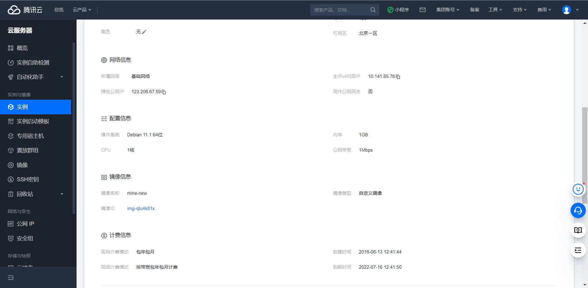
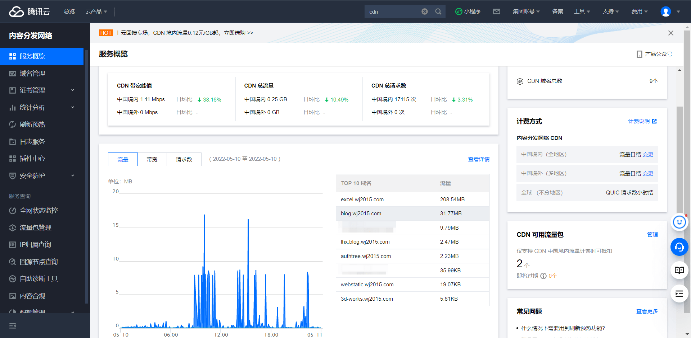
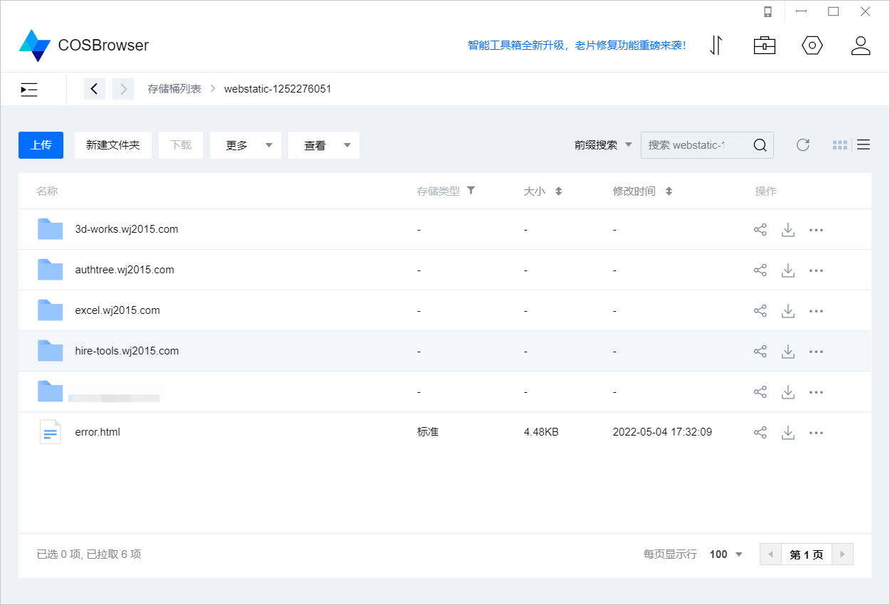
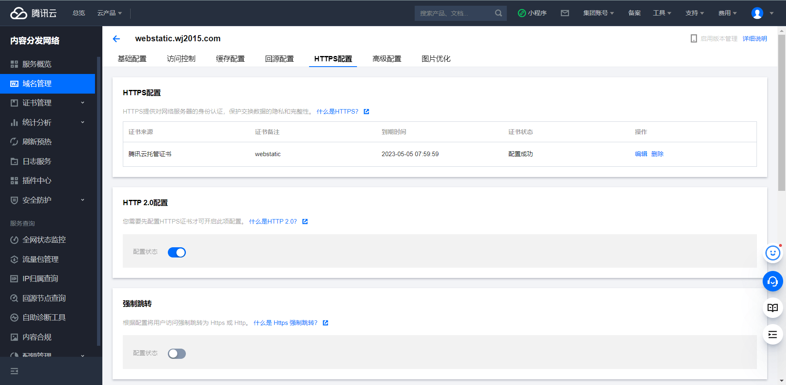
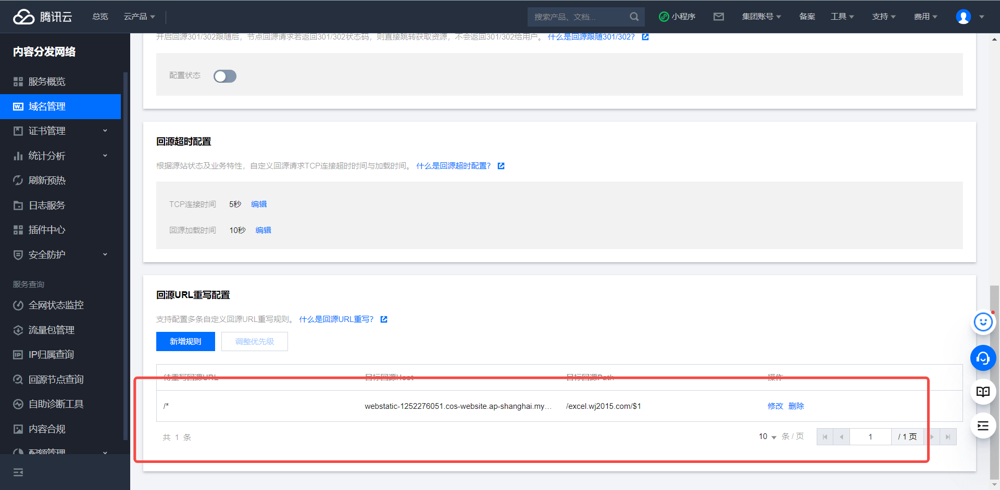
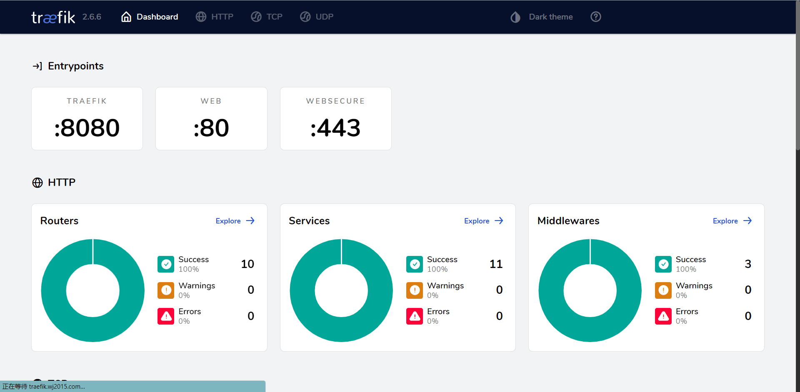
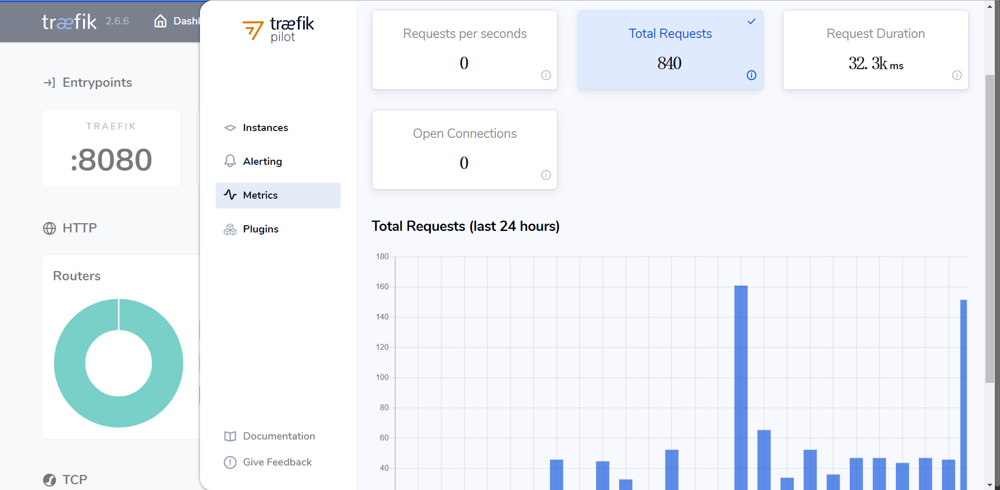
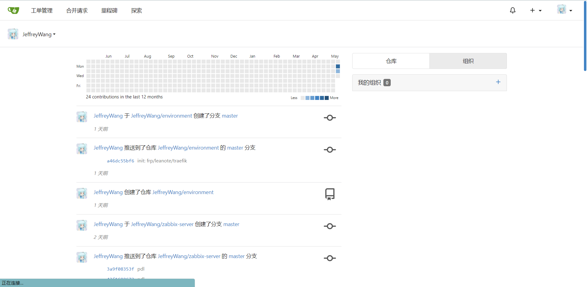
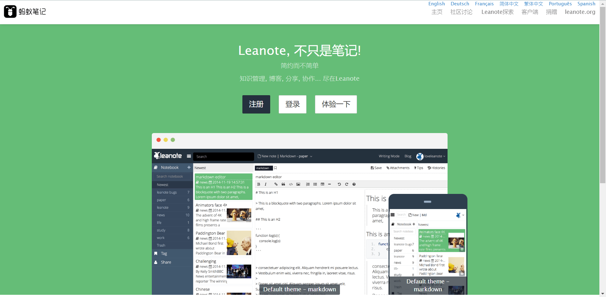
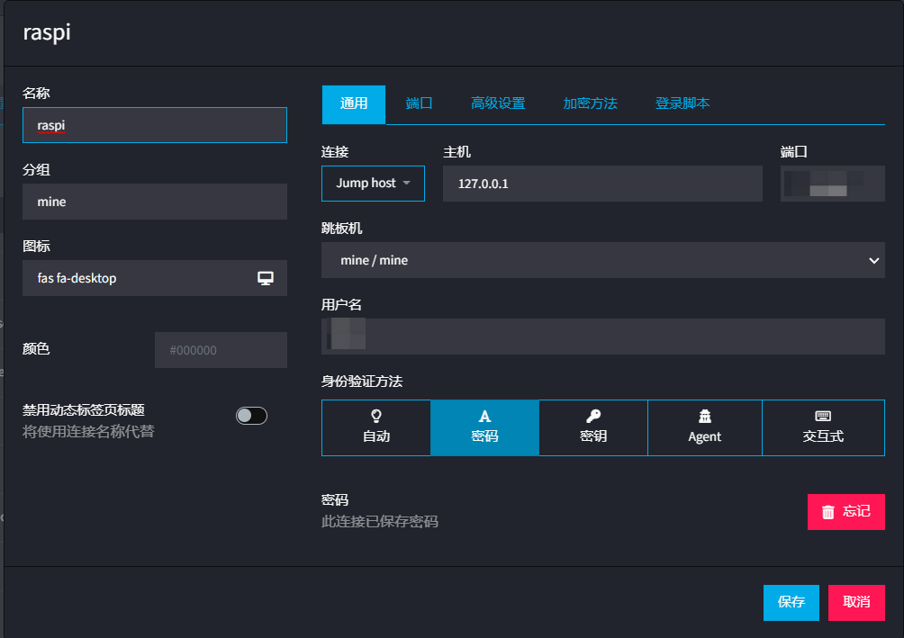

## 前言

我的服务器在16年创建之初，近乎白嫖了腾讯云的学生机后，就没有升级过系统，没记错还是 centos 6.8，服务器里边的数据也比较混乱，**有学生时期做的临时服务，有自建云盘数据、自建博客数据、各种静态网站+动态网站的 VHOST 托管、自建代码仓库、自建内网穿透等等**。

> 绝版学生机，S1.SMALL1，性能最差但也是续费最便宜的机器



虽然一直以来，他工作良好，但是为了日后的扩展性以及运行效率、安全等因素考虑，一直都想对他做个升级，升级主要想达到几个目的：

- **完美支持 Docker**，之前系统内核太老旧，docker 跑起来都有各种各样的问题

- HTTPS 做到动态配置，**不再每年需要上传新的 SSL 并修改配置**

- 动态网站**尽量容器化**

- 不能容器化的动态网站也需要**支持 vhost 映射，共用 80端口**，并且由 systemctl 进行服务管理，开机自启，停掉后自动拉起

- **静态网站走统一托管 + CDN**，部分站可支持境内外服务商分离

- **收束端口**，尽量做到仅暴露 22 和 80，提高安全性
  
  - 比如自建代码仓库的 SSH 连接不用新开 TCP 端口，树莓派穿透到服务器的 SSH 连接也不用新开 TCP 端口

- Mysql 升级， 再找一个更合适的数据库管理工具

- Mongo 升级

整个迁移过程尽量平滑，哪怕宕机也不要超过两分钟

> 这一点算是基本做到了吧，虽然中间碰到了一点问题，但整体过程还算平稳

## 迁移过程

### 静态网站走托管

静态网站毕竟只是静态资源的分发，放对象存储和 CDN 最合适了，并且我的大多数静态网站都是更新缓存不敏感的，比如开源项目文档、个人作品、博客等等

于是**整体思路就是借助对象存储管理静态网站数据，以及 CDN 做内容的分发缓存**，但是需要克服的是腾讯云这 CDN 不支持指定回源路径，以及实践中碰上的各种各样的坑



#### 静态文档和作品展示

比如如下站点，分别是我一些前端插件文档和一些效果展示的网页

3d-works.wj2015.com

hire-tools.wj2015.com

authtree.wj2015.com

excel.wj2015.com

借助 cosbrowser **全传到一个 webstaic 的存储桶即可**，然后 CDN 那边做特殊处理来回源



然后创建一个通用的 CDN [https://webstatic.wj2015.com]([https://webstatic.wj2015.com](https://webstatic.wj2015.com))，配置好 HTTPS 以及通用缓存策略、报警等等，**这里只给这一个静态站点做 https，因为免费的证书只有一年有效期**，每年续就挺麻烦的，但一些特殊的测试场景又需要 HTTPS，所以静态网站上留了这一个，方便测试。



因为一般站点是独立的，并且由于**免费 HTTPS 证书对特定子域名绑定这一特性**，泛解析 HTTPS 证书太贵了，每一个网站都需要建立独立的 CDN

> 微微吐槽：这点确实不如 AWS 了，虽说同样有效期一年，但人家可以给泛解析证书，CDN 回源还能更灵活的部署边缘节点处理、回源路径等

每一个网站配置也类似，但为了管理方便需要回源到同一个 COS BUCKET，否则每次想新建一个站还得从 COS 做起，工作效率会有影响。

所以翻遍了腾讯云 CDN 的功能，在回源配置中找到了 **『URL重写配置』**，再写一个特殊的匹配规则，就可以实现不同的域名回源时，回源到同一个 COS BUCKET 不同的路径了



然后用他的复制配置功能创建其他站点的 CDN，只需要改这一个地方即可

#### 博客动态转静态

也就是 [https://blog.wj2015.com/]([https://blog.wj2015.com/](https://blog.wj2015.com/)) 以及 [http://lhx.blog.wj2015.com/](http://lhx.blog.wj2015.com/) ，之前是使用 Wordpress 搭建的博客系统，现在想用静态页面生成的方式优化编写体验以及访问体验。

> 博客站配置了境内境外不同路径的解析，国外访问 Netlify ，国内访问腾讯云 CDN，以达最优的体验

长这样：


和这样：


还专门写了篇博客记录这个过程：[hexo博客迁移 - 九层台](https://blog.wj2015.com/2022/05/08/hexo%E5%8D%9A%E5%AE%A2%E8%BF%81%E7%A7%BB-md/)

### 动态网站走 Docker

首先是容器化，服务器用了最新的 debian 11 LTS，之所以没有继续选 centos，**是因为了解到随后的 centos stream 会转为滚动发布，对稳定性有影响**，所以乘现在有得选，转向 debian 的怀抱，加之我的树莓派也是 debian，之前还用过 deepin 、KUbuntu 等 debian 衍生系统，用起来倒还听习惯。

##### 一款优秀的反代软件 Traefik

之前的服务器中，都是**用 nginx 的 proxy_server 配合 vhost 来服务不同站点**的，配置已经比较精简了，但 HTTPS 证书的维护和零散的配置文件，管理起来总是有点不便的。

而且做新的服务器，动态网站都倾向于使用 Docker，而 nginx 放 Docker 中，之前工作中踩过一些坑，**比如部分服务下线的情况下重启 NGINX 会启动不了，导致所有的服务都挂掉**。

后来在公司同事的协助下，了解到了 treafik，稳定高效并且支持动态配置，[Traefik Proxy Documentation - Traefik](https://doc.traefik.io/traefik/)，公司已经稳定用了挺久了

还自带一个直观的 Dashboard 以及统计工具





配置也很简单，`docker-compose.yml` 中引入 `traefik` 后，其他容器可以以 Label 的形式动态的配置反向代理，也可以在静态的配置文件中，配置全局的、中间件

```yaml
version: '3.1'

services:
  reverse-proxy:
    image: traefik:v2.6
    restart: always
    command:
      - "--configFile=/etc/traefik/config.yml"
    ports:
      # The HTTP port
      - "80:80"
        # The Web UI (enabled by --api.insecure=true)
      - "8081:8080"
    volumes:
      - ./traefik/:/etc/traefik/
      - /var/run/docker.sock:/var/run/docker.sock
  whoami:
    # A container that exposes an API to show its IP address
    image: traefik/whoami
    labels:
      - "traefik.http.routers.whoami.rule=Host(`whoami.docker.localhost`)"
```

然后 `traefik/config.yml` 中可以配置一些基础信息，声明动态配置 `traefik/dynamic.yml` 等操作

```yml
api:
  insecure: true
  dashboard: true
entryPoints:
  web:
    address: ":80"
  websecure:
    address: ":443"
providers:
  docker: true
  file:
    directory: "/etc/traefik"
    filename: "dynamic.yml"
    watch: true
```

动态配置中即可申明可复用的**中间件，路由，非容器服务**等，比如下面的配置就可以实现一个统一密码的 basicAuth，并且路由中可指定匹配的 Host，使用哪些中间件，以及本机运行的其他服务

> 172.17.0.1 是 docker 网关地址，可指代宿主机

```yaml
http:
  middlewares:
    # 一些有权限要求的，可以自定义 basicAuth 加强保护
    admin-auth:
      basicAuth:
        users:
          - "admin:xxxxxxx"
  routers:
    traefik:
      rule: "Host(`traefik.wj2015.com`)"
      middlewares:
        - admin-auth
      service: traefik
  services:
    traefik:
      loadBalancer:
        servers:
          - url: "http://172.17.0.1:8081/"
```

然后外层 `docker-compose up -d` 运行起来即可

###### 参考文档

Treafik 的博客：[更好的反向代理工具 Traefik 配置入门——Docker 篇 - 掘金](https://juejin.cn/post/6844904030557175822)

Treafik 的文档：[Traefik Services Documentation - Traefik

#### 代码托管库 gogs 转 gitea

在许久之前，我用的 gogs（[https://gogs.io/]([https://gogs.io/](https://gogs.io/))），但是当时由于服务器内核版本等等限制，始终无法使用 ssh 提交代码，给操作带来了诸多不便。

这次系统升级完之后，ssh 方面将不会是障碍，那就顺便再调研了一下轻量化的 git 版本管理工具有哪些。

后来就找到了由 gogs 衍生出来的，功能更丰富的 gitea（[https://gitea.io/](https://gitea.io/)），引用一下外网评论观点，**gogs 以稳定为主**，可无缝的跨版本升级（虽然我从 0.10.x 并没法升级到 0.12），**gitea 以更丰富的界面和功能为特点，甚至我在文档里看到了自带的 npm 、composer 等私仓管理，一次安装多种享受**。

这是我 gitea 服务的界面



gogs 在迁移前忘记截图了，界面大同小异，**都是速度飞快、占用资源很低的优秀产品**

###### 共用 SSH 端口

云服务器只有一个 22 端口，但 gitea 的 SSH 仓库也需要暴露 SSH 服务，Gitea 官方文档给到了一个解决方案，就是利用 ssh 配置中的 `command`，**将 ssh 转到容器内的 ssh 上**

官方文档：[gitea/with-docker.en-us.md at a56fcdfa8f19efcc53c2163d60c9c1e1bafbc019 · go-gitea/gitea · GitHub](https://github.com/go-gitea/gitea/blob/a56fcdfa8f19efcc53c2163d60c9c1e1bafbc019/docs/content/doc/installation/with-docker.en-us.md)

> 微微吐槽一句，还是官方文档靠谱，中文文档这里边把命令文件路径写错了，还调试了挺久的

大概意思就是

- 宿主机创建一个用户，比如叫 git

- 给这个用户生成一个公私钥对，比如 `/home/git/.ssh/id_rsa` 和 `/home/git/.ssh/id_rsa.pub`

- 然后给 git 用户的 `/home/git/.ssh/authorized_keys` **添加上刚生成好的公钥（很重要）**

Gitea 在用户上传 ssh-key 之后的操作是

- 在 `/home/git/.ssh/authorized_keys` 下追加一行
- command="/usr/local/bin/gitea --config=/data/gitea/conf/app.ini serv key-6",no-port-forwarding,no-X11-forwarding,no-agent-forwarding,no-pty,no-user-rc,restrict ssh-rsa AAAAxxx commit

所以 git 用户的 `/home/git/.ssh/authorized_keys` 文件大概就像这样

```
ssh-rsa AAAAxxx Gitea Host Key
# gitea public key
command="/usr/local/bin/gitea --config=/data/gitea/conf/app.ini serv key-4",no-port-forwarding,no-X11-forwarding,no-agent-forwarding,no-pty,no-user-rc,restrict ssh-rsa AAAAxxxx== other
# gitea public key
command="/usr/local/bin/gitea --config=/data/gitea/conf/app.ini serv key-6",no-port-forwarding,no-X11-forwarding,no-agent-forwarding,no-pty,no-user-rc,restrict ssh-rsa AAAAxxx commit
```

文件中的 command 是用来查找服务认可的公钥用的，网上也有人摸过里边的坑，可以看这个博客理解下

[SSH AuthorizedKeysCommand 配置和坑 | Blog·Tanky Woo](https://blog.tankywoo.com/2020/12/29/ssh-authorizedkeyscommand.html)

而 `/usr/local/bin/gitea` 是官方提供的，2222 是 gitea 给宿主机映射的 ssh 端口

```shell
#!/bin/sh
ssh -p 2222 -o StrictHostKeyChecking=no git@127.0.0.1 "SSH_ORIGINAL_COMMAND=\"$SSH_ORIGINAL_COMMAND\" $0 $@"
```

所以 gitea 自定义私钥认证的过程大概就是：

- 用户拿着自己的私钥，以 git 为用户名连接服务器

- 宿主机 git 用户可接受的公钥经过 `/usr/local/bin/gitea` 的转发，以 git 的私钥 ssh 连接 gitea 容器

- gitea 容器的 `authorized_keys` 文件就是 git 用户的 `authorized_keys` 文件，进而通过 `/usr/local/bin/gitea` 发起的 ssh 连接认证，信息得以传递

#### 蚂蚁笔记数据迁移

[蚂蚁笔记](https://leanote.com/) 也是我之前部署的一个私有服务，里边记录了很多对个人来说有价值的笔记、思考等等，自然在迁移服务时也是要带上的

在新机器上新安装了蚂蚁笔记服务端后，剩下的过程也比较简单了

###### 动态笔记数据的迁移

蚂蚁笔记的**动态数据存在 mongo 上**，随后的 Mongo 服务化及数据迁移会详细描述迁移过程

##### 上传静态文件和配置的迁移

笔记中的图片都是存放在 `files/` 下的，配置文件是放到 `conf/app.conf`，前者打一个压缩包传到新服务器上去，后者对照新旧配置传入即可

迁移完长这样：



#### phpmyadmin 转 adminer

之前服务器管理 mysql 用的 phpmyadmin，因为当时服务器上有全套 LNMP 环境，搭建方便，但现在全员容器化了，也就得再调研下更适合容器化部署的方案了。

最后从 github 扒拉出来一个挺多人使用的，但界面也挺古老的管理工具，adminer，不过实用就好

官网：[https://www.adminer.org/]([https://www.adminer.org/](https://www.adminer.org/))

镜像用的官方提供的，[Docker Hub](https://hub.docker.com/_/adminer/)，良心好用

部署完界面长这样：


不过这个服务是部署在容器中的，需要给这个 IP 单独放一下权限，创建一个管理用户

参考博客：[mysql 8 create user_MySQL8.0 创建用户及授权_臻太太的博客-CSDN博客](https://blog.csdn.net/weixin_27066963/article/details/114745731)

**安全起见，这个服务不能对外暴露**，所以域名解析会设置一个比较偏门的，不容易猜到的域名，并且入口也会做上面 traefik 提到的 BasicAuth 增加安全性，要不是我还没有自建的 VPN，我可能还会加一个来源 IP 防护。

### 服务迁移

主要是测试用途和部分后端服务需要用到的服务，Mysql 经过一番清理，已经成功空掉了，建一个新库放这儿，以后新站有用的时候方便调用。

#### Mysql 升级 8.0

本来是想用容器化来实现的，但是考虑到效率并且本来服务器性能就孱弱，就没这样搞了

根据官方的安装文档，以服务的方式引入的，[MySQL :: MySQL 8.0 Reference Manual :: 2 Installing and Upgrading MySQL](https://dev.mysql.com/doc/refman/8.0/en/installing.html)

如果要迁移数据也比较简单，自己项目的数据简单导入导出即可，如果非得尽量无缝迁移，做个同步再提升主实例也可以操作。

##### Mongo 服务化及数据迁移

Mongo 同样遵循官方的引导，服务化的方式引入的，[# Install MongoDB Community Edition on Debian](https://www.mongodb.com/docs/manual/tutorial/install-mongodb-on-debian/#install-mongodb-community-edition-on-debian)

然后迁移老数据，借助 mongodump 和 mongorestore 即可，不太费事儿

https://www.mongodb.com/docs/database-tools/mongodump/

再参考了 https://www.mongodb.com/docs/manual/reference/command/createUser/ 创建一个安全的用户，仅访问业务对应的库，不给太多权限

#### FRP 的迁移和服务化

家里用树莓派做了个小 NAS，偶有远程管理的需求，但由于网络限制又不能走端口映射，于是之前就搞了一个 frp 服务，专门用于内网穿透

内网穿透有两个重要的业务，一个是访问 NAS 数据的网页端，另一个是需要支持透过宿主机访问树莓派 22 端口

客户端配置大概这样，宿主机上再通过 traefik 转发到本机的 frp http 端口，带上 Host 即可解决第一个问题了

```ini
[common]
server_addr = xxx.xxx.xxx.xxx
server_port = xxxx
privilege_token = xxxxxxxxx
[ssh]
type = tcp
local_ip = 127.0.0.1
local_port = 22
remote_port = 32222
[nas]
type = http
local_port = 8886
custom_domains = nas.wj2015.com
```

而第二个，我不像单独再开一个 `32222` 端口，想复用目前机器的 22 端口，采用 gitea 的方案，新增 command 的话会有问题是

- 我必须在宿主机上为树莓派新建一个用户，这不合理

- 宿主机需要知道树莓派的密钥，这更不合理了

所以经过一番调查，发现用 `ssh -j` 跳板功能即可完美实现，终端用的 `Tabby`，可以这样配置，完美收束

关于 `ssh -L` 以及 `ssh -j` 的用法可以参考文档：

- https://zhuanlan.zhihu.com/p/148825449

- [ssh 跳板(Jump Host)的使用 | 治部少辅](https://www.codewoody.com/posts/11038/)



#### SWAP

低配服务器，总归还是要加点 swap 分区，不然稍微激烈一点就会碰上内存不足的错误，影响使用

参考博客：[Linux上创建SWAP文件/分区_每天进步一点_点的博客-CSDN博客_创建swap分区](https://blog.csdn.net/zhangxiaoyang0/article/details/82501209)

## 总结

服务器迁移整体消耗我快一周的实践来整理服务、试错、调研，不过最终结果还是挺满意的，新服务器整理完毕后做了个镜像，两分钟就完全切换过去了，速度比之前快，并且结构清晰，哪怕再次迁移或者扩展都能比较方便的实现。
