## 前言

本篇博客主要介绍卷积神经网络的组成部分，以及变量表示，最后附上卷积神经网络代价函数的计算

## 正文

前文中学到的神经网络都是全连接类型的，隐藏层对输入层有着各自固定的偏好模式，满足偏好模式（权重和偏置来控制）兴奋度会提高； 卷积神经网络在隐藏层也有类似的特性，不过整理偏好的过程是运动的，会将偏好兴奋结果整理到少量神经单元中，**以减少神经单元数量，并且可以进行特定的模式识别**，可能初看还无法理解这段话，看了下面的过滤器和特征映射应该就会明白了。 **本文中所有的例子均为：**建立一个神经网络，用于识别 6 \* 6 的黑白图像中手写的 1 2 3，那么输入层神经单元就有 6行6列共 36 个

### 过滤器和特征映射（重点）

过滤器可以理解为一种偏好模式，比如像书中展示的一个过滤器S，对如下形式的图形敏感 [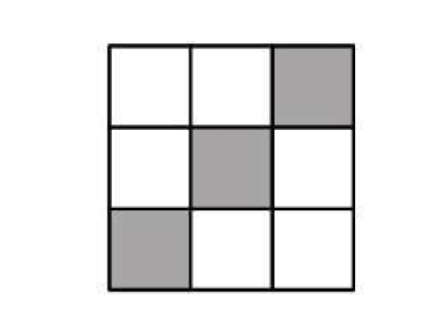](../static/uploads/2020/03/fdb59d7e7b2111a7126bac8c197122e7.png) 那么，拿着这个过滤器，在例子中的 6 \* 6 的图形中从左到右，从上到下依次识别，**每次识别过滤器S那么大的区域**，并将敏感度结果保存起来，相似度越高就越复合过滤器的偏好 [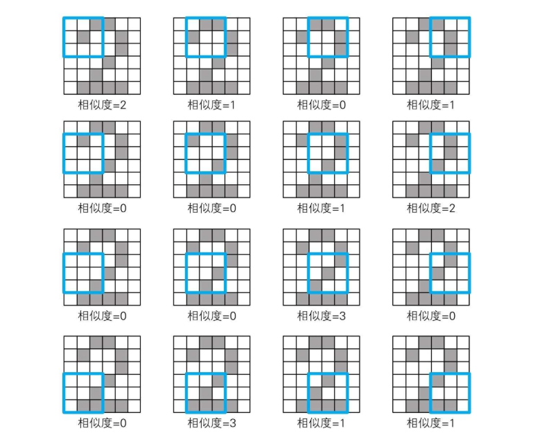](../static/uploads/2020/03/d2c7e47aa1f66260bfb0d7f0cb49999f.png) 得到的结果就是**特征映射**，也就是根据过滤器S得到的卷积 [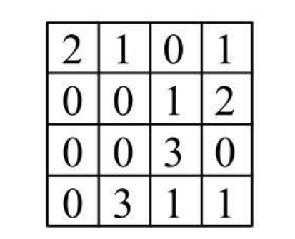](../static/uploads/2020/03/2ca85b19ab4d116ec74646e59fc80259.png)

### 卷积层神经单元输出与池化

简单卷积后，神经单元依旧有 16 个，还是有点多，那么还可以做一个操作叫做**池化**，书中提到了三种池化方式，首先来看下最简单的**最大池化**，剩下的两种也很容易理解了 池化的目标就是减少神经单元的数量，但是又能代表卷积层中的结果数据，那么把整个神经单元拆成 2 \* 2 的大区域，把每个大区域的**最大值（最大输出）作为代表放到池化层**的对应位置，即可得到池化的结果 [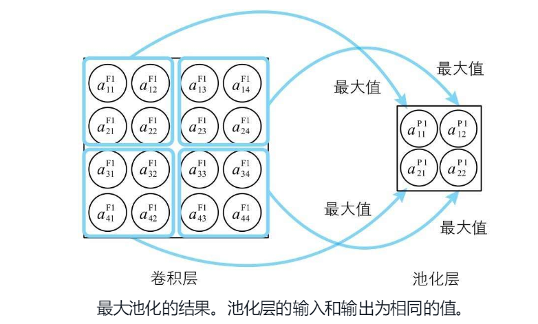](../static/uploads/2020/03/314d0ed29114c14a8f24303c92ba90b2.png)

#### 三种池化方式

书中提到了如下三种池化方式：

*   最大池化，使用区域中最大值作为代表值
*   平均池化，使用区域中的平均值作为代表值
*   L2池化，使用平方和开方的值作为代表值，$\\sqrt{a\_1^2+a\_2^2+a\_3^2+a\_4^2}$

### 变量和参数定义（重点）

书中给到了如下参数定义，结合第二幅图可能更能够理解 [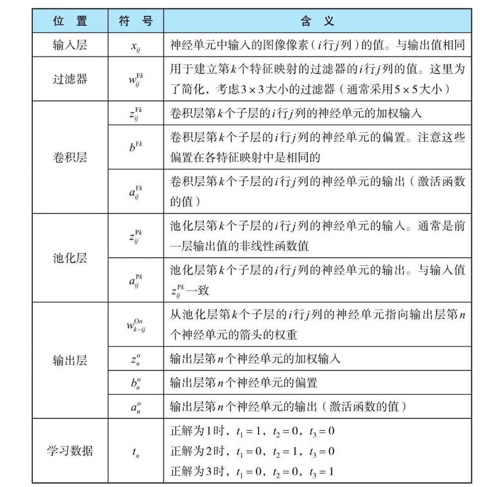](../static/uploads/2020/03/97dd6c527959a2c744b2c0f59a4785c1.png) 简单地说，**输入层右上角带上了 I** 表示Input，**每个过滤器K对应了以 $w\_{ij}^{Fk}$ 表示的神经单元**，经过过滤器的**卷积计算都对应生成的结果**（特征映射结果），卷积层中的加权输入依旧用z表示、偏置用b表示、输出用a表示，不过**右上角的F代表Filter**；卷积层对应的池化层也是如此，但是**池化层的神经单元输出等于输入**，所以没有偏置；输出层的变化是，**右上角带上了一个O**，表示Output，学习数据与之前的别无二致 [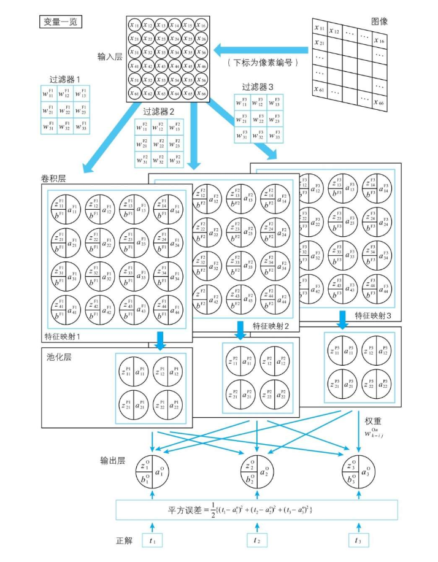](../static/uploads/2020/03/a2b9f739b8828bc7874f2ed08ed6a992.png)

### 各个层的变量关系

#### 输入层

输入层中的神经单元，输入等于输出，所以 $a\_{ij}^I = x\_{ij}$

#### 过滤器和卷积层

过滤器，右上角的F代表 Filter，过滤器中的w同样代表了对应位置的神经单元与过滤器中神经单元的权重 [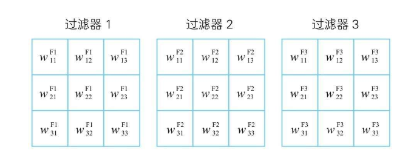](../static/uploads/2020/03/a60e7bdd940fd76ee98f981f33aa8b87.png) 所以第一块区域使用第一个过滤器得到的卷积结果 $c\_{11}^{F1}=w\_{11}^{F1}x\_{11}+w\_{12}^{F1}x\_{12}+w\_{13}^{F1}x\_{13}....w\_{33}^{F1}x\_{33}$ [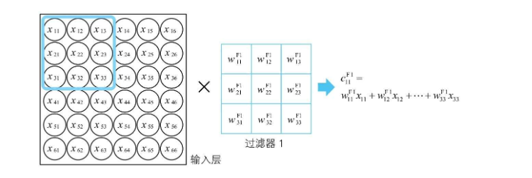](../static/uploads/2020/03/a50e78632bc8d5ca58cf932db598c0bb.png) 不难得到一个 3 \* 3 的过滤器，卷积结果公式如下，如果不是 3 \* 3，w的最终下标再变化下即可 [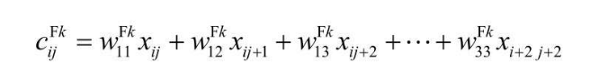](../static/uploads/2020/03/cdd5fe402d42b0ec65d542a030a2c8d2.png) 一般的，过滤器会有自己的偏置 $b^{Fk}$，这个偏置与输入层的神经单元无关，与过滤器中的神经单元也无关，最终得到如下的加权输入（输入到特征映射-卷积层神经单元） [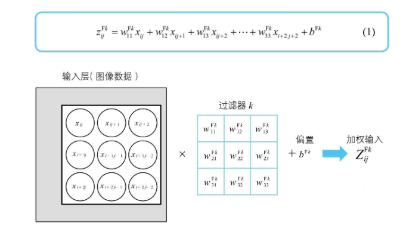](../static/uploads/2020/03/988c46c8bf36c8391d2f4e0a4ef4b03b.png) 卷积层的神经单元激活函数用 a 表示，所以卷积层的神经单元可以如下图表示 [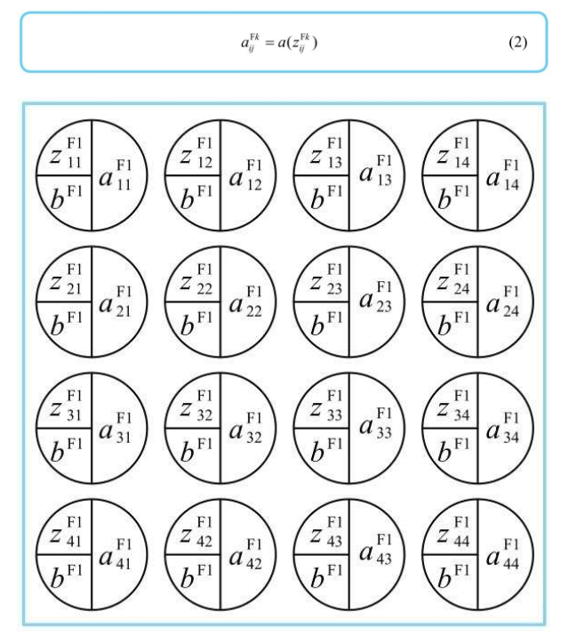](../static/uploads/2020/03/9637cfdc0cee3ef264c1ce9ac01b4a63.png)

#### 池化层

就是把卷积层的神经单元结果压缩到更少的神经单元中 [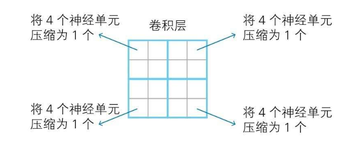](../static/uploads/2020/03/f8a8a743b6e1b11de1a9528e09196428.png) 最大池化，就简单求一下几个神经元输出的最大值就可以了 [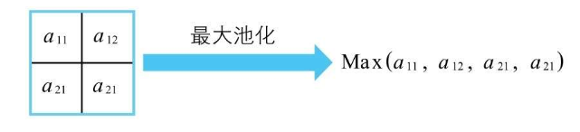](../static/uploads/2020/03/984d9e59a124f56f66d754c956a25a0d.png) 然后池化层的神经单元，输入等于输出，激活函数 $a(x)=x$ [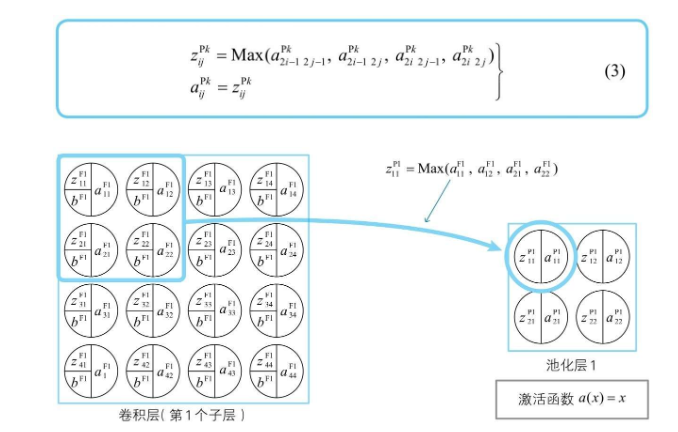](../static/uploads/2020/03/ec8c2ad7dfbfb4bd103c3355129d9e94.png)

#### 输出层

池化层和输出层的连接方式为全连接，输出层神经单元的输入就是权重求和，再加上池化层的整体偏置即可 [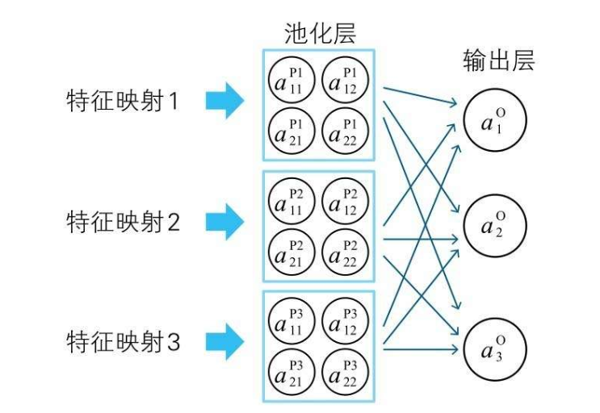](../static/uploads/2020/03/3f6e4d2ef34f7d3c84c65e69bd4dee3d.png) 不难得到如下式子 [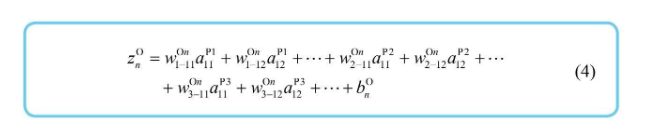](../static/uploads/2020/03/2d62a960b996defbeb60bff6238cf17f.png) 最后激活函数处理下，就可以得到输出神经单元的输出值 [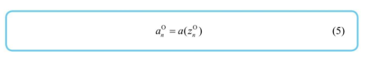](../static/uploads/2020/03/68e11c1d1e5b8a7d7442678348f42b48.png)

### 代价函数的计算

上面拿到输出神经单元的输出值后，根据代价函数的定义，把正解和输出值做差值平方即可得到平方误差C [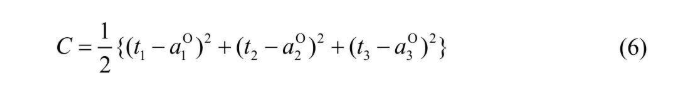](../static/uploads/2020/03/c9c1e307047b444db04a6a5f7d9e0cb8.png) 与之前全连接层的式子类似 [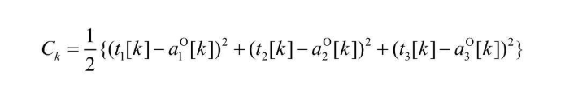](../static/uploads/2020/03/3672ab20cac66fd21018c94bdecb2d87.png) 经过多次学习，得到多个平方误差C，那么整个神经网络的代价函数就可以表示为如下式子 [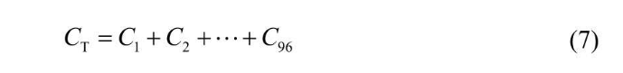](../static/uploads/2020/03/d11069be533e1907f5406b244a2e9173.png) 同样的，需要像之前一样得到代价函数在最小值的时候的各个参数（各个神经单元的偏置和权重），同样可以使用误差反向传播计算梯度，再通过梯度下降推导各个参数的最优解。

## 总结

主要介绍了过滤器、卷积层和池化层中间的关系和工作原理，以及在卷积神经网络中各个层的变量参数定义，以及各个层之间的数学关系，最后得到了代价函数。