## 前言

本篇主要学习下线代中向量与矩阵相关的知识，包括多维向量内积与机器学习中递推的关系，矩阵的基础概念和计算等；在书中也只提到与机器学习有关联的基础知识点，整体难度不算高；

## 正文

### 向量的定义

假设现在有两个点 A和B，那么 A->B 就是一个**有位置**（A的位置）**有方向**（A指向B的方向）**有大小**（AB线段的长度）的向量 [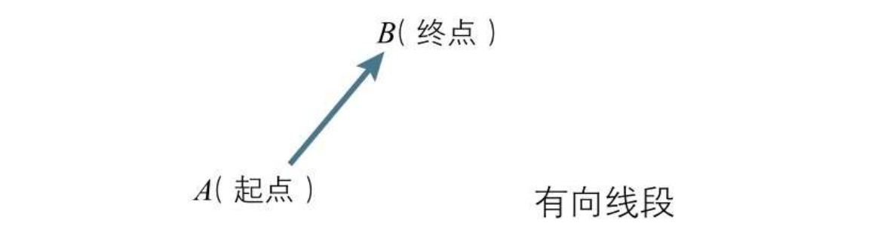](../static/uploads/2020/02/71fcf9abe4cf84ccdf69198ee36452be.png) 一个向量可以由如下三种方式表达 [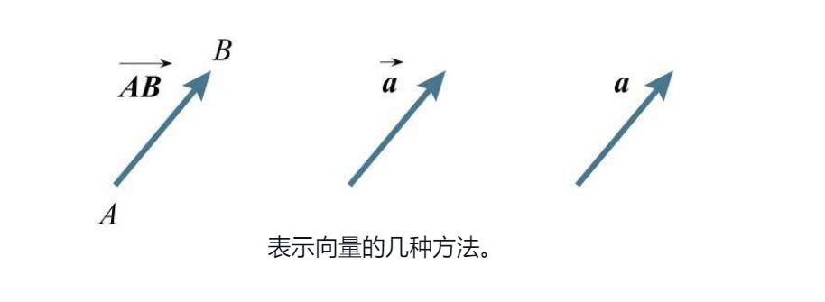](../static/uploads/2020/02/5eae25838ca2d51298397b331f3dcd95.png)

#### 坐标表示

如果我们建立一个直角坐标系，把A点移动到坐标原点，B点相对A点的位置不变，那么B点的坐标就可以看作是向量 A->B 的坐标表示 [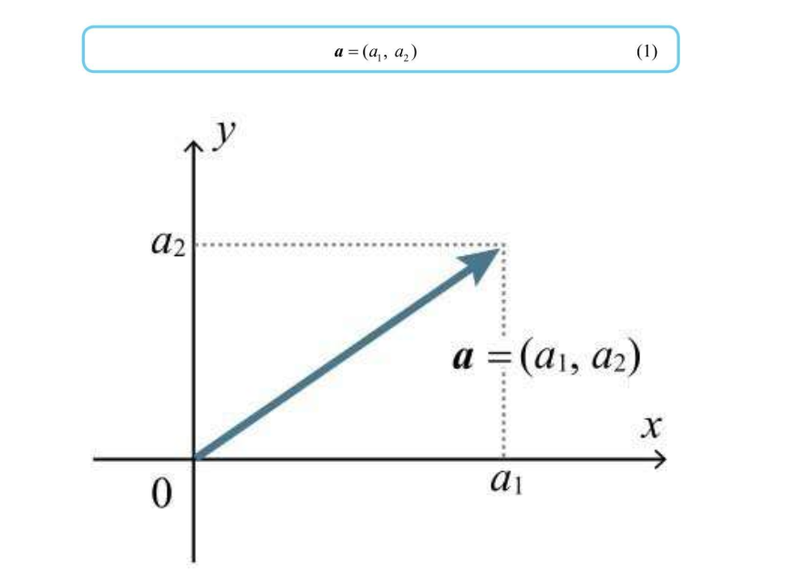](../static/uploads/2020/02/9dc05c87e6d85424c9dafb5923d78d82.png) 也可以把这个定义推广到三维甚至N维直角坐标系上，下图表示 A(1, 1, 1) 向量 [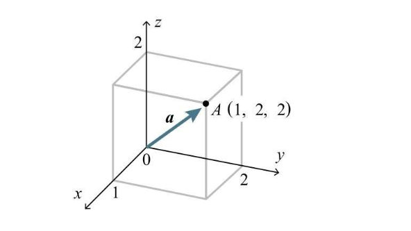](../static/uploads/2020/02/985fc8e016335ab5e75cc5ab7310ec7c.png)

#### 向量的大小

向量的大小用 a 表示，与绝对值符号相同 向量的大小即向量的长度，通过直角坐标系可以很方便的理解，比如 a = (3, 4)，根据勾股定理，该向量的大小就是 5 [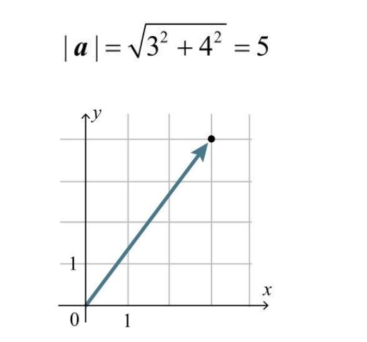](../static/uploads/2020/02/eebd483f2154a38c1a629abb68e290f4.png) 再推广到三维，a = (1, 2, 2)，那么向量 a 的大小就是： [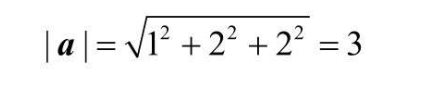](../static/uploads/2020/02/8e41f1fd1b9b902f1acb977167f7b704.png) [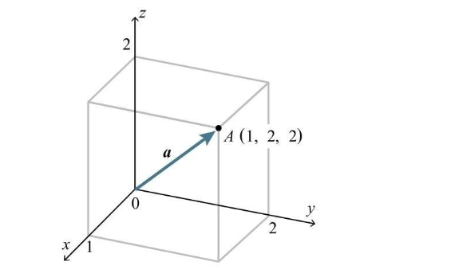](../static/uploads/2020/02/b80cf4d035409a3f04f44ea88e121fc2.png)

### 向量内积

向量的内积定义为两个向量的大小乘以向量夹角的 cos [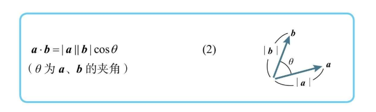](../static/uploads/2020/02/3adbe84110de2eb8aec197b121aaaeed.png) a和b，只要有一个为0，那么内积就是0 同理，这种解法也适用于三维向量 [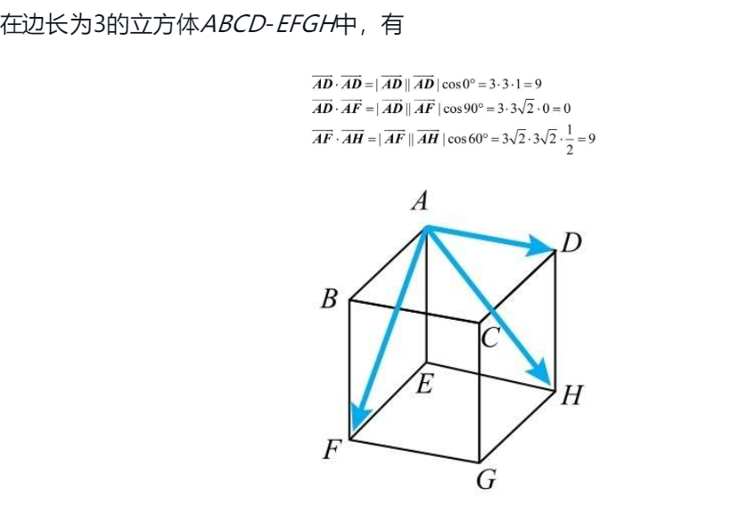](../static/uploads/2020/02/633f2e284855ccfe75ec2c866da93599.png)

#### 柯西不等式

因为任意的θ都会另 -1 < cos(θ) < 1，所以很容易推出下面的不等式 [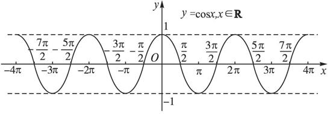](../static/uploads/2020/02/fa8a9531d9237ac930c4ed8fa52d5948.png) [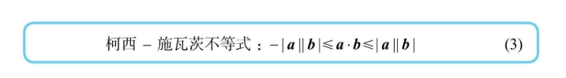](../static/uploads/2020/02/c49c95822909e699acfca2adce0cdbb9.png) 结合这个不等式，可以得到如下三种情况 [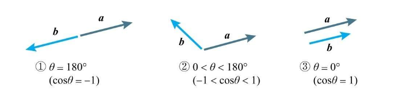](../static/uploads/2020/02/5edb3c5e8e9b1bcb6dad9e807a8e299d.png)

*   两个向量方向相反时，内积最小
*   两个向量方向相同是，内积最大
*   两个向量方向夹脚在 0 ~ 180° 时，内积大小会从最大到最小

书中特意提到，第一条性质（两个向量方向相反时，内积最小） 是日后梯度下降法的基本原理 [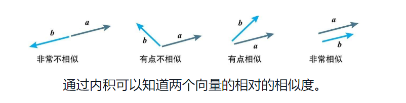](../static/uploads/2020/02/dfd75925865f3209460b5497e6dc9045.png)

#### 内积的坐标表示

还是首先以二维直角坐标系为例，内积可以以坐标的形式进行计算 [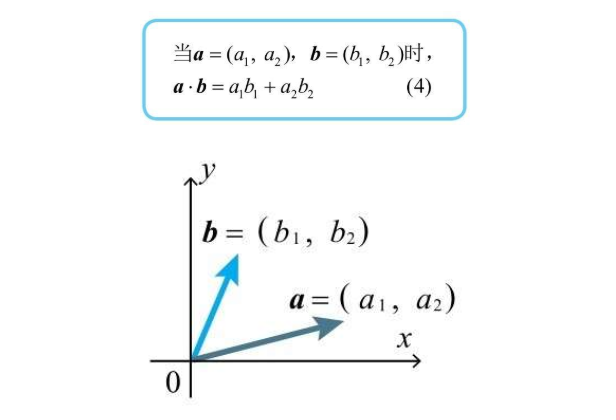](../static/uploads/2020/02/e3bc35d08d0db9e3bead1c576531fd20.png) 三维向量一样有这样的性质 [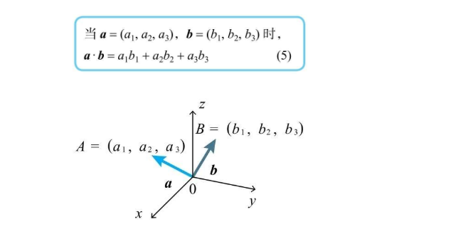](../static/uploads/2020/02/d888ad0529ce9a4fbb313a34e108e287.png)

### 多维向量一般化（重点）

[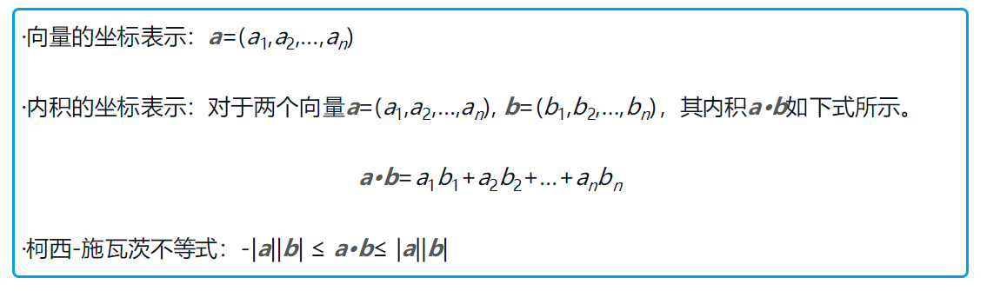](../static/uploads/2020/02/e0000b6558885945cf7c390d9c5ea14c.png)

> 关于推导，我也尝试用我撇脚的数学推算过，算了一两页纸发现越算越复杂，推不出来，找了个别人的推导过程，有兴趣的可以研究下 https://blog.csdn.net/zhangyingjie09/article/details/88375120

看到这个向量内积公式，有没有想到之前提到的神经单元的加权输入： [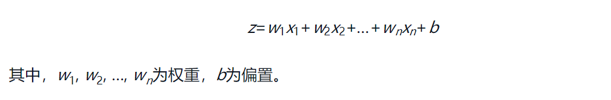](../static/uploads/2020/02/a91264ac5dc6e42f7cc5abba14738c89.png) 就可以表现为两个向量的内积加上偏置，向量 w = (w1, w2, w3, w4, ...)，x = (x1, x2, x3, x4, ...)，即： [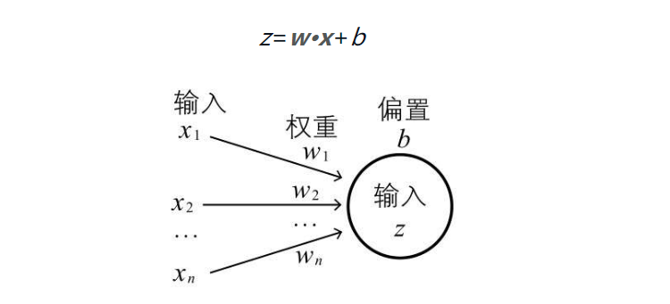](../static/uploads/2020/02/16524812f6b8be480b6dab3de161fd7f.png)

### 矩阵的定义

矩阵是数的阵列，横排为行，竖排为列，行数与列数相同称为**方阵**（类比正方形） 以及如下图X,Y所示的 行向量和列向量 [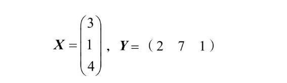](../static/uploads/2020/02/5a157249ae30df526ab61bc1bae971e5.png) 可以定义一个 m行n列的向量，第 i 行 j 列的元素用 aij 表示， [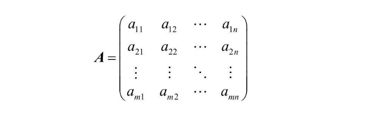](../static/uploads/2020/02/c5a4aadb6e5914eca1b00ebfaceba22b.png)

#### 单位矩阵

单位矩阵是一个特殊的矩阵，矩阵的斜对角线元素(aii)都是1，其他元素都是0 [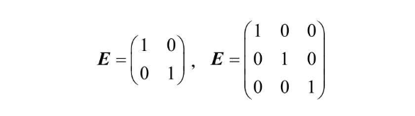](../static/uploads/2020/02/168d1ecbdf5f3d22d37ba15981087de5.png)

### 矩阵的运算

#### 矩阵比较、和差常数积

A和B相等的含义是两个矩阵对应的元素包括行数列数完全相等 两个矩阵的和、差、常数倍都符合四则运算，和与差都是相同位置的元素直接进行加减，常数倍的乘法直接乘到对应的元素中去，如下： [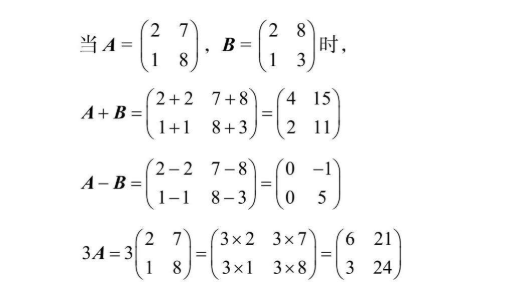](../static/uploads/2020/02/33844b120320569680c367382817b80d.png)

#### 矩阵乘积（重点）

把**向量A的i行**看作行向量，**向量B的j列**看作列向量，**其内积**作为结果的 **i行j列** 的元素 [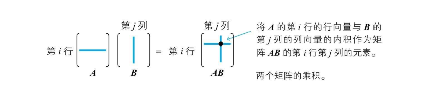](../static/uploads/2020/02/a447cc6278ae257e1687b27e11f17daf.png) 比如，两个向量乘积计算过程如下： [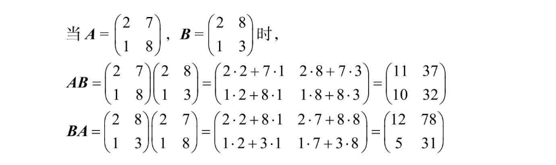](../static/uploads/2020/02/a222c96bf0b5f0a2aea4fd8473ac1b1e.png)

#### 哈达玛积

Hadamard积适用于两个相同形状的矩阵，符号的含义是相同行数相同列数的数相乘，作为新矩阵对应函数和列数的值 下图表现了哈达玛积的计算过程，很直观 [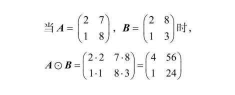](../static/uploads/2020/02/6a7e83e16e31ab8bf95a9a372bb56ccc.png)

#### 转置矩阵

转置矩阵是将矩阵A的i行j列的元素转换为新矩阵的j行i列，转置矩阵在原矩阵左上角加上一个小t表示 [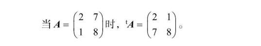](../static/uploads/2020/02/2dbc8abbdac3f682df11ca709a798b78.png)

## 总结

本片博客主要介绍向量和矩阵的基础知识，其中多维向量内积与神经单元加权输入的关系（w = (w1, w2, w3, w4, ...)，b = (x1, x2, x3, x4, ...)，则 z = w\*x + b）以及矩阵的乘积计算（i行j列 = A的i行向量与B的j列向量内积）是重点。