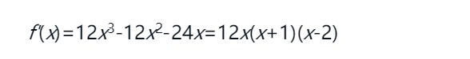
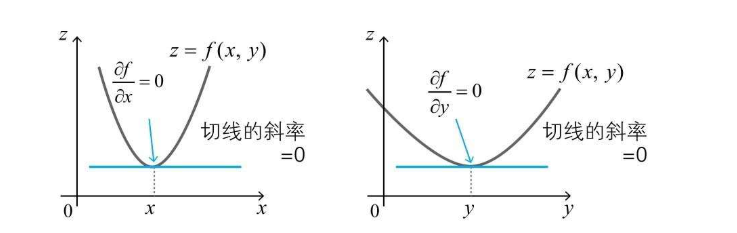

## 前言

本章主要记录机器学习里边比较重要且非常容易成为初学者拦路虎（没错就是博主我）的一个数学概念：导数和偏导数

## 正文

### 导数的定义

对于一个函数 f(x)，其导数的定义如下：  其中 lim Δx->0，表示右侧表达式在 Δx 趋近0的时候，应该是一个什么样的结果，比如 `f(x) = 3x` 的导数求解过程如下  已知函数**f(x)** ，求其 **导函数** 的过程叫做求导，当导函数的值存在的时候，称为函数`f(x)` 可导

#### 导数的含义及常见函数导数

导数的含义在坐标系中表现为连续函数某一点的切线(l)的斜率，当Q无线接近于P的时候，PQ的斜率就无限接近切线l的斜率  常见函数的导数公式：

*   (c)' = 0
*   (x)' = 1
*   (x^2)' = 2x
*   (x^3)' = 3x^2
*   (e^x)' = e^x
*   (e^(-x)) = - e^(-x)

### 导数的性质

导数具有线性的性质，即**“和的导数为导数的和，常数倍的导数为导数的常数倍”**，也就是如下图所示的公式  举个栗子，用导数的性质来求一个函数`f(x) = (2 - y)^2`，如果不用导数公式与式子，直接用定义 `f'(x) = (f(x + Δx) - f(x))/(Δx)` 的话，得算一分钟（说的就是博主本人）； 但是拆分多项时候，配合性质，几乎是一眼就能看出答案，过程如下： 

### 分数的求导

分数的求导涉及到一个公式，并且在函数相关的博客中提到的 sigmoid 函数就比较适合用这种方式置换求导 

> 注：f(x) != 0

而著名的激活函数 sigmoid，其定义如下：  可以用 `f(x) = 1 + e^(-x)` 带入到式子中，以分数求导的形式变换出如下格式的导数  书中的变换过程如下，还是比较容易看懂的 

### 导数和函数最小值的关系（重点）

由于导数表示函数 `f(x)` 在点 x 处的斜率，那么不难想到，`f(x)` 在导数 `f'(x) = 0` 时函数切线斜率为0，与x轴平行，只会是如下几种情况之一  那么可以推算出 `f'(a) = 0` 就是 `f(x)` 在 `x=a` 时最小值的必要条件

> 必要条件的定义：已知命题p、q，由p可以推出q，则q称为p的必要条件。 意思是 f'(a) = 0 的时候，函数值f(a)不一定是最小值，但是当 f(a)是最小值的时候，f'(a) 一定为0

#### 函数的增减表

这时候，不知道各位脑海中是否还记得高中数学老师一再叮嘱的，求函数极值的时候一定要出现的一个表，叫 **函数的增减表** 以 `f(x) = 3*x^4-4*x^3-12*x^2+32` 函数为例，根据公式很容易就求出其导数为  根据导数的特点，不难看出当 x=0,x=-1,x=2 时，导数取0，再在不同区间内随意取值判断导数正负，得到如下增减表  根据增减表，可以得出f(x)的大概图像如下  于是乎，当 x=2 的时候 `f(2) = 0` 是整个函数的极小值

### 偏导数

前边的博文主要在讲述一个自变量 x 如何求导数，但是神经网络里边的输入、权重、偏置都是一个可以调整的变量，那么多个自变量应该怎么求导呢？

#### 多变量函数

在了解偏导数之前，先看一下多变量函数，含有多个自变量的函数就叫做多变量函数，多变量函数很难直观化，特别是超过两个自变量的函数 比如 `z = x^2 + y^2` 的图像长这样： 

#### 偏导数的求解（重点）

偏导数故名思意，就是存在多个自变量（如：x,y,z）时，针对某一个变量进行求导，其他变量统统视为常数得到的结果 比如，关于函数 f(x,y)，其**关于x的偏导数** 定义如下：  **关于y的偏导数**定义如下：  比如说 `z=w1*x1 + w2*x2 + b` 求关于 x1,w1,b 的偏导数，将非相关的变量都视作常数，很容易得到如下结果 

#### 多变量函数的极值问题（重点）

多变量的最小值与单变量的最小值有异曲同工之妙，也有一个类似的必要条件，在函数的极值点，每个自变量的偏导数都是0  分别求偏导数，斜率均为0时，函数整体取极值  比如 `z = x^2+y^2`，求关于 x,y 的偏导数如下，极值就会在 x=0,y=0 处，与图像相符  

#### 躲不掉的拉格朗日

以博主贫瘠的高数基础，拉格朗日就只知道这个很有名，但就是不知道到底是啥 首先来看一波拉格朗日乘数法的介绍和定义

> 在数学中的最优化问题中，拉格朗日乘数法（以数学家Joseph-Louis Lagrange命名）是一种寻找多元函数在其变量受到一个或多个条件的约束时的极值的方法。

现在有一个变量约束条件，需要求一个函数的极值，比如

> 当x^2+y^2=1时，求x+y的最小值。

那么应该怎么求解呢，首先约束条件看可以看作一个函数 `g(x,y) = x^2+y^2`、`g(x,y) = C` 的形式，求 `f(x) = x + y` 的极小值 首先，按照下列规则构建一个函数 L，其中的 fx 就是期望求极小值的fx，gx就是约束条件 c 就是约束条件等于的常数项  以前面一个式子为例，对构建的函数L关于 x,y 分别求偏导数，均令其等于0，得到两个式子，再通过 `g(x,y) = C` 得到第三个式子 联立解出 x,y,λ即可 书中的求解过程如下所示 

## 总结

本篇主要介绍了导数和偏导数的特点和求解，以及导数与函数增减性和极值的联系，像延展出来的多变量函数的极值求解问题以及拉格朗日乘数法，在日后神经网络的计算中均会得到体现。